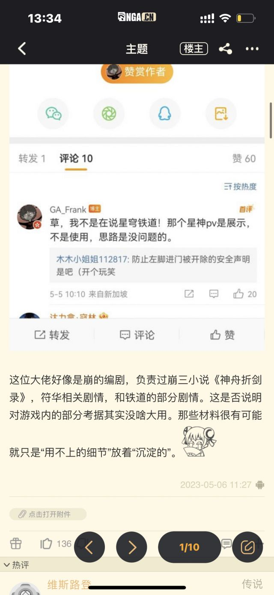

### [不吐不快] 感觉须弥和崩铁mhy整的活儿长远的影响在于对于米家还在开发的新游戏

Made by ngapost2md (c) ludoux [GitHub Repo](https://github.com/ludoux/ngapost2md)

----

##### 0.[0] \<pid:0\> 2023-08-04 13:38:15 by Azeroth.绵羊
很明显须弥剧情的崩溃和新玩法的停滞标志了很可能原神的上升期结束，崩铁投入如此大资源结果陷入产能困境也表明了mhy过去两年急速扩张后并没有很好的消化和整合好人力资源资源，崩铁存留率崩掉后续更新也不乐观。更别提某个直接砍掉的神秘大项目。

但是百足之虫死而不僵，看看山口山，看看阴阳师，原神虽然开始走下坡应该还能占着二游一哥挺很久，崩铁虽然前景不明，但是戴着原神的光环前期几个卡池赚的钱就够支撑后续几年的开发成本还绰绰有余了。

这半年米家整的活儿最大影响可能是后续新游戏光环消失，原神入坑的非结晶普通玩家下头后会正常评估新游戏的质量，本来可能会试一下zzz的可能被恶心到拒绝尝试，本来无条件相信米家新游戏品质开服就会课几单的可能会观望一两个版本不会轻易重课，当然mhy如果这的能拿出高品质保障的zzz那也能重新赢回口碑，但是看看崩铁的质量和产能我觉得难。新游戏没光环，品质赢不回口碑和市场，后面就是恶心循环，不过这个可能要很多年后倒回来看才有说服力了，就像现在看暴雪一样。

如果进过高速扩张的大公司职场经历的社畜估计懂，高速扩张后人才资源整合是非常让人头痛的, 本来圈内高水平人才也就那么多，一个大公司或者整个行业都高速扩张很难保证招人的经验和基本素质，最后就公司人才库很充裕，真正能干活儿的不多，组织可能要大调整，或者一个老人带四五个六七个新人，这也很可能就是崩铁明明分配了比原神1.x更多的资源，但是产能远不如原神1.x的原因，人月神话，懂得都懂。

----

##### 1.[0] \<pid:706897310\> 2023-08-04 13:40:34 by 雨源rainsource
反正我现在对mhy的要求高了很多，人设外貌涩度强度低了一点我都不会掏钱，然后就很久没掏过了，这就是给玩家喂shit的报偿

----

##### 2.[0] \<pid:706897605\> 2023-08-04 13:42:05 by 剑筑师と書記官

你米有一大堆人就是“用不上的沉淀”
准确来说，这家公司哪怕根本不存在，这个业界一样运转

----

##### 3.[0] \<pid:706897774\> 2023-08-04 13:42:57 by 岸上的喀秋莎
别的不知道，zzz已经spam了

----

##### 4.[1] \<pid:706898111\> 2023-08-04 13:44:43 by 就随便起了个名字
一开始我还很期待zzz的
被原崩铁三个恶心了之后我已经在看其他游戏了
或许之后也会玩但是我会选择当服务器蛀虫

----

##### 5.[0] \<pid:706898312\> 2023-08-04 13:45:41 by 白开水巨好喝
无所谓，这家企业的元老猛干的态度，以及猛干被曝光之后米哈游对它的处理态度已经可以认定，猛干语录就是他们整个公司的企业文化。
这样的企业发展好不好关玩家屁事，真正的玩家应该做的拒绝这家企业的有毒商品。

----

##### 6.[0] \<pid:706899506\> 2023-08-04 13:51:49 by Collapsar。
3.3之前，对原有点什么疲劳，期待zzz，对崩铁无感
3.3怒骂剧情，没了两个号
3.4弃原，嗅到3.3大厦将倾的腐臭味，而3.4毫无改进，预感要一路烂下去果断弃坑，并继续期待zzz，无感崩铁
崩铁上线，本着不体验没有发言权，蝗了几天，不出所料难玩+无聊透顶，对zzz期待度下降，毕竟崩铁的肉鸽做成那个鬼样子，养成还是那一套甚至变本加厉
最近，猛干实装，已经把mhy彻底拉进黑名单，包括zzz
心术不正的人做不出好东西，只有答辩和包装精美的答辩，zzz看起来像包装精美的答辩

----

##### 7.[0] \<pid:706899514\> 2023-08-04 13:51:50 by 夭叶舒华
nsdd其实米哈游自己也意识到了问题，很早就开始改，氪佬们的专属客服没了就是因为这个，但是现在都没整合明白………我不好说………

----

##### 8.[0] \<pid:706899835\> 2023-08-04 13:53:27 by xiaomo4440
我要平等关注米家每一款游戏，看看还能爆出什么新典hhhh

----

##### 9.[0] \<pid:706899843\> 2023-08-04 13:53:29 by 水老师命名权
感觉部分人常常把MHY这个公司推到台前，也加剧了这个问题。一般游戏如何如何都会说养养鼠策划，农药策划，明日方舟设计师怎么怎么，只有原一发生什么就会说米哈游如何，这就导致mhy的一款游戏不管是好还是坏，都会更大范围的影响它旗下的所有游戏。WY，TX游戏众多，不同游戏制作组泾渭分明，游戏之间相似度并不高。而米的游戏从崩三一以贯终一个画风，偏向大头大眼的废萌二次元风，更加会导致玩家厌恶了一个游戏之后，不会再入坑下一个
~~省流，入坑前质疑米黑，入坑时理解米黑，退坑后成为米黑~~NGA和贴吧里大量你被崩三恶心了还敢玩原？你被原恶心了还敢玩崩铁？也是这个道理。就连崩三玩家说原抢了资金，原神玩家说崩铁抢了资金的内战也是由于这种原因导致的。
这么看来米哈游的运营方式真的很像叠纸一个作品成功时就培养公司形象，然后用这个形象去辐射旗下的所有产品

----

##### 10.[0] \<pid:706900436\> 2023-08-04 13:56:16 by 雷军单推人
>[jump](#pid706899514) 夭叶舒华(2023-08-04 13:51) 说: 
>
>nsdd其实米哈游自己也意识到了问题，很早就开始改，氪佬们的专属客服没了就是因为这个，但是现在都没整合明白………我不好说………

你说什么鬼话呢？
降本增效第一步，屏蔽氪金玩家意见？
我把这事跟我timi工作朋友说，人家直呼不可思议。
我自己的私人客服，我从3.3开始一直在投诉编剧，然后人家把客服砍了，端上来了3.6，这什么意思还不明显吗？

----

##### 11.[1] \<pid:706900874\> 2023-08-04 13:58:43 by Collapsar。
>[jump](#pid706899843) 水老师命名权(2023-08-04 13:53) 说: 
>
>感觉部分人常常把MHY这个公司推到台前，也加剧了这个问题。一般游戏如何如何都会说养养鼠策划，农药策划，明日方舟设计师怎么怎么，只有原一发生什么就会说米哈游如何，这就导致mhy的一款游戏不管是好还是坏，都会更大范围的影响它旗下的所有游戏。WY，TX游戏众多，不同游戏制作组泾渭分明，游戏之间相似度并不高。而米的游戏从崩三一以贯终一个画风，偏向大头大眼的废萌二次元风，更加会导致玩家厌恶了一个游戏之后，不会再入坑下一个
>~~省流，入坑前质疑米黑，入坑时理解米黑，退坑后成为米黑~~NGA和贴

网易腾讯应该是工作室模式吧，内部同类产品之间都有竞争，所以以游戏为单位很合理。
mhy人员听起来会乱七八糟来回调？崩三的跑去搞一段时间原，原的调一堆去弄铁，须弥pv不行，当时说是因为做的好那个跑去崩铁了，普遍反应不行又回来搞草神散兵的救场

----

##### 12.[0] \<pid:706901316\> 2023-08-04 14:00:53 by Per-aspera-ad-astra
米现在就是转型去做4399奥比岛家园经营换装小游戏我都要担心他夹带私活

----

##### 13.[1] \<pid:706901445\> 2023-08-04 14:01:32 by lzlzzzz
>[jump](#pid706900436) 雷军单推人(2023-08-04 13:56) 说: 
>
>你说什么鬼话呢？
>降本增效第一步，屏蔽氪金玩家意见？
>我把这事跟我timi工作朋友说，人家直呼不可思议。
>我自己的私人客服，我从3.3开始一直在投诉编剧，......

他们会说米游社还有专属客服渠道捏

真的是笑死了，网易家为什么也要在微信搞心意客服不懂吗。

乐死了。

----

##### 14.[0] \<pid:706901477\> 2023-08-04 14:01:41 by 好想躺平
>[jump](#pid706899514) 夭叶舒华(2023-08-04 13:51)说:
>nsdd其实米哈游自己也意识到了问题，很早就开始改，氪佬们的专属客服没了就是因为这个，但是现在都没整合明白………我不好说………

米哈游的构造就注定了三老板想怎么动刀子都可以

现在都没改说明老板也有问题

3.3开始犯病我之所以等到3.8才弃坑就是还抱有幻想，现在？米桑快死吧

----

##### 15.[0] \<pid:706901644\> 2023-08-04 14:02:35 by Inquisit
反正在崩铁第一个月上大当冲完钱喜获80天更新就这以后哪怕没有猛干哥我也不会玩mhy的游戏了

----

##### 16.[0] \<pid:706901914\> 2023-08-04 14:04:05 by 夭叶舒华
>[jump](#pid706900436) 雷军单推人(2023-08-04 13:56) 说: 
>
>你说什么鬼话呢？
>降本增效第一步，屏蔽氪金玩家意见？
>我把这事跟我timi工作朋友说，人家直呼不可思议。
>我自己的私人客服，我从3.3开始一直在投诉编剧，然后人家把客服砍了，端上来了3.6，这什么意思还不明显吗？

别激动米具体怎么想的我也不造，但是他确实这么做了

----

##### 17.[0] \<pid:706902847\> 2023-08-04 14:08:56 by Collapsar。
你原不仅是游戏里整烂活，摆烂敷衍4399，游戏外的公关方式也极其离谱

李猛干这种员工，不管在哪家公司，爆出来，都是要切割的，先不管是真处理还是发个公告糊弄一下

小米高管一句小米都是屌丝买的，都给开除了

李猛干如此劲爆无下限的发言，到现在还无事发生

只要李猛干还在公司一天，我就只能认为猛干确实代表了mhy的企业文化

一个幽灵，一个limengan幽灵在整个mhy游荡

----

##### 18.[0] \<pid:706903548\> 2023-08-04 14:12:25 by muziqiduan
zzz画风其实偏欧美口味，但是你猜猜欧美被迪希雅气走的人还会不会回来试zzz。
还以为是小厂子时代，各种搞事情没有后遗症的啊。

----

##### 19.[0] \<pid:706905464\> 2023-08-04 14:22:01 by 苟活着的我
就那美工建模男女区别对待，IP运营爱磕CP，更别说还有散草99这种重量级操作，游戏外还有猛干这种爱看玩家扯头花和文案混入社区自己当预言家的操作，单纯觉得这群人连最基本的职业操守都没有

----

##### 20.[0] \<pid:706905528\> 2023-08-04 14:22:20 by 岩间琉璃，云间月
已经卸载了捏，以后再也不碰米家游戏。真是谢谢米哈游了，号价全烂掉了卖不出去

----

##### 21.[0] \<pid:706915752\> 2023-08-04 15:11:50 by heavenscar
我不知道你们为啥会曾经期待过zzz
是没去玩过一测吗

----

##### 22.[1] \<pid:706916706\> 2023-08-04 15:15:50 by 水老师命名权
>[jump](#pid706915752) heavenscar(2023-08-04 15:11) 说: 
>
>我不知道你们为啥会曾经期待过zzz
>是没去玩过一测吗

怎么说，细说下？

----

##### 23.[0] \<pid:706916711\> 2023-08-04 15:15:52 by hdjakry
zzz有我喜欢的烧鸡。当初期待度直接拉满可以说就是为了她去玩的，还免费给朋友和群里宣发3z现在拜拜了您，烧鸡到处有，谁稀罕你家这只

----

##### 24.[0] \<pid:706919169\> 2023-08-04 15:27:23 by heavenscar
>[jump](#pid706916706) 水老师命名权(2023-08-04 15:15) 说: 
>
>怎么说，细说下？

是一个满足某些人需求，日常体力够你刷一个小时的游戏捏

刷这一个小时里面起码40分钟在玩一种很新的跳电视屏幕走格子“肉鸽”，打引号是因为这个肉鸽成功击败原神阴阳寮，荣登我心目中第一抽象，20分钟算是个变体崩崩崩的感觉(我基本没玩过崩3可能认知问题很大)

除此之外，这游戏一测暂时是个没啥值得一提剧情的p5高清版的感觉

----

##### 25.[0] \<pid:706919432\> 2023-08-04 15:28:40 by 罗一川
首先不否认米哈游确实是有技术优势的，但是米哈游的问题也很明显，公司从头到下就喜欢卖CP以磕CP为乐
而这件事很明显是从最高层的那几个人传导下来的，因为米家游戏从一开始就是那个味，游戏最早就是他们自己做出来的
这件事情在男女对立没那么明显的前几年其实没什么问题
但是这几年加往后肉眼可见的加速之后想多头恰就没那么容易了，而且技术也到瓶颈了，在原神两年以后端出来的星铁除了能吹一下建模的精细程度其他东西完全乏善可陈
以后受众面会越来越明确难以出现一统天下的情况了

----

##### 26.[0] \<pid:706921055\> 2023-08-04 15:36:18 by 玛缇亚斯
>[jump](#pid706899843) 水老师命名权(2023-08-04 13:53) 说: 
>
>感觉部分人常常把MHY这个公司推到台前，也加剧了这个问题。一般游戏如何如何都会说养养鼠策划，农药策划，明日方舟设计师怎么怎么，只有原一发生什么就会说米哈游如何，这就导致mhy的一款游戏不管是好还是坏，都会更大范围的影响它旗下的所有游戏。WY，TX游戏众多，不同游戏制作组泾渭分明，游戏之间相似度并不高。而米的游戏从崩三一以贯终一个画风，偏向大头大眼的废萌二次元风，更加会导致玩家厌恶了一个游戏之后，不会再入坑下一个
>~~省流，入坑前质疑米黑，入坑时理解米黑，退坑后成为米黑~~NGA和贴

孙吧男女

----

##### 27.[0] \<pid:706923116\> 2023-08-04 15:45:55 by Hanaisnotok
崩铁都凉成那样了，开服吹破天的产能和质量，结果就端上来这么点小垃圾，反正zzz我是不会再玩了，之前还很期待来着，现在看起来能吹的都在一测吹完了

----

##### 28.[0] \<pid:706926684\> 2023-08-04 16:02:46 by 月霰斋星兰
你们是预期太高了 你米再烂有这个底子还是盆满钵满 没有原神之前的米只是一个有着年入20e左右的游戏项目的公司而已

而现在就算再拉 他随便出个游戏也起码可以年入20e了(崩铁再流失下去也不会低于崩3的)

你们是o达到了一个高峰觉得米以后不能每个游戏都赚个上百e那就是拉了 实际上人家的预期是多少你又不知道 说不定很低呢

当然应该也不会很低了 毕竟5k人大公司了

但是资本家赚不赚钱关我屁事罗  游戏看着凑合就蝗一波  心情好就打赏点月卡钱 不要入脑也不要重氪  本来这才是正常的对手游的游玩态度

----

##### 29.[0] \<pid:706928527\> 2023-08-04 16:11:52 by 怎样才能不被禁言1
>[jump](#pid706905528) 岩间琉璃，云间月(2023-08-04 14:22)说:
>已经卸载了捏，以后再也不碰米家游戏。真是谢谢米哈游了，号价全烂掉了卖不出去[s:ac:哭笑]

真是绝了，问一下号商，连十分之一都不到只能烂手里，这辈子不会给米哈游打钱了

----

##### 30.[0] \<pid:706929208\> 2023-08-04 16:15:00 by moonlight34
zzz真的很好玩吗...如果剧情人物玩法有一个便秘了怕不是凉的很快。我看别人的测试视频除了第一眼潮就没觉得多好玩。

----

##### 31.[0] \<pid:706930320\> 2023-08-04 16:20:17 by 怎样才能不被禁言1
>[jump](#pid706905528) 岩间琉璃，云间月(2023-08-04 14:22)说:
>已经卸载了捏，以后再也不碰米家游戏。真是谢谢米哈游了，号价全烂掉了卖不出去[s:ac:哭笑]

真是绝了，问一下号商，连十分之一都不到只能烂手里，这辈子不会给米哈游打钱了

