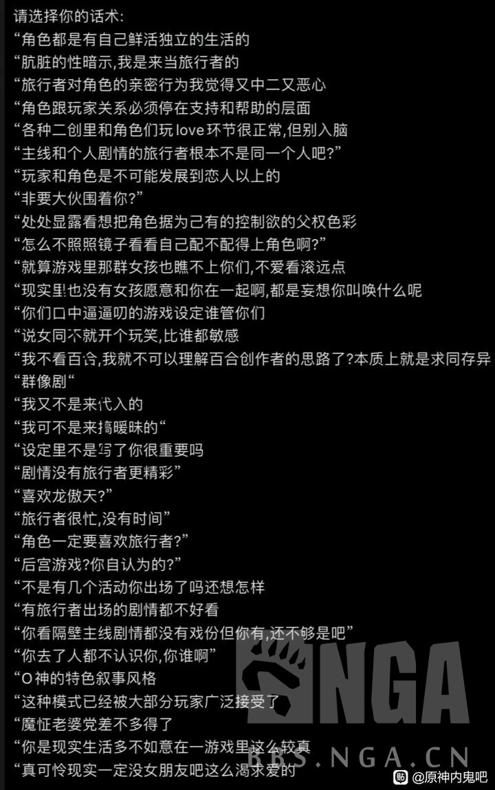
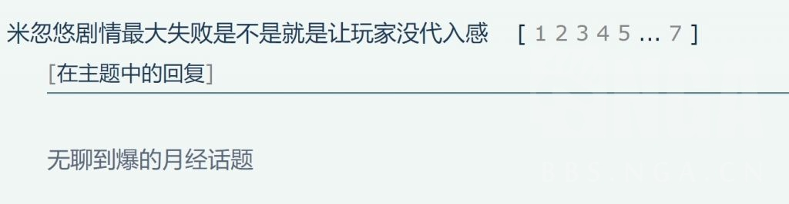
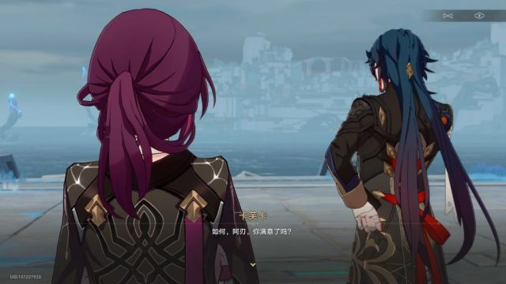
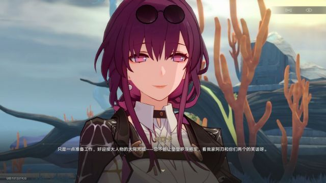
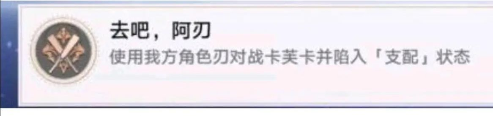
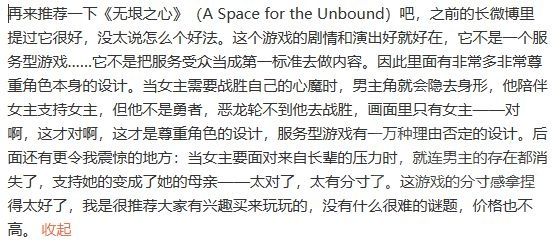

### [不吐不快]浅谈ml——二游的全自动印钞机

Made by ngapost2md (c) ludoux [GitHub Repo](https://github.com/ludoux/ngapost2md)

----

##### 0.[0] \<pid:0\> 2023-08-04 13:59:39 by zzzzzzy14
<b>ml，就是钱</b>

如果你是一个二游文案，而你没有任何水平，那你写ml即可，无论再低级的ml都会有大把用户为之买账，除了极少数人，谁不希望游戏角色爱自己呢？

这市面上有不少<b>纯粹ml</b>的游戏，例如pcr，大小碧蓝，少前，以及大部分乙游。

他们的剧情有什么深度吗？有原神这么多<b>“考据，用典”</b>吗？什么都没有，就是纯纯的ml，这成为了很长一段时间游戏圈的共识：

<b>ml，就是钱。</b>

作为“硬核不媚宅”的开创者，粥确实以性冷淡的画风吸引了很大一批用户，这就像每顿都是蛋糕的人会想喝杯黑咖啡缓缓——喝几口你就知道苦了，最后还是喜欢甜食。

到最后，ml卡在粥里还是卖的够好，媚宅皮销量就是高。

在比如ip游戏第一人fgo，人家也是一般向，那人家的ml那叫一个冲啊：<b>源源不断的ml卡男女都有，每年泳装几个五星人均ml。</b>

甚至七周年新出的卡公主，作为型月三大女主角，名花有主的人，也三个突破三种形态，切割了一个形态出来ml。

我不评价这种两头恰的行为是否正确，这只是一个商业规律：<b>相比ml人，cp党真的爆不出米。</b>

<b>而原神，或者说mhy不一样。</b>

他们所有的ml都是捏鼻ml，不符合公司精神，是在为商业牺牲。

所以他们的游戏一旦有起色就会迅速放弃ml，那他们的企业精神是什么？

<b>cp，特别是百合和男同</b>

原神媚宅的黄金期稻妻，神陪你逛街愿意依靠你，宵宫绫华都向你表达好感，申鹤把你视作捆住自己的红绳。

<b>因为当时mhy缺钱了！原神在走下坡路了！捏鼻搞搞ml吧！</b>

须弥之前蒸蒸日上，男同女同散草不就都来了？

崩三终章后不可抑制的玩家流失，又开始重启媚宅舰长线。

崩铁呢？<b>玩家流失的速度在所有mhy游戏里是最吓人的。</b>所以卡芙卡的人设要变，pv要改，mhy又要捏着鼻子媚宅咯！

希望能以这篇文章提醒还对mhy抱有期待的人：<b>如果你想让游戏变好，只有不氪这一种选择</b>

----

##### 1.[0] \<pid:706918312\> 2023-08-04 15:23:15 by Gdygfdqqqq
你都第十四个号了啊

----

##### 2.[1] \<pid:706918421\> 2023-08-04 15:23:45 by Katyushagent
笔在别人手上.jpg

----

##### 3.[0] \<pid:706918442\> 2023-08-04 15:23:51 by a阿洛洛洛
警钟撅烂

----

##### 4.[1] \<pid:706918552\> 2023-08-04 15:24:20 by zzzzzzy14
这审核了多久？我都要睡一觉起来了

----

##### 5.[2] \<pid:706918735\> 2023-08-04 15:25:14 by HeYUKARI
你这种ml魔怔人也算了玩家抽卡基本是看外形和强度的，强度最重要，游戏讨论也以设定剧情为主

----

##### 6.[0] \<pid:706918741\> 2023-08-04 15:25:15 by 抽烟的指挥官
自己生活警告

----

##### 7.[0] \<pid:706918878\> 2023-08-04 15:25:55 by SorryMaker701
猛干哥语录.txt

懒得对应了，你知道我说的什么就行

----

##### 8.[2] \<pid:706918979\> 2023-08-04 15:26:27 by 药师鬼
说得好，但原神是一家坚持走自己的路，绝不迎合玩家的行业内一流公司呢。

----

##### 9.[2] \<pid:706919065\> 2023-08-04 15:26:48 by kaguya蝉夏c
>[jump](#pid706918735) HeYUKARI(2023-08-04 15:25)说:
>你这种ml魔怔人也算了[s:ac:汗]玩家抽卡基本是看外形和强度的，强度最重要，游戏讨论也以设定剧情为主

神鹤不是比草妮流水高？

----

##### 10.[0] \<pid:706919129\> 2023-08-04 15:27:10 by zzzzzzy14
>[jump](#pid706918735) HeYUKARI(2023-08-04 15:25) 说: 
>
>你这种ml魔怔人也算了玩家抽卡基本是看外形和强度的，强度最重要，游戏讨论也以设定剧情为主

我只是在阐述客观规律。

ml人的付费欲望就是比cp党强的多得多得多。

----

##### 11.[0] \<pid:706919146\> 2023-08-04 15:27:16 by Ales1a_
感觉不如加速卖cp卖黑丝小男孩快点入土

----

##### 12.[3] \<pid:706919292\> 2023-08-04 15:27:59 by mithy-
其实很多米游玩家正是玩了米游，而被pua的不知道ml是啥了

----

##### 13.[0] \<pid:706919332\> 2023-08-04 15:28:13 by 无料通贩商
舟的角色流水ml无关只和是否限定以及限定前的角色强度有关

----

##### 14.[2] \<pid:706919539\> 2023-08-04 15:29:11 by pirsdsop
我认为大部分人既不看cp也不看ml 就这样  

ml也并非印钞机 虽然不想谈流水 但是既然要谈钱那就不得不谈流水 看隔壁新开国服的那个也知道了  都说是在等强卡 最终还是强度党罢了 真的为ml买单为啥开服不氪  

二游的流水一直都是多方面的  我个人觉得强度人设交织乃至游戏本身的质量和运营水平都要比ml的重要性要高很多  
而且你忘了单推人和ml人其实不是完全划等号)

----

##### 15.[0] \<pid:706919563\> 2023-08-04 15:29:15 by Cloudrapid133
是吗，那我会说：

----

##### 16.[2] \<pid:706919607\> 2023-08-04 15:29:24 by 无料通贩商
>[jump](#pid706919129) zzzzzzy14(2023-08-04 15:27) 说: 
>
>我只是在阐述客观规律。
>
>ml人的付费欲望就是比cp党强的多得多得多。

感觉不如单推党，ml群体只是和单推交集，单推能为一个角色花全套的钱，ml不一定

----

##### 17.[1] \<pid:706919609\> 2023-08-04 15:29:24 by Andywxj
ml真的重要么，也就你这种原神玩家会在乎了.jpg

----

##### 18.[4] \<pid:706919612\> 2023-08-04 15:29:25 by 李猛干厨
歪个楼，少前还真不是ml游戏

----

##### 20.[0] \<pid:706919909\> 2023-08-04 15:30:51 by 狐狸三号
确实有些游戏主打ml，除了ml啥也不是，甚至ml剧情也没什么出彩的~~全靠一抄~~，但就是能吸引爆米

----

##### 21.[0] \<pid:706920120\> 2023-08-04 15:31:57 by 待得云开时
问强度党一个问题：“你入坑原神的时候，是因为听说了原神某个强度爆表的角色快复刻了所以才入坑的吗？”

----

##### 22.[0] \<pid:706920188\> 2023-08-04 15:32:17 by acg风音
你说得对，之前好像是官方数据来着，舟闪灵那个泳装皮是卖的最好的

----

##### 23.[0] \<pid:706920413\> 2023-08-04 15:33:28 by Cvjutfvkkk
笑死，狠狠点了，国内乙游剧情有多烂懂得都懂

----

##### 24.[4] \<pid:706920445\> 2023-08-04 15:33:36 by lhx2770544613
>[jump](#pid706918421) Katyushagent(2023-08-04 15:23):

但钱在我手里.jpg

----

##### 25.[2] \<pid:706920551\> 2023-08-04 15:34:06 by 调香师正牌夫人
11111ml即使对于我这种不是奔着ml来的都是大杀器，大多数人都会对爱你角色不反感吧，如果恰好是你推那就是大杀器

----

##### 26.[0] \<pid:706920579\> 2023-08-04 15:34:13 by NATFproposal
>[jump](#pid706918735) HeYUKARI(2023-08-04 15:25) 说: 
>
>你这种ml魔怔人也算了玩家抽卡基本是看外形和强度的，强度最重要，游戏讨论也以设定剧情为主

米家的设定剧情很重要吗？也就米家结晶才在意吧

----

##### 27.[0] \<pid:706920665\> 2023-08-04 15:34:38 by 行檐
Z哥头上有没有XX14帽子？没有的话马上来了

----

##### 29.[0] \<pid:706921127\> 2023-08-04 15:36:39 by ArseneZ
中肯的，ml就是能爆米，碧蓝航线剧情讲的是啥都不知道在这种环境下已经活6年了，你说它流水低，人家只是没到top罢了，成本还低呢。

----

##### 30.[1] \<pid:706921144\> 2023-08-04 15:36:43 by 呙邱邱
>[jump](#pid706918735) HeYUKARI(2023-08-04 15:25):

确实强度为主，但是强度吸引不来新玩家啊，难不成我玩原神为了强度来玩。来玩无非是强度以外的比如美术，剧情，玩法，大世界……等等，但不是强度。玩了游戏后强度才是该在意的东西。而且强度也得建立在角色本身上，大多都是全都要，可以的话当然希望自己抽的又好看又强，或者让步一点，强且不难看。就算是夜兰，她的设计，立绘也是有可取之处的，车的最多还是建模。

----

##### 31.[0] \<pid:706921574\> 2023-08-04 15:38:46 by 随便看看186215
都十四号机了，666
个人感觉，同等强度，同级别塑造，ml对我来说是加分项
垃圾强度，垃圾剧情。但是ml在我这能有保底分。
ml能在我这有泛好感的提升。

----

##### 32.[0] \<pid:706921621\> 2023-08-04 15:39:01 by 神代Loga
都懂的，不过ml在文案和厕妹眼里有一个问题，那就是不够“高级”

----

##### 33.[2] \<pid:706921657\> 2023-08-04 15:39:11 by 你想想看
舟的ml真的是印钞机吗

舟的ml剧情，50%在语音，30%在档案，这两个都是得抽到，或者提前看解包才能了解的；剩下20%揉碎了撒在零零散散乱七八糟的主线和支线里，剧情里出名的也就独占一个肉鸽塑造水月，含泪败犬浊蒂，相互依偎缪缪，白月光普瑞赛斯和~~猫耳女仆~~教导主任凯尔希

要说真正的印钞机那还得是强度和泛人气  

编辑：上面说闪灵皮肤，那是涩涩，涩涩也是印钞机！或者说涩涩才是真正的印钞机！

----

##### 34.[2] \<pid:706921954\> 2023-08-04 15:40:27 by 塑料xxx
~~其实我也不是特别吃ml，但是我一般闲着没事不会给别人家老婆花钱~~

----

##### 35.[0] \<pid:706921962\> 2023-08-04 15:40:30 by 科莱恩，克怂
>[jump](#pid706919129) zzzzzzy14(2023-08-04 15:27) 说: 
>
>我只是在阐述客观规律。
>
>ml人的付费欲望就是比cp党强的多得多得多。

这一点倒是对的，cp向如果想要人付钱，那需要的塑造比大部分人想象中还要多得多
但是ml真的是只要够可爱就行  
我的感觉是cp向需要两个人的塑造都足够优秀，但是ml向只要在ml这一方面塑造足够就能卖钱

----

##### 36.[1] \<pid:706922085\> 2023-08-04 15:41:00 by 夭叶舒华
本bg人很有小众爱好的自觉~~如同过街老鼠人人喊打的bg人xs~~

----

##### 37.[2] \<pid:706922352\> 2023-08-04 15:42:14 by HeYUKARI
>[jump](#pid706919129) zzzzzzy14(2023-08-04 15:27) 说: 
>
>我只是在阐述客观规律。
>
>ml人的付费欲望就是比cp党强的多得多得多。

钟离算ml吗？雷神初登场的时候怎么说？影响一个角色的风评很多，你不能虚空造一个只有ml和cp两个对立属性来说事。而且出于讲故事的角度，角色关系必然是多样化的，不可能箭头就一个方向，我个人只要不搞两头吃，每个国家留那么一两个ml就行了，原现在的问题基本的搞不好，散草本来都是ml像的，结果后面玩炸了，妮其实看语音也是有的，结果路人化了，根本就没有什么进展，要是能像莱依拉和宵宫传说那样，来几段剧情。

----

##### 38.[0] \<pid:706922384\> 2023-08-04 15:42:23 by 何時會有HE的存在
雖然我不是ml玩家，但我一直覺得個角色對主角好天經地義，遊戲主角即是玩家分身嘛，但原的就是越來越空氣，真就當玩家是提款機

----

##### 39.[0] \<pid:706922454\> 2023-08-04 15:42:44 by 圣姜炒肉
米哈游这么喜欢凑他刃芙cp就凑呗，我又不是不能接受带cp的角色，老杨也有老婆啊，非得捏着鼻子来赚ml玩家的钱反手卖cp那是真的贱

----

##### 40.[0] \<pid:706922486\> 2023-08-04 15:42:51 by 就随便起了个名字
我去，14号机
ml能爆米我以为都知道呢……~~虽然我觉得爆米这个词有点贬义~~
所以我现在看米捏着鼻子给点ml真的很不理解，谁给他们的自信cp更能爆米啊
~~ml在米这里真的是人下人下人了~~

----

##### 41.[0] \<pid:706922584\> 2023-08-04 15:43:21 by 虹光新宇侠
说白了，最简单的问题，你如果打过一些类似于狼人杀的桌游就明白为啥了，无论如何，玩家都有个潜意识的想法：我，是对的；由此而来，你赞同我，那么在我心里，你的可信度就会提高，如果你说喜欢我，那你的可信度就会提的更高，就这么简单。

----

##### 42.[0] \<pid:706922797\> 2023-08-04 15:44:24 by 呙邱邱
主要原的圣遗物养成已经够精神污染了，还要我给文案或者ch养它的宝或者皮是不是有点太过分了，对主人公态度友善点说句好活是会人设崩坏还是世界观崩塌啊。而且文案自己都不在乎设定只为看笑话和自己爽……

----

##### 43.[0] \<pid:706922801\> 2023-08-04 15:44:24 by HeYUKARI
>[jump](#pid706919065) kaguya蝉夏c(2023-08-04 15:26) 说: 
>
>神鹤不是比草妮流水高？

神鹤外形更优，而且神鹤强度也不低啊，2.0时代神里可是平民第一C

----

##### 44.[0] \<pid:706922810\> 2023-08-04 15:44:26 by 今天也想吃饱饭
>[jump](#pid706922584) 虹光新宇侠(2023-08-04 15:43) 说: 
>
>说白了，最简单的问题，你如果打过一些类似于狼人杀的桌游就明白为啥了，无论如何，玩家都有个潜意识的想法：我，是对的；由此而来，你赞同我，那么在我心里，你的可信度就会提高，如果你说喜欢我，那你的可信度就会提的更高，就这么简单。

笔在人家手上，好在钱在自己包里

----

##### 45.[0] \<pid:706922855\> 2023-08-04 15:44:41 by 老虎二世
说到ML，就不得不提全员ML的碧蓝航线了，作为和少前差不多时期的二游老兵，其实文案水平也挺浆糊的。但是就是一手全角色ML+瑟瑟皮肤，已经安稳运营了这么多年了
连E-H都有一句名言：“阿祖蓝NTR本？你小子一定是个anti吧”

----

##### 46.[1] \<pid:706923115\> 2023-08-04 15:45:55 by nowhy1234
ml不等于单推
而且舟从一开始就是杂食党的天下。闪灵皮肤媚宅和ml有什么关系。不了解他游生态请勿硬套

----

##### 47.[1] \<pid:706923241\> 2023-08-04 15:46:29 by 无月之想
说实在的，目前版本为止，原神的ml少得可怜，石锤ml的只有绫华申鹤宵宫，心海都是擦边(能量+3)
所有的ml几乎都在二创里
硬核不媚宅的粥？粥我最近刚刚回坑，缪缪据说是超大杯ml，但是剧情我还没看到
但是人家是怎么ml的呢？
星极：夜晚总会结束，群星也终将落幕，如果这就是一切的尽头，那我该做些有意义的事情了。比如？唔......博士，您介意我每天清晨叫醒您吗？
白金：本来打算在完成手上的任务之后就回国的，嗯，现在我改变主意了。理由？哎呀，特意打听这种事，可是不懂少女心的表现哦。
安洁丽娜：甲板上的视野很好，很适合观赏星空呢。看到那颗孤零零的星星了吗？据说总有一天，它会等来自己的伴星，拥抱，起舞......但，那要等上多久？我又要等上多久，星星......才会明白呢？
羽毛笔：博士博士，我可以坐在离博士近一点的地方吗？唔，因为办公室这么大，离博士远了感觉会有些冷清，不行吗？
夜烟：我现在，心情很好，来给你个谜语猜猜吧~&quot;为什么乌鸦长得像写字台？&quot;呢？
我甚至懒得一个一个点了

那你说你剧情写的比粥好吗？你真的敢这么说吗？
人家粥剧情谜语人不说人话(截止我退坑之前)，但是人家至少没整烂活吧？
跟散兵人设相似的梅菲斯特，你知道他剧情最终下场是什么吗？
梅菲斯特剧情最后化为怪物，玩家甚至还有不少为他心酸的
我至今都还记得那个下午我在电脑前沉默着听完了那一曲摇篮曲
你们塑造的散兵是个什么风评？   

----

##### 48.[0] \<pid:706923255\> 2023-08-04 15:46:34 by innovation9
人家在追求更高级的呢，比如尖叫抓挠

----

##### 49.[0] \<pid:706923360\> 2023-08-04 15:47:06 by XXXxxxUUUuuu
>[jump](#pid706921144) 呙邱邱(2023-08-04 15:36) 说: 
>
>确实强度为主，但是强度吸引不来新玩家啊，难不成我玩原神为了强度来玩。来玩无非是强度以外的比如美术，剧情，玩法，大世界……等等，但不是强度。玩了游戏后强度才是该在意的东西。而且强度也得建立在角色本身上，大多都是全都要，可以的话当然希望自己抽的又好看又强，或者让步一点，强且不难看。就算是夜兰，她的设计，立绘也是有可取之处的，车的最多还是建模。

那ml又能吸引多少玩家
游戏最重要的还是好玩，只要游戏好玩有多少人在乎ml不ml，真把ml当成游戏卖点的典型代表后宫向和乙向也没见流水薄纱其他类型游戏

----

##### 50.[0] \<pid:706923474\> 2023-08-04 15:47:39 by 硫酸氢
反正我润了，mhy继续推自己最爱的CP吧，反正怎么作都是二游第一流水嘛(虽然0h，但应该还是吧)

----

##### 51.[0] \<pid:706923659\> 2023-08-04 15:48:21 by 嘟嘟水
说到底ml就是保底那张擦屁股的纸。它决定不了角色热门程度的上限，但是它能保住下限——他可能强度外形啥都没有，但是他爱你，你可以不爱他，但至少这样你也不会讨厌他

----

##### 52.[0] \<pid:706924070\> 2023-08-04 15:50:15 by Tony特别帅
老哥应该去开付费课，一般来说最能赚钱的知识免费说出来是会被喷的。

----

##### 53.[0] \<pid:706924186\> 2023-08-04 15:50:50 by kemax3
想起当年fgo的黑冲田，强度在我这是完全没法上场，奈何ml剧情造的太好了没忍住就氪了。

只能说你米活该暴米。

----

##### 54.[0] \<pid:706924204\> 2023-08-04 15:50:57 by 老虎二世
>[jump](#pid706919563) Cloudrapid133(2023-08-04 15:29) 说: 
>
>是吗，那我会说：
>

对6z哥用猛干语录实在是领带美元

----

##### 55.[0] \<pid:706924473\> 2023-08-04 15:52:13 by 南海狒狒王
我有不同意见
18年到现在我接触了不少国产二次元手游，有很多运营和楼主是一样的想法，认为ml是最能吸金爆米的，从而导致之后思路朝ml转向，男性向有战双、云图计划，女性向有食物语、花亦山，都是前期通吃，后期转ml，这些游戏彻底转向ml后，可以说都遭遇了热度腰斩，但是又不能背叛既有且仅有的用户，所以也只能一直这样了
至于你想要的一开始就血统纯正的ml手游，糊掉的太多太多了，例如双生视界、超能手办团等等，纯ml在国内的上限就是男性向舰b女性向光夜(这么来看女性向甚至上限更高)，如果只要做ml就能赚钱，厂商又不是傻子，为什么不做？
只有一个原因，那就是想要赚钱，肯定是什么用户都要赚一点，就像一个高人气男角色，粉群必定是多样化的，又有路人好感，又有梦女，又有cpf，又有唯粉。如果只有一种粉丝，那就如同泡泡一样虚幻，一戳就破，最好例子就是我们的赔宝

----

##### 58.[0] \<pid:706924646\> 2023-08-04 15:53:06 by mie001
ml赚钱x
玩家作为核心的赚钱√

----

##### 59.[1] \<pid:706924650\> 2023-08-04 15:53:07 by radiAnce1
>[jump](#pid706919539) pirsdsop(2023-08-04 15:29) 说: 
>
>我认为大部分人既不看cp也不看ml 就这样  
>
>ml也并非印钞机 虽然不想谈流水 但是既然要谈钱那就不得不谈流水 看隔壁新开国服的那个也知道了  都说是在等强卡 最终还是强度党罢了 真的为ml买单为啥开服不氪  
>
>二游的流水一直都是多方面的  我个人觉得强度人设交织乃至游戏本身的质量和运营水平都要比ml的重要性要高很多  
>而且你忘了单推人和ml人其实不是完全划等号)

虽然但是，正常人玩ba基本都不会去玩国服吧，立绘和剧情都有被和谐的风险，而除了剧情和立绘，ba的可玩性又不足，国际服还可以选繁体中文，国服相对于国际服只有网络稳定优势，其他没啥竞争力啊

----

##### 61.[3] \<pid:706924731\> 2023-08-04 15:53:34 by 萨卡兹甲鱼
有一说一，舟那边最多的是杂食党，然后是强度党，角色是不是ml不影响抽卡的，今年周年是ml角色，一个月总流水比去年要低的，涩涩倒是有点关系，但ml的影响大概还没有一个角色能到打十万大

----

##### 62.[0] \<pid:706924975\> 2023-08-04 15:54:47 by 星间琉璃心上月
反正我玩游戏，推ml我当厨力党，不推ml的我当强度党，封杀ml我直接开run，像舟我纯纯强度抽卡，崩铁？卸载好久了，勿cue

----

##### 63.[1] \<pid:706925394\> 2023-08-04 15:56:46 by radiAnce1
>[jump](#pid706923360) XXXxxxUUUuuu(2023-08-04 15:47) 说: 
>
>那ml又能吸引多少玩家
>游戏最重要的还是好玩，只要游戏好玩有多少人在乎ml不ml，真把ml当成游戏卖点的典型代表后宫向和乙向也没见流水薄纱其他类型游戏

虽然但是，ba刚刚日服顶着fgo八周年登顶啊，人家也是ml知名游戏啊

----

##### 64.[0] \<pid:706925628\> 2023-08-04 15:57:55 by 蒸馍，你不服气？
事实上一个角色跳出既有的轨道做出不同寻常的选择这是创作里常见的塑造。至于按谁想的写这种问题嘛，毕竟笔在人家手里。

----

##### 65.[0] \<pid:706925774\> 2023-08-04 15:58:34 by radiAnce1
>[jump](#pid706924693) nowhy1234(2023-08-04 15:53) 说: 
>
>BA号称教所有二游做ml的也没见他拳打原脚踩舟啊，
>赛马娘按ml党说法标准两头恰，照样是cy老大
>有没有一种可能影响游戏的因素是多种多样的，游戏性剧情美术角色，关键看长板能否强过短板吸引用户呢

ba刚刚日服顶着fgo八周年登顶，国服立绘和剧情都有和谐风险，谁会选择玩国服ba啊

----

##### 66.[0] \<pid:706925846\> 2023-08-04 15:58:59 by 花瓣飘零
可是感觉乙游也不是很赚钱的样子

----

##### 68.[0] \<pid:706926195\> 2023-08-04 16:00:34 by hanana-
>[jump](#pid706924473) 南海狒狒王(2023-08-04 15:52) 说: 
>
>我有不同意见
>18年到现在我接触了不少国产二次元手游，有很多运营和楼主是一样的想法，认为ml是最能吸金爆米的，从而导致之后思路朝ml转向，男性向有战双、云图计划，女性向有食物语、花亦山，都是前期通吃，后期转ml，这些游戏彻底转向ml后，可以说都遭遇了热度腰斩，但是又不能背叛既有且仅有的用户，所以也只能一直这样了
>至于你想要的一开始就血统纯正的ml手游，糊掉的太多太多了，例如双生视界、超能手办团等等，纯ml在国内的上限就是男性向舰b女性向光夜(这么来看女性向甚至上限更高)，如果只要做ml就能赚钱，

其实感觉女性向吃的就是死忠的钱，也许流水冲不到头部但只要流水在中上游能熬过一年甚至两年就能稳定运营下去然后养老

----

##### 69.[0] \<pid:706926379\> 2023-08-04 16:01:27 by 南海狒狒王
>[jump](#pid706925394) radiAnce1(2023-08-04 15:56)说:
>[quote][pid=706923360,37255259,3]Reply[/pid] <b>Post by [uid=64342817]XXXxxxUUUuuu[/uid] (2023-08-04 15:47):</b>  那ml又能吸引多少玩家[s:a2:不明觉厉] 游戏最重要的还是好玩，只要游戏好玩有多少人在乎ml不ml，真把ml当成游戏卖点的典型代表后宫向和乙向也没见流水薄纱其他类型游戏[s:ac:呆][/quote]虽然但是，ba刚刚日服顶着fgo八周年登顶啊，人家也是ml知名游戏啊

国内外市场不一样啊，国内二次元比例相对而言太少了，根本不成气候，手游流水大头靠路人现充微氪，你看看现在畅销榜前几位和其利润结构就知道了，冲锋基本靠几块钱几十块钱的皮肤
Ba国服流水也是拉中拉，完全能当国内二游反例举证
如果真靠ml就能吸金爆米，那为什么战双流水比舟低多了，战双各方面成本可是比舟大很多的

----

##### 70.[0] \<pid:706926413\> 2023-08-04 16:01:37 by nowhy1234
>[jump](#pid706925774) radiAnce1(2023-08-04 15:58)说:
>>[jump](#pid706924693) nowhy1234(2023-08-04 15:53) 说: 
>>
>>BA号称教所有二游做ml的也没见他拳打原脚踩舟啊，
>>赛马娘按ml党说法标准两头恰，照样是cy老大
>>有没有一种可能影响游戏的因素是多种多样的，游戏性剧情美术角色，关键看长板能否强过短板吸引用户呢
>
>ba刚刚日服顶着fgo八周年登顶，国服立绘和剧情都有和谐风险，谁会选择玩国服ba啊

那意思就是说BA日服基本=他游日服+国服了？等一个年度流水呗

----

##### 71.[0] \<pid:706926437\> 2023-08-04 16:01:42 by 咸鱼小咕哒
其实我无所谓ml不ml，我是那种只要游戏好玩其他都无所谓的人。原神的编剧对黄毛那叫一个毫无感情，不说一定要围着转吧，连当个普通过路人都难。普通路人也不至于面对赔宝骂莱依拉只能吃瘪，不告诉万叶神里真相，成为CPplay的一环……不要求角色爱我，起码尊重下我吧

----

##### 72.[0] \<pid:706926487\> 2023-08-04 16:01:53 by momookyk
>[jump](#pid706919612) 李猛干厨(2023-08-04 15:29) 说: 
>
>歪个楼，少前还真不是ml游戏

早期挺ML的，著名春田废人养成机，后面为啥会变成那样就不得而知了

----

##### 73.[0] \<pid:706926491\> 2023-08-04 16:01:55 by 辰盛方戊左窦
>[jump](#pid0) zzzzzzy14(2023-08-04 13:59):

fgo:懂又不懂

----

##### 74.[0] \<pid:706926524\> 2023-08-04 16:02:05 by XXXxxxUUUuuu
>[jump](#pid706925394) radiAnce1(2023-08-04 15:56) 说: 
>
>虽然但是，ba刚刚日服顶着fgo八周年登顶啊，人家也是ml知名游戏啊

个例又不代表全部，畅销榜ml向游戏占比很多吗，比不以ml为卖点的游戏多了吗

----

##### 77.[0] \<pid:706926920\> 2023-08-04 16:03:49 by 呙邱邱
>[jump](#pid706923360) XXXxxxUUUuuu(2023-08-04 15:47):

要不你看一下ba或者废狗，没有游戏性甚至后者美工没有审核，怎么就能赚钱啊。按你来说登顶的游戏都得游戏性质量拉满？
我同意ml并不是决定因素，但它是个不错的添头，不影响角色本身塑造情况下非常加分。

----

##### 78.[0] \<pid:706927369\> 2023-08-04 16:05:56 by 叶落寒宵
原在稻妻下滑？那个时候难道不是蒸蒸日上？

----

##### 79.[0] \<pid:706927448\> 2023-08-04 16:06:22 by 水晶钻石
……小碧蓝其实不少河豚在玩，虽然国内因为一些原因可能看不到吧

----

##### 80.[0] \<pid:706927531\> 2023-08-04 16:06:44 by 老虎二世
>[jump](#pid706926487) momookyk(2023-08-04 16:01) 说: 
>
>早期挺ML的，著名春田废人养成机，后面为啥会变成那样就不得而知了

因为羽中遭受了三次背叛，心境大变

----

##### 81.[0] \<pid:706927584\> 2023-08-04 16:07:02 by radiAnce1
>[jump](#pid706926524) XXXxxxUUUuuu(2023-08-04 16:02) 说: 
>
>个例又不代表全部，畅销榜ml向游戏占比很多吗，比不以ml为卖点的游戏多了吗

不占全部，但是至少一部分游戏可以靠优质的ml剧情吃饱饱，即使自身游戏性不够，一般向游戏，至少要在游戏质量和可玩性上有硬实力才能成为爆款。

----

##### 82.[0] \<pid:706927729\> 2023-08-04 16:07:45 by nowhy1234
氵两句
以国内游戏而言，想大大爆米必须能够吸引到现充。以角色人气而言，想登顶巅峰必须能够同时吸引男女。
太君们明显是没有国内市场那样看中游戏性和社交性的，所以很多日游来国内会水土不服

----

##### 83.[0] \<pid:706927987\> 2023-08-04 16:09:04 by zzzzzzy14
>[jump](#pid706927369) 叶落寒宵(2023-08-04 16:05) 说: 
>
>原在稻妻下滑？那个时候难道不是蒸蒸日上？

稻妻之前的三长草改变了原神在稻妻的决策，他们觉得开始搞ml。

决策是有滞后性的，如果说经历3.8的大败原神想要改变，最快也要4.3-4.4才能看到了。

----

##### 84.[2] \<pid:706927988\> 2023-08-04 16:09:04 by 你七弟
全自动爆米机在国产手游里难道不是社交吗？是局限在二次元这个赛道？

----

##### 85.[0] \<pid:706928117\> 2023-08-04 16:09:46 by 调香师正牌夫人
>[jump](#pid706922352) HeYUKARI(2023-08-04 15:42) 说: 
>
>钟离算ml吗？雷神初登场的时候怎么说？影响一个角色的风评很多，你不能虚空造一个只有ml和cp两个对立属性来说事。而且出于讲故事的角度，角色关系必然是多样化的，不可能箭头就一个方向，我个人只要不搞两头吃，每个国家留那么一两个ml就行了，原现在的问题基本的搞不好，散草本来都是ml像的，结果后面玩炸了，妮其实看语音也是有的，结果路人化了，根本就没有什么进展，要是能像莱依拉和宵宫传说那样，来几段剧情。

钟离收箭头发箭头无数等于没推cp至于雷神，说的像撕鸣神组撕的少了一样

----

##### 86.[0] \<pid:706928178\> 2023-08-04 16:10:09 by 笛河
卡芙卡改ml是什么瓜来个切瓜的

----

##### 87.[0] \<pid:706928425\> 2023-08-04 16:11:19 by 老虎二世
另外必须承认真要BA看全球流水的绝对值，比不赢mhy游戏的
但是论玩家社区二创的活跃度，BA吊打原崩铁，没毛病吧？

那么，作为一个正常玩家而不是流水厨、Top粉，我为什么要在乎游戏流水是高是低呢？难道不更应该关心二创吗

----

##### 88.[0] \<pid:706928589\> 2023-08-04 16:12:12 by radiAnce1
>[jump](#pid706926379) 南海狒狒王(2023-08-04 16:01) 说: 
>
>国内外市场不一样啊，国内二次元比例相对而言太少了，根本不成气候，手游流水大头靠路人现充微氪，你看看现在畅销榜前几位和其利润结构就知道了，冲锋基本靠几块钱几十块钱的皮肤
>Ba国服流水也是拉中拉，完全能当国内二游反例举证
>如果真靠ml就能吸金爆米，那为什么战双流水比舟低多了，战双各方面成本可是比舟大很多的

明日方舟的成功是不可复刻的，除了方舟自身游戏素质和塔防游戏市场竞品较少的原因以外，19年的版号寒冬也是一个重要影响因素，当时市面上能拿到版号的二游数量很少，方舟利用这一时期积攒了大量用户，而战双则是市场早就存在崩坏三这一强大竞争对手，这样下来流水自然是没有明日方舟流水高了。

----

##### 89.[0] \<pid:706928665\> 2023-08-04 16:12:33 by 世界为我们存在
>[jump](#pid706921038) 飞鱼w(2023-08-04 15:36) 说: 
>
>如何评价二游先帝yys根本没有ml

云玩家在这里放什么没头没尾无理无据的狗屁呢
今年520出的孔雀直接吻晴明这就是你嘴里挤出的没有ml
再往前还有一个sp红叶剧情

----

##### 90.[2] \<pid:706928674\> 2023-08-04 16:12:36 by 卯朱闵丙熊包
我得说一句，所谓ba顶着fgo周年登顶，实际上是当时fgo周年已经开了好几天了，强度已经下降了很多时候ba才偷了一手，而且没多久就又掉下去了，现在还是在比他早开了好几天池子的fgo下面

不是说不强，只是说也没那么强，事实上就是现在纯女角色主卖ml的手艺游上限也就在这了，各方面来讲都还是没有男女全都要的手游上限高

----

##### 91.[1] \<pid:706928677\> 2023-08-04 16:12:37 by ALLAN_Y
>[jump](#pid706918735) HeYUKARI(2023-08-04 15:25) 说: 
>
>你这种ml魔怔人也算了玩家抽卡基本是看外形和强度的，强度最重要，游戏讨论也以设定剧情为主

你玩原神是因为角色人设和大世界玩法入坑的还是听说某个角色强度很高入坑的？你坚持玩一个游戏是对剧情人设世界观有兴趣，对角色有感情才坚持的还是因为角色强度很高才坚持的？

----

##### 92.[0] \<pid:706928686\> 2023-08-04 16:12:39 by 今天也想吃饱饭
>[jump](#pid706928178) 笛河(2023-08-04 16:10) 说: 
>
>卡芙卡改ml是什么瓜来个切瓜的

可能说的是我家阿刃被冲了吧

----

##### 93.[0] \<pid:706928715\> 2023-08-04 16:12:47 by 透明的视野
游戏越火，收入越高，收入越高，越不差钱，越不差钱，越卖cp，越卖cp，收入越低，收入越低，优化越少，优化越少，评价越差，评价越差，游戏越糊。
所以游戏越火，游戏越糊

----

##### 94.[0] \<pid:706928861\> 2023-08-04 16:13:25 by 就随便起了个名字
>[jump](#pid706928178) 笛河(2023-08-04 16:10) 说: 
>
>卡芙卡改ml是什么瓜来个切瓜的

我一直以为卡夫卡是ml的
改ml可能是之前刃芙商单火速撤回+卡夫卡pv推迟到卡池上线前一天吧  
编辑，楼上贴图的阿刃也是原因之一

----

##### 96.[0] \<pid:706928979\> 2023-08-04 16:13:59 by 狐狸三号
>[jump](#pid706928178) 笛河(2023-08-04 16:10)说:
>卡芙卡改ml是什么瓜[s:ac:哭笑]来个切瓜的

之前的一个商单嗑卡刃cp 疑似被mhy联系删了 但这似乎不是转卖ml 因为如果之前就不想卖ml的话没必要删啊

----

##### 97.[0] \<pid:706929036\> 2023-08-04 16:14:12 by 加贺烧
不控制变量愣比不同游戏流水证明不了非ML&gt;ML啊，我玩的几个二游里喜欢主角的平均下来就是比不喜欢主角的人气高啊

----

##### 98.[0] \<pid:706929125\> 2023-08-04 16:14:35 by 呙邱邱
加一点美术加一点玩法技术力加一点强度加一点优秀人设加一点ml(友情爱情都可以)加一点边边角角的细节，加亿点点营销推广商单社区舆论碰瓷噱头。

----

##### 99.[1] \<pid:706929294\> 2023-08-04 16:15:25 by 1703kj
舟是怎么得出ml党爆米这个结论的？

----

##### 100.[0] \<pid:706929354\> 2023-08-04 16:15:44 by XXXxxxUUUuuu
>[jump](#pid706926920) 呙邱邱(2023-08-04 16:03) 说: 
>
>要不你看一下ba或者废狗，没有游戏性甚至后者美工没有审核，怎么就能赚钱啊。按你来说登顶的游戏都得游戏性质量拉满？
>我同意ml并不是决定因素，但它是个不错的添头，不影响角色本身塑造情况下非常加分。
>还有吐槽一下我玩原氪金以前是为了让它好，不是让它恶心我。ml不一定赚钱，它就不是决定因素，但ml一转CP把主角当摄像头不尊重玩家不尊重自己的角色社区舆论管控边边角角恶心强度温水煮青蛙机制逼抽新卡这几套下来玩家还没点黑泥就怪了。

fgo不是厨力向？你的意思是ml能代表所有厨力党了是吗？

----

##### 101.[0] \<pid:706929734\> 2023-08-04 16:17:34 by nowhy1234
话说这版没人玩灵魂潮汐吗，有非常多的ml剧情，玩法也还算OK。虽然凉得够呛。

----

##### 102.[0] \<pid:706929815\> 2023-08-04 16:17:56 by 狐狸三号
>[jump](#pid706929354) XXXxxxUUUuuu(2023-08-04 16:15)说:
>>[jump](#pid706926920) 呙邱邱(2023-08-04 16:03) 说: 
>>
>>要不你看一下ba或者废狗，没有游戏性甚至后者美工没有审核，怎么就能赚钱啊。按你来说登顶的游戏都得游戏性质量拉满？
>>我同意ml并不是决定因素，但它是个不错的添头，不影响角色本身塑造情况下非常加分。
>>还有吐槽一下我玩原氪金以前是为了让它好，不是让它恶心我。ml不一定赚钱，它就不是决定因素，但ml一转CP把主角当摄像头不尊重玩家不尊重自己的角色社区舆论管控边边角角恶心强度温水煮青蛙机制逼抽新卡这几套下来玩家还没点黑泥就怪了。
>
>fgo不是厨力向？你的意思是ml能代表所有厨力党了是吗？

看到fgo我这个老fgo人不困了，你所谓fgo的厨力是什么厨力？对原作的厨力？那你可知fgo多少原作角色拿来直接卖ml的？

----

##### 103.[0] \<pid:706930009\> 2023-08-04 16:18:54 by 萨卡兹甲鱼
>[jump](#pid706929294) 1703kj(2023-08-04 16:15) 说: 
>
>舟是怎么得出ml党爆米这个结论的？

看到你编辑了，所以我也编辑一下好了

----

##### 105.[0] \<pid:706930054\> 2023-08-04 16:19:05 by 小号勿扰
虽然各种作品作者潜在引导不同，但我还是很好奇，看主角谈恋爱是磕cp的多还是ml党多，亦或者是单纯欣赏一个故事的人多。
不分清这个问题，ml的定义会大的过分。

----

##### 106.[4] \<pid:706930061\> 2023-08-04 16:19:09 by ALLAN_Y
>[jump](#pid706924473) 南海狒狒王(2023-08-04 15:52) 说: 
>
>我有不同意见
>18年到现在我接触了不少国产二次元手游，有很多运营和楼主是一样的想法，认为ml是最能吸金爆米的，从而导致之后思路朝ml转向，男性向有战双、云图计划，女性向有食物语、花亦山，都是前期通吃，后期转ml，这些游戏彻底转向ml后，可以说都遭遇了热度腰斩，但是又不能背叛既有且仅有的用户，所以也只能一直这样了
>至于你想要的一开始就血统纯正的ml手游，糊掉的太多太多了，例如双生视界、超能手办团等等，纯ml在国内的上限就是男性向舰b女性向光夜(这么来看女性向甚至上限更高)，如果只要做ml就能赚钱，

有一说一，您说的那些游戏都是热度腰斩之后才转向ml保个底的，不转ml凉的更快。

----

##### 107.[3] \<pid:706930093\> 2023-08-04 16:19:17 by 露缇娜丝
ml能苞米这种事连v圈最底层的皮套人都知道老米会不知道吗，皮套+rsq+抽象+回复老头私信=百舰。
要不然v圈怎么有那么多苞米老头，这就是ml的魔力啊！

----

##### 108.[0] \<pid:706930196\> 2023-08-04 16:19:47 by XXXxxxUUUuuu
>[jump](#pid706929815) 狐狸三号(2023-08-04 16:17) 说: 
>
>看到fgo我这个老fgo人不困了，你所谓fgo的厨力是什么厨力？对原作的厨力？那你可知fgo多少原作角色拿来直接卖ml的？

喜欢呗，卖不卖ml都不影响我抽他

----

##### 109.[1] \<pid:706930425\> 2023-08-04 16:20:45 by 哒哒块
就爱看6z哥暴论

大碧蓝第一部动画卖贝法x企业的cp，直接被玩家当黑历史处理

----

##### 110.[0] \<pid:706930428\> 2023-08-04 16:20:46 by 就随便起了个名字
>[jump](#pid706929734) nowhy1234(2023-08-04 16:17) 说: 
>
>话说这版没人玩灵魂潮汐吗，有非常多的ml剧情，玩法也还算OK。虽然凉得够呛。

没想到在这里还能看到灵魂潮汐
真·小糊游~~里面的角色真的好看~~

----

##### 112.[2] \<pid:706930691\> 2023-08-04 16:22:04 by 今锁朱楼
>[jump](#pid706929354) XXXxxxUUUuuu(2023-08-04 16:15)说:
>[quote][pid=706926920,37255259,4]Reply[/pid] <b>Post by [uid=62041319]呙邱邱[/uid] (2023-08-04 16:03):</b>  要不你看一下ba或者废狗，没有游戏性甚至后者美工没有审核，怎么就能赚钱啊。按你来说登顶的游戏都得游戏性质量拉满？ 我同意ml并不是决定因素，但它是个不错的添头，不影响角色本身塑造情况下非常加分。 还有吐槽一下我玩原氪金以前是为了让它好，不是让它恶心我。ml不一定赚钱，它就不是决定因素，但ml一转CP把主角当摄像头不尊重玩家不尊重自己的角色社区舆论管控边边角角恶心强度温水煮青蛙机制逼抽新卡这几套下来玩家还没点黑泥就怪了。[/quote]fgo不是厨力向？你的意思是ml能代表所有厨力党了是吗？

ml不能代表厨力向，但厨这个字本意就是表达对角色的喜欢。
那一个角色给你甩脸子难道会有很多人喜欢吗？
伸手不打笑脸人，这才是ml的真谛。喜欢角色的会喜欢，无感角色的也没有多么讨厌的情绪，毕竟帅哥美女都主动找你玩了。

----

##### 113.[0] \<pid:706930711\> 2023-08-04 16:22:10 by 呙邱邱
>[jump](#pid706929354) XXXxxxUUUuuu(2023-08-04 16:15)说:
>[quote][pid=706926920,37255259,4]Reply[/pid] <b>Post by [uid=62041319]呙邱邱[/uid] (2023-08-04 16:03):</b>  要不你看一下ba或者废狗，没有游戏性甚至后者美工没有审核，怎么就能赚钱啊。按你来说登顶的游戏都得游戏性质量拉满？ 我同意ml并不是决定因素，但它是个不错的添头，不影响角色本身塑造情况下非常加分。 还有吐槽一下我玩原氪金以前是为了让它好，不是让它恶心我。ml不一定赚钱，它就不是决定因素，但ml一转CP把主角当摄像头不尊重玩家不尊重自己的角色社区舆论管控边边角角恶心强度温水煮青蛙机制逼抽新卡这几套下来玩家还没点黑泥就怪了。[/quote]fgo不是厨力向？你的意思是ml能代表所有厨力党了是吗？

不是你咬文嚼字找茬呢，我说话已经很平和了还是你就是想吵架？我都说了ml是个添头，我提到废狗因为提到的ml从者多，就算不ml从者对咕哒都挺看重(无论好的坏的方面)。

----

##### 114.[1] \<pid:706930900\> 2023-08-04 16:23:03 by axv_ytw
>[jump](#pid706924473) 南海狒狒王(2023-08-04 15:52) 说: 
>
>我有不同意见
>18年到现在我接触了不少国产二次元手游，有很多运营和楼主是一样的想法，认为ml是最能吸金爆米的，从而导致之后思路朝ml转向，男性向有战双、云图计划，女性向有食物语、花亦山，都是前期通吃，后期转ml，这些游戏彻底转向ml后，可以说都遭遇了热度腰斩，但是又不能背叛既有且仅有的用户，所以也只能一直这样了
>至于你想要的一开始就血统纯正的ml手游，糊掉的太多太多了，例如双生视界、超能手办团等等，纯ml在国内的上限就是男性向舰b女性向光夜(这么来看女性向甚至上限更高)，如果只要做ml就能赚钱，

你举例的那几个转向ml的游戏，四个中至少有两个是本来运营就作死，搞崩玩家盘之后才转ml保命的……说服力不是很强

----

##### 115.[0] \<pid:706931041\> 2023-08-04 16:23:46 by iwhcd
>[jump](#pid706930093) 露缇娜丝(2023-08-04 16:19)说:
>[img]https://img.nga.178.com/attachments/mon_201209/14/-47218_5052bc4cc6331.png[/img]ml能苞米这种事连v圈最底层的皮套人都知道老米会不知道吗，皮套+rsq+抽象+回复老头私信=百舰。 要不然v圈怎么有那么多苞米老头，这就是ml的魔力啊！

可能米哈游真认为原神对标的是3A不需要卖“角色爱”跟“魅宅”

----

##### 116.[0] \<pid:706931133\> 2023-08-04 16:24:11 by 飞鱼w
>[jump](#pid706928665) 世界为我们存在(2023-08-04 16:12) 说: 
>
>云玩家在这里放什么没头没尾无理无据的狗屁呢
>今年520出的孔雀直接吻晴明这就是你嘴里挤出的没有ml
>再往前还有一个sp红叶剧情

我开服2200天签到成云玩家了你是晴明？那你怎么不是神乐博雅比丘尼？玩家在yys只是不知名阴阳师

----

##### 117.[0] \<pid:706931159\> 2023-08-04 16:24:17 by 未始有物
ml党从供给层面本来就挺好养活的啊，上面一堆觉得呃呃这也算的，只要不给明确的反向信息就可以是啊，一句话完事人家就可以因为就这就氪，米不少角色ml只从供给来说比很多游戏给的还足呢，但是毒在总要赛几乎明确的反向信息，ml党不需要多少粮但对雷非常敏感

----

##### 119.[2] \<pid:706931326\> 2023-08-04 16:25:00 by 啊呜一口吃掉aa
爆米有几种路线，有的走量，拉路人盘泛好感，只要玩的人多，所以什么都沾一些尽量吸引更多受众。
有的走专用赛道另辟蹊径，比如走ml加瑟瑟的碧蓝，ml的乙游，这些游戏虽然玩家没那么多，但是有专门的受众会去玩，游戏厂商一样能靠这个加较低的成本就能长久活下去。

米现在算是两不沾，剧情烂，出赔宝，玩家泛好感度败光，大量玩家卖号。

把草神拉下水，本来本来ml路线的草神人设垫成什么玩意儿了都。ml受众对于角色要求也不高，只要对玩家说两句好听的就会抽卡，记得3.3间章不少草厨还在为了草神自我欺骗和脑补呢，文案非得端出3.6把人创死它才高兴，就是贱得慌，看不上玩家

----

##### 120.[0] \<pid:706931387\> 2023-08-04 16:25:20 by 脖子右拧好兄弟
啮齿类动物就是磕，磕，磕是本能，一天不磕浑身难受要长脑子要被脑子控制了。

----

##### 121.[0] \<pid:706931418\> 2023-08-04 16:25:28 by 你七弟
今年比较火的新二游除了米剩下的是1999和e7，e7的pvp也挺赚钱(很平稳)，1999大宣发+差异化风格(掉得挺快)，要看到ml大爆米估计得等到少前2了，
说真的我还是看好pvp和社交

----

##### 122.[0] \<pid:706931436\> 2023-08-04 16:25:34 by HeYUKARI
>[jump](#pid706928677) ALLAN_Y(2023-08-04 16:12) 说: 
>
>你玩原神是因为角色人设和大世界玩法入坑的还是听说某个角色强度很高入坑的？你坚持玩一个游戏是对剧情人设世界观有兴趣，对角色有感情才坚持的还是因为角色强度很高才坚持的？

入坑了，然后呢，游戏里谁是全看xp的？或者说全都是xp的？只要是在游戏社区混，倒向强度是必然的，只是多寡的问题而已。神子我一眼看中，所以第一次up就抽了，但抽夜兰纯强度，夜兰up的时候，群里全是一边抽一边骂的，夜兰那建模，如果没有提瓦特第一人的强度，你觉得会有那么多人叫兰姐？给个迪希雅强度，蓝豆起步，下限我不敢想

----

##### 123.[1] \<pid:706931451\> 2023-08-04 16:25:37 by 水晶钻石
>[jump](#pid706929815) 狐狸三号(2023-08-04 16:17) 说: 
>
>看到fgo我就不困了，你所谓fgo的厨力是什么厨力？对原作的厨力？那你可知fgo多少原作角色拿来直接卖ml的？

那fgo还有多少原作角色被拉去搞拉郎配呢，fgo玩家最爱谴责的不就是cpml两头恰吗，怎么一夜之间感觉fgo成了ml党的应许之地

----

##### 124.[0] \<pid:706931737\> 2023-08-04 16:26:54 by 狐狸三号
>[jump](#pid706930196) XXXxxxUUUuuu(2023-08-04 16:19)说:
>[quote][pid=706929815,37255259,6]Reply[/pid] <b>Post by [uid=61309105]狐狸三号[/uid] (2023-08-04 16:17):</b>  看到fgo我这个老fgo人不困了，你所谓fgo的厨力是什么厨力？对原作的厨力？那你可知fgo多少原作角色拿来直接卖ml的？[/quote]喜欢呗，卖不卖ml都不影响我抽他[s:ac:茶]

原来你也玩fgo？看你的发言彷佛对fgo社区氛围一无所知呢

----

##### 125.[0] \<pid:706932038\> 2023-08-04 16:28:14 by 狐狸三号
>[jump](#pid706931451) 水晶钻石(2023-08-04 16:25)说:
>[quote][pid=706929815,37255259,6]Reply[/pid] <b>Post by [uid=61309105]狐狸三号[/uid] (2023-08-04 16:17):</b>  看到fgo我就不困了，你所谓fgo的厨力是什么厨力？对原作的厨力？那你可知fgo多少原作角色拿来直接卖ml的？[/quote][s:ac:哭笑]那fgo还有多少原作角色被拉去搞拉郎配呢，fgo玩家最爱谴责的不就是cpml两头恰吗，怎么一夜之间感觉fgo成了ml党的应许之地

毕竟是ml这个词的来源，fgo玩过的花活踩过的雷比99%的二游都多。但是fgo的ml依然是量大人多，这几个都是客观事实
所以看到他提所谓的厨力向我更绷不住，原作厨的黑泥从开服我就开始品鉴了，一直到最近公主出来还在品鉴

----

##### 126.[0] \<pid:706932069\> 2023-08-04 16:28:24 by 无月之想
>[jump](#pid706931451) 水晶钻石(2023-08-04 16:25)说:
>[quote][pid=706929815,37255259,6]Reply[/pid] <b>Post by [uid=61309105]狐狸三号[/uid] (2023-08-04 16:17):</b>  看到fgo我就不困了，你所谓fgo的厨力是什么厨力？对原作的厨力？那你可知fgo多少原作角色拿来直接卖ml的？[/quote][s:ac:哭笑]那fgo还有多少原作角色被拉去搞拉郎配呢，fgo玩家最爱谴责的不就是cpml两头恰吗，怎么一夜之间感觉fgo成了ml党的应许之地

但是原神有FGO那个剧情实力吗？
FGO是有的章节平庸，有的章节惊艳，但是始终不曾整过烂活
原神到现在剧情烂活都整多少了
还不如让他一开始就冲着ml去写，至少ml应该整不出散兵那种逆天烂活

----

##### 127.[0] \<pid:706932116\> 2023-08-04 16:28:40 by iwhcd
>[jump](#pid706931451) 水晶钻石(2023-08-04 16:25)说:
>[quote][pid=706929815,37255259,6]Reply[/pid] <b>Post by [uid=61309105]狐狸三号[/uid] (2023-08-04 16:17):</b>  看到fgo我就不困了，你所谓fgo的厨力是什么厨力？对原作的厨力？那你可知fgo多少原作角色拿来直接卖ml的？[/quote][s:ac:哭笑]那fgo还有多少原作角色被拉去搞拉郎配呢，fgo玩家最爱谴责的不就是cpml两头恰吗，怎么一夜之间感觉fgo成了ml党的应许之地

因为FGO会魅宅会出夏活泳装，原神目前版本是硬核不魅宅

----

##### 128.[0] \<pid:706932336\> 2023-08-04 16:29:38 by ArseneZ
>[jump](#pid706928674) 卯朱闵丙熊包(2023-08-04 16:12) 说: 
>
>我得说一句，所谓ba顶着fgo周年登顶，实际上是当时fgo周年已经开了好几天了，强度已经下降了很多时候ba才偷了一手，而且没多久就又掉下去了，现在还是在比他早开了好几天池子的fgo下面
>
>不是说不强，只是说也没那么强，事实上就是现在纯女角色主卖ml的手艺游上限也就在这了，各方面来讲都还是没有男女全都要的手游上限高

你这个手艺游不会是我理解错了吧

----

##### 129.[0] \<pid:706932413\> 2023-08-04 16:29:58 by 南海狒狒王
>[jump](#pid706930061) ALLAN_Y(2023-08-04 16:19):

真不是，随便举例一下，战双就不是，战双衰败的转折点恰恰就在它把原来的女主鲨了出了新ml女主冰露这个时间节点，并且在此之后它把所有角色不分男女统统赶去卖ml(比如卡穆和人马姐)，当然当时它出的问题是多种多样的，包括回档和男女矛盾
食物语就更不是了，它就是突然转变运营方向剧情变成角色全部都当主角的……迷弟了，对不起我不想用舔狗这个词但文案表现确实是这样的
只能说ml的上限绝对是有限的，绝对不是楼主说的什么爆米万金油，难道让散兵开始舔黄毛，须弥这个后期就不烂了吗？显然不可能
如果一个游戏开始投机取巧，不去正儿八经运营别的方面，偏信只要ml，让角色说两句好话，玩家就会爆米，那等待着它的未来一定就是爆死

----

##### 130.[3] \<pid:706932440\> 2023-08-04 16:30:04 by dogge852
ML還是CP更能爆米我不知道，我只知道<b>先ML後CP或者是先CP後ML給別的人戴綠帽的角色肯定爆死</b>
官方都下場賣草神綠帽子給玩家了，這還不懂嗎？

----

##### 131.[0] \<pid:706932452\> 2023-08-04 16:30:06 by 呙邱邱
>[jump](#pid706928665) 世界为我们存在(2023-08-04 16:12):

阴阳师有点不一样，上帝视角加上官方引导是“崽”“为崽而战”。
其实当什么养都没有限制，毕竟……确实没有主视角啊。

----

##### 133.[0] \<pid:706933022\> 2023-08-04 16:32:38 by XXXxxxUUUuuu
>[jump](#pid706931737) 狐狸三号(2023-08-04 16:26) 说: 
>
>原来你也玩fgo？看你的发言彷佛对fgo社区氛围一无所知呢

社区氛围不是强度至上？同样卖ml，亦有差别，强度高的就是更吃香，哪款游戏都一样

----

##### 134.[0] \<pid:706933055\> 2023-08-04 16:32:48 by Corve
只能说，不是ml不行，是国内ml不行，不爆米阿。
外服多少大火的ml游戏来国内都暴死了，倒不是反对ml，但现在国内环境就是这么个环境，你说ml有受众没问题，我也在玩ml游戏(某韩国游戏)，但国内ml能不能有国外的付费力度，我不好说。

----

##### 135.[0] \<pid:706933116\> 2023-08-04 16:33:05 by 水晶钻石
>[jump](#pid706932069) 无月之想(2023-08-04 16:28) 说: 
>
>但是原神有FGO那个剧情实力吗？
>FGO是有的章节平庸，有的章节惊艳，但是始终不曾整过烂活
>原神到现在剧情烂活都整多少了
>还不如让他一开始就冲着ml去写，至少ml应该整不出散兵那种逆天烂活

始终不曾整过烂活这个我持保留意见，我也同意卖ml是最不容易出错的，就是很好奇如今ml党对fgo的追捧是从何而来，搞得我经历过的一些炎上好像假的一样

----

##### 136.[0] \<pid:706933447\> 2023-08-04 16:34:32 by 唔於
不够ml就需要你游够新够有趣，最好是top类，能稳固核心粉，社区氛围玩家能自发调节给整个游戏正反馈。以前还玩原的时候都说没兴趣上线也没兴趣玩别的可见原来的大厦多宏伟

----

##### 137.[0] \<pid:706933504\> 2023-08-04 16:34:47 by nowhy1234
>[jump](#pid706930428) 就随便起了个名字(2023-08-04 16:20):

看起来这版是真没人玩这糊游了
多来几个ml党爆爆米哇

----

##### 138.[0] \<pid:706933789\> 2023-08-04 16:35:57 by radiAnce1
>[jump](#pid706931133) 飞鱼w(2023-08-04 16:24) 说: 
>
>我开服2200天签到成云玩家了你是晴明？那你怎么不是神乐博雅比丘尼？为什么大多数玩家称呼晴明为阿爸？玩家在yys只是不知名阴阳师

说句实话，yys这种游戏与其他的二游差异很大，本身的强社交属性和重视PVP，这些特质你在其他二游上很难看到，所以并不能用普通二游的视角来看待yys。回归到yys自身流水，现在yys新玩家很少，基本都是老玩家囤囤鼠，现在阴阳师盈利主要还是靠月卡和典藏皮肤，以及优惠礼包，真正氪金抽卡的玩家还是很少吧

----

##### 139.[0] \<pid:706933834\> 2023-08-04 16:36:10 by 就随便起了个名字
>[jump](#pid706932440) dogge852(2023-08-04 16:30) 说: 
>
>ML還是CP更能爆米我不知道，我只知道<b>先ML後CP或者是先CP後ML給別的人戴綠帽的角色肯定爆死</b>
>官方都下場賣草神綠帽子給玩家了，這還不懂嗎？

散和草一开始都是ml结果双双手牵手卖cp狠狠地背刺了一波玩家一般游戏还真不敢做。
~~所以散服刻0h我很乐，这是你米应该的~~

----

##### 140.[0] \<pid:706934137\> 2023-08-04 16:37:34 by Amklein
作为嗑cp并且会为cp双方买单的玩家感觉有被冒犯到，但仔细一想倒也并无道理……原本倾向ml的玩家数量就远多于cp，再加上cp党内部也很复杂，并且许多cp党在跳出cp圈子后也无法给予角色应有的尊重，就像很多人说cp嗑到最后都是霸总娇妻，ml魔怔一点也就不过是对角色极端的爱意，说不定会氪更多，而cp党魔怔起来反而看不出对角色有什么爱，那种揪着面目全非的角色双方嗑的人，确实很难想象他们会为官方的角色买单

----

##### 141.[1] \<pid:706934399\> 2023-08-04 16:38:37 by 世界为我们存在
>[jump](#pid706931133) 飞鱼w(2023-08-04 16:24) 说: 
>
>我开服2200天签到成云玩家了你是晴明？那你怎么不是神乐博雅比丘尼？为什么大多数玩家称呼晴明为阿爸？玩家在yys只是不知名阴阳师

对对对
晴明戏份比剩下三个全凑起来都比较多，明确卖式神恋爱的也只有他。
而就因为你自己和你口中所谓的“大多数玩家”代入不进去，晴明就不是yys的主角就不是玩家的化身就

----

##### 142.[0] \<pid:706934510\> 2023-08-04 16:39:07 by 肆-水
说来好笑，ml角色被骂时你们发声了吗，神里申鹤被骂时，我可没见过这么多ml人，城南楼时你们人呢，我刚入坑看见城南楼居然没人骂回去，那几天都不看nga了，等ml角色被骂了不知道多少轮，突然发现没ml角色了，想起来说话了是吧

----

##### 143.[0] \<pid:706934738\> 2023-08-04 16:40:01 by 8991aiih
>[jump](#pid706932440) dogge852(2023-08-04 16:30):

战双的赛琳娜：？
强度：那时候的独域机体有组队限制，导致强度就是一个寄字，上不了场
初登场：卖跟她的闺蜜，艾拉的cp，虽然剧情是艾拉单方面追人没追上
再登场：剧情+角色设定变得完全偏向ml

人气：第一次官方人气投票，赛琳娜在自己的剧情跟主线关联不大，强度也不行的情况下……夺冠了

(附带一提，後来艾拉也转向ml路线的卑女了，什麽防火防盗防闺蜜)

----

##### 144.[1] \<pid:706934923\> 2023-08-04 16:40:47 by Aizen0529
但是有一个很严重的问题，ml也要编剧文案放下身段去想讨好玩家的剧情和文字的，米哈游的编剧文案对玩家什么态度，他写的出吗，不都在搞皮套人各种黑泥嘲讽吗。
整个须弥倒了多少黑泥，我是真的无语，好好一个梦幻的国家变成一个充满黑泥的垃圾场，卡维我原本以为是一个非常阳光开朗的人，结果是个纤细玻璃心的小画家，还疑似皮套人，晕倒，他和艾尔海森的邀约和传说任务我都没做，但是活动剧情里他俩吵架我是真的有被吓到，破镜重圆了就甜甜蜜蜜就好了，为什么还会吵架吵到指责对方的性格，真的吓人。

----

##### 145.[0] \<pid:706934953\> 2023-08-04 16:40:56 by 未薇HAO
>[jump](#pid706934399) 世界为我们存在(2023-08-04 16:38) 说: 
>
>对对对
>晴明戏份比剩下三个全凑起来都比较多，明确卖式神恋爱的也只有他。
>而就因为你自己和你口中所谓的“大多数玩家”代入不进去，晴明就不是yys的主角就不是玩家的化身就

yys其实很多都是老婆老公党的毕竟剧情真没几个人看
~~所以不管你有没有cp全是我的人~~

----

##### 146.[0] \<pid:706934984\> 2023-08-04 16:41:03 by radiAnce1
>[jump](#pid706929734) nowhy1234(2023-08-04 16:17) 说: 
>
>话说这版没人玩灵魂潮汐吗，有非常多的ml剧情，玩法也还算OK。虽然凉得够呛。

听说过，不是说老板挺有钱的吗？甚至中间亏损了几个月都坚持下来了

----

##### 147.[1] \<pid:706935183\> 2023-08-04 16:42:03 by 纪灵玥
吸引人的是涩涩，让人氪金的是强度。像原这样看剧情的是少数吧，谁管你ml还是cp。这是我的身边统计学。

----

##### 148.[0] \<pid:706935228\> 2023-08-04 16:42:16 by 想看你看的世界主真
马哈鱼确实喜欢搞两头恰，哪个是镍币搞的我还真没看出来

----

##### 149.[0] \<pid:706935663\> 2023-08-04 16:44:17 by 我冲我自己
还真是，fgo就是写的烂了就加ml要素，反派洗白加ml要素，只要是ml无论写成啥样就是有人买账

----

##### 150.[0] \<pid:706935794\> 2023-08-04 16:44:50 by radiAnce1
>[jump](#pid706932069) 无月之想(2023-08-04 16:28) 说: 
>
>但是原神有FGO那个剧情实力吗？
>FGO是有的章节平庸，有的章节惊艳，但是始终不曾整过烂活
>原神到现在剧情烂活都整多少了
>还不如让他一开始就冲着ml去写，至少ml应该整不出散兵那种逆天烂活

呃，fgo烂活也不少好吧，布姐的两头恰，2.6玛修和狮子头结婚剧情都没少被人吐槽，fgo存在一个问题，就是以前作品里的人物在游戏里出场，既要卖ml，又要照顾原作粉丝的感情，这就导致了很严重的两头恰的观感，典型例子就是泳装伽摩。

----

##### 151.[0] \<pid:706936007\> 2023-08-04 16:45:50 by shskdbd
一句话，玩二游谁对我好我抽谁，玩游戏又不是给自己添堵的

----

##### 152.[0] \<pid:706936208\> 2023-08-04 16:46:42 by 用户名未命名用户
>[jump](#pid706928674) 卯朱闵丙熊包(2023-08-04 16:12) 说: 
>
>我得说一句，所谓ba顶着fgo周年登顶，实际上是当时fgo周年已经开了好几天了，强度已经下降了很多时候ba才偷了一手，而且没多久就又掉下去了，现在还是在比他早开了好几天池子的fgo下面
>
>不是说不强，只是说也没那么强，事实上就是现在纯女角色主卖ml的手艺游上限也就在这了，各方面来讲都还是没有男女全都要的手游上限高

是这样的，ba国服流水更拉日本那套国内不吃

----

##### 153.[0] \<pid:706936557\> 2023-08-04 16:48:19 by Aizen0529
ml也要真情实感的，绫华的月下独舞和旅行者分别时哼的小调是绝唱了，那种氛围，我会想起黑之契约者的ep，那首我循坏了十多年的《月光》，那种怅然若失，唉。
魈和申鹤的公主抱我是一般，没什么感觉，完全没有被魅到，散草就，小草是我看PV先对小草产生了怜爱，小草对我说的那些话我也一般，游戏画面和人物语言很难打动我，更能打动我的是氛围和音乐，至于散兵，从1.0就讨厌了。

----

##### 155.[0] \<pid:706937311\> 2023-08-04 16:51:40 by 飞鱼w
>[jump](#pid706934399) 世界为我们存在(2023-08-04 16:38) 说: 
>
>对对对
>晴明戏份比剩下三个全凑起来都多，明确卖式神恋爱的也只有他。
>而就因为你自己和你口中所谓的“大多数玩家”代入不进去，晴明就不是yys的主角就不是玩家的化身

我是没见过哪家二游称呼玩家自己的化身为阿爸的，你不承认大多数这个称呼也是从开服一直传到了现在那么sp红叶和孔雀是多久以后出的？居然是开服6周年以后耶，这“ml&quot;卖的真是太早了

----

##### 156.[0] \<pid:706937847\> 2023-08-04 16:54:09 by iwhcd
>[jump](#pid706936208) 用户名未命名用户(2023-08-04 16:46)说:
>[quote][pid=706928674,37255259,5]Reply[/pid] <b>Post by 卯朱闵丙熊包(90楼) (2023-08-04 16:12):</b>  我得说一句，所谓ba顶着fgo周年登顶，实际上是当时fgo周年已经开了好几天了，强度已经下降了很多时候ba才偷了一手，而且没多久就又掉下去了，现在还是在比他早开了好几天池子的fgo下面  不是说不强，只是说也没那么强，事实上就是现在纯女角色主卖ml的手艺游上限也就在这了，各方面来讲都还是没有男女全都要的手游上限高[s:ac:哭笑][/quote]是这样的，ba国服流水更拉[s:ac:哭笑]日本那套国内不吃

真有人玩BA国服啊？比BGO删的凶

----

##### 157.[0] \<pid:706938007\> 2023-08-04 16:54:49 by 随便看看186215
个人感觉就二游而言，感觉与其说ml不如说剧情塑造好+人设外形好(不一定是好看)更容易爆米。
我曾经期待过剧情好设定好，但是现在感觉，真是可遇而不可求，剧情塑造和个人情绪同时到位的感觉真不多，反倒是拉的，雷的，真是品鉴的够多了
还不如整点ml和白开水日常，起码不功不过，略有加分

至于cp，你剧情好塑造好当然愿意买单，别的不说，你手游这因素那因素，你能拿出多少来塑造你的cp呢。一般感觉卖的好的都是大部分玩家喜欢转为官推那种水到渠成的，或者你磕不磕cp都不影响别的。
就是你卖cp，你别卖到我脸上就行但起码你官方别轻易下场。塑造不好的cp是大减分。

强按着头的，先cp后ml的，先ml后cp我都不看好，主打的一个叛逆

强度对我来说不是最决定的因素，但下水道级别的强度绝对是不爆米的因素。如果一个人一直无法拿出来用绝对是减分项，相反强度高用途广能一直看到也是加分项。
咱们在理查，就拿原神举例。强度不够高，深渊用不上。但我个人可以考虑不打深渊。但是若是你连大世界都拉不动，大世界都不好用，就太难受了。

强度对我来说主要是为了体验游戏，基本上强度足够体验游戏内容就够了。强度美是在为我喜欢的角色买单，抽夜兰是为了胡桃更好的上场。是这样的逻辑

----

##### 158.[0] \<pid:706938068\> 2023-08-04 16:55:06 by 8991aiih
>[jump](#pid706929734) nowhy1234(2023-08-04 16:17):

这个就是真的全靠ml浓度高跟文案顶住的例子了
全员ml+文案兼具飙车技术过硬与强而有力的整活力度+婚後剧情+asmr的含金量
就算也就打一次，也不是所有人都喜欢走机关迷宫的
活动时不时就能整各种烂活，没活动的时候又过於长草
(扫雷活动都能因为稳定性出到第五期，这游戏的玩法ch有着不可推卸的责任)

----

##### 159.[0] \<pid:706938142\> 2023-08-04 16:55:25 by numb45
>[jump](#pid706924473) 南海狒狒王(2023-08-04 15:52) 说: 
>
>我有不同意见
>18年到现在我接触了不少国产二次元手游，有很多运营和楼主是一样的想法，认为ml是最能吸金爆米的，从而导致之后思路朝ml转向，男性向有战双、云图计划，女性向有食物语、花亦山，都是前期通吃，后期转ml，这些游戏彻底转向ml后，可以说都遭遇了热度腰斩，但是又不能背叛既有且仅有的用户，所以也只能一直这样了
>至于你想要的一开始就血统纯正的ml手游，糊掉的太多太多了，例如双生视界、超能手办团等等，纯ml在国内的上限就是男性向舰b女性向光夜(这么来看女性向甚至上限更高)，如果只要做ml就能赚钱，

变杂食党全都要确实赚的更多我同意，但就战双而言，人家一开始卖丽芙里哥，渡边比安卡，后面被喷了才变完全ml的你不会认为卖那段时间cp的战双是巅峰流水吧，人家又不是傻子，赚钱的事不做。

----

##### 160.[2] \<pid:706938262\> 2023-08-04 16:55:51 by 锟斤拷烫烫
既然提到fgo了就有一个很简单的例子证明6z哥的论点，同样是凛的同位体，宇宙凛和艾蕾人气是比弓凛高不少的

----

##### 161.[0] \<pid:706938443\> 2023-08-04 16:56:37 by 无月之想
>[jump](#pid706935794) radiAnce1(2023-08-04 16:44)说:
>[quote][pid=706932069,37255259,7]Reply[/pid] <b>Post by [uid=62915147]无月之想[/uid] (2023-08-04 16:28):</b>  但是原神有FGO那个剧情实力吗？ FGO是有的章节平庸，有的章节惊艳，但是始终不曾整过烂活 原神到现在剧情烂活都整多少了 还不如让他一开始就冲着ml去写，至少ml应该整不出散兵那种逆天烂活[/quote]呃，fgo烂活也不少好吧，布姐的两头恰，2.6玛修和狮子头结婚剧情都没少被人吐槽，fgo存在一个问题，就是以前作品里的人物在游戏里出场，既要卖ml，又要照顾原作粉丝的感情，这就导致了很严重的两头恰的观感，典型例子就是泳装伽摩。

2.6的时候我都退坑好久了……
那确实是我的知识盲区了

----

##### 162.[0] \<pid:706938461\> 2023-08-04 16:56:43 by 好家伙灬灬
>[jump](#pid706935183) 纪灵玥(2023-08-04 16:42) 说: 
>
>吸引人的是涩涩，让人氪金的是强度。像原这样看剧情的是少数吧，谁管你ml还是cp。这是我的身边统计学。

问题是须弥也妹涩涩啊

----

##### 163.[4] \<pid:706939585\> 2023-08-04 17:01:27 by jwbdbx
楼主别太过分了，单推=ml党？？？原自己最能爆米的雷夜谁是ml？人气现象级的岩雷胡谁ml？就反向出圈的散草谁又是ml？？？。。。。。。二游宅宅们一个雷神奶香刀就能入坑氪金，谁跟ml有什么关系？原里尤其是神党甚至觉得神对谁有反应就是掉价

----

##### 164.[0] \<pid:706939631\> 2023-08-04 17:01:42 by 献给美第奇
卡夫卡人设要改？她本来不就是妈妈型来着

----

##### 165.[0] \<pid:706939711\> 2023-08-04 17:02:04 by 沁心粉钻56424
>[jump](#pid706924473) 南海狒狒王(2023-08-04 15:52) 说: 
>
>我有不同意见
>18年到现在我接触了不少国产二次元手游，有很多运营和楼主是一样的想法，认为ml是最能吸金爆米的，从而导致之后思路朝ml转向，男性向有战双、云图计划，女性向有食物语、花亦山，都是前期通吃，后期转ml，这些游戏彻底转向ml后，可以说都遭遇了热度腰斩，但是又不能背叛既有且仅有的用户，所以也只能一直这样了
>至于你想要的一开始就血统纯正的ml手游，糊掉的太多太多了，例如双生视界、超能手办团等等，纯ml在国内的上限就是男性向舰b女性向光夜(这么来看女性向甚至上限更高)，如果只要做ml就能赚钱，

别的不清楚，食物语我有话说，食物语热度腰斩纯纯自己出新品阶圣鸭作的
在女性向里出一个角色的全新UR卡时没处理好，被冲爆了，食物语目前处于一种很神奇的状态，一直在出SSR卡，新品阶UR只出过一回圣鸭，出了被喷没了就一直绝版，连带UR新卡也绝迹，甚至在各大协会是禁圣品的，超话好像也禁止讨论圣鸭相关

----

##### 166.[0] \<pid:706939851\> 2023-08-04 17:02:39 by 献给美第奇
>[jump](#pid706918421) Katyushagent(2023-08-04 15:23) 说: 
>
>笔在别人手上.jpg

笔在“人家～”手上

----

##### 167.[0] \<pid:706939900\> 2023-08-04 17:02:49 by 陈迪winston
少前的剧情还是可以的，主要是玩法养成拖后腿

----

##### 168.[0] \<pid:706940023\> 2023-08-04 17:03:24 by 飞霜叩门
>[jump](#pid706934137) Amklein(2023-08-04 16:37) 说: 
>
>作为嗑cp并且会为cp双方买单的玩家感觉有被冒犯到，但仔细一想倒也并无道理……原本倾向ml的玩家数量就远多于cp，再加上cp党内部也很复杂，并且许多cp党在跳出cp圈子后也无法给予角色应有的尊重，就像很多人说cp嗑到最后都是霸总娇妻，ml魔怔一点也就不过是对角色极端的爱意，说不定会氪更多，而cp党魔怔起来反而看不出对角色有什么爱，那种揪着面目全非的角色双方嗑的人，确实很难想象他们会为官方的角色买单

倒也不至于快进到反思券……cp党也是正常的二游需求，和ml党井水不犯河水，各自安好，不是每个游戏都跟原一样喜欢搅混水看尖叫抓挠的

----

##### 169.[4] \<pid:706940191\> 2023-08-04 17:04:09 by 啊呜一口吃掉aa
>[jump](#pid706934510) 肆-水(2023-08-04 16:39) 说: 
>
>说来好笑，ml角色被骂时你们发声了吗，神里申鹤被骂时，我可没见过这么多ml人，城南楼时你们人呢，我刚入坑看见城南楼居然没人骂回去，那几天都不看nga了，等ml角色被骂了不知道多少轮，突然发现没ml角色了，想起来说话了是吧

还没发现吗？米家文案自己不喜欢ml，只有想玩家爆米的时候才会捏着鼻子搞ml，每个米游相关论坛风向都是ml人下人，别的二游可能主要都在骂策划，单推人打架，cp人打架，但米家游戏的论坛会出现大量单独开贴骂ml和骂媚宅的

哪怕我玩yys这个ml成分比较低的游戏，玩家们主要也都是在骂司马zen，而不是去踩ml玩家和角色，至少我没见过专门开贴车sp雪女媚宅红叶媚宅的

猛干哥的出现让我怀疑除了米结晶，米哈游水军也在带打ml的风向，这也是让玩家们自己打起来的办法。

骂媚宅和那段时间先卸载知乎再卸载泥潭的。还不明白吗？在米游ml就是逆风人下人，米哈游自己带头踩ml，结晶们跟着踩ml游戏，比如最近打BA~~我自己绫华申鹤双满命的ml人，现在体验就是后悔给米充钱反过来踩ml玩家~~

----

##### 170.[0] \<pid:706941038\> 2023-08-04 17:08:00 by 纪灵玥
>[jump](#pid706938461) 好家伙灬灬(2023-08-04 16:56) 说: 
>
>问题是须弥也妹涩涩啊

所以流水暴死呀。原这个一年不出限五女角色的操作真的是前无古人后无来者。原现在的角色一不符合大众xp，二是档期逆天，才导致性别问题这么突出。

----

##### 171.[2] \<pid:706941741\> 2023-08-04 17:11:15 by grp767
所以ml的定义是什么？
如果是字面意思的喜欢主角，那基本市面上没几款不是ml的手游

----

##### 172.[0] \<pid:706942158\> 2023-08-04 17:13:09 by 未始有物
看对ml要求多高就知道确实是一条大腿了，要求纯女ml世界第一才配证道，有三阶心态25证道证了一万次道了好吧
ml强度这些说到底不都是依附式的，高圆圆来和你表白和楼下张大妈来和你表白能等价都叫做表白就没区别了么，而ml几乎能单项扛旗了，游戏糊卖ml还能苟延残喘，游戏糊了你来个大数字直接入土
而且我要说最值钱的ml本来就在男女同时有的游戏里而不是单性别游戏里，说白了符号的价值在于和他连接的符号的价值总和，美女高价值，被很多人喜欢的美女更高价值，人欲望着他人的欲望，非要要求什么纯女ml给ml证道没有任何道理

----

##### 173.[0] \<pid:706942776\> 2023-08-04 17:15:42 by iwhcd
>[jump](#pid706940191) 啊呜一口吃掉aa(2023-08-04 17:04)说:
>[quote][pid=706934510,37255259,8]Reply[/pid] <b>Post by [uid=63103733]肆-水[/uid] (2023-08-04 16:39):</b>  说来好笑，ml角色被骂时你们发声了吗，神里申鹤被骂时，我可没见过这么多ml人，城南楼时你们人呢，我刚入坑看见城南楼居然没人骂回去，那几天都不看nga了，等ml角色被骂了不知道多少轮，突然发现没ml角色了，想起来说话了是吧[s:a2:你看看你][/quote]还没发现吗？米家文案自己不喜欢ml，只有想玩家爆米的时候才会捏着鼻子搞ml，每个米游相关论坛风向都是ml人下人，别的二游可能主要都在骂策划，单推人打架，cp人打架，但米家游戏的论坛会出现大量单独开贴骂ml和骂媚宅的[s:a2:偷吃]  哪怕我玩yys这个ml成分比较低的游戏，玩家们主要也都是在骂司马zen，而不是去踩ml玩家和角色，至少我没见过专门开贴车sp雪女媚宅红叶媚宅的[s:ac:哭笑]  猛干哥的出现让我怀疑除了米结晶，米哈游水军也在带打ml的风向，这也是让玩家们自己打起来的办法。  骂媚宅和那段时间先卸载知乎再卸载泥潭的。还不明白吗？在米游ml就是逆风人下人，米哈游自己带头踩ml，结晶们跟着踩ml游戏，比如最近打BA[s:a2:冷笑]<del class='gray'> 我自己绫华申鹤双满命的ml人，现在体验就是后悔给米充钱反过来踩ml玩家 </del>

很会打那怎不敢打崩3魅宅跟ml呢？

----

##### 176.[0] \<pid:706943861\> 2023-08-04 17:20:18 by 溶解在暧昧中
原来少前是ml游戏

----

##### 177.[0] \<pid:706944141\> 2023-08-04 17:21:31 by 伊莱亚斯0508
>[jump](#pid706938142) numb45(2023-08-04 16:55) 说: 
>
>变杂食党全都要确实赚的更多我同意，但就战双而言，人家一开始卖丽芙里哥，渡边比安卡，后面被喷了才变完全ml的你不会认为卖那段时间cp的战双是巅峰流水吧，人家又不是傻子，赚钱的事不做。

渡边和比安卡就算了吧，里和丽芙也能说卖cp这俩真一点苗头都没好吧，顶天了丽芙日配换cv前和里哥的日配cv在那个年头确实还算是热门声优cp，但剧情里这俩真不是啊，纯队友啊，还不如露西亚和丽芙cp靠谱起码露西亚还抱了丽芙有个cg咱就是说不能那会cv是民间cp就摁头游戏角色就是cp了，战双除了日配还有中配粤配呢那会。  
而且战双流水最高的时候不就是刚开服只有个前八章，人物关系都比较原始随时可往任意方向调整的那会嘛

----

##### 178.[0] \<pid:706944836\> 2023-08-04 17:24:32 by 夭叶舒华
[quote][pid=706944141,37255259,9]Reply[/pid] <b>Post by [uid=61494602]伊莱亚斯0508[/uid] (2023-08-04 17:21):</b>

渡边和比安卡就算了吧，里和丽芙也能说卖cp这俩真一点苗头都没好吧，顶天了丽芙日配换cv前和里哥的日配cv在那个年头确实还算是热门声优cp，但剧情里这俩真不是啊，纯队友啊，还不如露西亚和丽芙cp靠谱起码露西亚还抱了丽芙有个cg咱就是说不能那会cv是民间cp就摁头游戏角色就是cp了，战双除了日配还有中配粤配呢那会。  
而且战双流水最高的时候不就是刚开服只有个前八章，人物关系都比较原始随时可往任意方向调整的那会嘛![ac(https://img4.nga.178.com/ngabbs/post/smile/)这都tm能算卖？~~虽然我有浅磕过~~

----

##### 179.[1] \<pid:706944845\> 2023-08-04 17:24:33 by grp767
>[jump](#pid706938142) numb45(2023-08-04 16:55):

你说露芙是cp都比里芙是cp更有力
不过战双流水重新起来其实跟ml/cp没啥关系，二代机的技术跟一代机完全没法比，拆分机制+操作简化，流水都从这来的
不过战双的ml确实好吃

----

##### 180.[0] \<pid:706946023\> 2023-08-04 17:29:50 by 狐狸三号
>[jump](#pid706942158) 未始有物(2023-08-04 17:13)说:
>看对ml要求多高就知道确实是一条大腿了，要求纯女ml世界第一才配证道，有三阶心态25证道证了一万次道了好吧 ml强度这些说到底不都是依附式的，高圆圆来和你表白和楼下张大妈来和你表白能等价都叫做表白就没区别了么，而ml几乎能单项扛旗了，游戏糊卖ml还能苟延残喘，游戏糊了你来个大数字直接入土 而且我要说最值钱的ml本来就在男女同时有的游戏里而不是单性别游戏里，说白了符号的价值在于和他连接的符号的价值总和，美女高价值，被很多人喜欢的美女更高价值，人欲望着他人的欲望，非要要求什么纯女ml给ml证道没有任何道理[s:ac:哭笑]

同道中人了属于是，我一直认为一般向游戏里的ml才是最好的ml

----

##### 181.[0] \<pid:706946690\> 2023-08-04 17:32:45 by 勇者鱼丸君
我米哈游绝对不会像你们这样黑子妥协的~~缺钱了除外~~

----

##### 182.[0] \<pid:706946904\> 2023-08-04 17:33:46 by タウィル

你们能不能别氪铁子啊
想想就很刺激,铁子1.2再掉一掉1.3符玄什么也得没有我就活不下去了,1.4镜流快进到倒贴

----

##### 183.[0] \<pid:706947020\> 2023-08-04 17:34:20 by 午餐肉批发
我不是奔着ml来的，甚至曾经对ml嗤之以鼻，但是这半年来让我不得不开始支持ml。

ml不一定能带来比强度向多的流水，但是一定是沉默的大多数的默认选择——我在看到绫华是持有率第一的主c以后发出这样的感叹。

----

##### 184.[0] \<pid:706947048\> 2023-08-04 17:34:27 by numb45
[quote][pid=706944141,37255259,9]Reply[/pid] <b>Post by [uid=61494602]伊莱亚斯0508[/uid] (2023-08-04 17:21):</b>

渡边和比安卡就算了吧，里和丽芙也能说卖cp这俩真一点苗头都没好吧，顶天了丽芙日配换cv前和里哥的日配cv在那个年头确实还算是热门声优cp，但剧情里这俩真不是啊，纯队友啊，还不如露西亚和丽芙cp靠谱起码露西亚还抱了丽芙有个cg咱就是说不能那会cv是民间cp就摁头游戏角色就是cp了，战双除了日配还有中配粤配呢那会。  
而且战双流水最高的时候不就是刚开服只有个前八章，人物关系都比较原始随时可往任意方向调整的那会嘛![ac(https://img4.nga.178.com/ngabbs/post/smile/)

----

##### 185.[2] \<pid:706947792\> 2023-08-04 17:38:20 by 星际量子状态中
嗑cp的跳脸ml就算了还把自己包装的多高贵似的。原神建议加大力度嗑，把ml玩家全劝退就是赢赢赢。

----

##### 186.[0] \<pid:706948095\> 2023-08-04 17:39:58 by gtgce
ml还是cp都是次要的
重点不是质量得高吗
原几次扩圈，钟离，雷神，神女劈观，哪个是以ml或者cp为卖点的

----

##### 187.[0] \<pid:706948119\> 2023-08-04 17:40:06 by 網速堪憂
感觉走向另一个极端了

----

##### 188.[0] \<pid:706948431\> 2023-08-04 17:41:41 by grp767
>[jump](#pid706947020) 午餐肉批发(2023-08-04 17:34)说:
>我不是奔着ml来的，甚至曾经对ml嗤之以鼻，但是这半年来让我不得不开始支持ml。  ml不一定能带来比强度向多的流水，但是一定是沉默的大多数的默认选择——我在看到绫华是持有率第一的主c以后发出这样的感叹。

还能想起绫华在泥潭曾经是三天一小车五天一大车，什么钢板刘海，什么白给不矜持，什么龟龟泳姿，什么皇皇，什么石楠花，什么丢了社奉行的脸

结果大浪淘沙后，是限五c里持有率的独一档高度，总体来看可谓遥遥领先

----

##### 189.[0] \<pid:706948620\> 2023-08-04 17:42:46 by 逢河牧野0v0
>[jump](#pid706919539) pirsdsop(2023-08-04 15:29) 说: 
>
>我认为大部分人既不看cp也不看ml 就这样  
>
>ml也并非印钞机 虽然不想谈流水 但是既然要谈钱那就不得不谈流水 看隔壁新开国服的那个也知道了  都说是在等强卡 最终还是强度党罢了 真的为ml买单为啥开服不氪  
>
>二游的流水一直都是多方面的  我个人觉得强度人设交织乃至游戏本身的质量和运营水平都要比ml的重要性要高很多  
>而且你忘了单推人和ml人其实不是完全划等号)

国服ba和谐了多少你是一点不看啊，想玩的早去玩国际服了

----

##### 190.[0] \<pid:706949032\> 2023-08-04 17:44:57 by 伊莱亚斯0508
>[jump](#pid706947048) numb45(2023-08-04 17:34) 说: 
>
>里芙内测的时候有这个倾向，后来官方光速滑跪了。(你要我截图我确实找不出来，就这条你要说不算也可以)至于流水，难道不是战双的运营问题加上前期技术事故负主要责任?改成cp向或者杂食就能救起来了是吧

内测那当然不算啊，内测那会还逆元装置是炸药项圈，指挥官和空花同舟共寄呢，哪是现在这不说空花魅魔也是人类之光的首席为视角展开的地球人类文明救亡图存的大纲
而且流水那我又没说什么腰斩责任在哪，都开服玩到现在的谁不知道这游戏流水腰斩从来责任都不在剧情文案上，只是说下战双流水巅峰还真就是开服那会

----

##### 191.[5] \<pid:706949304\> 2023-08-04 17:46:20 by 我流伦子哥
>[jump](#pid706934510) 肆-水(2023-08-04 16:39) 说: 
>
>说来好笑，ml角色被骂时你们发声了吗，神里申鹤被骂时，我可没见过这么多ml人，城南楼时你们人呢，我刚入坑看见城南楼居然没人骂回去，那几天都不看nga了，等ml角色被骂了不知道多少轮，突然发现没ml角色了，想起来说话了是吧

你知道一年前甚至半年前的泥潭有玩家胆敢发声说喜欢ml的话，ta所有的发言几乎都别想点上正数赞吗  
即使现在出了里版依旧要被规训的

----

##### 192.[3] \<pid:706949681\> 2023-08-04 17:48:10 by 银银银弦
以前还想着求同存异，现在发现还是得声音大ml就是正确!

----

##### 193.[0] \<pid:706949793\> 2023-08-04 17:48:50 by 白未名霜
其实我作为ml爱好者对这种“一般向”游戏的要求很简单。
要卖cp你就光明正大地卖，别跟爷扯上关系，跟你的cp恩恩爱爱去，要卖的好可以考虑随个分子钱。
要卖ml就好好媚宅，剧情里多跟爷互动，无论是对爷一见钟情还是朝夕相处慢慢发展感情，请不要牵扯其他角色，尤其是异性。

----

##### 194.[3] \<pid:706950076\> 2023-08-04 17:50:18 by 0123cola
说实话我本人是不太能接受ml的，隔壁顺火暖超大杯ml差点把我吓跑了。但是你原现在这出场即复读的剧情质量和黄毛跑来跑去没人理的摄像头化的趋势，还不如卖ml，至少没几个人会讨厌主动对你好的人吧。不过要我说其实我还是最喜欢当年振袖秋风问红叶那种，剧情本身不错，然后比武大会上一堆人吹捧，当时搞得我还真是有点飘飘然了

----

##### 195.[0] \<pid:706950355\> 2023-08-04 17:51:38 by 逢河牧野0v0
楼里拿钟离举例的其实有点偏了，因为钟离本身不需要ml也能得到大众的喜爱，他本身的塑造是完整自洽的，咱就好这一口完美君父。
在一个角色的塑造里，ml是能给他/她兜底的。你既没能力写好角色，这个角色跟玩家又不熟，那凭什么给厂商掏钱。

----

##### 196.[0] \<pid:706950603\> 2023-08-04 17:52:50 by 深眠冠爵
对米来说，ml不是赚不赚钱的问题，是想不想写的问题
人家内部就看不起ml

----

##### 197.[1] \<pid:706950850\> 2023-08-04 17:54:12 by 阿天布鲁斯
说实话跟隔壁V圈也差不多，隔壁也是天天“男友粉排狗后边”“不会真有人把主播当老婆了吧”“就爱看CP”
结果就是卖gachi(ml)哄着男友粉的才能赚大米，说着不在乎，贬低男友粉氛围的V越来越凉，老头一个接一个跑，说着喜欢CP的分逼不刷，最后凉了一哄而散留一个基本盘烂完的主播退出大伙儿视线
这年头你不提供情绪价值，真指望大伙儿当你的《嘉宾》啊，真有人愿意当ATM供养别人家庭吗

----

##### 199.[0] \<pid:706951850\> 2023-08-04 17:59:10 by 摆烂的鱼鱼
>[jump](#pid706930053) XXXxxxUUUuuu(2023-08-04 16:19):

你把反噬叫过分？你还是先和手综那些因为米整烂活被喷ml转cp然后开始试图滑坡抹黑ml还各种把ml打为人下人的那些人对线过再来当理中客吧。
“说得好像流水都是ml党贡献的一样”就你这句已经说明了你和那些玩意一个货色，玩家不满ml转cp，i米开始ml小众人下人，玩家证明ml就是大众就是氪金比重大，你就搁这滑流水都是ml党贡献的？什么玩意。

----

##### 200.[0] \<pid:706951960\> 2023-08-04 17:59:38 by ArseneZ
>[jump](#pid706950603) 深眠冠爵(2023-08-04 17:52) 说: 
>
>对米来说，ml不是赚不赚钱的问题，是想不想写的问题
>人家内部就看不起ml

这段话说得很明白了。

----

##### 201.[0] \<pid:706952122\> 2023-08-04 18:00:29 by zzzzzzy14
>[jump](#pid706950850) 阿天布鲁斯(2023-08-04 17:54) 说: 
>
>说实话跟隔壁V圈也差不多，隔壁也是天天“男友粉排狗后边”“不会真有人把主播当老婆了吧”“就爱看CP”
>结果就是卖gachi(ml)哄着男友粉的才能赚大米，说着不在乎，贬低男友粉氛围的V越来越凉，老头一个接一个跑，说着喜欢CP的分逼不刷，最后凉了一哄而散留一个基本盘烂完的主播退出大伙儿视线
>这年头你不提供情绪价值，真指望大伙儿当你的《嘉宾》啊，真有人愿意当ATM供养别人家庭吗

所以说我的论证并没有收到个人感情的影响——ml能爆米就是板上钉钉的事实。

但mhy文案看不起玩家不想写ml也是事实。他们只有穷的时候急的时候才愿意写点ml。

----

##### 202.[0] \<pid:706952309\> 2023-08-04 18:01:32 by Equiie
我一直都是杂食党啊，只有ml或者cp的游戏是很难玩下去的。

----

##### 203.[0] \<pid:706952823\> 2023-08-04 18:04:07 by jwbdbx
>[jump](#pid706952122) zzzzzzy14(2023-08-04 18:00) 说: 
>
>所以说我的论证并没有收到个人感情的影响——ml能爆米就是板上钉钉的事实。
>
>但mhy文案看不起玩家不想写ml也是事实。他们只有穷的时候急的时候才愿意写点ml。

问题是原能爆米的几个都不是ml啊，你有什么数据能证明你的观点？还是说只要不是cp就是ml？想逼玩家走二极管？。。。。。。ml是角色对主角表达情爱，你的观点是主要角色对主角态度好点就是ml？这不是教养问题吗？

----

##### 204.[0] \<pid:706953065\> 2023-08-04 18:05:19 by 澄江月影
等等，卡芙卡人设变和pv改是什么事

----

##### 205.[0] \<pid:706953087\> 2023-08-04 18:05:27 by StarryForest
ml能不能爆米不好说，但是一般玩家都很难讨厌对自己好的角色，所以ml向描写可以保住基本的泛好感。如果角色人设加分，xp也把握住了，大概率人气不会很低。
说实话，除了米家这种没有skip的游戏，我知道的很多玩家玩二游是不看剧情的。抽卡只看涩涩和强度，ml与否还真不会专门拿出来说，只有厨子才会去关心剧情是cp还是ml

----

##### 206.[3] \<pid:706953352\> 2023-08-04 18:06:55 by ss8267988
只要一个游戏做ml你就愿意掏钱，这话不说别人，就ml党你们自己相信吗，现在二游想挣钱越来越难了，要真有这么完美的财富密码就好了
就国内环境而言，仙帝之后各阶段比较龙头的二游，暖暖崩二bgo阴阳师崩坏3碧蓝航线明日方舟原神铁道，这些游戏你们真的觉得ml含量占比很高吗？这些游戏里分别人气最高的几个角色ml向在其中占比又有多少？
ml党毫无疑问是一般向二游里非常重要的一部分受众，但是把自己想得比天高，觉得二游一股脑全向着自己才能爆大米倒也大可不必

----

##### 207.[0] \<pid:706953823\> 2023-08-04 18:09:32 by wmmncaz
洗洗睡吧，梦里啥都有

----

##### 208.[0] \<pid:706953881\> 2023-08-04 18:09:52 by 湖心石
>[jump](#pid706951960) ArseneZ(2023-08-04 17:59)说:
>[quote][pid=706950603,37255259,10]Reply[/pid] <b>Post by [uid=63450778]深眠冠爵[/uid] (2023-08-04 17:52):</b>  对米来说，ml不是赚不赚钱的问题，是想不想写的问题 人家内部就看不起ml[s:ac:呆][/quote]这段话说得很明白了。 [img]https://img.nga.178.com/attachments/mon_202308/04/l2Q2s-gwyuK2lT1kSfh-6q.jpg[/img]

看得出来对自己之前做的服务有多反感了

----

##### 209.[0] \<pid:706954074\> 2023-08-04 18:10:51 by 用户名未命名用户
如果角色对主控态度好一点就是ml，那这个ml也太没含金量了

----

##### 210.[0] \<pid:706954324\> 2023-08-04 18:12:07 by 墨已遥
>[jump](#pid706920120) 待得云开时(2023-08-04 15:31):

这句话薄纱了，狗屁的强度党，真有这么强的好胜心怎么不去玩竞技类游戏，来原这种“单机”堵ml的嘴干嘛

----

##### 211.[0] \<pid:706954828\> 2023-08-04 18:14:46 by jwbdbx
>[jump](#pid706954074) 用户名未命名用户(2023-08-04 18:10) 说: 
>
>如果角色对主控态度好一点就是ml，那这个ml也太没含金量了

我发现楼主和楼里部分人只要是对主角态度好点就是ml，而cp就是互相箭头。。。。。他们可能是年一游吧，知道ml的l是love吗？是角色对主角表达情爱才是ml，原的ml限定就神里魈申鹤，从流水来看都挺一般，且玩家对他们同样有不可忽视的强度需求，从没因为ml对他们宽松

----

##### 212.[0] \<pid:706955040\> 2023-08-04 18:15:44 by 等把美又强的剑
看这个楼里这么多反ml或者不支持纯ml的就知道米内部是怎么样了。。。

----

##### 213.[0] \<pid:706955049\> 2023-08-04 18:15:47 by 摆烂的鱼鱼
>[jump](#pid706949681) 银银银弦(2023-08-04 17:48):

说白了就是这种龟训太久了

----

##### 214.[8] \<pid:706955225\> 2023-08-04 18:16:50 by NATFproposal
>[jump](#pid706948431) grp767(2023-08-04 17:41) 说: 
>
>还能想起绫华在泥潭曾经是三天一小车五天一大车，什么钢板刘海，什么白给不矜持，什么龟龟泳姿，什么皇皇，什么石楠花，什么丢了社奉行的脸
>
>结果大浪淘沙后，是限五c里持有率的独一档高度，总体来看可谓遥遥领先

绫华天天被辱还被骂倒贴贱人就是因为她是个强度在线的ml女角，在当时的城南解那里仇恨度拉满了

----

##### 215.[12] \<pid:706955233\> 2023-08-04 18:16:52 by 随便看看186215
纯ml的乙游和galgame起码都能算一类游戏。活的多滋润说不上，但起码有一批稳定受众和泛受众。
非引战，来涨涨见识。推荐几个，纯玩家摄像头，看别人专门搞cp的游戏
想去体验体验

----

##### 216.[0] \<pid:706955800\> 2023-08-04 18:19:55 by 等把美又强的剑
>[jump](#pid706954828) jwbdbx(2023-08-04 18:14) 说: 
>
>我发现楼主和楼里部分人只要是对主角态度好点就是ml，而cp就是互相箭头。。。。。他们可能是年一游吧，知道ml的l是love吗？是角色对主角表达情爱才是ml，原的ml限定就神里魈申鹤，从流水来看都挺一般，且玩家对他们同样有不可忽视的强度需求，从没因为ml对他们宽松

神里那也算不上ml，难道就指着一个传说加一点点皮肤剧情吗，除了魈一直有这方面的剧情别的角色目前都就一小段，很难作数。

----

##### 217.[0] \<pid:706955948\> 2023-08-04 18:20:47 by jwbdbx
>[jump](#pid706955233) 随便看看186215(2023-08-04 18:16) 说: 
>
>纯ml的乙游和galgame起码都能算一类游戏。活的多滋润说不上，但起码有一批稳定受众和泛受众。
>非引战，来涨涨见识。推荐几个，纯玩家摄像头，看别人专门搞cp的游戏
>想去体验体验

那王者不就可以，里面多的是cp，没有主角不存在任何ml

----

##### 218.[7] \<pid:706956216\> 2023-08-04 18:22:04 by 无月之想
>[jump](#pid706955233) 随便看看186215(2023-08-04 18:16)说:
>纯ml的乙游和galgame起码都能算一类游戏。活的多滋润说不上，但起码有一批稳定受众和泛受众。
>非引战，来涨涨见识。推荐几个，纯玩家摄像头，看别人专门搞cp的游戏
>想去体验体验

目前的星穹铁道就是这样
到目前里面的角色没有一个对主角表示出异乎寻常的好感，倒是cp一对一对的
艾丝妲阿兰，刃卡芙卡，希儿布洛妮娅，罗刹杨叔
当然我就这么看着啊，星铁有没有骨气一直这么保持下去

----

##### 219.[10] \<pid:706956282\> 2023-08-04 18:22:25 by swx745592
嗯舔玩家的态度是最重要的。
卖ML的就使劲ML，卖CP的就使劲CP，烧鸡就给我狠狠地烧。
别烧鸡烧了一半，钱到手了就衣服一穿，我是有艺术追求嗯，我要从良了

----

##### 220.[3] \<pid:706956327\> 2023-08-04 18:22:37 by lng236
>[jump](#pid706954828) jwbdbx(2023-08-04 18:14)说:
>[quote][pid=706954074,37255259,11]Reply[/pid] <b>Post by [uid=64802286]用户名未命名用户[/uid] (2023-08-04 18:10):</b>  如果角色对主控态度好一点就是ml，那这个ml也太没含金量了[s:ac:哭笑][/quote]我发现楼主和楼里部分人只要是对主角态度好点就是ml，而cp就是互相箭头。。。。。他们可能是年一游吧，知道ml的l是love吗？是角色对主角表达情爱才是ml，原的ml限定就神里魈申鹤，从流水来看都挺一般，且玩家对他们同样有不可忽视的强度需求，从没因为ml对他们宽松

 神申池超抖音72小时，你确定这挺一般吗

----

##### 221.[1] \<pid:706956361\> 2023-08-04 18:22:46 by 用户名未命名用户
>[jump](#pid706955800) 等把美又强的剑(2023-08-04 18:19) 说: 
>
>神里那也算不上ml，难道就指着一个传说加一点点皮肤剧情吗，除了魈一直有这方面的剧情别的角色目前都就一小段，很难作数。

算不算ml得问大众

----

##### 222.[0] \<pid:706956597\> 2023-08-04 18:23:55 by 等把美又强的剑
>[jump](#pid706956361) 用户名未命名用户(2023-08-04 18:22) 说: 
>
>算不算ml得问大众

ml首先就不是大众概念。大众概念只有贬义词那个。。。大众喊的欢。

----

##### 223.[6] \<pid:706956650\> 2023-08-04 18:24:16 by 逢河牧野0v0
而且我还想起来一件事，草神和其他，其实本来也是ml角色

----

##### 224.[0] \<pid:706956783\> 2023-08-04 18:24:51 by 用户名未命名用户
>[jump](#pid706956597) 等把美又强的剑(2023-08-04 18:23) 说: 
>
>ml首先就不是大众概念。大众概念只有贬义词那个。。。大众喊的欢。

我说的大众是指玩家

----

##### 225.[5] \<pid:706957009\> 2023-08-04 18:26:08 by fudi3000
扶她狗两头恰，但是人家有原典啊，原典有CP再搞ML那就是御主牛别人

和米忽悠这种NPC牛玩家的能一样吗

----

##### 226.[3] \<pid:706957156\> 2023-08-04 18:26:54 by 无月之想
>[jump](#pid706955800) 等把美又强的剑(2023-08-04 18:19)说:
>>[jump](#pid706954828) jwbdbx(2023-08-04 18:14) 说: 
>>
>>我发现楼主和楼里部分人只要是对主角态度好点就是ml，而cp就是互相箭头。。。。。他们可能是年一游吧，知道ml的l是love吗？是角色对主角表达情爱才是ml，原的ml限定就神里魈申鹤，从流水来看都挺一般，且玩家对他们同样有不可忽视的强度需求，从没因为ml对他们宽松
>
>神里那也算不上ml，难道就指着一个传说加一点点皮肤剧情吗，除了魈一直有这方面的剧情别的角色目前都就一小段，很难作数。

绫华那是真的箭头拉满，只要你点个头就能跟你谈婚论嫁的那种，窃以为在ml上魈都逊色绫华一筹……

----

##### 227.[6] \<pid:706957183\> 2023-08-04 18:27:04 by 湖心石
>[jump](#pid706956216) 无月之想(2023-08-04 18:22)说:
>>[jump](#pid706955233) 随便看看186215(2023-08-04 18:16)说:
>>纯ml的乙游和galgame起码都能算一类游戏。活的多滋润说不上，但起码有一批稳定受众和泛受众。
>>非引战，来涨涨见识。推荐几个，纯玩家摄像头，看别人专门搞cp的游戏
>>想去体验体验
>
>目前的星穹铁道就是这样
>到目前里面的角色没有一个对主角表示出异乎寻常的好感，倒是cp一对一对的
>艾丝妲阿兰，刃卡芙卡，希儿布洛妮娅，罗刹杨叔
>当然我就这么看着啊，星铁有没有骨气一直这么保持下去

你在铁道板说这个可能会被骂到锁帖，说卡夫卡不是ml都有人急的很

----

##### 228.[0] \<pid:706957262\> 2023-08-04 18:27:28 by iwhcd
>[jump](#pid706956282) swx745592(2023-08-04 18:22)说:
>嗯舔玩家的态度是最重要的。
>卖ML的就使劲ML，卖CP的就使劲CP，烧鸡就给我狠狠地烧。
>别烧鸡烧了一半，钱到手了就衣服一穿，我是有艺术追求嗯，我要从良了

太对了

----

##### 229.[1] \<pid:706957283\> 2023-08-04 18:27:33 by 呙邱邱
>[jump](#pid706952823) jwbdbx(2023-08-04 18:04) 说: 
>
>问题是原能爆米的几个都不是ml啊，你有什么数据能证明你的观点？还是说只要不是cp就是ml？想逼玩家走二极管？。。。。。。ml是角色对主角表达情爱，你的观点是主要角色对主角态度好点就是ml？这不是教养问题吗？

换个说法，穷的时候它讨好玩家，无论是改善游戏内容还是出又强又讨喜的新角色……本质不都是想把玩家伺候好好继续割韭菜嘛，当然ml是其中一种方式，比起模型啊机制啊也比较简单——“说爱他/她，让他/她再氪一单”，加几段话的功夫，如果有动画还可以放进推广吸引新人，没动画反正玩家会自己脑补。

----

##### 230.[0] \<pid:706957486\> 2023-08-04 18:28:34 by 等把美又强的剑
>[jump](#pid706956783) 用户名未命名用户(2023-08-04 18:24) 说: 
>
>我说的大众是指玩家

玩家也一样。。你想说是个玩家就懂ml吗？

----

##### 231.[0] \<pid:706957671\> 2023-08-04 18:29:33 by 随便看看186215
>[jump](#pid706956216) 无月之想(2023-08-04 18:22) 说: 
>
>目前的星穹铁道就是这样
>到目前里面的角色没有一个对主角表示出异乎寻常的好感，倒是cp一对一对的
>艾丝妲阿兰，刃卡芙卡，希儿布洛妮娅，罗刹杨叔
>当然我就这么看着啊，星铁有没有骨气一直这么保持下去

想再多来几个看看，分析分析纯cp能不能支撑起来一些剧情向游戏。星铁开始蝗了一波。还挺期待kfk和符玄，然后1.2没玩完就退坑了，等着看乐子

----

##### 232.[0] \<pid:706957813\> 2023-08-04 18:30:20 by Shanger5124
确实，我目前氪金抽的都是ml，而且都是女性~~还有好几个成女，感觉上大当了~~，唯一一个例外是钟离，入坑被推荐抽一个不亏，而且强度够高，最后一锤定音还是看了角色pv之后抽的

----

##### 233.[0] \<pid:706958002\> 2023-08-04 18:31:23 by 等把美又强的剑
>[jump](#pid706957156) 无月之想(2023-08-04 18:26) 说: 
>
>绫华那是真的箭头拉满，只要你点个头就能跟你谈婚论嫁的那种，窃以为在ml上魈都逊色绫华一筹……

除了传说和皮肤衣服最终段能感受到一点，别的地方几乎只是普通协作一般的交谈，还是说每个人理解不一样，我觉得魈那种随叫随到有问必答的类‘忠犬’的合约关系比绫华这种关键时间昙花一现的ml表现差多了。

绫华的日常举动中感受不到丝毫的ml气息。

----

##### 234.[1] \<pid:706958041\> 2023-08-04 18:31:34 by 湖心石
>[jump](#pid706957671) 随便看看186215(2023-08-04 18:29)说:
>>[jump](#pid706956216) 无月之想(2023-08-04 18:22) 说: 
>>
>>目前的星穹铁道就是这样
>>到目前里面的角色没有一个对主角表示出异乎寻常的好感，倒是cp一对一对的
>>艾丝妲阿兰，刃卡芙卡，希儿布洛妮娅，罗刹杨叔
>>当然我就这么看着啊，星铁有没有骨气一直这么保持下去
>
>想再多来几个看看，分析分析纯cp能不能支撑起来一些剧情向游戏。星铁开始蝗了一波。还挺期待kfk和符玄，然后1.2没玩完就退坑了，等着看乐子

这么说吧，CP厨爆米一爆爆两个听起来似乎很能赚，但是人家对剧情和人物塑造的要求比ml玩家高的多了，而且，嗑CP真的不一定需要下游戏，cp厨对同人的依存也比ml高很多

----

##### 235.[2] \<pid:706958434\> 2023-08-04 18:33:50 by 无月之想
>[jump](#pid706957183) 湖心石(2023-08-04 18:27)说:
>>[jump](#pid706956216) 无月之想(2023-08-04 18:22)说:
>>>[jump](#pid706955233) 随便看看186215(2023-08-04 18:16)说:
>>>纯ml的乙游和galgame起码都能算一类游戏。活的多滋润说不上，但起码有一批稳定受众和泛受众。
>>>非引战，来涨涨见识。推荐几个，纯玩家摄像头，看别人专门搞cp的游戏
>>>想去体验体验
>>
>>目前的星穹铁道就是这样
>>到目前里面的角色没有一个对主角表示出异乎寻常的好感，倒是cp一对一对的
>>艾丝妲阿兰，刃卡芙卡，希儿布洛妮娅，罗刹杨叔
>>当然我就这么看着啊，星铁有没有骨气一直这么保持下去
>
>你在铁道板说这个可能会被骂到锁帖，说卡夫卡不是ml都有人急的很

刃卡芙卡是不是cp我看着明镜似的
就比如你也可以麻醉自己说艾丝妲跟阿兰不是一对，但是事实上是人家花钱的密钥都握在阿兰手上
刃前一秒还在跟饮月要死要活，下一秒被卡芙卡一句话拉走，是不是cp我还不知道吗
这就是我及其干脆地放弃了卡芙卡的理由，我对撬人墙角没兴趣

----

##### 236.[3] \<pid:706958441\> 2023-08-04 18:33:52 by 用户名未命名用户
>[jump](#pid706957486) 等把美又强的剑(2023-08-04 18:28) 说: 
>
>玩家也一样。。你想说是个玩家就懂ml吗？

你是新型，没有人比你更懂ml

----

##### 237.[0] \<pid:706958612\> 2023-08-04 18:34:52 by 摆烂的鱼鱼
>[jump](#pid706955948) jwbdbx(2023-08-04 18:20)说:
>>[jump](#pid706955233) 随便看看186215(2023-08-04 18:16) 说: 
>>
>>纯ml的乙游和galgame起码都能算一类游戏。活的多滋润说不上，但起码有一批稳定受众和泛受众。
>>非引战，来涨涨见识。推荐几个，纯玩家摄像头，看别人专门搞cp的游戏
>>想去体验体验
>
>那王者不就可以，里面多的是cp，没有主角不存在任何ml

都没主角玩家是观察者了，性质能和抽卡二游一样吗

----

##### 238.[0] \<pid:706958764\> 2023-08-04 18:35:45 by 随便看看186215
>[jump](#pid706958041) 湖心石(2023-08-04 18:31) 说: 
>
>这么说吧，CP厨爆米一爆爆两个听起来似乎很能赚，但是人家对剧情和人物塑造的要求比ml玩家高的多了，而且，嗑CP真的不一定需要下游戏

不知道对不对，我总觉得CP是依附在游戏上的，虽然上限不高但ml能单独拿出来赚钱，单独拿出来做游戏，
虽然纯ml其实上限也就那样，但它有一定的下限。

----

##### 239.[4] \<pid:706958976\> 2023-08-04 18:37:00 by 遙星旻月
>[jump](#pid706952823) jwbdbx(2023-08-04 18:04) 说: 
>
>问题是原能爆米的几个都不是ml啊，你有什么数据能证明你的观点？还是说只要不是cp就是ml？想逼玩家走二极管？。。。。。。ml是角色对主角表达情爱，你的观点是主要角色对主角态度好点就是ml？这不是教养问题吗？

因为你原就没几个ml，所以不少人才会退而求其次找强度容貌上佳而且不明面上乱搞关系对主角态度还不错的纸皮人当替代品
你所谓的靠单推人的角色，如果都出个带超大箭头的if版，不带箭头的那版当场倒闭

----

##### 240.[13] \<pid:706958985\> 2023-08-04 18:37:02 by 无月之想
>[jump](#pid706958002) 等把美又强的剑(2023-08-04 18:31)说:
>>[jump](#pid706957156) 无月之想(2023-08-04 18:26) 说: 
>>
>>绫华那是真的箭头拉满，只要你点个头就能跟你谈婚论嫁的那种，窃以为在ml上魈都逊色绫华一筹……
>
>除了传说和皮肤衣服最终段能感受到一点，别的地方几乎只是普通协作一般的交谈，还是说每个人理解不一样，我觉得魈那种随叫随到有问必答的类‘忠犬’的合约关系比绫华这种关键时间昙花一现的ml表现差多了。
>
>绫华的日常举动中感受不到丝毫的ml气息。

活动剧情能贴就贴，演示、pv里面就差把表白写在脸上了
日常？
这就是旅行者平日里的生活么，呵，感觉又多了解了你一些。
早安，旅行者。能像这样在清晨见你一面，我会忍不住觉得…接下来将是顺利的一天。
&#39;若知是梦何须醒，不比真如一相会。&#39;
请随我一同避雨吧。
如你有空，我们移步木漏茶室如何？在这样恬静的日子，略加交流茶艺心得，想来是颇具雅趣的。
如果有机会的话，我想试着和你共度异国的节日。需要遵循的当地风俗、礼仪规范，还有伴手礼的推荐，可以麻烦你…一一指导我吗？

我倒是很好奇，你心目中ml的标准是什么？   

----

##### 241.[4] \<pid:706959064\> 2023-08-04 18:37:26 by 湖心石
>[jump](#pid706958434) 无月之想(2023-08-04 18:33)说:
>>[jump](#pid706957183) 湖心石(2023-08-04 18:27)说:
>>>[jump](#pid706956216) 无月之想(2023-08-04 18:22)说:
>>>>[jump](#pid706955233) 随便看看186215(2023-08-04 18:16)说:
>>>>纯ml的乙游和galgame起码都能算一类游戏。活的多滋润说不上，但起码有一批稳定受众和泛受众。
>>>>非引战，来涨涨见识。推荐几个，纯玩家摄像头，看别人专门搞cp的游戏
>>>>想去体验体验
>>>
>>>目前的星穹铁道就是这样
>>>到目前里面的角色没有一个对主角表示出异乎寻常的好感，倒是cp一对一对的
>>>艾丝妲阿兰，刃卡芙卡，希儿布洛妮娅，罗刹杨叔
>>>当然我就这么看着啊，星铁有没有骨气一直这么保持下去
>>
>>你在铁道板说这个可能会被骂到锁帖，说卡夫卡不是ml都有人急的很
>
>刃卡芙卡是不是cp我看着明镜似的
>就比如你也可以麻醉自己说艾丝妲跟阿兰不是一对，但是事实上是人家花钱的密钥都握在阿兰手上
>刃前一秒还在跟饮月要死要活，下一秒被卡芙卡一句话拉走，是不是cp我还不知道吗
>这就是我及其干脆地放弃了卡芙卡的理由，我对撬人墙角没兴趣

目前看来mhy是想吃一波卡夫卡ml的流量的，CP可以放放吃完这波之后再炒，包括删商单和这些社区讨论氛围的引导，这可能也是一种镍币吧

----

##### 242.[6] \<pid:706959075\> 2023-08-04 18:37:31 by 摆烂的鱼鱼
>[jump](#pid706956216) 无月之想(2023-08-04 18:22)说:
>>[jump](#pid706955233) 随便看看186215(2023-08-04 18:16)说:
>>纯ml的乙游和galgame起码都能算一类游戏。活的多滋润说不上，但起码有一批稳定受众和泛受众。
>>非引战，来涨涨见识。推荐几个，纯玩家摄像头，看别人专门搞cp的游戏
>>想去体验体验
>
>目前的星穹铁道就是这样
>到目前里面的角色没有一个对主角表示出异乎寻常的好感，倒是cp一对一对的
>艾丝妲阿兰，刃卡芙卡，希儿布洛妮娅，罗刹杨叔
>当然我就这么看着啊，星铁有没有骨气一直这么保持下去

它要是把角色对玩家的好感互动删了甚至主角删了不搞玩家是其play的一环我就当它硬气，这硬气个啥啊，不就还在pua龟龟嘛

----

##### 243.[0] \<pid:706959111\> 2023-08-04 18:37:41 by 等把美又强的剑
>[jump](#pid706958441) 用户名未命名用户(2023-08-04 18:33) 说: 
>
>你是新型，没有人比你更懂ml

还是个，你觉得是个玩家就是懂ml的，那就是你对，按这个理解也就是散兵ml到家了，组团给你带ml呢，带完须弥团带风团，带完还能带枫丹。。

----

##### 244.[0] \<pid:706959576\> 2023-08-04 18:39:59 by 等把美又强的剑
>[jump](#pid706958985) 无月之想(2023-08-04 18:37) 说: 
>
>活动剧情能贴就贴，演示、pv里面就差把表白写在脸上了
>日常？
>这就是旅行者平日里的生活么，呵，感觉又多了解了你一些。
>早安，旅行者。能像这样在清晨见你一面，我会忍不住觉得…接下来将是顺利的一天。
>&#39;若知是梦何须醒，不比真如一相会。&#39;
>请随我一同避雨吧。
>如你有空，我们移步木漏茶室如何？在这样恬静的日子，略加交流茶艺心得，想来是颇具雅趣的。
>如果有机会的话，我想试着和你共度异国的节日。需要遵循的当地风俗、礼仪规范，还有伴手礼的推荐，可以麻烦你…一一指导我吗？
>
>我倒是很好奇，你心目中ml的标准是什

确实，如果喜欢挖边角料，那哪个角色语音pv没有ml边角料啊，难道就指着靠边角料过活了吗？

ba的优香，pcr的优衣这种

----

##### 245.[5] \<pid:706960141\> 2023-08-04 18:43:09 by 无月之想
>[jump](#pid706959576) 等把美又强的剑(2023-08-04 18:39)说:
>>[jump](#pid706958985) 无月之想(2023-08-04 18:37) 说: 
>>
>>活动剧情能贴就贴，演示、pv里面就差把表白写在脸上了
>>日常？
>>这就是旅行者平日里的生活么，呵，感觉又多了解了你一些。
>>早安，旅行者。能像这样在清晨见你一面，我会忍不住觉得…接下来将是顺利的一天。
>>&#39;若知是梦何须醒，不比真如一相会。&#39;
>>请随我一同避雨吧。
>>如你有空，我们移步木漏茶室如何？在这样恬静的日子，略加交流茶艺心得，想来是颇具雅趣的。
>>如果有机会的话，我想试着和你共度异国的节日。需要遵循的当地风俗、礼仪规范，还有伴手礼的推荐，可以麻烦你…一一指导我吗？
>>
>>我倒是很好奇，你心目中ml的标准是什
>
>确实，如果喜欢挖边角料，那哪个角色语音pv没有ml边角料啊，难道就指着靠边角料过活了吗？
>
>ba的优香，pcr的优衣这种

这TM是边角料的问题吗
绫华到现在，但凡有活动，也是直白对玩家宣示好感
挂机只要挂一会，就能听到“感觉又多了解了你一些”
下个雨，“请随我一同避雨吧”
你以为绫华cue旅行者的只有这些吗？语音里到处都在对话，我只是不想复制太多
你以为绫华公认的你游女友是怎么来的？
这都是边角料，什么才是正料？

比如，想要了解绫华·其五：接下来要说的话，可能不太符合&#39;稻妻幕府社奉行神里家&#39;的身份。不过，就我的判断，你应该能容许我小小的任性吧？
…稍微有点累了…可以让我靠一下你的肩膀吗？一下就好。
绫华的烦恼·心意：&#39;坦率&#39;，真的是一件很难的事情。我必须不断告诫自己是神里家的大小姐，在无数双眼睛，无数人的期盼之下摆出完美无缺的姿态。这样的我，是否也该追求自己的愿望呢，是否也该…让你理解我的心意呢…

甚至托马的语音：神里小姐知书达理，心地善良又温柔端庄，就是不够坦率。欸对了，下次说话的时候，要是小姐又露出那副欲言又止的模样，你一定要主动些，多问问她的想法。   

----

##### 246.[6] \<pid:706960560\> 2023-08-04 18:45:37 by mihomopromax
说得好,但是要补充一点:米哈游最TM煞笔+逆天的是再有钱以后能把ml强扭成cp把所有人都创死

----

##### 247.[0] \<pid:706960811\> 2023-08-04 18:47:00 by StarryForest
>[jump](#pid706955233) 随便看看186215(2023-08-04 18:16)说:
>纯ml的乙游和galgame起码都能算一类游戏。活的多滋润说不上，但起码有一批稳定受众和泛受众。
>非引战，来涨涨见识。推荐几个，纯玩家摄像头，看别人专门搞cp的游戏
>想去体验体验

 PJSK算吗(？)
玩家设定是世界夹缝中的观测者，游戏剧情全程都是旁观别人的故事。而且因为游戏文案卖CP经常用力过猛，CP党舞起来基本不看场合，在B站看相关剧情一开弹幕全是“ta好爱ta”

----

##### 248.[0] \<pid:706960849\> 2023-08-04 18:47:12 by 等把美又强的剑
>[jump](#pid706960141) 无月之想(2023-08-04 18:43) 说: 
>
>这TM是边角料的问题吗
>绫华到现在，但凡有活动，也是直白对玩家宣示好感
>挂机只要挂一会，就能听到“感觉又多了解了你一些”
>下个雨，“请随我一同避雨吧”
>你以为绫华cue旅行者的只有这些吗？语音里到处都在对话，我只是不想复制太多
>你以为绫华公认的你游女友是怎么来的？
>这都是边角料，什么才是正料？

那当然是游戏实机剧情啊，谁有空总是去语音集里吃ml啊，我玩的是纸片对撞的卡牌游戏吗？

----

##### 249.[2] \<pid:706961059\> 2023-08-04 18:48:23 by 江之岛
>[jump](#pid706955948) jwbdbx(2023-08-04 18:20) 说: 
>
>那王者不就可以，里面多的是cp，没有主角不存在任何ml

说多少次了，王者又不是二游，这种不卖角色卖皮肤的社交游戏，卖cp也是服务给现充小情侣代入自嗨的，是人家play的一环啦

----

##### 250.[9] \<pid:706961068\> 2023-08-04 18:48:25 by 摆烂的鱼鱼
>[jump](#pid706959576) 等把美又强的剑(2023-08-04 18:39)说:
>>[jump](#pid706958985) 无月之想(2023-08-04 18:37) 说: 
>>
>>活动剧情能贴就贴，演示、pv里面就差把表白写在脸上了
>>日常？
>>这就是旅行者平日里的生活么，呵，感觉又多了解了你一些。
>>早安，旅行者。能像这样在清晨见你一面，我会忍不住觉得…接下来将是顺利的一天。
>>&#39;若知是梦何须醒，不比真如一相会。&#39;
>>请随我一同避雨吧。
>>如你有空，我们移步木漏茶室如何？在这样恬静的日子，略加交流茶艺心得，想来是颇具雅趣的。
>>如果有机会的话，我想试着和你共度异国的节日。需要遵循的当地风俗、礼仪规范，还有伴手礼的推荐，可以麻烦你…一一指导我吗？
>>
>>我倒是很好奇，你心目中ml的标准是什
>
>确实，如果喜欢挖边角料，那哪个角色语音pv没有ml边角料啊，难道就指着靠边角料过活了吗？
>
>ba的优香，pcr的优衣这种

还真是，ml玩家要求就是什么低这么卑贱，不然又怎么会龟到这种地步，长久以来被骂都不敢说话。

只要不有什么绑的很死的cp，那就可以靠边角料脑补她喜欢我，啊不，只要够龟有cp也可以，比如现在的鸵鸟草厨

说到底人家为啥要搞这些边角料呢，完全可以不做这些对角色没帮助甚至降级的操作不是嘛，还不是要吊着泛ml党

----

##### 251.[0] \<pid:706961169\> 2023-08-04 18:48:56 by 路灯灯灯
鉴定为没玩过胡扯。

----

##### 252.[3] \<pid:706961717\> 2023-08-04 18:52:04 by 无月之想
>[jump](#pid706960849) 等把美又强的剑(2023-08-04 18:47)说:
>>[jump](#pid706960141) 无月之想(2023-08-04 18:43) 说: 
>>
>>这TM是边角料的问题吗
>>绫华到现在，但凡有活动，也是直白对玩家宣示好感
>>挂机只要挂一会，就能听到“感觉又多了解了你一些”
>>下个雨，“请随我一同避雨吧”
>>你以为绫华cue旅行者的只有这些吗？语音里到处都在对话，我只是不想复制太多
>>你以为绫华公认的你游女友是怎么来的？
>>这都是边角料，什么才是正料？
>
>那当然是游戏实机剧情啊，谁有空总是去语音集里吃ml啊，我玩的是纸片对撞的卡牌游戏吗？

游戏实机剧情也有啊，之前试胆大会，是可以选择绫华同行的啊
然后绫华皮肤剧情也有ml
自身传说那就是一场盛大的表白我就不提了

----

##### 253.[0] \<pid:706962049\> 2023-08-04 18:53:59 by jwbdbx
>[jump](#pid706961059) 江之岛(2023-08-04 18:48) 说: 
>
>说多少次了，王者又不是二游，这种不卖角色卖皮肤的社交游戏，卖cp也是服务给现充小情侣代入自嗨的，是人家play的一环啦

虽然很讽刺，原还真没比王者二次元，原是很实际的强度至上数值向游戏，宵宫传说二都公主抱极致ml了，结果流水一点波动也没有。。。。。ml和其他cp都是小众，对流水驱动都不如强度或者特效一根毛

----

##### 254.[0] \<pid:706962527\> 2023-08-04 18:56:23 by jwbdbx
>[jump](#pid706961068) 摆烂的鱼鱼(2023-08-04 18:48) 说: 
>
>还真是，ml玩家要求就是什么低这么卑贱，不然又怎么会龟到这种地步，长久以来被骂都不敢说话。
>
>只要不有什么绑的很死的cp，那就可以靠边角料脑补她喜欢我，啊不，只要够龟有cp也可以，比如现在的鸵鸟草厨
>
>说到底人家为啥要搞这些边角料呢，完全可以不做这些对角色没帮助甚至降级的操作不是嘛，还不是要吊着泛ml党

你这个泛ml是什么？那cp党也可以来个只要两角色说过话就是泛cp，那游戏就不存在没有cp的角色。。。。。ml党连宵宫二那种纯ml剧情都不愿意贡献流水，那真别自视甚高

----

##### 255.[0] \<pid:706962852\> 2023-08-04 18:58:02 by 阿九爱吃红烧肉
>[jump](#pid706962527) jwbdbx(2023-08-04 18:56) 说: 
>
>你这个泛ml是什么？那cp党也可以来个只要两角色说过话就是泛cp，那游戏就不存在没有cp的角色。。。。。ml党连宵宫二那种纯ml剧情都不愿意贡献流水，那真别自视甚高

你也不想想之前的小树林

----

##### 256.[11] \<pid:706962984\> 2023-08-04 18:58:45 by CGD2
我就知道会变成“XX有ml为什么流水不如xx”“什么是ml”之类的话题
在讨论这个东西之前，能否先思考一下所谓ml的背后究竟反映了什么市场需求？玩家寻求ml到底是在希望得到什么？
是<b>“虚拟世界及其建造者对自己的尊重”</b>
你去逛商场都知道售货员会招呼你“帅哥美女来看看这个”，更何况是从诞生之初就承载着消费者对虚拟世界的情感需求的“二次元”？玩家当然可以看纸片人和自己“山无棱天地合”，也可以看“爱恨情仇尖叫抓挠”，<b>但前提条件是至少这帮子人会跟自己说句“你人还怪好咧”，吃好喝好会带自己一份，这些东西的创造者更应该表达出“感谢惠顾”的态度</b>
至于“XX有ml为什么流水不如xx”则是纯纯的片面思维，因为<b>流水显然不可能被单一因素完全控制</b>，包括赔钱货——难道只是因为他不卖ml吗？在这种地方纠结属于是两小儿辩日，全靠我寻思能行了
纠结论证ml和流水的正比关系已经是陷入思维误区，有一种流水低了就加强社区管理的美

综上两点，我认为<b>ml比起钞票，更像是印钞的纸</b>，商家的尊重是商业道德，纸片人的尊重是商业价值，前者与后者是内蕴与外在的关系，而这又与消费者的消费需求统一，最终形成了“虚拟世界”的市场环境
因此，当商家的态度存在问题，会立刻反映到产品的表现上，最后从上而下的摧毁掉整个市场：(商家)只有你这样的XX厨觉得重要吧？》》》(商品)蒸馍，你不服气？
于是大家就真的走了。

----

##### 257.[0] \<pid:706963332\> 2023-08-04 19:00:38 by kunizu
不一定的，那要等到下一场技术革命等VR的ML

----

##### 258.[1] \<pid:706963518\> 2023-08-04 19:01:42 by 多一滋
关键是为了卖cp恨不得主角直接消失，都直接上脸踩玩家了，还搞啥圈地自萌啊 能不能有点自尊心？我现在只吃ml就是因为在ml里角色才会尊重你了解你，把你当个有血有肉的人，而不是记录我们恩爱的用完就扔的工具人摄像头

----

##### 259.[0] \<pid:706963522\> 2023-08-04 19:01:44 by kunizu
[quote][pid=706962984,37255259,13]Reply[/pid] <b>Post by [uid=64333484]CGD2[/uid] (2023-08-04 18:58):</b>[/quote]尊重肯定是一切的基础，是印钞的纸，只是对很多人来说尊重被诉求出了ML两字。 我不置可否，有可能也有别的情况

----

##### 260.[7] \<pid:706963716\> 2023-08-04 19:02:55 by Jason794
不ml那我来玩什么二游，玩二游不就是要有老婆/老公吗

----

##### 261.[0] \<pid:706964001\> 2023-08-04 19:04:32 by 小王饼干
不ml也可以少拿我当play的一环见证他们当烂偶像剧

----

##### 262.[2] \<pid:706964004\> 2023-08-04 19:04:33 by 无月之想
>[jump](#pid706960849) 等把美又强的剑(2023-08-04 18:47)说:
>>[jump](#pid706960141) 无月之想(2023-08-04 18:43) 说: 
>>
>>这TM是边角料的问题吗
>>绫华到现在，但凡有活动，也是直白对玩家宣示好感
>>挂机只要挂一会，就能听到“感觉又多了解了你一些”
>>下个雨，“请随我一同避雨吧”
>>你以为绫华cue旅行者的只有这些吗？语音里到处都在对话，我只是不想复制太多
>>你以为绫华公认的你游女友是怎么来的？
>>这都是边角料，什么才是正料？
>
>那当然是游戏实机剧情啊，谁有空总是去语音集里吃ml啊，我玩的是纸片对撞的卡牌游戏吗？

说真的，除非你说绫华现在剧情不够
那我举双手同意，绫华传说二什么时候端上来
现在绫华剧情本来并不算多，绝大部分都是在向玩家表达好意
甚至还有绫人托马在旁边敲边鼓
也是极其罕有的从pv到演示，除了一个讲她过往的雪霁逢春，别的都在向玩家宣示好意
甚至ep里都在镇守之森的小溪旁看跟玩家一起逛祭典买的面具
你可以说横向对比其他游戏的顶尖ml角色还不够，但是仅以原神内而言，我不觉得她ml程度输给任何一个人

----

##### 263.[0] \<pid:706964076\> 2023-08-04 19:04:59 by 随便看看186215
>[jump](#pid706962527) jwbdbx(2023-08-04 18:56) 说: 
>
>你这个泛ml是什么？那cp党也可以来个只要两角色说过话就是泛cp，那游戏就不存在没有cp的角色。。。。。ml党连宵宫二那种纯ml剧情都不愿意贡献流水，那真别自视甚高

我觉得原神3.6还有多少ml党都存疑，人都被吓跑了吧。散兵，草神都是ml，然后3.6一波，谁还敢为你原神ml买单

我感觉ml爆米有个上限，但是ml确实能增加人气，这人气转化成多少米得看厂家了。cp只有好一些的cp，水准以上的cp能达到这种程度

补充一下：宵宫还有小树林

----

##### 264.[0] \<pid:706964162\> 2023-08-04 19:05:30 by 等把美又强的剑
>[jump](#pid706961717) 无月之想(2023-08-04 18:52) 说: 
>
>游戏实机剧情也有啊，之前试胆大会，是可以选择绫华同行的啊
>然后绫华皮肤剧情也有ml
>自身传说那就是一场盛大的表白我就不提了

试胆大会可以选的角色可以多了，难道不是看剧情表现吗？感觉不如大妖怪和武士的十年之约。

那段文本，甚至没留下什么印象，不说我都忘了。

----

##### 265.[2] \<pid:706964262\> 2023-08-04 19:06:03 by ss8267988
>[jump](#pid706962984) CGD2(2023-08-04 18:58) 说: 
>
>我就知道会变成“XX有ml为什么流水不如xx”“什么是ml”之类的话题
>在讨论这个东西之前，能否先思考一下所谓ml的背后究竟反映了什么市场需求？玩家寻求ml到底是在希望得到什么？
>是<b>“虚拟世界及其建造者对自己的尊重”</b>
>你去逛商场都知道售货员会招呼你“帅哥美女来看看这个”，更何况是从诞生之初就承载着消费者对虚拟世界的情感需求的“二次元”？玩家当然可以看纸片人和自己“山无棱天地合”，也可以看“爱恨情仇尖叫抓挠”，[size=120%][b]但前提条件是至少这帮子人会跟自己说句“你人还怪

我挺认同你说的话，但主楼的讨论不就是你最开始提到的话题吗，后续走向很难不以此为根基延展。
里茶这么多人，除了ml还有太多地方没感受到mhy的尊重了，这些被聚集起来的人互相之间本身就存在很大的观点分歧，楼主这种言论引起争论也是必然的。

----

##### 266.[2] \<pid:706964485\> 2023-08-04 19:07:18 by 阿九爱吃红烧肉
宵宫2就是补偿小树林的，有些人可别忘了

这是厨子应得的好吗

----

##### 267.[0] \<pid:706964668\> 2023-08-04 19:08:20 by 无月之想
>[jump](#pid706964162) 等把美又强的剑(2023-08-04 19:05)说:
>>[jump](#pid706961717) 无月之想(2023-08-04 18:52) 说: 
>>
>>游戏实机剧情也有啊，之前试胆大会，是可以选择绫华同行的啊
>>然后绫华皮肤剧情也有ml
>>自身传说那就是一场盛大的表白我就不提了
>
>试胆大会可以选的角色可以多了，难道不是看剧情表现吗？感觉不如大妖怪和武士的十年之约。
>
>那段文本，甚至没留下什么印象，不说我都忘了。

可是你有没有想过，绫华本来就没出场几个活动
再往前追溯也就一个容彩祭，然后就没了
剧情戏份不够多，这我也没啥办法
就目前的戏份里表达好感的占比已经很足够了，大小姐毕竟也还要点矜持的

----

##### 268.[0] \<pid:706965823\> 2023-08-04 19:15:11 by CGD2
>[jump](#pid706964262) ss8267988(2023-08-04 19:06)说:
>[quote][pid=706962984,37255259,13]Reply[/pid] <b>Post by [uid=64333484]CGD2[/uid] (2023-08-04 18:58):</b>  我就知道会变成“XX有ml为什么流水不如xx”“什么是ml”之类的话题 在讨论这个东西之前，能否先思考一下所谓ml的背后究竟反映了什么市场需求？玩家寻求ml到底是在希望得到什么？ 是<b>“虚拟世界及其建造者对自己的尊重”</b> 你去逛商场都知道售货员会招呼你“帅哥美女来看看这个”，更何况是从诞生之初就承载着消费者对虚拟世界的情感需求的“二次元”？玩家当然可以看纸片人和自己“山无棱天地合”，也可以看“爱恨情仇尖叫抓挠”，[size=120%][b]但前提条件是至少这帮子人会跟自己说句“你人还怪[/quote]我挺认同你说的话，但主楼的讨论不就是你最开始提到的话题吗，后续走向很难不以此为根基延展。 里茶这么多人，除了ml还有太多地方没感受到mhy的尊重了，这些被聚集起来的人互相之间本身就存在很大的观点分歧，楼主这种言论引起争论也是必然的。

当然。我的第一句话就是在表达我对这个帖子走向的预期，也没有说“这样讨论不行”，我明确提出的反对观点只有“讨论ml和流水的正比关系是思维误区”而已，我的主体思路是在探讨ml的本质上

----

##### 269.[0] \<pid:706965925\> 2023-08-04 19:15:46 by 人2333
你不舔我不围着我赚指望我给你爆米?你不舔有的是人舔我，整得自己多高贵似的
部分编剧文案就是犯文青病，雪上加霜管理层也不理，审核也通过一窝子罢了，本质就是现充看不起宅

不可否认的是，拉宣传摸大众向，大方向上寻求上进确实比纯向的好，但是搞得来嘛
也就手游这个暴利玩意，大不了装个死得了，过个一年半年算球，我就没见过“玩家”冲死的官方，只有官方一直整烂活流失宣布关停的玩家的冲对现在的手游来讲屁都不是

----

##### 270.[1] \<pid:706966342\> 2023-08-04 19:18:19 by 的呢抵抗
>[jump](#pid706921657) 你想想看(2023-08-04 15:39):

其实楼主说的fgo，很多ml也是仅限在语音里，比如2.6那一帮子人，不看个人空间语音和情人节剧情，除了c呆，你根本看不出来是ml，但个人语音台词写的好，情人节修罗场玩的飞起，大家还是吃，所以形式其实没那么重要，笔力才是最重要的

----

##### 271.[0] \<pid:706966385\> 2023-08-04 19:18:33 by 江之岛
>[jump](#pid706962049) jwbdbx(2023-08-04 18:53) 说: 
>
>虽然很讽刺，原还真没比王者二次元，原是很实际的强度至上数值向游戏，宵宫传说二都公主抱极致ml了，结果流水一点波动也没有。。。。。ml和其他cp都是小众，对流水驱动都不如强度或者特效一根毛

原神是以角色付费为主要收入项目的类型，理论上应该花更多心思在角色本身上。
but2.7三无复刻，3.2光速二度复刻带小树林，强度上更是早早爆金币，宵宫真爱党早就被背刺麻了，等角色终于被作践得榨不出多余油水了，想起来要讨好用户和抱怨用户不爆米了原神的运营真是贱得慌，鉴定为做原神做的

----

##### 272.[0] \<pid:706966413\> 2023-08-04 19:18:43 by 音无彩矢
这会儿聊ml是不是在为&quot;林尼将作为ml角色平稳落地&quot;预热啊？

----

##### 273.[0] \<pid:706966588\> 2023-08-04 19:19:44 by jwbdbx
>[jump](#pid706966413) 音无彩矢(2023-08-04 19:18) 说: 
>
>这会儿聊ml是不是在为&quot;林尼将作为ml角色平稳落地&quot;预热啊？

很明显啊，目前在这楼里为ml至上说话的，到时候林尼出来就很尴尬了

----

##### 274.[0] \<pid:706966820\> 2023-08-04 19:21:16 by Giovann
>[jump](#pid706966342) 的呢抵抗(2023-08-04 19:18) 说: 
>
>其实楼主说的fgo，很多ml也是仅限在语音里，比如2.6那一帮子人，不看个人空间语音和情人节剧情，除了c呆，你根本看不出来是ml，但个人语音台词写的好，情人节修罗场玩的飞起，大家还是吃，所以形式其实没那么重要，笔力才是最重要的

fgo经常ml和cp两头恰，吃相不可谓不难看
但是为啥名声不如mhy臭，还不是历史人物原型加成+写手基本上吊打mhy吗，所以说mhy被骂的本质还是编剧水平太烂

----

##### 275.[0] \<pid:706966858\> 2023-08-04 19:21:30 by 人2333
>[jump](#pid706966588) jwbdbx(2023-08-04 19:19) 说: 
>
>很明显啊，目前在这楼里为ml至上说话的，到时候林尼出来就很尴尬了

拉到吧散的语音摆在那，你要不去看看

----

##### 276.[0] \<pid:706966926\> 2023-08-04 19:21:56 by 何可守
md我就说一句，控制变量会不会？
吵了十几页，真要争什么ml还是cp更能爆米，能不能先把其他条件统一了

----

##### 277.[0] \<pid:706967193\> 2023-08-04 19:23:39 by jwbdbx
>[jump](#pid706966858) 人2333(2023-08-04 19:21) 说: 
>
>拉到吧散的语音摆在那，你要不去看看

你散也就语音口上说说，林尼嘛都知道吧

----

##### 278.[0] \<pid:706967547\> 2023-08-04 19:25:54 by 就随便起了个名字
……ml党吃ml不代表ml党什么ml都吃吧cp党都能选择想吃哪个cp，ml不行吗？扯林尼的能不能搞清楚啊

----

##### 279.[0] \<pid:706968465\> 2023-08-04 19:30:52 by 人2333
>[jump](#pid706967193) jwbdbx(2023-08-04 19:23) 说: 
>
>你散也就语音口上说说，林尼嘛都知道吧

还没出来就口头上说说了，这么相信mhy不整烂活啊
要不你把你工位证出示一下，不然v我50当我是秦始皇

----

##### 280.[0] \<pid:706968704\> 2023-08-04 19:32:07 by 远岱青衫
只有ml。。那阿宅也不是憨憨啊，就直接撒钱。。
ml只是因素之一。。

而且还有我这种不怎么关心ml也不吃什么cp的，当初入坑并坚持玩的原因是原足够好玩。。

----

##### 281.[0] \<pid:706969296\> 2023-08-04 19:35:31 by XXXxxxUUUuuu
>[jump](#pid706951850) 摆烂的鱼鱼(2023-08-04 17:59) 说: 
>
>你把反噬叫过分？你还是先和手综那些因为米整烂活被喷ml转cp然后开始试图滑坡抹黑ml还各种把ml打为人下人的那些人对线过再来当理中客吧。
>“说得好像流水都是ml党贡献的一样”就你这句已经说明了你和那些玩意一个货色，玩家不满ml转cp，i米开始ml小众人下人，玩家证明ml就是大众就是氪金比重大，你就搁这滑流水都是ml党贡献的？什么玩意。

你自己眼睛瞎看不见“有些人”要对号入座怪我？
我不会帮cp党说话自然也不会帮ml党说话
你觉得我和那些玩意一样货色，那我也只能祝你这种眼瞎的ml党和cp党99

----

##### 282.[0] \<pid:706969340\> 2023-08-04 19:35:48 by 我修院淳平
>[jump](#pid706921038) 飞鱼w(2023-08-04 15:36) 说: 
>
>如何评价二游先帝yys根本没有ml

你说的对，但孔雀明王是在5月20号出的

----

##### 283.[0] \<pid:706970245\> 2023-08-04 19:39:58 by jwbdbx
>[jump](#pid706968465) 人2333(2023-08-04 19:30) 说: 
>
>还没出来就口头上说说了，这么相信mhy不整烂活啊
>要不你把你工位证出示一下，不然v我50当我是秦始皇

散解？你散确实也就语音ml了，散草99

----

##### 284.[0] \<pid:706970550\> 2023-08-04 19:41:18 by 声烦莫笑
但是流水高的雷神胡桃夜兰都没见什么ML

----

##### 285.[2] \<pid:706970975\> 2023-08-04 19:43:01 by 摆烂的鱼鱼
>[jump](#pid706962527) jwbdbx(2023-08-04 18:56):

外观强度等都是影响氪金和热度的因素，ml也是，说到底谁说ml是“唯一”因素了，无非是在说ml对氪金的影响程度比较关键吧，人家说ml那是和cp比的，你扯强度那都不是一个维度上的，外观强度ml又不是互斥你高我低。

我难道说只要说个话就算ml了？不得不说，看到这种滑“说个话就xxx”的给我整ptsd了。你前面不是说感觉楼里说的ml是只要对玩家好而不局限于情爱吗？那你就这样理解我说的泛ml党不就就好了，只要有一定唯一性是对其特殊的存在就足够让吊着这所谓的“泛ml党”了，cp同理，咱原宝之前没暴雷的两头恰不就是如此？但要是有一些这种视玩家为唯一的角色，但其中某个角色同时cp又绑的死，那你觉得所谓“泛ml党”相对于其他不绑cp的，会更喜欢那个？

----

##### 286.[0] \<pid:706971112\> 2023-08-04 19:43:37 by 叶公好龙娘
我对ml的理解

就是到终点站才停的地铁和有轨电车

能有什么烂活都是乘客影响驾驶员的多

----

##### 287.[2] \<pid:706971217\> 2023-08-04 19:44:06 by 大可多冰
>[jump](#pid706970245) jwbdbx(2023-08-04 19:39) 说: 
>
>散解？你散确实也就语音ml了，散草99

我散解哄堂大笑了兄弟们
不会你想和人对线你都不拿捏对面所知吧

确实，我可能“考据”的比散解还多点呢

你宁愿觉得我是散解也不觉得mhy不会继续整烂活枫丹能好起来，你这想法来里版干嘛？
手棕瓜版b站那个不比里版好多了？

----

##### 288.[0] \<pid:706973369\> 2023-08-04 19:53:34 by 摆烂的鱼鱼
>[jump](#pid706969296) XXXxxxUUUuuu(2023-08-04 19:35)说:
>[quote][pid=706951850,37255259,10]Reply[/pid] <b>Post by [uid=64906117]摆烂的鱼鱼[/uid] (2023-08-04 17:59):</b>  你把反噬叫过分？你还是先和手综那些因为米整烂活被喷ml转cp然后开始试图滑坡抹黑ml还各种把ml打为人下人的那些人对线过再来当理中客吧。 “说得好像流水都是ml党贡献的一样”就你这句已经说明了你和那些玩意一个货色，玩家不满ml转cp，i米开始ml小众人下人，玩家证明ml就是大众就是氪金比重大，你就搁这滑流水都是ml党贡献的？什么玩意。[/quote]你自己眼睛瞎看不见“有些人”要对号入座怪我？[s:a2:鬼脸] 我不会帮cp党说话自然也不会帮ml党说话[s:ac:茶] 你觉得我和那些玩意一样货色，那我也只能祝你这种眼瞎的ml党和cp党99[s:ac:blink]

我可不是什么纯粹ml党，倒不如说我原本是没意识到自己有这个倾向的潜在ml党，是咱原宝的烂活给我逼成纯粹ml党的。

然后，什么眼瞎，什么对号入座？我说的就是你此刻的理中客让我恶心。“我不会帮cp党说话自然也不会帮ml党说话”，但能在ml党长期被社区一些玩意打为人下人的情况下，在ml党因为ml转cp烂活觉醒不龟了反击的情况下，跳出来说有些ml党是不是太过分了。

----

##### 289.[0] \<pid:706975769\> 2023-08-04 20:04:20 by 摆烂的鱼鱼
>[jump](#pid706966926) 何可守(2023-08-04 19:21):

确实，前面看到扯强度这种非互斥的因素来说事就离谱。另外，好久不见的id，还以为大佬们都累了走了呢

----

##### 290.[1] \<pid:706976023\> 2023-08-04 20:05:29 by 随便看看186215
>[jump](#pid706966413) 音无彩矢(2023-08-04 19:18) 说: 
>
>这会儿聊ml是不是在为&quot;林尼将作为ml角色平稳落地&quot;预热啊？

gayshit谁爱抽谁抽吧
ml只是一个加分项，当时伞不是也号称ml，但嘴臭加剧情不喜欢真心抽不来，也幸好没抽
但我觉得当初伞兵宣传ml也是拉了一部分人的
乐

----

##### 291.[0] \<pid:706977093\> 2023-08-04 20:10:01 by 梦境黄昏
原神现在的体量就算不卖ml照样流水比很多卖ml的游戏高。雷神卖吗？夜兰卖吗？哪怕是人气，高人气的胡桃雷神可莉钟离也不卖，只有绫华算卖得最明显的
真想要向编剧表明要ml角色就用脚投票，夜兰雷神你照氪，那凭什么编剧要更多绫华呢

----

##### 293.[1] \<pid:706978567\> 2023-08-04 20:15:47 by usfdocb
仅代表自己，不怎么吃ml更不嗑cp，推不推角色全看人设戳不戳我以及塑造优不优秀，塑造足够好哪怕啥都不卖我也喜欢，剧情稀烂就算ml怼脸我也喜欢不起来
当然角色对玩家态度好肯尊重玩家那一定是加分项，在不影响塑造的情况下卖卖ml我也喜闻乐见，cp只要别卖到明面上我可以无视，除非搞背刺玩家这套不然对我影响都不大，能百分百创s我的只有垃圾剧情

----

##### 294.[0] \<pid:706988235\> 2023-08-04 20:55:59 by 何可守
>[jump](#pid706975769) 摆烂的鱼鱼(2023-08-04 20:04) 说: 
>
>确实，前面看到扯强度这种非互斥的因素来说事就离谱。另外，好久不见的id，还以为大佬们都累了走了呢

没想到还有人眼熟我，唉，没了个号又被封了几次，还是潜水吧

----

##### 295.[0] \<pid:706990624\> 2023-08-04 21:06:12 by shandingren
好像看懂了，又好像没看懂，所以ml是啥

----

##### 296.[0] \<pid:706993184\> 2023-08-04 21:17:11 by 随便看看186215
>[jump](#pid706990624) shandingren(2023-08-04 21:06) 说: 
>
>好像看懂了，又好像没看懂，所以ml是啥

ml：master love 来源于fgo
最简单粗暴的个人理解
狭义上ml：角色和玩家操作的主角搞cp
广义上ml：重视玩家的主角，提高主角和角色互动性(或者说重视一点屏幕前的玩家互动性吧，有点meta的感觉)

----

##### 297.[0] \<pid:707001154\> 2023-08-04 21:53:58 by 痛感满满的幸福感
>[jump](#pid706964004) 无月之想(2023-08-04 19:04):

哥们你理他干啥，一看就知道他的pg纯jb路人b毛剧情没有在这个帖子里狂吐酸水呢

----

##### 298.[0] \<pid:707003374\> 2023-08-04 22:05:04 by Icalo
mhy既不尊重角色，也不尊重玩家。ml核心是尊重并取悦玩家，好的ml既尊重角色人设也尊重并取悦玩家，可惜mhy不仅态度有问题水平也有问题。

----

##### 299.[0] \<pid:707010984\> 2023-08-04 22:44:13 by 无月之想
>[jump](#pid707001154) 痛感满满的幸福感(2023-08-04 21:53)说:
><b>Reply to [pid=706964004,37255259,14]Reply[/pid] Post by [uid=62915147]无月之想[/uid] (2023-08-04 19:04)</b>哥们你理他干啥，一看就知道他的pg纯jb露人毛剧情没有在这个帖子里狂吐酸水呢[s:ac:哭笑]

我还奇怪呢，别人也就罢了，绫华这种公认的你游女友还不ml吗

----

##### 301.[0] \<pid:707025424\> 2023-08-05 00:06:33 by 等把美又强的剑
>[jump](#pid707001154) 痛感满满的幸福感(2023-08-04 21:53) 说: 
>
>哥们你理他干啥，一看就知道他的pg纯jb露人毛剧情没有在这个帖子里狂吐酸水呢

这下实名羡慕散散了，我散还在赢。

----

##### 302.[0] \<pid:707025931\> 2023-08-05 00:09:46 by 痛感满满的幸福感
真可怜。。。丑态尽显

----

##### 303.[0] \<pid:707026172\> 2023-08-05 00:11:33 by 等把美又强的剑
>[jump](#pid707025931) 痛感满满的幸福感(2023-08-05 00:09) 说: 
>
>真可怜。。。丑态尽显

怎么不回，还以为不在了呢，有何高见？

----

##### 304.[0] \<pid:707034729\> 2023-08-05 01:18:56 by 随便看看186215
>[jump](#pid707024238) 8991aiih(2023-08-04 23:58) 说: 
>
>szb
>这个游戏的剧情意外的非常符合要求
>
>玩家在网易服的官方公告内是“主战者”，但是剧情中从来没有出现过这个概念
>(不然剧情就会变成各种我打我自己了，因为很多剧情主要角色都可以是主战者)
>国际服乾脆就直接叫玩家了
>
>毕竟这游戏的重点还是打牌
>
>
>前面是八个人闯各自的副本，合流打boss
>这时候的剧情……基本上没什麽人夸
>
>公会篇，主要其实是梅希亚这个反派的b格有塑造起来，而且也让她在没洗白的情况下被劈死

大家说的，我好像都是蝗过一段时间的。
王者，你说卖cp吧有，但是他这个核心卖点还是pvp和社交吧，cp就是个添头啊
星铁蝗过，我看看他以后咋样
szb，这东西我当时蝗过半年，还买了不少fate的皮肤，这东西还是打牌，我当时是把它当二游打牌来看的。cp感觉也是个添头吧
音游那个倒是没玩过，就不说了
总感觉说的都是我当年打魔兽那种看着阿尔塞斯和吉安娜那种感觉，在乎cp吗，这不就是个添头，愿意可以磕一磕。不愿意，重心还是这个游戏。

但是像是舰娘那种，我真的感觉我有为了点点点和ml买单，你真的很在乎剧情和游戏吗
纯cp的买单往往感觉是为剧情故事的买单。但是cp从来没感觉是游戏核心卖点那种感觉，总是有点无心插柳那种
一家之言，看看就好
想象中纯ml游戏，图+人设+一定程度ml互动(甚至几句语音？)，应该就能有买单的，好像买单过类似的
想象中纯cp游戏，图+人设+大量的cp剧情？，(一两句话几个图不会就能磕cp吧。但剧情多了基本不是纯卖cp感觉更像卖故事？)

----

##### 305.[0] \<pid:707037006\> 2023-08-05 01:43:12 by ritsukaalter
二游里基本都是这个规律，单推比cp党更能爆米，而单推的主要组成部分是ml单推党，也就是天天被骂的老婆老公党(梦男梦女)。
顺便，讨论单推/ml的氪度对比对象是cp，而非强度党。和强度党对比的应该是厨力党。
而厨力党和强度党的爆米能力，是要根据游戏类型决定的。游戏性越低，厨力党爆米优势越高，典型的就是fgo。
另外，不管是厨力还是强度党，最开始入坑的契机都绝不会是节奏榜或者大数字。强度要发挥作用是建立在游戏本身吸引人的基础上，而游戏吸引人无非也就是，要么角色吸引人，要么游戏性足够高而吸引人。前者的话就会形成厨力党更能爆米的局面，而后者会是强度党更能爆米。
至于原神属于哪一种，大伙心里应该都有数

----

##### 306.[0] \<pid:707037723\> 2023-08-05 01:52:02 by ryoko117
其实根本不需要举其他游戏的例子，原神卖的最好的纯主c不是别人而是ml话事人绫华，男角色里魈人气也居高不下，对于没有神buff的一般角色，ml就是人气的极大加分项。

----

##### 307.[0] \<pid:707038052\> 2023-08-05 01:55:59 by 奥托·斯科尔兹内
>[jump](#pid706919332) 无料通贩商(2023-08-04 15:28) 说: 
>
>舟的角色流水ml无关只和是否限定以及限定前的角色强度有关

某个要把妈妈抓走的幻神可是让粥的流水难看到死啊

----

##### 308.[0] \<pid:707038193\> 2023-08-05 01:58:02 by 奥托·斯科尔兹内
以及公主实际上也不是cp路线——藤丸立香和远野志贵完全可以是一个人，然后再叠加上岸波白野和卫宫士郎，以及黑桐干也

----

##### 309.[0] \<pid:707039448\> 2023-08-05 02:15:27 by akanatsu
都游戏了，玩家多少要点特别的参与感的，要不然同样的价钱影视动漫小说我能看多少了？
也不是说一定要怎样贴玩家，卖cp卖到把玩家赶出去了不准上桌这本身就是违背游戏互动规律的

----

##### 310.[0] \<pid:707039611\> 2023-08-05 02:17:41 by 奥托·斯科尔兹内
>[jump](#pid706943861) 溶解在暧昧中(2023-08-04 17:20) 说: 
>
>原来少前是ml游戏

发了那么多指环不算么……

----

##### 311.[0] \<pid:707039899\> 2023-08-05 02:21:57 by 三宫紫影
碧蓝剧情没有深度，没有“考据，用典”

张嘴就来，岁月史书现场，没玩过就别拿来垫了

----

##### 312.[0] \<pid:707039984\> 2023-08-05 02:23:33 by 奥托·斯科尔兹内
>[jump](#pid706955233) 随便看看186215(2023-08-04 18:16) 说: 
>
>纯ml的乙游和galgame起码都能算一类游戏。活的多滋润说不上，但起码有一批稳定受众和泛受众。
>非引战，来涨涨见识。推荐几个，纯玩家摄像头，看别人专门搞cp的游戏
>想去体验体验

零境交错，死的透透的

----

##### 313.[0] \<pid:707040007\> 2023-08-05 02:24:05 by 谦谦谦3
>[jump](#pid706941741) grp767(2023-08-04 17:11) 说: 
>
>所以ml的定义是什么？
>如果是字面意思的喜欢主角，那基本市面上没几款不是ml的手游

原神不是

----

##### 315.[0] \<pid:707041030\> 2023-08-05 02:42:01 by 谦谦谦3
就算角色不是ml，至少对我有好感或者是朋友吧

一个ARPG，作为主角，一开始是角色的朋友然后变成摄像头，你游把玩家当舔狗呢

我又不贱我才不当小丑

----

##### 316.[1] \<pid:707041964\> 2023-08-05 03:02:31 by 咸鱼化石
连一句爱我都不肯说，还想骗我充五百

----

##### 317.[0] \<pid:707042660\> 2023-08-05 03:19:42 by 啊呜一口吃掉aa
>[jump](#pid706977093) 梦境黄昏(2023-08-04 20:10) 说: 
>
>原神现在的体量就算不卖ml照样流水比很多卖ml的游戏高。雷神卖吗？夜兰卖吗？哪怕是人气，高人气的胡桃雷神可莉钟离也不卖，只有绫华算卖得最明显的
>真想要向编剧表明要ml角色就用脚投票，夜兰雷神你照氪，那凭什么编剧要更多绫华呢

“真想要向编剧表明要ml角色就用脚投票&quot;

须弥版本3.2-3.4，永冻对群就是被妮绽爆金币，3.5所有up都不推荐抽的情况下，神申复刻池子超抖音72个小时超过了草妮池子60小时，总不可能绫华或者申鹤谁强度比草神加妮露打包在一起更强吧？

米为什么不出更多ml角色。明明都进理查了，不知道猛干哥？不知道原神文案就是不受约束，最爱写小男孩和让女玩家尖叫抓挠的cp？和营收都没大关系了，但凡文案在乎营收，会硬推赔宝和海卡cp？

所以我也用脚投票不玩了，谁爱当摄像头谁当去，我玩乙游玩顺火暖和ml的游戏去了

----

##### 318.[0] \<pid:707047458\> 2023-08-05 06:26:23 by 留下一个小不点
可惜永远是市场说话。事实证明纯ml游戏都是小众游戏，ml人根本爆不出米

----

##### 319.[0] \<pid:707053781\> 2023-08-05 08:07:52 by 圣光之漾
你没有玩过明日方舟吧

----

##### 320.[0] \<pid:707054726\> 2023-08-05 08:16:55 by 乐克乐克yyds
>[jump](#pid706940191) 啊呜一口吃掉aa(2023-08-04 17:04) 说: 
>
>还没发现吗？米家文案自己不喜欢ml，只有想玩家爆米的时候才会捏着鼻子搞ml，每个米游相关论坛风向都是ml人下人，别的二游可能主要都在骂策划，单推人打架，cp人打架，但米家游戏的论坛会出现大量单独开贴骂ml和骂媚宅的
>
>哪怕我玩yys这个ml成分比较低的游戏，玩家们主要也都是在骂司马zen，而不是去踩ml玩家和角色，至少我没见过专门开贴车sp雪女媚宅红叶媚宅的
>
>猛干哥的出现让我怀疑除了米结晶，米哈游水军也在带打ml的风向，这也是让玩家们自己打起来的办法。前几天

呵呵……其实yys车媚宅的也很狠，但集中在皮肤上，毕竟看剧情的人少。真的把各种ruyao，露熊的皮肤都逼得包起来了

----

##### 321.[0] \<pid:707055188\> 2023-08-05 08:21:26 by write54
ba大量可以考据的内容，只是人家不需要你去纠结考据纯看已有的剧情就非常完整好看
pcr世界涉及到多个轮回，世界观也是能考据的，但是实际上人家剧情最终写的很简单

----

##### 322.[0] \<pid:707064099\> 2023-08-05 09:29:22 by Fsge2017
我2.8入坑还真是听着“叶天帝”复刻了的风声下载的原神，以为万叶是隔壁fgo神周那这样的角色，想着入坑抽个强力角色开荒体验应该非常不错
(确实开荒体验不错，不过真不是神周那，伤害还不如常驻五星c)

----

##### 323.[0] \<pid:707064693\> 2023-08-05 09:33:30 by 大可多冰
>[jump](#pid707055188) write54(2023-08-05 08:21) 说: 
>
>ba大量可以考据的内容，只是人家不需要你去纠结考据纯看已有的剧情就非常完整好看
>pcr世界涉及到多个轮回，世界观也是能考据的，但是实际上人家剧情最终写的很简单

现在手游策划感觉全是一个脑子就国产最近这一批感觉全是喜欢黑深残没有一个想给“主角”好下场的
海陆窑子，4字，pcr同期还有一堆click，近的苍雾啊，龙游啊，尘白啊，解神啊
人文案时不时文青病犯恶心你一下就是要质疑你主角的正统性

毕竟确实废土文确实适合这个所以我不多评价反正多的是选择
ba我为啥喜欢就是起码人把he和故事的结局就由我来改变摆在那
也不会跟pcr那样先逆天搁渠道服试探然后偷摸加男角色pcr511双人卡我5年多nga经验第一次被减威望

国产这些编剧就没有那种带着镣铐制作的想法，他不是觉得我要在规划范围内进行创作，而是先创作然后再按规划范围删删改改，能写得好就有鬼了12+的游戏就该写些12+的东西，跳出框架乐

----

##### 324.[0] \<pid:707064708\> 2023-08-05 09:33:35 by QQ少年oo
为什么某些人说的好像ml角色就是人下人，这次公子pv出场也有说他是来ml的，我看不懂了

----

##### 325.[0] \<pid:707067616\> 2023-08-05 09:52:51 by write54
>[jump](#pid707064693) 大可多冰(2023-08-05 09:33) 说: 
>
>现在手游策划感觉全是一个脑子就国产最近这一批感觉全是喜欢黑深残没有一个想给“主角”好下场的
>海陆窑子，4字，pcr同期还有一堆click，近的苍雾啊，龙游啊，尘白啊，解神啊
>人文案时不时文青病犯恶心你一下就是要质疑你主角的正统性
>
>毕竟确实废土文确实适合这个所以我不多评价反正多的是选择
>ba我为啥喜欢就是起码人把he和故事的结局就由我来改变摆在那
>也不会跟pcr那样先逆天搁渠道服试探然后偷摸加男角色

如果是pc老玩家根本就不在乎511，因为人家本身前作就是cp

