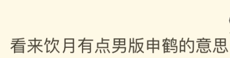

### [不吐不快]有人能帮我解析一下饮月和申鹤的区别吗

Made by ngapost2md (c) ludoux [GitHub Repo](https://github.com/ludoux/ngapost2md)

----

##### 0.[0] \<pid:0\> 2023-08-04 17:07:51 by RiNSliiUH
看到这个评论把我整懵了。

----

##### 1.[0] \<pid:706941200\> 2023-08-04 17:08:41 by yian127

----

##### 2.[4] \<pid:706941235\> 2023-08-04 17:08:52 by k384698637
>[jump](#pid0) RiNSliiUH(2023-08-04 17:07) 说: 
>
>看到这个评论把我整懵了。
>

这下真登月碰瓷了

----

##### 3.[5] \<pid:706941238\> 2023-08-04 17:08:52 by 哈人哈人太哈人了
这两个有哪里有相似之处吗

----

##### 4.[6] \<pid:706941260\> 2023-08-04 17:08:58 by 江鹤疏
国风仙人设定，美强惨
~~卖肉~~

----

##### 5.[3] \<pid:706941281\> 2023-08-04 17:09:05 by 香槟买好了就等
啊？啊？？难得看到里查cue我老婆怎么原因如此奇怪

----

##### 6.[1] \<pid:706941321\> 2023-08-04 17:09:17 by 是是是洺
饮月卖cp的

----

##### 7.[6] \<pid:706941342\> 2023-08-04 17:09:21 by 2233log
申鹤是ml
而饮月君……我不好说

----

##### 8.[0] \<pid:706941381\> 2023-08-04 17:09:32 by 我冲我自己
一个男的一个女的……？

----

##### 9.[0] \<pid:706941427\> 2023-08-04 17:09:46 by 113322qwe1
啊？不是男版云墨？？

----

##### 10.[0] \<pid:706941509\> 2023-08-04 17:10:11 by Hp老板
饮月是mhy游戏里的人物 申鹤也是 因此他们是一个人 论证完毕

----

##### 11.[0] \<pid:706941539\> 2023-08-04 17:10:17 by 不想上班999号
？隔壁饮月也是江户星某角色的专辅自己不太能独立行走那种一看就不受策划喜爱的？

----

##### 12.[0] \<pid:706941560\> 2023-08-04 17:10:23 by 璃月推魈员
饮月卖的不是ml是cp吧，毫无相似

----

##### 13.[0] \<pid:706941639\> 2023-08-04 17:10:41 by 就随便起了个名字
呃……元素都有国风跟仙人？身世……都比较惨？

----

##### 14.[1] \<pid:706941806\> 2023-08-04 17:11:29 by 今锁朱楼
饮月不是一眼魈？

----

##### 15.[1] \<pid:706941986\> 2023-08-04 17:12:20 by 澄澈泠渊
饮月和阿鹤的相似点…大概只是都有个国风bgm
但我觉得神女劈观比水龙吟好听多了

----

##### 16.[0] \<pid:706942113\> 2023-08-04 17:12:58 by 碎银酿普洱
主要是基于水龙吟是对神女劈观的拙劣模仿这个点
同样用到了水这个点，申鹤把海冻住，饮月将海打开

区别就是申鹤流程里强绑定主角，饮月是负责给自己加了个大逼去的

----

##### 17.[0] \<pid:706942155\> 2023-08-04 17:13:08 by BoarMkI
ftmdp，女玩家那么多觉得饮月嬷味重生理不适的，男玩家看申鹤有这感觉？

----

##### 18.[0] \<pid:706942162\> 2023-08-04 17:13:10 by 二之日廿五
申鹤好看，饮月丑就是最大区别

----

##### 19.[0] \<pid:706942227\> 2023-08-04 17:13:28 by 柏Cheung
差远了

----

##### 20.[0] \<pid:706942256\> 2023-08-04 17:13:38 by XXXxxxUUUuuu
大概是饮月在上辈子的熟人和列车组之间选了列车组，让部分人觉得饮月和申鹤一样都是ml向吧

----

##### 21.[0] \<pid:706942321\> 2023-08-04 17:13:54 by 江鹤疏
其实我觉得以隔壁帖子的意义来看，应该是说饮月衣服露出度很高，类比一下就是申鹤那套衣服男版的感觉(。)

----

##### 22.[0] \<pid:706942619\> 2023-08-04 17:15:07 by 喵西斯
他们那边怎么什么都碰瓷啊

----

##### 23.[0] \<pid:706942629\> 2023-08-04 17:15:09 by 落檄
啊？

zsbd

----

##### 24.[2] \<pid:706942859\> 2023-08-04 17:16:01 by 玩c罗玩的
看不出区别的需要挂个眼科

----

##### 25.[0] \<pid:706943054\> 2023-08-04 17:16:52 by 丑章农丑解宗
饮月是善良版的散兵吧

