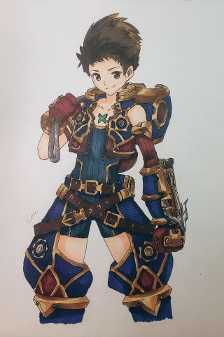

### [不吐不快] 不是那个潜水员的头盔设计我看不懂啊

Made by ngapost2md (c) ludoux [GitHub Repo](https://github.com/ludoux/ngapost2md)

----

##### 0.[4] \<pid:0\> 2023-08-04 20:11:35 by 云彩间隙裏消逝
那些外观的原型啊，还有其他就先不谈了，都谈烂了
我好奇的是，这次实机展示里，如果我没有看错，在他潜水时好像没有戴，只是一个技能(应该是大招)？才戴上
那你这样的意义是什么？难不成只是为了个，这个是个潜水员，我要想办法体现潜水员的元素，所以就做了个头盔？
那你为什么不在潜水的时候用呢？而且这个头盔我没记错是要配合一整套的潜水设备的，你就一个头盔有屁用？

----

##### 1.[1] \<pid:706977996\> 2023-08-04 20:13:26 by 肯定是假的
楼主这么一说，我才发现他们有多搞笑
为了高阻力，所以水下战斗不跟陆上一样
但是我在陆上战斗，就可以带个平时不用的大金属头盔
也许这个金属是比水轻一点吧

----

##### 2.[0] \<pid:706978171\> 2023-08-04 20:14:08 by chasingchild
异度之刃2罢了

----

##### 3.[4] \<pid:706978312\> 2023-08-04 20:14:41 by kip2021
这不就把nga默认头像做进去了

----

##### 4.[0] \<pid:706978534\> 2023-08-04 20:15:37 by 纸游W
喜欢我
在有魔法的世界表演魔术的魔术师
和
在没有氧气条的世界戴潜水头盔的潜水员吗

----

##### 5.[0] \<pid:706979929\> 2023-08-04 20:21:29 by 云彩间隙裏消逝
>[jump](#pid706978312) kip2021(2023-08-04 20:14)说:
>这不就把nga默认头像做进去了[s:ac:哭笑]

草，忘了这茬了

----

##### 6.[0] \<pid:707003205\> 2023-08-04 22:04:10 by 云彩间隙裏消逝
自顶一下~

----

##### 7.[0] \<pid:707003435\> 2023-08-04 22:05:22 by 須賀悠衣
>[jump](#pid706978312) kip2021(2023-08-04 20:14)说:
>这不就把nga默认头像做进去了[s:ac:哭笑]

草我要笑死了

----

##### 8.[0] \<pid:707003759\> 2023-08-04 22:06:48 by Nimbus純水100
潮汐猎人罢了

----

##### 9.[0] \<pid:707003910\> 2023-08-04 22:07:39 by 超定归约律
>[jump](#pid706977996) 肯定是假的(2023-08-04 20:13) 说: 
>
>楼主这么一说，我才发现他们有多搞笑
>为了高阻力，所以水下战斗不跟陆上一样
>但是我在陆上战斗，就可以带个平时不用的大金属头盔
>也许这个金属是比水轻一点吧

可能需要下水和海带强空气吧

----

##### 10.[0] \<pid:707004021\> 2023-08-04 22:08:11 by 不要和傻逼争论
你要说潜水员头盔，我就想到了这位人生赢家雷老板

----

##### 11.[0] \<pid:707004116\> 2023-08-04 22:08:46 by 冰河新栖姬
nga头笑死
我觉得只是为了表现他有一个强化状态，所以刚好用了潜水头盔
不管怎样，如果角色在水下强制装备厚重的潜水设备，那对重视颜值的二游绝对是灾难性影响

----

##### 12.[0] \<pid:707004147\> 2023-08-04 22:08:55 by 南翎
>[jump](#pid706978312) kip2021(2023-08-04 20:14) 说: 
>
>这不就把nga默认头像做进去了

草了
合着是在阴阳怪气nga是吧

----

##### 13.[1] \<pid:707004309\> 2023-08-04 22:09:43 by 云后的彩虹糖
一边是考虑高阻力，一边是浮力大于重力，什么薛定谔的物理法则

