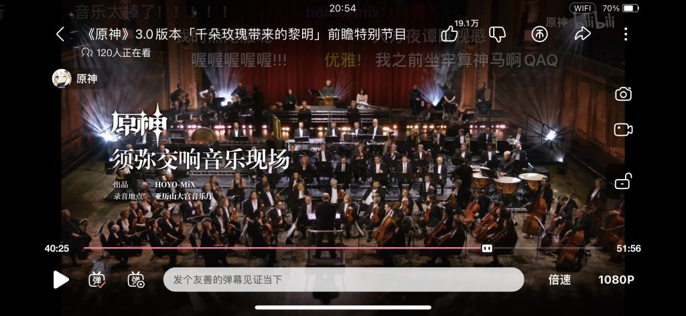

### [热点事件] 陈老师这次有署名吗?音乐感觉很一般啊,不会真的走了吧

Made by ngapost2md (c) ludoux [GitHub Repo](https://github.com/ludoux/ngapost2md)

----

##### 0.[0] \<pid:0\> 2023-08-04 20:46:41 by mihomopromax
虽然须弥后续很多天雷,但是几首曲子依旧绕梁三日.这次前瞻没有现场演奏,音乐会感觉好普通.不会真的去别的项目了吧

----

##### 1.[12] \<pid:706986196\> 2023-08-04 20:47:45 by 兰兰顶真
音乐还行吧，主要是没须弥那么抓耳。须弥那几个中东和印度乐器用的太好了，一出声音立马镇住了

----

##### 2.[0] \<pid:706986431\> 2023-08-04 20:48:39 by EWSCHNEE
这次没有现场音乐前瞻吗

----

##### 3.[0] \<pid:706986595\> 2023-08-04 20:49:16 by safindem
没提到陈老师是淡出了吗？怎么是个看着像市场部的人在介绍音乐啊

----

##### 4.[0] \<pid:706986690\> 2023-08-04 20:49:37 by 青蛙鸣泣之时1
交响乐乐器没有记忆点，都算是欧洲很难和蒙德拉开差距。

----

##### 5.[0] \<pid:706986694\> 2023-08-04 20:49:38 by mihomopromax
>[jump](#pid706986196) 兰兰顶真(2023-08-04 20:47)说:
>音乐还行吧，主要是没须弥那么抓耳。须弥那几个中东和印度乐器用的太好了，一出声音立马镇住了

人比人得死,货比货得扔.和以前的比差远了

----

##### 6.[3] \<pid:706987332\> 2023-08-04 20:52:11 by 马小跳i
以前还露脸讲讲音乐的，现在脸都不露，大概实锤走了

----

##### 7.[0] \<pid:706987552\> 2023-08-04 20:53:08 by 小样儿鸣
被须弥爆了几条街的水平，不过还有翻盘空间。

----

##### 8.[0] \<pid:706987649\> 2023-08-04 20:53:29 by vaderblade3
音乐会都没了，感觉不妙，都忙着联动喜茶去了

----

##### 9.[0] \<pid:706987739\> 2023-08-04 20:53:50 by Inquisit
没提 估计有也只剩存货了

----

##### 10.[7] \<pid:706993976\> 2023-08-04 21:20:15 by 55小玮555
当初说是要待5年的来着，除非特殊情况否则应该不会提前跑路…的吧

----

##### 11.[1] \<pid:706994182\> 2023-08-04 21:21:13 by 一只扁扁

去年这个也没有
你要等明天发交响乐视频时候看看，简介会写作曲。

----

##### 12.[0] \<pid:706994361\> 2023-08-04 21:22:02 by 转生能成功吗
专辑里面好像都是有署名的

----

##### 13.[0] \<pid:706994412\> 2023-08-04 21:22:15 by 烛龙影
珍珠之歌三几乎没有陈致逸单独作曲的音乐了，只有几首合作的，对原的枫丹音乐不抱太大期望

----

##### 14.[0] \<pid:706997294\> 2023-08-04 21:35:34 by 55小玮555
>[jump](#pid706994412) 烛龙影(2023-08-04 21:22) 说: 
>
>珍珠之歌三几乎没有陈致逸单独作曲的音乐了，只有几首合作的，对原的枫丹音乐不抱太大期望

当时ost里评论区的说法是“写几首定个调子就去忙枫丹去了”，如果枫丹ost里也不多的话…

----

##### 15.[0] \<pid:706997639\> 2023-08-04 21:37:13 by Adonais
其实大概就算陈老师还在可能也不会太出彩。欧洲古典风实在是太多珠玉在前了，现代配乐做这一块想出彩本来就很难，大多成功了的要依托作品本身带给作曲人的灵感，比如血源这种。但以现在原神项目组能带来的区域和故事，音乐组可能也不知道他们想干什么，只能泛泛地做点挺好听不出错但也不精彩的东西上来。

----

##### 16.[0] \<pid:706998344\> 2023-08-04 21:40:35 by arutty
确实一般，除了乐队很贵以外感觉不如龙之谷，pv里音乐转场也非常生硬。

----

##### 17.[0] \<pid:707002413\> 2023-08-04 22:00:15 by 柔风散秋梦
其实这次音乐实录的两首……内鬼那边评价都不算高。我最喜欢的战斗音乐(也是评价最高的)是前瞻节目当背景音乐出过一次的那个。
[url](https://www.bilibili.com/video/BV1Au41157yg)
链接中战斗音乐2

----

##### 18.[0] \<pid:707006130\> 2023-08-04 22:18:44 by 柔风散秋梦
这次《枫丹》没有记忆点也算是真的。可以说委婉、美丽，但没有速度变化，没有突然拔高(离调算是有但不突出)，配器也不算突出(水杯子又不是主要乐器)，很难让人有身躯一震的感觉。只能说是个较优秀的氛围音乐。
客观来讲，足迹pv的枫丹旋律是有的，但不是很明显(弦乐合奏的特性)。也许整个小提琴solo好一点？
另外，枫丹城算是个很大的城吧，我个人认为应该添加更多的铜管要素，并且微调混响(也许是母带的问题)……现在这个更像是海底啊。

----

##### 19.[0] \<pid:707068156\> 2023-08-05 09:56:31 by xyxf233
想多了，只是多些人来分担压力而已，枫丹周本ost你可以看到陈致逸的

----

##### 20.[0] \<pid:707069597\> 2023-08-05 10:05:46 by 水煮鱼超好吃
上次看到泥潭有人说米给陈老师硬塞了一堆不认识的米员工而且还不听话，好像和上面说的“合作”对上了哟

----

##### 21.[0] \<pid:707070218\> 2023-08-05 10:09:31 by 斯特拉神斯
没有署名

