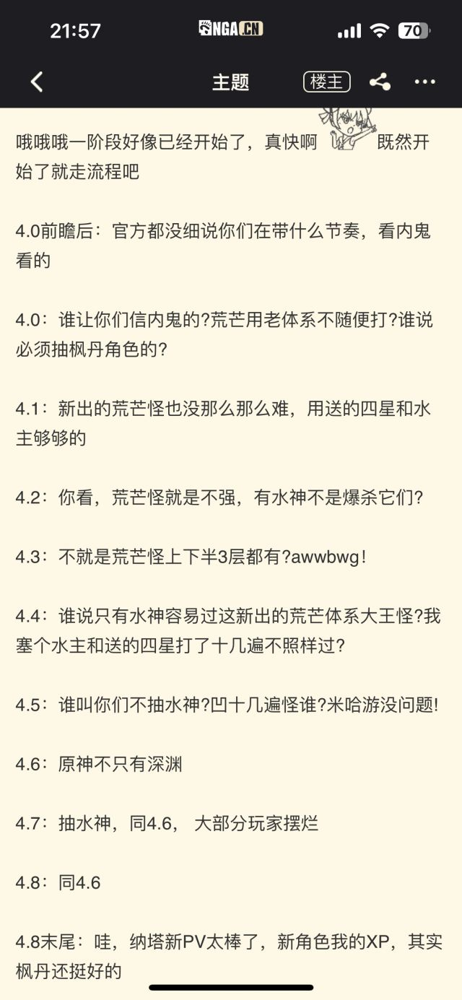

### [不吐不快]你们觉得荒芒机制怎么样

Made by ngapost2md (c) ludoux [GitHub Repo](https://github.com/ludoux/ngapost2md)

----

##### 0.[0] \<pid:0\> 2023-08-04 21:51:09 by EWSCHNEE
感觉跟没活硬整一样。
怎么形容，相当于一个外部挂件但只能差特定的插槽

----

##### 1.[0] \<pid:707000675\> 2023-08-04 21:51:45 by yblc
mhy没活了 ，元素反应都不会做了~~哪怕是加强聚变呢~~，op肯定是要爆旧角色金币的。

----

##### 2.[0] \<pid:707000782\> 2023-08-04 21:52:12 by 罗小福
令人作呕的设计

----

##### 3.[0] \<pid:707000833\> 2023-08-04 21:52:28 by 早见初
勾史用低情商的方式端上来了。

----

##### 4.[1] \<pid:707001078\> 2023-08-04 21:53:37 by CUCUK
米都说了枫丹限定
也就是说也会有纳塔限定，至冬限定
以后谁也别笑谁，人人都是巴巴托斯

----

##### 5.[0] \<pid:707002045\> 2023-08-04 21:58:22 by HitsugayaToushirou
现在有荒芒，以后就跟铁道一样特定怪必须用特定属性才能打，不用对应属性不能打断怪物技能，一个蓄力攻击直接捅穿你大动脉。
逆属性能不能打？倒也能，只不过容错率贼低，你慢慢凹去吧，有对应属性基本无脑打。
这么一说，我感觉好像跟坛友提到过的崩3好像啊。

----

##### 6.[0] \<pid:707002230\> 2023-08-04 21:59:16 by 有梦想的非酋
让你不能只抽一个水神跳过呗，都有荒芒了，一路荒一路芒一路水神一路你还得掏一个枫丹角色，荒芒深渊的具体强度应该会提升到要么你练度，高命，专武足够三人成队带个没其他作用的荒芒工具人，要么你平铺零命的枫丹新体系新队伍，狠狠滴惩罚不抽老角色命座又不抽新体系的玩家(注意这里是新体系，不是枫丹新角色，如果枫丹开辟新体系，那么1新+3旧的组队强度肯定到不了t1，没t1的低命队伍打深渊哪怕顺环境也不好受，那你就需要抽新体系的c和辅助，甚至抽一整套)，原神深渊一直在膨胀要求玩家跟着版本抽卡，要么平铺抽新版本t1队伍+体系，要么抽命座提升老队伍强度，低命+抽的角色强度不高or体系不完整，就会被深渊狠狠惩罚

----

##### 7.[4] \<pid:707002435\> 2023-08-04 22:00:20 by 墨意一痕

主版看到的

----

##### 8.[1] \<pid:707002670\> 2023-08-04 22:01:30 by 就随便起了个名字
>[jump](#pid707002045) HitsugayaToushirou(2023-08-04 21:58) 说: 
>
>现在有荒芒，以后就跟铁道一样特定怪必须用特定属性才能打，不用对应属性不能打断怪物技能，一个蓄力攻击直接捅穿你大动脉。
>逆属性能不能打？倒也能，只不过容错率贼低，你慢慢凹去吧，有对应属性基本无脑打。
>这么一说，我感觉好像跟坛友提到过的崩3好像啊。

好家伙，逐渐崩三化
想起来回坑拿原画集没推荐角色打了5分了凹你都凹不起

----

##### 9.[0] \<pid:707003180\> 2023-08-04 22:04:02 by 闲人闲事儿
版本前期上来先用温水，老东西也能爆杀，等到版本中期开始提温度，老东西得升配置，到了版本后期，水温到顶，老东西给我爆金币

----

##### 10.[0] \<pid:707003336\> 2023-08-04 22:04:52 by bzbjzj
表面是有类似丘丘盾之类的互动机制，但不要指望有类似动作游戏解招博弈的正反馈设计。比如之前圣骸兽破招设定出来深渊都凉了。现在更大概是简单设计强制配队，大世界用不上，深渊用不上。

----

##### 11.[0] \<pid:707003716\> 2023-08-04 22:06:38 by CUCUK
>[jump](#pid707002435) 墨意一痕(2023-08-04 22:00) 说: 
>
>
>主版看到的

还是委婉了
米甚至可以干的出让一路即有芒又有荒的啊

----

##### 12.[0] \<pid:707003804\> 2023-08-04 22:07:05 by q794623
    习惯了，米氏策划最喜欢搞温水煮青蛙，最初的一些玩意看起来没压力，后面上强度就知道痛了

----

##### 13.[0] \<pid:707003949\> 2023-08-04 22:07:47 by 吃乐川下你和我
就是为了不让玩家抽一个队伍玩半年，加快版本迭代而已
纯纯是为了卖卡

----

##### 14.[0] \<pid:707003965\> 2023-08-04 22:07:53 by FENGZHIGUIJI
船大难掉头，抄自己原来的东西能让人恶心，天下也是独一家了

----

##### 15.[0] \<pid:707015653\> 2023-08-04 23:08:24 by chomuchomu
4399模拟器就别聊机制了，你机我笑

