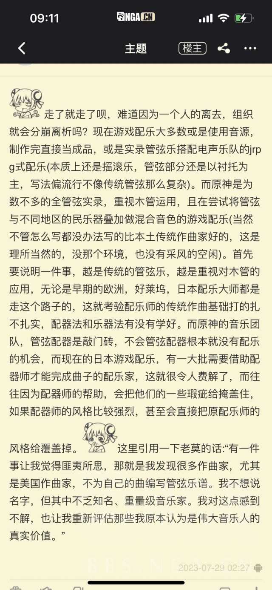
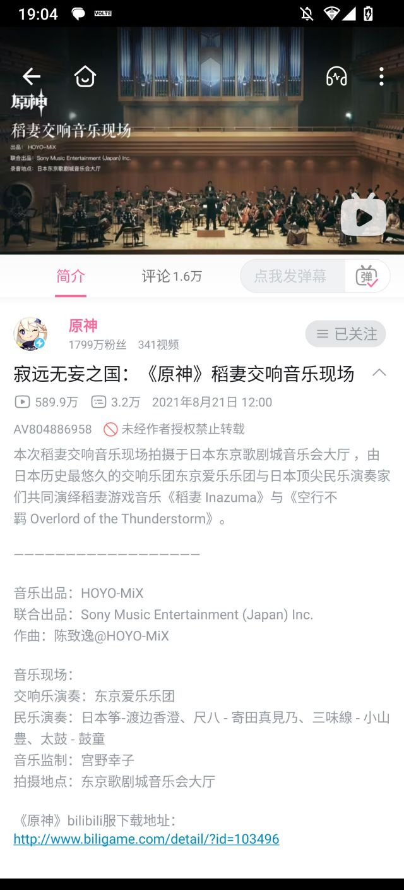

### [不吐不快] 音乐，极其套路化，单调，乏味，重复

Made by ngapost2md (c) ludoux [GitHub Repo](https://github.com/ludoux/ngapost2md)

----

##### 0.[7] \<pid:0\> 2023-08-04 22:09:53 by kenso999
记得刚接触原神音乐时，即使不懂乐理，但相信很多人都能仅凭感知就能发现陈的音乐有种惊为天人的特质
后来接触了一些音乐分析，比如ALEX的几期乐评，
当时陈老师还在下边回复说“自己有意的避免LOOP化的套路”
[url](https://www.bilibili.com/video/BV1LZ4y1L7UJ)
包括这句话在内的分析与陈的自述，当时给了我很多启发

就以ALEX第一期分析的《鲜衣游侠》为例，为什么这首歌听起来这么的灵动
1，段落结构不重复，ABCDE， 中间有重复使用的元素，但尽量使用技巧 避免给人重复的感觉
2，主要的调子或者说动机，非常灵动，走向具有高度的不可预测性
3，下了非常大的心思，使用各种技巧和乐器，避免小段落中的单调. (可以数数鲜衣游侠的前段，同样的调子重复了12遍，但却没有单调感)
4，情绪逐渐由低推到高潮，层层递进
用这些因素去看《疾如猛火》 也能发现相似的特性
<b>最终，才成就这些神曲的最终听感，既有朗朗上口的段落，但又不口水，既有章法，又不失灵动</b>

而以这次现场演奏的《花与剑的轮舞》为例
1，结构单调重复，其实就是套路化的loop， ABACDABABC
2，主调可预测性，缺乏灵性，反复使用，着重强调。像极了新手围绕着自己好不容易想出的“宝贝小调”写了首歌，抱着俗透的几个音符爱不释手的样子
3，缺少丰富的元素来丰富听感(也许之前有各种“民族乐器”的帮助，交响乐就是欧洲的“民族”，但大家太熟悉了)
4，没有层层递进的感觉，虽然后段使劲想用各种大乐器加进来把情绪往上推，但明显力有不逮。最后给人的感觉，就是在转着圈念经

当时听完MIDI感觉心凉了一半，还有人在说MIDI不算数
但是我说，3.0的MIDI我精准的挑出了所有大火的看板曲，包括兰那罗，几初的智愿，维摩庄，包括4首战斗曲
当时爱不释手的抱着听了一个多月，好不好听根本跟MIDI没有关系，曲子的基本基调已经打下了，只是MIDI乐器音色听起来很呆板而已
这次没演奏的其他战斗曲，跟这个《花与剑的轮舞》基本是同样的问题

如果这是陈老师写的，那它们跟原神初期陈差了有0.5-0.8个陈
如果这不是陈写的，我祝陈老师脱离这项目之后好好休息休息，调整一下状态，30几岁正当年，未来几十年我们的文艺产品一定还有很长的上升期，在这个时期一定能凭借自己的才能，并乘着这股势头，陈老师一定能达到真正国际级大师的地位
跟着这帮虫豸完全是浪费才能，暴殄天物

----

##### 1.[0] \<pid:707004635\> 2023-08-04 22:11:24 by laserxkuma
我不懂太多，我只能说 起码我不喜欢，听起来 没有 3.0 早期版本以及之前的味道，不如说 从沙漠的音乐开始就怪怪了

----

##### 2.[0] \<pid:707004646\> 2023-08-04 22:11:27 by 剑筑师と書記官
陈致逸肯定是参与度越来越少软退出
现在我是有点信纳塔以后全自家的说法

----

##### 3.[0] \<pid:707005246\> 2023-08-04 22:14:24 by kenso999
>[jump](#pid707004646) 剑筑师と書記官(2023-08-04 22:11)说:
>陈致逸肯定是参与度越来越少软退出
>现在我是有点信纳塔以后全自家的说法

须弥就跟走穴差不多了，他作曲编曲的比例大量稀释，但是其他老师的水准也是比较高的
但主要4首战斗曲还是他主笔了，但其实在当时，LOOP化，套路化已经开始了
但可能也是民族元素的使用，所以给了人很多新鲜感，另外就是作曲编曲的水平还是比现在要高几档

----

##### 5.[0] \<pid:707010215\> 2023-08-04 22:40:26 by 花瓣飘零
最近fgo 的八周年pv 音乐，我一直在循环，我想这种歌词和旋律比较像我心中的二次元，纯粹又热血 ，还好听  ，我觉得陈老师的话一定能拿出来那种特别抓人的音乐，毕竟他还写过铠甲勇士

----

##### 6.[0] \<pid:707010954\> 2023-08-04 22:44:03 by ANUBlS
在今晚之前我一直相信陈老师说的他会做完五年是真的

但是今天前瞻那个音乐录像听到一半我就开始怀疑这个说法是不是真的了

----

##### 7.[0] \<pid:707011343\> 2023-08-04 22:45:53 by KIMIGGA
陈老师赶紧润，期待您下一个作品

----

##### 8.[1] \<pid:707012424\> 2023-08-04 22:51:05 by 鲜百香四季春茶
这和民族乐器根本没啥关系，蒙德的音乐、渊下宫的音乐同样也很出色，民族乐器只会给好的旋律添光加彩而不是力挽狂澜

----

##### 9.[0] \<pid:707012749\> 2023-08-04 22:52:59 by Narcus
我还以为是我欣赏不来而已

----

##### 11.[0] \<pid:707013102\> 2023-08-04 22:54:51 by 弥可-
不知道我有没有听错，感觉第一首里有用到羽管键琴，就我的观感来说，感觉不如一部很老的动画《蔷薇少女》的bgm用的好……

----

##### 12.[0] \<pid:707013209\> 2023-08-04 22:55:25 by 转生能成功吗
其实hoyomix里面我还有一个特别喜欢的作曲，姜以君，做出来的曲子很有张力

----

##### 13.[0] \<pid:707013572\> 2023-08-04 22:57:22 by kenso999
还想起之前看见陈的微博，说半夜听拉三听得泪流满面
我当时还想说，是不是到了枫丹终于有卸下负重，拆了镣铐跳舞的感觉，是不是能终于解放他最终的能力，可以大胆妄为的疯狂一把了
然后现在，WOC

----

##### 14.[0] \<pid:707013994\> 2023-08-04 22:59:17 by haozhucs8
>[jump](#pid707013102) 弥可-(2023-08-04 22:54)说:
>不知道我有没有听错，感觉第一首里有用到羽管键琴，就我的观感来说，感觉不如一部很老的动画《蔷薇少女》的bgm用的好……

 蔷薇少女OST  yyds!

----

##### 16.[0] \<pid:707015234\> 2023-08-04 23:06:08 by aertgrujvdyjgfu
我不知道别人怎么想的，我觉得今天的音乐会非常无聊，以前的灵气和惊艳全都没了，甚至连耐听的程度都达不到，我现在已经忘了，没有留下任何印象

----

##### 17.[0] \<pid:707015559\> 2023-08-04 23:07:53 by 剑筑师と書記官
>[jump](#pid707013209) 转生能成功吗(2023-08-04 22:55) 说: 
>
>其实hoyomix里面我还有一个特别喜欢的作曲，姜以君，做出来的曲子很有张力

尽管我不喜欢岁门，但是sweet trap我的神  

草龙周本其实也不错的

----

##### 19.[0] \<pid:707016827\> 2023-08-04 23:15:18 by ANUBlS
>[jump](#pid707011343) KIMIGGA(2023-08-04 22:45) 说: 
>
>陈老师赶紧润，期待您下一个作品

希望只是单纯不给mhy写了

我上一个喜欢的作曲家是程池，最有名的作品是《大宋提刑官》的《满江红》，在国内的时候跟三宝一伙的，履历不细说审核不让过，反正是大佬

然后他去了阿美，这些年下来作品稀少，至今我还得靠着循环《新丝绸之路二零零六》和《大乘天》过日子

----

##### 20.[1] \<pid:707016915\> 2023-08-04 23:15:40 by 网友述
关于原神音乐，最逗比的是在原版看到过一个原神音乐在历史游戏中排第几名的投票，一堆说稳前十前五的。
我寻思成本比你低的有靠风格化更脱颖而出的，成本比你高的更能拿捏你，有些经典你更别想去碰了。
推一步讲，我都没见过哪个游戏的粉丝敢说那个游戏的音乐在全游戏排几几的，你算老几？
退一万步讲，谁敢说自己玩过的游戏足够多能给出一个合理的排名？就闭着眼睛嗯投历史前十倒是挺容易让人笑话的。

----

##### 21.[0] \<pid:707017295\> 2023-08-04 23:17:42 by 萨萨萨萨0918
hoyomix一个陈一个姜还一个苑demon，都很有灵性，这次的不知道是谁写的……可能是被()夺舍了吧

----

##### 23.[1] \<pid:707026095\> 2023-08-05 00:11:03 by Rilesss
跟楼主一样的感受
反复品鉴音乐会录像后，两年半以来我第一次为hoyomix感到担忧

貌似陈老师为散作曲之后就几乎退出了3.4-3.8的作曲
楼主说的这种LOOP化也许就是这段时间开始逐渐蔓延，我直接点名草龙周本

垮完剧情垮人设连带着美术废了，没想到现在音乐居然也有苗头了，唉

----

##### 24.[0] \<pid:707027003\> 2023-08-05 00:17:14 by 两块半大魔王
所以到现在，原的水平是全方位下降的咯，从剧情文案到游戏玩法到美工音乐，就连前瞻里制作者们也不是在介绍自己的作品打磨的有多好，而是不停强调自己有多辛苦。
符合我对某些生物的刻板印象，也渐渐理解原神怎么会越来越拉了。

----

##### 25.[0] \<pid:707027008\> 2023-08-05 00:17:15 by Farout
这次4.0pv的音乐也一般，我还以为至少这方面不会太拉跨的

----

##### 26.[0] \<pid:707027208\> 2023-08-05 00:18:31 by kenso999
>[jump](#pid707026095) Rilesss(2023-08-05 00:11)说:
>跟楼主一样的感受 反复品鉴音乐会录像后，两年半以来我第一次为hoyomix感到担忧  貌似陈老师为散作曲之后就几乎退出了3.4-3.8的作曲 楼主说的这种LOOP化也许就是这段时间开始逐渐蔓延，我直接点名草龙周本  垮完剧情垮人设连带着美术废了，没想到现在音乐居然也有苗头了，唉

倒不用替hoyomix担心，星铁虽然我过了主线就没玩了，系统各方面都不太对胃口，但是PV和音乐的水准就是原神开服水准，甚至有超越。崩3，星铁，ZZZ都有这种水准，不知道为什么就是原神保持不住
可能很简单，就是资源抽调，或者被一帮虫豸给夺舍了，一个生命周期达到中末期产品的待遇
虽然有点不甘吧，但还是有点气，
这么大体量这么大MAU的产品，做出X来，都有下边10-20%的人觉得还不错，“太刀了，太好听了，哇塞”
放4-5月份的时候说音乐 PV 编剧的事，会有全屏的人让我6字滚
放1-2个月前，舆论55开，放现在就那10-20%的人都张不了嘴了
谁不希望这游戏好呢，但饭圈化能好的了吗

----

##### 27.[0] \<pid:707027261\> 2023-08-05 00:18:54 by commodore1280
笑死，唯一稳定发挥的部门倒了

----

##### 28.[1] \<pid:707028104\> 2023-08-05 00:24:46 by 南海狒狒王
在流水楼有人发过之前截到的某发言
能对工作了解到这种细枝末节的多半是内部人员了

也就是说：1.陈真的跑了；2.内部音乐人员和文案一样自信

----

##### 29.[0] \<pid:707028555\> 2023-08-05 00:27:57 by kenso999
>[jump](#pid707016915) 网友述(2023-08-04 23:15)说:
>关于原神音乐，最逗比的是在原版看到过一个原神音乐在历史游戏中排第几名的投票，一堆说稳前十前五的。 我寻思成本比你低的有靠风格化更脱颖而出的，成本比你高的更能拿捏你，有些经典你更别想去碰了。 推一步讲，我都没见过哪个游戏的粉丝敢说那个游戏的音乐在全游戏排几几的，你算老几？ 退一万步讲，谁敢说自己玩过的游戏足够多能给出一个合理的排名？就闭着眼睛嗯投历史前十倒是挺容易让人笑话的。    补图：

<a href="javascript:;" onclick="collapse(this);">+</a>点击展开 ...
[img]https://img.nga.178.com/attachments/mon_202308/05/l2Q2s-89f5K1sT1kShs-sg.jpg[/img]

、

我觉得作为一个据说有5-6000万MAU的产品来说，啥人都有，不应该拿极端言论来说事(网上夸就是友，黑就是敌吗，很浅显的道理，不需要我展开)，
我也经常看见夸的，搞“排名”也见过，但很少很少
但真让我主观感觉，历史上确实应该是在第一梯队作品中有一号的，不输很多神作
蒙德璃月第一档，稻妻须弥第二档，但陈和原神明显没有得到应得的荣誉

原神的很多东西都因为手游的身份被低估了
大世界的大框架是塞尔达给出的新公式所奠定的，要是照着育碧的公式肯定要LOW很多
但音乐和战斗系统是最被低估的

元素反应虽然不平衡，但是如果把这套东西套到个单机大作上，那都是惊为天人的，跟这套系统比，即使主机PC上很多RPG那种脸滚键盘的技能释放，根本就是无聊透顶
音乐就更别说了，如果换个欧美的单机，横扫各大奖项了

----

##### 30.[0] \<pid:707028842\> 2023-08-05 00:29:59 by Giovann
>[jump](#pid707028104) 南海狒狒王(2023-08-05 00:24) 说: 
>
>在流水楼有人发过之前截到的某发言
>能对工作了解到这种细枝末节的多半是内部人员了
>
>
>
>也就是说：1.陈真的跑了；2.内部音乐人员和文案一样自信

但是新音乐不好听不抓耳是事实啊

----

##### 31.[1] \<pid:707028978\> 2023-08-05 00:31:06 by Germanuim
3.0和4.0的PV再也无法带给我2.0PV神里绫华立绘出来那一瞬间给我的惊为天人的震撼了

----

##### 32.[0] \<pid:707029487\> 2023-08-05 00:34:29 by 白泽老中医啊啊啊啊
>[jump](#pid707004646) 剑筑师と書記官(2023-08-04 22:11):

说真的，能活到纳塔嘛？其他周边游戏除非是结晶真的还会有玩家去玩嘛？

----

##### 33.[0] \<pid:707029909\> 2023-08-05 00:37:46 by Malygos0
原神的bgm感觉缺了一点层次感，而且复用太多了，好歹复用的时候变一下调啊

拿魔兽为例，原的bgm完全可以做成类似于暴风要塞的bgm和初入暴风城的bgm那样，更何况暴风要塞的bgm还有很多不同的调式

----

##### 34.[0] \<pid:707030176\> 2023-08-05 00:40:09 by Giovann
>[jump](#pid707029909) Malygos0(2023-08-05 00:37) 说: 
>
>原神的bgm感觉缺了一点层次感，而且复用太多了，好歹复用的时候变一下调啊
>
>拿魔兽为例，原的bgm完全可以做成类似于暴风要塞的bgm和初入暴风城的bgm那样，更何况暴风要塞的bgm还有很多不同的调式

哎呀，这种手法叫回响嘛

----

##### 35.[0] \<pid:707030276\> 2023-08-05 00:40:52 by kenso999
>[jump](#pid707028104) 南海狒狒王(2023-08-05 00:24)说:
>在流水楼有人发过之前截到的某发言 能对工作了解到这种细枝末节的多半是内部人员了  [img]https://img.nga.178.com/attachments/mon_202308/05/l2Q2s-jl9iZvT1kShs-12h.jpeg[/img]  也就是说：1.陈真的跑了；2.内部音乐人员和文案一样自信

因为一个人肯定崩不了，但跟他扯的这录制技术的问题根本也没关系，HOYOMIX神人多了去了，崩那俩，蔡近瀚 宫崎
但原神现在的问题是什么，群龙无首，项目 管理极其混乱

之前我分析的帖子都被锁了，
为什么在3.0中后期会出现这样的地图安排，为什么好几个编剧故事都有相似性，动不动就写死人骗廉价的眼泪，为什么至少3-4个PV都拉胯了
我就认为全是项目管理的问题，没有人在上边进行高效的统筹规划，很多东西单拿出来问题都不大，但是放在连续的版本里就像全是沙漠-沙漠-沙漠-沙漠，
陈肯定最终是世界级的超级大师，但是MHY有没有陈没那么重要，本质是团队极速从400倒2000人的扩张，直接把团队的执行力给干废了，刘和蔡缓了2年都没缓过来

----

##### 36.[0] \<pid:707030625\> 2023-08-05 00:43:38 by 罗成成lcc
>[jump](#pid707027208) kenso999(2023-08-05 00:18) 说: 
>
>倒不用替hoyomix担心，星铁虽然我过了主线就没玩了，系统各方面都不太对胃口，但是PV和音乐的水准就是原神开服水准，甚至有超越。崩3，星铁，ZZZ都有这种水准，不知道为什么就是原神保持不住
>可能很简单，就是资源抽调，或者被一帮虫豸给夺舍了，一个生命周期达到中末期产品的待遇
>虽然有点不甘吧，但还是有点气，
>这么大体量这么大MAU的产品，做出X来，都有下边10-20%的人觉得还不错，“太刀了，太好听了，哇塞”
>放4-5月份的时候说音乐 PV 编剧的事，会有全屏的人让我6字滚
>放1-2个月前，舆论5

星铁的音乐……
你听着水龙吟再说一遍
也不是说不好吧，就是感觉很多时候音乐太过用力了，插入的时机也不是很好，有一种非常尬的感觉。

----

##### 37.[0] \<pid:707030946\> 2023-08-05 00:46:05 by Giovann
>[jump](#pid707030625) 罗成成lcc(2023-08-05 00:43) 说: 
>
>星铁的音乐……
>你听着水龙吟再说一遍
>也不是说不好吧，就是感觉很多时候音乐太过用力了，插入的时机也不是很好，有一种非常尬的感觉。

星铁的音乐我感觉就比较一般了野火和水龙吟都尬尬的，踏上旅途还挺好听一直在列车里面放这首，但是不知道为什么这么短。

----

##### 38.[0] \<pid:707030978\> 2023-08-05 00:46:20 by kenso999
>[jump](#pid707029909) Malygos0(2023-08-05 00:37)说:
>原神的bgm感觉缺了一点层次感，而且复用太多了，好歹复用的时候变一下调啊[s:a2:偷吃]  拿魔兽为例，原的bgm完全可以做成类似于暴风要塞的bgm和初入暴风城的bgm那样，更何况暴风要塞的bgm还有很多不同的调式[s:a2:偷吃]

、

同一个调子变调出几个曲子复用问题不大，在以往的版本里也不会觉得单调，够用就行了
原神的制作周期WOW是比不了的，一个大版本他能写出几个小时的有效故事呀，几个月更新一个大版本呀？有多少时间是水在了刷取装备上，真正的有效内容是多少，完全不是一个类型的产品
但现在是连一个曲子都已经立不住了
之前我把几十首MIDI扫一遍，真的事一首都记不住，
能听，但是放在一种西式奇幻RPG的OST里，就是泯然众人的水平

----

##### 39.[0] \<pid:707031059\> 2023-08-05 00:46:56 by 白鸟过提瓦特
别啊，我还一直很期待足迹pv里纳塔的那一段啊
~~或者楼主有什么纳塔这个风格的音乐推荐吗，真的很喜欢很喜欢那种(是弗拉门戈吗)的感觉啊~~

----

##### 40.[0] \<pid:707031231\> 2023-08-05 00:48:14 by 南海狒狒王
>[jump](#pid707030276) kenso999(2023-08-05 00:40)说:
><b>Reply to [pid=707028104,37261043,2]Reply[/pid] Post by [uid=60265224]南海狒狒王[/uid] (2023-08-05 00:24)</b>  因为一个人肯定崩不了，但跟他扯的这录制技术的问题根本也没关系，HOYOMIX神人多了去了，崩那俩，蔡近瀚 宫崎 但原神现在的问题是什么，群龙无首，项目 管理极其混乱  之前我分析的帖子都被锁了， 为什么在3.0中后期会出现这样的地图安排，为什么好几个编剧故事都有相似性，动不动就写死人骗廉价的眼泪，为什么至少3-4个PV都拉胯了 我就认为全是项目管理的问题，没有人在上边进行高效的统筹规划，很多东西单拿出来问题都不大，但是放在连续的版本里就像全是沙漠-沙漠-沙漠-沙漠， 陈肯定最终是世界级的超级大师，但是MHY有没有陈没那么重要，本质是团队极速从400倒2000人的扩张，直接把团队的执行力给干废了，刘和蔡缓了2年都没缓过来

米的项目管理肯定是出了大问题，但不认可你说陈一个人跑了就跑了，米内部不缺大佬这点
1.你说需要一个中层统筹规划，而陈有能力有名望，恰好就是能够统筹原神整体音乐的人，他跑了更是群龙无首
2.音乐这种个人色彩浓郁的创作非常需要创作者自身的才华，别的东西可以用工业化手段进行弥补，但是音乐创作需要天才

----

##### 41.[0] \<pid:707031329\> 2023-08-05 00:49:02 by kenso999
>[jump](#pid707030625) 罗成成lcc(2023-08-05 00:43)说:
>[quote][pid=707027208,37261043,2]Reply[/pid] <b>Post by [uid=14607624]kenso999[/uid] (2023-08-05 00:18):</b>  倒不用替hoyomix担心，星铁虽然我过了主线就没玩了，系统各方面都不太对胃口，但是PV和音乐的水准就是原神开服水准，甚至有超越。崩3，星铁，ZZZ都有这种水准，不知道为什么就是原神保持不住 可能很简单，就是资源抽调，或者被一帮虫豸给夺舍了，一个生命周期达到中末期产品的待遇 虽然有点不甘吧，但还是有点气， 这么大体量这么大MAU的产品，做出X来，都有下边10-20%的人觉得还不错，“太刀了，太好听了，哇塞” 放4-5月份的时候说音乐 PV 编剧的事，会有全屏的人让我6字滚 放1-2个月前，舆论5[/quote]星铁的音乐…… 你听着水龙吟再说一遍[s:ac:冷] 也不是说不好吧，就是感觉很多时候音乐太过用力了，插入的时机也不是很好，有一种非常尬的感觉。

这首是最一般的，问题蒙德璃月里也有一半的和不一般的(当然架不住粉圈又开始起哄了)
但除此之外包括有歌词的，包括各种氛围音乐，那种灵性是有的，不呆板，不是一般的所谓中式复古的那种呆滞感，我觉得水平中上肯定有，少数几首神曲，这足够了

----

##### 42.[0] \<pid:707031800\> 2023-08-05 00:52:39 by kenso999
>[jump](#pid707031231) 南海狒狒王(2023-08-05 00:48)说:
><b>Reply to [pid=707030276,37261043,2]Reply[/pid] Post by [uid=14607624]kenso999[/uid] (2023-08-05 00:40)</b> 米的项目管理肯定是出了大问题，但不认可你说陈一个人跑了就跑了，米内部不缺大佬这点 1.你说需要一个中层统筹规划，而陈有能力有名望，恰好就是能够统筹原神整体音乐的人，他跑了更是群龙无首 2.音乐这种个人色彩浓郁的创作非常需要创作者自身的才华，别的东西可以用工业化手段进行弥补，但是音乐创作需要天才

我想说的重点是管理问题

之前原神音乐团队在陈的带领下有10分
但没有他就必定要到2分了吗？这恰恰反应出来真正的问题不是陈本身
如果管理顺畅，换个7-8分的人上来也是能顶住的，
好的管理，就是不能说少了一个人公司就不转了

----

##### 43.[0] \<pid:707033450\> 2023-08-05 01:06:45 by 网友述
>[jump](#pid707028555) kenso999(2023-08-05 00:27) 说: 
>
>、
>
>我觉得作为一个据说有5-6000万MAU的产品来说，啥人都有，不应该拿极端言论来说事(网上夸就是友，黑就是敌吗，很浅显的道理，不需要我展开)，
>我也经常看见夸的，搞“排名”也见过，但很少很少
>但真让我主观感觉，历史上确实应该是在第一梯队作品中有一号的，不输很多神作
>蒙德璃月第一档，稻妻须弥第二档，但陈和原神明显没有得到应得的荣誉
>
>原神的很多东西都因为手游的身份被低估了
>大世界的大框架是塞尔达给出的新公式所奠定的，要是照着育碧的公式肯定要LOW很多
>但音乐和战斗系统是最被低估的
>
>元素反应

我的主观是玩完游戏之后去听ost，里面让自己印象很深又好听的曲子数量，脱颖而出的的确有一些。但更多数有一种 “几乎没什么人去谈及它的音乐”的游戏 里的音乐的感觉。然后我又更倾向整体。
被手游拖累了也是真，元素这牌是好的，也不是没打好，是彻底落家里了。
七圣召唤把落家里那副牌拿出来，每个元素玩的都挺开心。而本体一直都整得跟种姓制度(五颜六色版)似的。
开服打好的牌：命座和四星。现在前者也打的很好，只不过方向变成赚更多钱了(想赚钱确实无可指摘，但说x块也确实没毛病)，而后者因为不符合这个方向，现在也收起来了。

----

##### 43.[0] \<pid:707033450\> 2023-08-05 01:06:45 by 网友述
>[jump](#pid707028555) kenso999(2023-08-05 00:27) 说: 
>
>、
>
>我觉得作为一个据说有5-6000万MAU的产品来说，啥人都有，不应该拿极端言论来说事(网上夸就是友，黑就是敌吗，很浅显的道理，不需要我展开)，
>我也经常看见夸的，搞“排名”也见过，但很少很少
>但真让我主观感觉，历史上确实应该是在第一梯队作品中有一号的，不输很多神作
>蒙德璃月第一档，稻妻须弥第二档，但陈和原神明显没有得到应得的荣誉
>
>原神的很多东西都因为手游的身份被低估了
>大世界的大框架是塞尔达给出的新公式所奠定的，要是照着育碧的公式肯定要LOW很多
>但音乐和战斗系统是最被低估的
>
>元素反应

我的主观是玩完游戏之后去听ost，里面让自己印象很深又好听的曲子数量。原神里脱颖而出的的确有一些，但更多数有一种 “几乎没什么人去谈及它的音乐”的游戏 里的音乐的感觉。而我评价时又更倾向整体上怎么样。
被手游拖累了也是真，元素这牌是好的，也不是没打好，是彻底落家里了。
七圣召唤把落家里那副牌拿出来，每个元素玩的都挺开心。而本体一直都整得跟种姓制度(五颜六色版)似的。

----

##### 44.[0] \<pid:707034078\> 2023-08-05 01:12:50 by kazuha71
Where are Debussy and Ravel de Fontaine?

----

##### 45.[0] \<pid:707034463\> 2023-08-05 01:16:24 by splendont
须弥midi我当初天天循环听兰纳罗那几首，以至于正式服删了几首我还感到可惜，枫丹我只能说完全没啥记忆点

----

##### 46.[0] \<pid:707034593\> 2023-08-05 01:17:31 by kenso999
>[jump](#pid707031059) 白鸟过提瓦特(2023-08-05 00:46):

真不知道纳塔会怎么样了，还能拉回来吗
从现在考据看其实应该是非洲和南美的结合，拉丁音乐有，但我也很期待很多非洲乐器的使用，应该有文明4Baba Yetu那种感觉，但现在有点没指望了

----

##### 47.[0] \<pid:707035766\> 2023-08-05 01:29:05 by abbccdkani
战斗已经算更好的了，主城音乐才是真突出一个迷惑，实在不敢想象这种质量的音乐能当原神主题曲音乐。。。

----

##### 48.[0] \<pid:707035868\> 2023-08-05 01:30:14 by Giovann
>[jump](#pid707034078) kazuha71(2023-08-05 01:12) 说: 
>
>Where are Debussy and Ravel de Fontaine?
>

mhy哪敢碰真lingling

----

##### 49.[0] \<pid:707036226\> 2023-08-05 01:34:11 by xlsq03
我一直在期待米哈游是不是能搞出点国产三剑那种风味的音乐
但好像我期望太高了

----

##### 50.[0] \<pid:707036595\> 2023-08-05 01:38:41 by kenso999
>[jump](#pid707036226) xlsq03(2023-08-05 01:34)说:
>我一直在期待米哈游是不是能搞出点国产三剑那种风味的音乐 但好像我期望太高了

会有的，但不在原神里 

----

##### 51.[0] \<pid:707036994\> 2023-08-05 01:43:04 by xlsq03
>[jump](#pid707036595) kenso999(2023-08-05 01:38) 说: 
>
>会有的，但不在原神里 

该怎么说，最近在玩顺火暖，感觉听到了很熟悉很怀念的味道，一查作曲家，还真是骆集益
米家游戏我玩的不多，只玩了铁和原，目前没见到太多有类似这种风格的……仙舟的音乐更是无法理解

----

##### 52.[0] \<pid:707063687\> 2023-08-05 09:26:42 by ayainchaos
>[jump](#pid707013572) kenso999(2023-08-04 22:57) 说: 
>
>还想起之前看见陈的微博，说半夜听拉三听得泪流满面
>我当时还想说，是不是到了枫丹终于有卸下负重，拆了镣铐跳舞的感觉，是不是能终于解放他最终的能力，可以大胆妄为的疯狂一把了
>然后现在，WOC

我好像明白为什么那首boss战是陈致逸亲自唱的了

感觉有点心酸又无奈

----

##### 53.[0] \<pid:707075312\> 2023-08-05 10:39:41 by 阿荠赛
花与剑……这个曲名总觉得在须弥已经见过了啊……

----

##### 54.[0] \<pid:707076587\> 2023-08-05 10:46:47 by 鈴谷
>[jump](#pid707013102) 弥可-(2023-08-04 22:54) 说: 
>
>不知道我有没有听错，感觉第一首里有用到羽管键琴，就我的观感来说，感觉不如一部很老的动画《蔷薇少女》的bgm用的好……

光宗信吉可是大师。

----

##### 55.[0] \<pid:707078729\> 2023-08-05 10:58:35 by neesd
再说说周本bossbgm，从女士到散兵都是很高的水准，到了草龙这垮了一截

----

##### 56.[0] \<pid:707078847\> 2023-08-05 10:59:17 by vaderblade3
>[jump](#pid707017295) 萨萨萨萨0918(2023-08-04 23:17):

一个姓尤的，之前没见过

----

##### 57.[0] \<pid:707079925\> 2023-08-05 11:04:53 by kenso999
>[jump](#pid707078729) neesd(2023-08-05 10:58)说:
>再说说周本bossbgm，从女士到散兵都是很高的水准，到了草龙这垮了一截

单拿bgm会感觉很垮，但放在版本里看就不奇怪了，编剧音乐地图没有不垮的，整个大版本的项目管理都垮了，而宵宫二是一个老编剧来走穴的插入式内容

----

##### 58.[0] \<pid:707079953\> 2023-08-05 11:05:05 by 案前神水咒不成
就现在这批货，能写出静谧的星夜(Silent Starry Night)就算他们成功

----

##### 59.[0] \<pid:707079990\> 2023-08-05 11:05:15 by 魑魅魍魉魖魌
一觉醒来我已经忘了昨天前瞻放了什么音乐了

----

##### 60.[0] \<pid:707080321\> 2023-08-05 11:06:56 by 案前神水咒不成
说到草龙
这音乐最早是璃月版本的，大概在层岩前夕被解包出来一直没用上
后来就加入须弥风一编曲，嚯

----

##### 61.[0] \<pid:707081031\> 2023-08-05 11:10:41 by lkkkkstar
>[jump](#pid707030625) 罗成成lcc(2023-08-05 00:43) 说: 
>
>星铁的音乐……
>你听着水龙吟再说一遍
>也不是说不好吧，就是感觉很多时候音乐太过用力了，插入的时机也不是很好，有一种非常尬的感觉。

星铁音乐我感觉只有景元幻胧战的二三阶段音乐有原的早期水平，有若坨周本音乐的调调，其他的能听但不够惊艳

----

##### 62.[0] \<pid:707082114\> 2023-08-05 11:16:40 by 风之碧海之翠
璃月的BGM称得上悠扬，鹤观绀田村能让人印象深刻，沙漠也就阿如村凑合，其余时候有什么BGM？完全没感觉到有BGM，去年尬吹过的层岩地下也完全没感觉到有BGM，总之没音乐装点你游更加无趣

----

##### 63.[0] \<pid:707082336\> 2023-08-05 11:18:01 by ANUBlS
>[jump](#pid707036994) xlsq03(2023-08-05 01:43) 说: 
>
>该怎么说，最近在玩顺火暖，感觉听到了很熟悉很怀念的味道，一查作曲家，还真是骆集益
>米家游戏我玩的不多，只玩了铁和原，目前没见到太多有类似这种风格的……仙舟的音乐更是无法理解

仙舟的音乐我感觉挺好理解的~~没有说铁尤其仙舟音乐好的意思，大眼那边就仙舟音乐已经跟结晶们对喷过一轮了~~
我猜你应该没有跟家里人去宗/教胜地旅过游更没参加过道观的法会

----

##### 64.[1] \<pid:707085325\> 2023-08-05 11:34:37 by 歪比巴卜算子咏梅
吹原的音乐排名前几是真的假的，怎么理查一觉醒来变抽象了
我理解某些潭友对原的蒙德璃月还有滤镜，毕竟爱过，但说实话原的音乐一直给我的感觉是旋律好听归好听，但跟游戏的关系不太大，懂我的意思吗各位，就是这段旋律拿出来放在不管什么里面都很优秀，并不会因为是原神就起到1+1&gt;2的效果，优秀是人家音乐组的人优秀，是背后文化优秀，不是概念优秀
反例的我的建议是去听lol烬的主题乐，其实单听也还行但是肯定谈不上那么美，但是你但凡玩过烬，你就知道里面的鼓点做成手枪换弹声，而且正好是4发一周期做的有多绝   

----

##### 65.[0] \<pid:707085859\> 2023-08-05 11:37:43 by 花瓣飘零
>[jump](#pid707028104) 南海狒狒王(2023-08-05 00:24) 说: 
>
>在流水楼有人发过之前截到的某发言
>能对工作了解到这种细枝末节的多半是内部人员了
>
>
>
>也就是说：1.陈真的跑了；2.内部音乐人员和文案一样自信

这人是上海ip 吗

----

##### 66.[0] \<pid:707085924\> 2023-08-05 11:38:07 by kenso999
>[jump](#pid707080321) 案前神水咒不成(2023-08-05 11:06)说:
>说到草龙 这音乐最早是璃月版本的，大概在层岩前夕被解包出来一直没用上 后来就加入须弥风一编曲，嚯[s:ac:偷笑]

说难听点就是边角料，在层岩这种高质量版本呢种都上不了桌的玩意
边角料的剧本，地图，音乐，弱智小游戏，凑巴凑巴就是一个版本，工业流水线的基本款

----

##### 67.[0] \<pid:707086013\> 2023-08-05 11:38:38 by 怎样才能不被禁言1
>[jump](#pid707085859) 花瓣飘零(2023-08-05 11:37) 说: 
>
>这人是上海ip 吗

这是匿名发言

----

##### 68.[0] \<pid:707086149\> 2023-08-05 11:39:27 by 花瓣飘零
>[jump](#pid707086013) 怎样才能不被禁言1(2023-08-05 11:38) 说: 
>
>这是匿名发言

好家伙，那估计是真走了，内部还很自信

----

##### 69.[1] \<pid:707086225\> 2023-08-05 11:39:54 by 159357呵
>[jump](#pid707085325) 歪比巴卜算子咏梅(2023-08-05 11:34)说:
>吹原的音乐排名前几是真的假的，怎么理查一觉醒来变抽象了[s:a2:惊] 我理解某些潭友对原的蒙德璃月还有滤镜，毕竟爱过，但说实话原的音乐一直给我的感觉是旋律好听归好听，但跟游戏的关系不太大，懂我的意思吗各位，就是这段旋律拿出来放在不管什么里面都很优秀，并不会因为是原神就起到1+1&gt;2的效果，优秀是人家音乐组的人优秀，是背后文化优秀，不是概念优秀 反例的我的建议是去听lol烬的主题乐，其实单听也还行但是肯定谈不上那么美，但是你但凡玩过烬，你就知道里面的鼓点做成手枪换弹声，而且正好是4发一周期做的有多绝   

之前有个帖说玩原审美降级了，我还觉得不至于吧？
还确实是。
如果喜欢原神的音乐，但平时接触古典乐比较少的盆友可以多去听点儿古典乐，一定也会喜欢的。此处强烈推荐老柴老肖。

----

##### 70.[0] \<pid:707086986\> 2023-08-05 11:44:11 by 他小炒肉谁啊
>[jump](#pid707085325) 歪比巴卜算子咏梅(2023-08-05 11:34) 说: 
>吹原的音乐排名前几是真的假的，怎么理查一觉醒来变抽象了
>我理解某些潭友对原的蒙德璃月还有滤镜，毕竟爱过，但说实话原的音乐一直给我的感觉是旋律好听归好听，但跟游戏的关系不太大，......

简单说就是陈致逸的风格极其明显，单独拿出来当陈致逸作品集都不违和，这就是陈致逸值钱的地方嘛归根结底就是音乐和其他部分是并行的，互不干涉，音乐这边拿了个大纲就要开始了，其他部分之后可能还要打磨，音乐开弓就没回头箭了

----

##### 71.[0] \<pid:707087674\> 2023-08-05 11:47:51 by 歪比巴卜算子咏梅
>[jump](#pid707086225) 159357呵(2023-08-05 11:39) 说: 
>
>之前有个帖说玩原审美降级了，我还觉得不至于吧？
>还确实是。
>如果喜欢原神的音乐，但平时接触古典乐比较少的盆友可以多去听点儿古典乐，一定也会喜欢的。

都已经逆大天原神的椅子竟然是能坐的了，你就原谅他们吧
就是给我费解完了，倒也不是说原的旋律不好听，就是好听但跟原没关系，老生常谈的制作人自己不玩，这又不是制作人的问题，换句话来讲就是力大砖飞，只是“没那么好”，也不知道是谁听了无法接受

----

##### 72.[0] \<pid:707088267\> 2023-08-05 11:51:06 by 歪比巴卜算子咏梅
>[jump](#pid707086986) 他小炒肉谁啊(2023-08-05 11:44) 说: 
>
>简单说就是陈致逸的风格极其明显，单独拿出来当陈致逸作品集都不违和，这就是陈致逸值钱的地方嘛归根结底就是音乐和其他部分是并行的，互不干涉，音乐这边拿了个大纲就要开始了，其他部分之后可能还要打磨，音乐开弓就没回头箭了

是这样的，周期太赶了，音乐做成这样已经尽力了，只是确实谈不上“所有游戏中名列前茅”，这样也是有点太不把人家买断式的打磨时间当回事了

----

##### 73.[0] \<pid:707088272\> 2023-08-05 11:51:08 by 一只扁扁
>[jump](#pid707036994) xlsq03(2023-08-05 01:43) 说: 
>
>该怎么说，最近在玩顺火暖，感觉听到了很熟悉很怀念的味道，一查作曲家，还真是骆集益
>米家游戏我玩的不多，只玩了铁和原，目前没见到太多有类似这种风格的……仙舟的音乐更是无法理解

哦居然是他
古剑一二都是他，难怪很熟悉
我还蛮喜欢他的配乐

----

##### 74.[0] \<pid:707088980\> 2023-08-05 11:54:49 by 他小炒肉谁啊
>[jump](#pid707088267) 歪比巴卜算子咏梅(2023-08-05 11:51) 说: 
>
>是这样的，周期太赶了，音乐做成这样已经尽力了，只是确实谈不上“所有游戏中名列前茅”，这样也是有点太不把人家买断式的打磨时间当回事了

国产游戏名列前茅有点可能，所有游戏……我都不说尼尔ff这堆猛人云集的了，就无双8那个交响的水准都不是那么容易超越的，别人暗耻也是电音玩出花，刚开始转交响的选手

----

##### 75.[0] \<pid:707089262\> 2023-08-05 11:56:27 by kenso999
>[jump](#pid707085325) 歪比巴卜算子咏梅(2023-08-05 11:34)说:
>吹原的音乐排名前几是真的假的，怎么理查一觉醒来变抽象了[s:a2:惊] 我理解某些潭友对原的蒙德璃月还有滤镜，毕竟爱过，但说实话原的音乐一直给我的感觉是旋律好听归好听，但跟游戏的关系不太大，懂我的意思吗各位，就是这段旋律拿出来放在不管什么里面都很优秀，并不会因为是原神就起到1+1&gt;2的效果，优秀是人家音乐组的人优秀，是背后文化优秀，不是概念优秀 反例的我的建议是去听lol烬的主题乐，其实单听也还行但是肯定谈不上那么美，但是你但凡玩过烬，你就知道里面的鼓点做成手枪换弹声，而且正好是4发一周期做的有多绝   

其实我也意识到过这个问题，跟其他的影视作品和游戏比，陈老师的作品即是优势也是劣势
在很多优秀作品中，其实“氛围音乐”是为主的，主要功能是烘托作品本身，但是陈的音乐，好听到有点太跳脱了，完全可以独自存在
而很多优秀作品，如果不是放在影视作品本身中来听并没有那么惊艳，如果没看过原作的听众可能都意识不到它们好在哪，但是在作品中却是绝配
‘就像星际穿越中那几个最为流行的音乐片段，好是好，但是一整张作品集里其他的音乐都没那么跳脱，都是以服务好作品为宗旨的。但原神，是满满的全是“抓耳”
但是也像我原贴里说的，陈的这种爪耳 是不俗的 不落于口水的，平常的流行曲作者，想到个绝妙的片段，就容易用到俗透了，但陈有很多天马行空的设计来“去俗”
而且陈有本事能大批量的产出这么多高质量的作品 前期也是独揽所有创作，这点也是一大本事

----

##### 76.[0] \<pid:707090576\> 2023-08-05 12:03:47 by 雲玩家かみかぜ
须弥沙漠后期的一部分音乐我已经能听出来一点套路了

----

##### 77.[0] \<pid:707090952\> 2023-08-05 12:05:53 by kenso999
>[jump](#pid707090576) 雲玩家かみかぜ(2023-08-05 12:03)说:
>须弥沙漠后期的一部分音乐我已经能听出来一点套路了

甚至不需要后期，前期被很多喜欢的 都已经开始没有那么灵动了
奥摩斯港，狮尾之舞，拿去跟鲜衣游侠比都是套路化的
如果鲜衣游侠需要陈打磨3个月，后边这些曲子他一天能写3首

----

##### 78.[0] \<pid:707091341\> 2023-08-05 12:07:56 by 歪比巴卜算子咏梅
>[jump](#pid707089262) kenso999(2023-08-05 11:56) 说: 
>
>其实我也意识到过这个问题，跟其他的影视作品和游戏比，陈老师的作品即是优势也是劣势
>在很多优秀作品中，其实“氛围音乐”是为主的，主要功能是烘托作品本身，但是陈的音乐，好听到有点太跳脱了，完全可以独自存在
>而很多优秀作品，如果不是放在影视作品本身中来听并没有那么惊艳，如果没看过原作的听众可能都意识不到它们好在哪，但是在作品中却是绝配
>‘就像星际穿越中那几个最为流行的音乐片段，好是好，但是一整张作品集里其他的音乐都没那么跳脱，都是以服务好作品为宗旨的。但原神，是满满的全是“抓耳”
>但是也像我原贴里说的

你说得对，但那是陈致逸的本事，跟原有什么关系
你不会想说，正因为有原的优秀文化基底在，陈老师才能做出这些作品吧？
好兄弟，我不想妄自揣测你，但你如果真这么想，麻烦先跟我提个醒哈，我吃一个速效救心丸然后提升一下攻击性

----

##### 79.[0] \<pid:707091867\> 2023-08-05 12:11:09 by kenso999
>[jump](#pid707091341) 歪比巴卜算子咏梅(2023-08-05 12:07)说:
>[quote][pid=707089262,37261043,4]Reply[/pid] <b>Post by [uid=14607624]kenso999[/uid] (2023-08-05 11:56):</b>  其实我也意识到过这个问题，跟其他的影视作品和游戏比，陈老师的作品即是优势也是劣势 在很多优秀作品中，其实“氛围音乐”是为主的，主要功能是烘托作品本身，但是陈的音乐，好听到有点太跳脱了，完全可以独自存在 而很多优秀作品，如果不是放在影视作品本身中来听并没有那么惊艳，如果没看过原作的听众可能都意识不到它们好在哪，但是在作品中却是绝配 ‘就像星际穿越中那几个最为流行的音乐片段，好是好，但是一整张作品集里其他的音乐都没那么跳脱，都是以服务好作品为宗旨的。但原神，是满满的全是“抓耳” 但是也像我原贴里说的[/quote]你说得对，但那是陈致逸的本事，跟原有什么关系 你不会想说，正因为有原的优秀文化基底在，陈老师才能做出这些作品吧？[s:ac:哭笑] 好兄弟，我不想妄自揣测你，但你如果真这么想，麻烦先跟我提个醒哈，我吃一个速效救心丸然后提升一下攻击性

那我想说 要分清楚是什么时期的原神，你如果说原神从一开始打的基础就一无是处，大火全是运气，那我无话可说，别攻击了
事实是，初期的原神和陈是互相成就的，以前陈也才华横溢，但是如果在更虫豸的破项目里接活，他被世界听到并欣赏的路途会坎坷很多

----

##### 80.[0] \<pid:707091904\> 2023-08-05 12:11:21 by 真红眼教授
>[jump](#pid707028104) 南海狒狒王(2023-08-05 00:24) 说: 
>
>在流水楼有人发过之前截到的某发言
>能对工作了解到这种细枝末节的多半是内部人员了
>
>
>
>也就是说：1.陈真的跑了；2.内部音乐人员和文案一样自信

八九不离十了，现在老本快啃完了，坐等枫丹音乐烂完

----

##### 81.[0] \<pid:707091963\> 2023-08-05 12:11:44 by Deathana
关注陈致逸还是天刀的时候
来玩原一部分原因是当时原开服的时机很好，缓解了我打荒野之息的时候严重的武器耐久度不足的恐惧
另一个原因就是很多人吹音乐后来发现是陈致逸

----

##### 82.[0] \<pid:707093479\> 2023-08-05 12:20:24 by 歪比巴卜算子咏梅
>[jump](#pid707091867) kenso999(2023-08-05 12:11) 说: 
>
>那我想说 要分清楚是什么时期的原神，你如果说原神从一开始打的基础就一无是处，大火全是运气，那我无话可说，别攻击了
>事实是，初期的原神和陈是互相成就的，以前陈也才华横溢，但是如果在更虫豸的破项目里接活，他被世界听到并欣赏的路途会坎坷很多

这不就巧了吗，我知道陈致逸还真是在原之前就知道他了，哥几个不会没看过铠甲勇士吧？
我什么时候说原的大火是纯靠运气了？我跟你说音乐，你跟我说大火，我说陈致逸，你说米哈游内部，你想想我在说什么，再想想你在说什么，归根到底你不也是觉得陈致逸吃了ip红利吗？那跟音乐有什么关系，大中午的，真不想跟你辩经，难蚌

----

##### 83.[0] \<pid:707094387\> 2023-08-05 12:25:39 by kenso999
>[jump](#pid707093479) 歪比巴卜算子咏梅(2023-08-05 12:20)说:
>[quote][pid=707091867,37261043,4]Reply[/pid] <b>Post by [uid=14607624]kenso999[/uid] (2023-08-05 12:11):</b>  那我想说 要分清楚是什么时期的原神，你如果说原神从一开始打的基础就一无是处，大火全是运气，那我无话可说，别攻击了 事实是，初期的原神和陈是互相成就的，以前陈也才华横溢，但是如果在更虫豸的破项目里接活，他被世界听到并欣赏的路途会坎坷很多[/quote]这不就巧了吗，我知道陈致逸还真是在原之前就知道他了，哥几个不会没看过铠甲勇士吧？ 我什么时候说原的大火是纯靠运气了？我跟你说音乐，你跟我说大火，我说陈致逸，你说米哈游内部，你想想我在说什么，再想想你在说什么，归根到底你不也是觉得陈致逸吃了ip红利吗？那跟音乐有什么关系，大中午的，真不想跟你辩经，难蚌

我们的观点没那么大矛盾，就是别把话说绝“有什么关系”，关系是有的
创作，经济，影响力，方方面面

----

##### 84.[0] \<pid:707095282\> 2023-08-05 12:30:54 by 歪比巴卜算子咏梅
>[jump](#pid707094387) kenso999(2023-08-05 12:25) 说: 
>
>我们的观点没那么大矛盾，就是别把话说绝“有什么关系”，关系是有的
>创作，经济，影响力，方方面面

确实其实没根本矛盾，反正咱谁也说服不了谁，就这样吧，求同存异问题不大

----

##### 85.[0] \<pid:707096995\> 2023-08-05 12:41:14 by xlsq03
>[jump](#pid707088272) 一只扁扁(2023-08-05 11:51) 说: 
>
>哦居然是他
>古剑一二都是他，难怪很熟悉
>我还蛮喜欢他的配乐

玉满堂，御剑江湖……我以为会在国风城市听到这样的音乐呢

----

##### 86.[0] \<pid:707097305\> 2023-08-05 12:43:08 by 雲玩家かみかぜ
>[jump](#pid707090952) kenso999(2023-08-05 12:05) 说: 
>
>甚至不需要后期，前期被很多喜欢的 都已经开始没有那么灵动了
>奥摩斯港，狮尾之舞，拿去跟鲜衣游侠比都是套路化的
>如果鲜衣游侠需要陈打磨3个月，后边这些曲子他一天能写3首

而且后期的都不是他写的

----

##### 87.[0] \<pid:707097891\> 2023-08-05 12:46:45 by 雲玩家かみかぜ
>[jump](#pid707028104) 南海狒狒王(2023-08-05 00:24) 说: 
>
>在流水楼有人发过之前截到的某发言
>能对工作了解到这种细枝末节的多半是内部人员了
>
>
>
>也就是说：1.陈真的跑了；2.内部音乐人员和文案一样自信

业内人士可以有自己的想法，但是产品最终面向的是一般用户，音乐到底对不对路，还是能听出来的。

----

##### 88.[0] \<pid:707098075\> 2023-08-05 12:47:34 by xlsq03
>[jump](#pid707082336) ANUBlS(2023-08-05 11:18) 说: 
>
>仙舟的音乐我感觉挺好理解的~~没有说铁尤其仙舟音乐好的意思，大眼那边就仙舟音乐已经跟结晶们对喷过一轮了~~
>我猜你应该没有跟家里人去宗/教胜地旅过游更没参加过道观的法会

我说的无法理解是指主城
直观点讲就是……呃，难听

----

##### 89.[0] \<pid:707100021\> 2023-08-05 12:58:43 by 剑筑师と書記官
>[jump](#pid707026095) Rilesss(2023-08-05 00:11) 说: 
>
>跟楼主一样的感受
>反复品鉴音乐会录像后，两年半以来我第一次为hoyomix感到担忧
>
>貌似陈老师为散作曲之后就几乎退出了3.4-3.8的作曲
>楼主说的这种LOOP化也许就是这段时间开始逐渐蔓延，我直接点名草龙周本
>
>垮完剧情垮人设连带着美术废了，没想到现在音乐居然也有苗头了，唉

其实草龙周本去年的版本完成度已经很高了
而且测试服的类似合成音的底音其实也不错
但是正式服这个就说不上来……

----

##### 90.[0] \<pid:707100995\> 2023-08-05 13:04:28 by MOYUxuanshou
刚刚又去看了一遍影的PV，只能说太强了

----

##### 92.[0] \<pid:707104625\> 2023-08-05 13:25:34 by 献给美第奇
看一个贴，说陈今年退出hoyomix了

----

##### 93.[0] \<pid:707105682\> 2023-08-05 13:31:50 by ANUBlS
>[jump](#pid707098075) xlsq03(2023-08-05 12:47) 说: 
>
>我说的无法理解是指主城
>直观点讲就是……呃，做出来的效果很难听

就是主城
道教音乐确实是这个味儿，我妈年年按头带我上山参加法会~~别说了今年已经跟道观约好了11月我得去皈依了~~
我这辈子唯一感觉这玩意好听是有次爬山，山顶大喇叭在播放，而盘山小路弯弯曲曲，距离时近时远，音乐声忽大忽小，飘飘渺渺的非常对味

----

##### 94.[0] \<pid:707110873\> 2023-08-05 14:03:10 by ayainchaos
>[jump](#pid707104625) 献给美第奇(2023-08-05 13:25) 说: 
>
>看一个贴，说陈今年退出hoyomix了

老哥瓜切一下

----

##### 95.[0] \<pid:707111567\> 2023-08-05 14:07:24 by TooruW
>[jump](#pid707030276) kenso999(2023-08-05 00:40) 说: 
>
>因为一个人肯定崩不了，但跟他扯的这录制技术的问题根本也没关系，HOYOMIX神人多了去了，崩那俩，蔡近瀚 宫崎
>但原神现在的问题是什么，群龙无首，项目 管理极其混乱
>
>之前我分析的帖子都被锁了，
>为什么在3.0中后期会出现这样的地图安排，为什么好几个编剧故事都有相似性，动不动就写死人骗廉价的眼泪，为什么至少3-4个PV都拉胯了
>我就认为全是项目管理的问题，没有人在上边进行高效的统筹规划，很多东西单拿出来问题都不大，但是放在连续的版本里就像全是沙漠-沙漠-沙漠-沙漠，
>陈肯定最终是世界级的超级大师

陈老师确实是极其优秀的作曲人，但能不能说成是世界级的超级大师，这个title太重了

----

##### 96.[0] \<pid:707112174\> 2023-08-05 14:11:09 by TooruW
>[jump](#pid707103959) 炒鸡内金(2023-08-05 13:21) 说: 
>
>《青龙永夜》(《天涯明月刀》青龙会主题曲) [url](https://c6.y.qq.com/base/fcgi-bin/u?__=vmt6XUrEwdss) @QQ音乐   这是陈17年的编曲

这整张专都特别好，我甚至觉得天刀时期的陈老师的灵动一如当年，即使在沙漠的几首曲子里也能感受到

----

##### 97.[0] \<pid:707112852\> 2023-08-05 14:15:17 by kenso999
>[jump](#pid707111567) TooruW(2023-08-05 14:07)说:
>[quote][pid=707030276,37261043,2]Reply[/pid] <b>Post by [uid=14607624]kenso999[/uid] (2023-08-05 00:40):</b>  因为一个人肯定崩不了，但跟他扯的这录制技术的问题根本也没关系，HOYOMIX神人多了去了，崩那俩，蔡近瀚 宫崎 但原神现在的问题是什么，群龙无首，项目 管理极其混乱  之前我分析的帖子都被锁了， 为什么在3.0中后期会出现这样的地图安排，为什么好几个编剧故事都有相似性，动不动就写死人骗廉价的眼泪，为什么至少3-4个PV都拉胯了 我就认为全是项目管理的问题，没有人在上边进行高效的统筹规划，很多东西单拿出来问题都不大，但是放在连续的版本里就像全是沙漠-沙漠-沙漠-沙漠， 陈肯定最终是世界级的超级大师[/quote][s:ac:晕]陈老师确实是极其优秀的作曲人，但能不能说成是世界级的超级大师，这个title太重了

em要不你再仔细读读，我主贴和回复中的意思都是他最终会是，
初期的他和原神是互相成就，但现在的他是被这个项目严重拖累了，没有足够多有高度的作品，像久石让汉斯季默那样，那肯定不是，是不是要看未来的发展

----

##### 98.[0] \<pid:707115384\> 2023-08-05 14:31:24 by 竹声未央
>[jump](#pid707028104) 南海狒狒王(2023-08-05 00:24) 说: 
>
>在流水楼有人发过之前截到的某发言
>能对工作了解到这种细枝末节的多半是内部人员了
>
>
>
>也就是说：1.陈真的跑了；2.内部音乐人员和文案一样自信

非常专业，不过看上去感觉只能说明是个行业内人士，或者深度爱好者，也未必一定是内部人士吧。总之等网易云专辑上架时应该就能真正判断陈还在不在了

----

##### 99.[0] \<pid:707160398\> 2023-08-05 19:06:28 by renjianhualaozi
摆几张截图吧，分别是稻妻，须弥，枫丹的交响音乐现场介绍

----

##### 100.[0] \<pid:707183178\> 2023-08-05 21:01:04 by 五月晴岚
>[jump](#pid707160398) renjianhualaozi(2023-08-05 19:06) 说: 
>
>摆几张截图吧，分别是稻妻，须弥，枫丹的交响音乐现场介绍

怎么不写音乐出品和编曲人了

----

##### 101.[0] \<pid:707199313\> 2023-08-05 22:22:50 by 許久、等待
>[jump](#pid707013209) 转生能成功吗(2023-08-04 22:55) 说: 
>
>其实hoyomix里面我还有一个特别喜欢的作曲，姜以君，做出来的曲子很有张力

姜老师貌似也不在了…

----

##### 102.[0] \<pid:707201809\> 2023-08-05 22:35:37 by 他小炒肉谁啊
>[jump](#pid707115384) 竹声未央(2023-08-05 14:31) 说: 
>
>非常专业，不过看上去感觉只能说明是个行业内人士，或者深度爱好者，也未必一定是内部人士吧。总之等网易云专辑上架时应该就能真正判断陈还在不在了

大胆预测，枫丹第一张专还是有陈致逸的，可能会有几首是第一作曲，但是大部分都是作曲靠后的位置，然后结晶就会拿这个作为理由开始岁月史书，对了喝一桶水果茶，错了喝薄荷奶绿

----

##### 103.[0] \<pid:707202676\> 2023-08-05 22:39:50 by kenso999
>[jump](#pid707201809) 他小炒肉谁啊(2023-08-05 22:35)说:
>[quote][pid=707115384,37261043,5]Reply[/pid] <b>Post by [uid=39380423]竹声未央[/uid] (2023-08-05 14:31):</b>  非常专业，不过看上去感觉只能说明是个行业内人士，或者深度爱好者，也未必一定是内部人士吧。总之等网易云专辑上架时应该就能真正判断陈还在不在了[s:ac:哭笑][/quote]大胆预测，枫丹第一张专还是有陈致逸的，可能会有几首是第一作曲，但是大部分都是作曲靠后的位置，然后结晶就会拿这个作为理由开始岁月史书，对了喝一桶水果茶，错了喝薄荷奶绿[img]https://img.nga.178.com/attachments/mon_201209/14/-47218_5052bc4cc6331.png[/img]

猜着玩意对错是太没谱的事，建议就别赌。署名这东西，是你的也可以写别人的名，不是你的也可以写上你的名，钱的事
但是这几天舆论这么猛，发视频竟然都不写，完全可以写上去降降温嘟嘟嘴，看来确实也没那么简单，两边头都很铁

----

##### 104.[0] \<pid:707204249\> 2023-08-05 22:48:28 by 他小炒肉谁啊
>[jump](#pid707202676) kenso999(2023-08-05 22:39)说:
><b>Reply to [pid=707201809,37261043,6]Reply[/pid] Post by [uid=63886056]他小炒肉谁啊[/uid] (2023-08-05 22:35)</b>  猜着玩意对错是太没谱的事，建议就别赌。署名这东西，是你的也可以写别人的名，不是你的也可以写上你的名，钱的事 但是这几天舆论这么猛，发视频竟然都不写，完全可以写上去降降温嘟嘟嘴，看来确实也没那么简单，两边头都很铁

我只是在骗吃骗喝而已，别太在意归根结底这次现场不署名加4.0pv音乐不参与其实已经是很反常的事情了，无论到时有名字没名字都解释不清楚的

----

##### 105.[0] \<pid:707205644\> 2023-08-05 22:56:16 by 神原之秋
>[jump](#pid707028104) 南海狒狒王(2023-08-05 00:24):

好家伙，我现在发现米哈游这帮人有一说一都有种孤芳自赏的感觉，就是自我陶醉在自己的幻想中，我自己懂的好多我好牛逼我们的团队超级牛逼，喷我们的人都没有审美，都是群傻逼。像我这么优质的人做东西你们都应该感恩戴德地接受图里这个和李猛干先生是一个品种的，只能尊重祝福了

----

##### 106.[0] \<pid:707224167\> 2023-08-06 01:08:22 by ether-wind
听感不够丰富和缺少民族乐器没有必然关系，交响音乐里从来不缺听感丰富的作品。根本原因在于这次两首作品的配器法相当俗套，特别是弦乐部分的loop和高潮部分管乐的使用，给人感觉像是一般的商用作品。这样的曲子出现在一般的场景中无伤大雅，但作为一个国度的标志性音乐就不太行了。

此外，个人认为还有一点在于调式的使用。蒙德地区大量使用了多利亚调式和利底亚调式，璃月地区用的是中国传统五声调式，稻妻采用的是都节调式，须弥的调式我不太了解，但也是特殊调式。这些调式都赋予了这些国家截然不同的性格。但本次的音乐听上去只采用了普通的自然小调，显得不够有异域色彩。

----

##### 107.[0] \<pid:707224671\> 2023-08-06 01:13:11 by Euncydar
>[jump](#pid707004646) 剑筑师と書記官(2023-08-04 22:11):

陈老师不算米自家的吗？一直以为hoyo mix就是专门给陈组的，或者相当于是米买了他的团队 因为看结晶很喜欢说别家音乐都是外包的，来夸米的音乐和陈老师

----

##### 108.[0] \<pid:707226409\> 2023-08-06 01:32:04 by kenso999
>[jump](#pid707224167) ether-wind(2023-08-06 01:08)说:
>听感不够丰富和缺少民族乐器没有必然关系，交响音乐里从来不缺听感丰富的作品。根本原因在于这次两首作品的配器法相当俗套，特别是弦乐部分的loop和高潮部分管乐的使用，给人感觉像是一般的商用作品。这样的曲子出现在一般的场景中无伤大雅，但作为一个国度的标志性音乐就不太行了。  此外，个人认为还有一点在于调式的使用。蒙德地区大量使用了多利亚调式和利底亚调式，璃月地区用的是中国传统五声调式，稻妻采用的是都节调式，须弥的调式我不太了解，但也是特殊调式。这些调式都赋予了这些国家截然不同的性格。但本次的音乐听上去只采用了普通的自然小调，显得不够有异域色彩。

专业的来了。我觉得应该不是调式的问题，什么调式都能出彩，想想感觉最大的问题还是编曲，中间那个调子出现的时候，真的我就想，您想让我听啥？编曲真的就是一板一眼的，跟八股文似的，这跟以前的陈作品比像个傻子写的

----

##### 109.[0] \<pid:707226708\> 2023-08-06 01:35:40 by Giovann
>[jump](#pid707226409) kenso999(2023-08-06 01:32) 说: 
>
>专业的来了。我觉得应该不是调式的问题，什么调式都能出彩，想想感觉最大的问题还是编曲，中间那个调子出现的时候，真的我就想，您想让我听啥？编曲真的就是一板一眼的，跟八股文似的，这跟以前的陈作品比像个傻子写的

调式挺重要的，相当于一首曲子的地基，基本上情绪和风格就已经奠定了。
枫丹尴尬的是它用了个没啥特色的普通小调没有特殊调式，你又卷不过其他西幻配乐乃至古典音乐，自然流于俗套。

----

##### 110.[0] \<pid:707227006\> 2023-08-06 01:39:23 by kenso999
>[jump](#pid707226708) Giovann(2023-08-06 01:35)说:
>[quote][pid=707226409,37261043,6]Reply[/pid] <b>Post by [uid=14607624]kenso999[/uid] (2023-08-06 01:32):</b>  专业的来了。我觉得应该不是调式的问题，什么调式都能出彩，想想感觉最大的问题还是编曲，中间那个调子出现的时候，真的我就想，您想让我听啥？编曲真的就是一板一眼的，跟八股文似的，这跟以前的陈作品比像个傻子写的[/quote]调式挺重要的，相当于一首曲子的地基，基本上情绪和风格就已经奠定了。 枫丹尴尬的是它用了个没啥特色的普通小调没有特殊调式，你又卷不过其他西幻配乐乃至古典音乐，自然流于俗套。

嗯可能吧，另外今天还看好多人说，“因为这是纯古典，所以好多人听不懂，欣赏水平不行”。我TM想说有本事你拿到古典圈里去让人评评，人家认你这是优秀的古典吗，饭圈已经疯到一定程度了

----

##### 111.[0] \<pid:707227166\> 2023-08-06 01:41:37 by 天涯墨刀
枫丹音乐，听了完全记不住，比之前的差太多了

----

##### 112.[0] \<pid:707227174\> 2023-08-06 01:41:42 by Giovann
>[jump](#pid707227006) kenso999(2023-08-06 01:39) 说: 
>
>嗯可能吧，另外今天还看好多人说，“因为这是纯古典，所以好多人听不懂，欣赏水平不行”。我TM想说有本事你拿到古典圈里去让人评评，人家认你这是优秀的古典吗，饭圈已经疯到一定程度了

我在好几个贴都说过了，这bgm就是个古典音乐版的口水歌，也就是你说的八股文、一板一眼，纯纯套路作品
孝子能拿古典音乐嗯洗是没想到的，听一下老肖那首很著名的圆舞曲就知道差距了，这还是老肖写着玩的。

----

##### 113.[0] \<pid:707227310\> 2023-08-06 01:43:13 by kenso999
>[jump](#pid707227174) Giovann(2023-08-06 01:41)说:
>[quote][pid=707227006,37261043,6]Reply[/pid] <b>Post by [uid=14607624]kenso999[/uid] (2023-08-06 01:39):</b>  嗯可能吧，另外今天还看好多人说，“因为这是纯古典，所以好多人听不懂，欣赏水平不行”。我TM想说有本事你拿到古典圈里去让人评评，人家认你这是优秀的古典吗，饭圈已经疯到一定程度了[/quote][s:ac:哭笑]我在好几个贴都说过了，这bgm就是个古典音乐版的口水歌，也就是你说的八股文、一板一眼，纯纯套路作品 孝子能拿古典音乐嗯洗是没想到的，听一下老肖那首很著名的圆舞曲就知道差距了，这还是老肖写着玩的。

好奇问一下，你们觉得蟹黄堡怎么样

----

##### 114.[0] \<pid:707227602\> 2023-08-06 01:46:39 by 泛舟浮白
>[jump](#pid707036226) xlsq03(2023-08-05 01:34) 说: 
>
>我一直在期待米哈游是不是能搞出点国产三剑那种风味的音乐
>但好像我期望太高了

你想想璃月在主线和活动剧情是什么待遇就知道根本不可能了

----

##### 115.[0] \<pid:707227691\> 2023-08-06 01:47:55 by Giovann
>[jump](#pid707227310) kenso999(2023-08-06 01:43) 说: 
>
>好奇问一下，你们觉得蟹黄堡怎么样

我能说海岛版本我a了吗~~我马上现听~~
我朋友是个巴洛克音乐原教旨爱好者，特别偏激那种，听完直接大骂o并且彻底拉黑o

----

##### 116.[0] \<pid:707227808\> 2023-08-06 01:49:29 by 不尔魃
>[jump](#pid707205644) 神原之秋(2023-08-05 22:56)说:
><b>Reply to [pid=707028104,37261043,2]Reply[/pid] Post by [uid=60265224]南海狒狒王[/uid] (2023-08-05 00:24)</b> 好家伙，我现在发现米哈游这帮人有一说一都有种孤芳自赏的感觉，就是自我陶醉在自己的幻想中，我自己懂的好多我好牛逼我们的团队超级牛逼，喷我们的人都没有审美，都是群傻逼。像我这么优质的人做东西你们都应该感恩戴德地接受[s:ac:哭笑]图里这个和李猛干先生是一个品种的，只能尊重祝福了

很多人有眼高手低的毛病，但是米就怪了，他们内部总是能跳出这么多连鉴赏能力都欠奉的人，偏偏还借着平台自视甚高
只能说连什么是好的都分不清楚比眼高手低更可怕(

----

##### 117.[0] \<pid:707227889\> 2023-08-06 01:50:26 by Giovann
>[jump](#pid707227808) 不尔魃(2023-08-06 01:49) 说: 
>
>很多人有眼高手低的毛病，但是米就怪了，他们内部总是能跳出这么多连鉴赏能力都欠奉的人，偏偏还借着平台自视甚高
>只能说连什么是好的都分不清楚比眼高手低更可怕(

大伙说的风口上的猪是比喻，没想到真的是猪啊

----

##### 118.[0] \<pid:707228251\> 2023-08-06 01:55:37 by kenso999
>[jump](#pid707227808) 不尔魃(2023-08-06 01:49)说:
><b>Reply to [pid=707205644,37261043,6]Reply[/pid] Post by [uid=60127502]神原之秋[/uid] (2023-08-05 22:56)</b>很多人有眼高手低的毛病，但是米就怪了，他们内部总是能跳出这么多连鉴赏能力都欠奉的人，偏偏还借着平台自视甚高[s:ac:哭笑] 只能说连什么是好的都分不清楚比眼高手低更可怕(

老人搭的地基好，不说神中神吧，肯定是历史上经得起比较的第一梯队，大世界观，小的人物塑造，战斗系统，音乐，渲染画面风格，既有站在巨人肩膀上的，也有很多自己原创独一无二的创造
虽然带节奏瞎猜测不好，但是流出来一些看起来很像真的团队内部的抱怨，大火之后着急招人，整个团队扩充3-4倍，组织架构可能被网易企鹅来的人给干废了，刘和蔡不可能说刚招进来1000多人马上再开掉吧，就慢慢磨合呗，而且从1.3-1.6的内容量来看，确实急需产能爬坡，但是进来的人不可能光是干活的，慢慢1-2年就把这个团队给绑架了。所以刘也在讲话中说招进来的人完全不懂MHY的精神和企业文化，首先先裁的是国际工作室那帮人，但是国内工作室有多乱，我估计他们都不好意思提
看看王者世界那些项目，真的能感觉到就是一帮年薪百万的现充充值，更何况刘当时招的是一帮猪鹅不要的人，管理灾难

----

##### 119.[0] \<pid:707228825\> 2023-08-06 02:03:29 by kenso999
说个不负责的猜想，带个节奏。突然想起来云堇的那个幕后，看着是真奇怪
IP 美术 什么音频组都跑出来说，陈就在录音师后边都没有他的采访。啥部门都说了，歌曲在里边有这么大的篇幅，作曲编曲不说话
“当时是很急的活”“我们小时候都跟着家长都去听戏”
现在看陈在做这个活的时候，感觉气氛就很怪

----

##### 120.[0] \<pid:707229285\> 2023-08-06 02:10:33 by 南海狒狒王
>[jump](#pid707228825) kenso999(2023-08-06 02:03)说:
>说个不负责的猜想，带个节奏。突然想起来云堇的那个幕后，看着是真奇怪 IP 美术 什么音频组都跑出来说，陈就在录音师后边都没有他的采访。啥部门都说了，歌曲在里边有这么大的篇幅，作曲编曲不说话 “当时是很急的活”“我们小时候都跟着家长都去听戏” 现在看陈在做这个活的时候，感觉气氛就很怪

既然如此，我补充一个信息
神女劈棺在米哈游内部的地位非常重要，已经相当于符号化的程度了，如果应聘市场职位，在面试时有80%的可能性会被问到：你觉得神女劈棺为什么能够成功？
隔壁水龙吟也是对标神女劈棺进行营销，指望能再复刻一个宣发奇迹
这么大的一件事，肯定各个部门都想揽功劳啦～

----

##### 121.[0] \<pid:707229620\> 2023-08-06 02:15:37 by Giovann
>[jump](#pid707227310) kenso999(2023-08-06 01:43) 说: 
>
>好奇问一下，你们觉得蟹黄堡怎么样

ok我听完了，谢皇堡这几首巴洛克风格特有的节奏把握的挺好的，全部采用小调，感觉偏向日式哥特风味了而且有点模仿巴赫风格(起名也是德语)，我没玩那个地图不过烘托谢皇堡的哥特风格肯定是非常好的。
缺点是巴洛克特有的复调基本没表现，通奏低音没啥表现，对巴赫风格的模仿比较流于表面了。优点是至少写了一首赋格，好听，全羽管键琴好评~~受够了钢琴弹巴洛克了~~。ost的交响乐我觉得挺好的，也不说是巴洛克风格吧因为还是没有复调，喜欢配器，它这个改编创新就挺好的，甚至是活动限时bgm。
枫丹音乐的问题还是在没有风格特色和抓耳的旋律，它第一首用了个圆舞曲，第二首对不起我注意力在鲁特琴和玻璃琴上了所以忘了分析啥题材~~也不想再听一遍~~，但是吧法国特点没表现出来，因为圆舞曲还有后面曲子的风格其实都是偏德奥的(古典主义遗产)，法国音乐最出名的前有吕利、拉莫代表的芭蕾歌剧，后有拉威尔、德彪西代表的印象派风格，然后这两首硬是一种风格都没有蹭到，而且写的还毫无特色(圆舞曲这种题材早就被开发完了，写点拿来烘托氛围还行，主城音乐和战斗音乐真撑不起)，所以非常尴尬。

----

##### 122.[0] \<pid:707229732\> 2023-08-06 02:17:25 by kenso999
>[jump](#pid707229285) 南海狒狒王(2023-08-06 02:10)说:
><b>Reply to [pid=707228825,37261043,6]Reply[/pid] Post by [uid=14607624]kenso999[/uid] (2023-08-06 02:03)</b> 既然如此，我补充一个信息 神女劈棺在米哈游内部的地位非常重要，已经相当于符号化的程度了，如果应聘市场职位，在面试时有80%的可能性会被问到：你觉得神女劈棺为什么能够成功？ 隔壁水龙吟也是对标神女劈棺进行营销，指望能再复刻一个宣发奇迹 这么大的一件事，肯定各个部门都想揽功劳啦～

这么重要，“还是个很急的活”，就说定计划做管理的有多乱吧，一帮畜X
水龙吟是照着它做的听来一点都不奇怪，就是个东施效颦的玩意，本体都尬的抠脚，但那成功是多个因素集合 再加上意外的产物，甚至很多工作还可能是再2.0之前主体团队打下的地基
3.3之后的版本就是失去老地基的结果。各个部门都像在生产“模块化”的东西

比如要求各个编剧小组去写个命题作为，要求是智慧之国的传说故事
编剧1，研究事故失控了，提纳里去救
编剧2，研究失控了，艾尔海森去救
编剧3，研究失控了，草神去救

地图组1，沙漠
地图组2，沙漠
地图组3，沙漠

各小组都写完了交上去，领导一看重了，不好意思让人重写吧
全都交给动画脚本组去做呗
这组织架构基本就是瘫痪的状态
在稻妻后期就已经撑不住了，但稻妻还有老团队为渊下宫和层岩打的基础，所以看起来不明显

----

##### 123.[0] \<pid:707229858\> 2023-08-06 02:19:29 by 南海狒狒王
>[jump](#pid707229620) Giovann(2023-08-06 02:15)说:
>[quote][pid=707227310,37261043,6]Reply[/pid] <b>Post by [uid=14607624]kenso999[/uid] (2023-08-06 01:43):</b>  好奇问一下，你们觉得蟹黄堡怎么样[/quote]ok我听完了，谢皇堡这几首巴洛克风格特有的节奏把握的挺好的，全部采用小调，感觉偏向日式哥特风味了[s:ac:哭笑]而且有点模仿巴赫风格(起名也是德语)，我没玩那个地图不过烘托谢皇堡的哥特风格肯定是非常好的。 缺点是巴洛克特有的复调基本没表现，通奏低音没啥表现，对巴赫风格的模仿比较流于表面了。优点是至少写了一首赋格，好听，全羽管键琴好评<del class='gray'> 受够了钢琴弹巴洛克了 </del>。ost的交响乐我觉得挺好的，也不说是巴洛克风格吧因为还是没有复调，喜欢配器，它这个改编创新就挺好的，甚至是活动限时bgm。 枫丹音乐的问题还是在没有风格特色和抓耳的旋律，它第一首用了个圆舞曲，第二首对不起我注意力在鲁特琴和玻璃琴上了所以忘了分析啥题材<del class='gray'> 也不想再听一遍 </del>，但是吧法国特点没表现出来，因为圆舞曲还有后面曲子的风格其实都是偏德奥的(古典主义遗产)，法国音乐最出名的前有吕利、拉莫代表的芭蕾歌剧，后有拉威尔、德彪西代表的印象派风格，然后这两首硬是一种风格都没有蹭到，而且写的还毫无特色(圆舞曲这种题材早就被开发完了，写点拿来烘托氛围还行，主城音乐和战斗音乐真撑不起)，所以非常尴尬。

大佬，我不懂乐理，但是平常听点古典，请问一下，它这个圆舞曲我感觉前面还行，中段之后就特别乱而且有点刺耳，而且各乐器感觉不太和谐，这是我的错觉吗，还是能用乐理知识来解释？

----

##### 124.[0] \<pid:707230540\> 2023-08-06 02:31:34 by kenso999
>[jump](#pid707229620) Giovann(2023-08-06 02:15)说:
>[quote][pid=707227310,37261043,6]Reply[/pid] <b>Post by [uid=14607624]kenso999[/uid] (2023-08-06 01:43):</b>  好奇问一下，你们觉得蟹黄堡怎么样[/quote]ok我听完了，谢皇堡这几首巴洛克风格特有的节奏把握的挺好的，全部采用小调，感觉偏向日式哥特风味了[s:ac:哭笑]而且有点模仿巴赫风格(起名也是德语)，我没玩那个地图不过烘托谢皇堡的哥特风格肯定是非常好的。 缺点是巴洛克特有的复调基本没表现，通奏低音没啥表现，对巴赫风格的模仿比较流于表面了。优点是至少写了一首赋格，好听，全羽管键琴好评<del class='gray'> 受够了钢琴弹巴洛克了 </del>。ost的交响乐我觉得挺好的，也不说是巴洛克风格吧因为还是没有复调，喜欢配器，它这个改编创新就挺好的，甚至是活动限时bgm。 枫丹音乐的问题还是在没有风格特色和抓耳的旋律，它第一首用了个圆舞曲，第二首对不起我注意力在鲁特琴和玻璃琴上了所以忘了分析啥题材<del class='gray'> 也不想再听一遍 </del>，但是吧法国特点没表现出来，因为圆舞曲还有后面曲子的风格其实都是偏德奥的(古典主义遗产)，法国音乐最出名的前有吕利、拉莫代表的芭蕾歌剧，后有拉威尔、德彪西代表的印象派风格，然后这两首硬是一种风格都没有蹭到，而且写的还毫无特色(圆舞曲这种题材早就被开发完了，写点拿来烘托氛围还行，主城音乐和战斗音乐真撑不起)，所以非常尴尬。

OK，我也觉得仲夏夜绮思还是算流行一点的定位吧，没有那么硬核(巴洛克确实没咋听过，可能确实也没资格评价)
但是气氛烘托，层层递进，基本的章法技法都有，所以最终呈现出来的效果挺好的
枫丹真的像小学生作文，扶老奶奶过马路的水平 

----

##### 125.[0] \<pid:707231227\> 2023-08-06 02:41:49 by Giovann
>[jump](#pid707229858) 南海狒狒王(2023-08-06 02:19) 说: 
>
>大佬，我不懂乐理，但是平常听点古典，请问一下，它这个圆舞曲我感觉前面还行，中段之后就特别乱而且有点刺耳，而且各乐器感觉不太和谐，这是我的错觉吗，还是能用乐理知识来解释？

我重新听了一遍
我觉得问题在于它用的配器太乱太杂糅了~~米哈游特有碎尸~~，常规交响乐团配备上面加了手风琴，人声，羽管键琴，鲁特琴。前二者还好说，羽管键琴和鲁特琴同为古乐器声音都是偏小的，在现代交响乐队齐奏中根本凸显不出来。那个羽管键琴甚至还跟钢琴合奏~~我杀人的心都有了~~，这种就是硬生生的给钢琴增音色，而且羽管键琴和钢琴用的音律不一样，所以说一起演奏羽管键琴音色还被包住就显得非常不和谐和奇怪。
中段有一段鲁特琴演奏非常灾难，在只有一把鲁特琴的情况下古乐团来伴奏在鲁特琴弹至少是不一样的旋律的时候都会放轻声音。这个不仅没放轻还几乎把鲁特琴的声音全部盖住了，但是又有一点声音被听到，造成了一种杂音效果，显得那一段特别乱。
谢皇堡的交响乐也用了羽管键琴，但是羽管键琴出来的时候乐队是伴奏模式，凸显了羽管键琴，这才是正确配器。

这首圆舞曲是枫丹主城音乐吧，那我用灾难来形容也不为过。首先整个的主旋律是偏哥特的，也就是之前那个前瞻贴里面有老哥说的哈利波特那种。但是枫丹主城用的主要是新艺术浪潮时期的加artdeco风格(前瞻里面说还有巴洛克，个p，有就怪了)，而且整个主城还是蓝白色调，整体给人感觉明快清朗梦幻，跟哥特风不搭。(哥特风基本上是建筑上有很多高耸的尖尖，蒙德大教堂就是)然后还是那句话，法国风格没表现出来。

----

##### 126.[0] \<pid:707231369\> 2023-08-06 02:43:53 by Giovann
>[jump](#pid707230540) kenso999(2023-08-06 02:31) 说: 
>
>OK，我也觉得仲夏夜绮思还是算流行一点的定位吧，没有那么硬核(巴洛克确实没咋听过，可能确实也没资格评价)
>但是气氛烘托，层层递进，基本的章法技法都有，所以最终呈现出来的效果挺好的
>枫丹真的像小学生作文，扶老奶奶过马路的水平 

对滴，我也觉得这种流行版巴洛克风格还可以，用在游戏里烘托氛围、人物形象等都是很好的，毕竟游戏音乐为游戏服务。
枫丹这个确实太套路化了，很严重的一个问题就是，它的风格和主城风格不搭调。

----

##### 127.[0] \<pid:707232184\> 2023-08-06 02:56:29 by kemax3
神女劈观我自己刷了好几次，还把链接分享给了不玩原的朋友和家人。

水龙吟就那个封面，别说让我点进去看，就热门偶然瞟到一眼我都觉得恶心，分享给周遭更是想都不敢想。

----

##### 128.[0] \<pid:707232291\> 2023-08-06 02:58:15 by Giovann
>[jump](#pid707232184) kemax3(2023-08-06 02:56) 说: 
>
>神女劈观我自己刷了好几次，还把链接分享给了不玩原的朋友和家人。
>
>水龙吟就那个封面，别说让我点进去看，就热门偶然瞟到一眼我都觉得恶心，更不用提分享给周遭。

水龙吟太公式化了，有一种工业垃圾的美。米显然是没活了但是又想复刻一个神女劈观

----

##### 129.[0] \<pid:707232838\> 2023-08-06 03:06:51 by 随时随刻事实上
>[jump](#pid707010954) ANUBlS(2023-08-04 22:44) 说: 
>
>在今晚之前我一直相信陈老师说的他会做完五年是真的
>
>但是今天前瞻那个音乐录像听到一半我就开始怀疑这个说法是不是真的了

有人说5年已经到期了，从原神开始制作的18年签约，到现在正好到期离开。

----

##### 130.[0] \<pid:707233007\> 2023-08-06 03:09:37 by 黑乌龙茶酚
这里人多热闹，安安静静看一会儿你们聊

----

##### 131.[0] \<pid:707233208\> 2023-08-06 03:13:55 by 泛舟浮白
>[jump](#pid707232838) 随时随刻事实上(2023-08-06 03:06) 说: 
>
>有人说5年已经到期了，从原神开始制作的18年签约，到现在正好到期离开。

如果是这样的话恭喜他终于脱离苦海

----

##### 132.[0] \<pid:707233258\> 2023-08-06 03:14:53 by Giovann
>[jump](#pid707233208) 泛舟浮白(2023-08-06 03:13) 说: 
>
>如果是这样的话恭喜他终于脱离苦海

陈老师快去别的地方发光发热吧，这种天才继续被mhy糟蹋是真的可惜了

----

##### 133.[1] \<pid:707233486\> 2023-08-06 03:19:11 by 泛舟浮白
>[jump](#pid707233258) Giovann(2023-08-06 03:14) 说: 
>
>陈老师快去别的地方发光发热吧，这种天才继续被mhy糟蹋是真的可惜了

希望他能够遇到越来越多和他的编曲契合互相成就的好作品

----

##### 134.[0] \<pid:707235906\> 2023-08-06 04:25:12 by 0cmdy
>[jump](#pid707199313) 許久、等待(2023-08-05 22:22) 说: 
>
>姜老师貌似也不在了…

啊？你这发帖2感觉说的跟真的一样，要真这样那我估计4.1抽个大法官就要跟这游戏说再见了

----

##### 135.[0] \<pid:707236082\> 2023-08-06 04:32:34 by 长野原新之助
>[jump](#pid707005246) kenso999(2023-08-04 22:14) 说: 
>
>须弥就跟走穴差不多了，他作曲编曲的比例大量稀释，但是其他老师的水准也是比较高的
>但主要4首战斗曲还是他主笔了，但其实在当时，LOOP化，套路化已经开始了
>但可能也......

你是怎么做到连用四个但的

----

##### 136.[0] \<pid:707241512\> 2023-08-06 07:31:57 by 林山远木
就是有种重复单调的感觉，我没专业知识也不知道怎么表达
感谢楼主嘴替

----

##### 137.[0] \<pid:707241788\> 2023-08-06 07:36:22 by 雲玩家かみかぜ
>[jump](#pid707232838) 随时随刻事实上(2023-08-06 03:06) 说: 
>
>有人说5年已经到期了，从原神开始制作的18年签约，到现在正好到期离开。

反正20年原神项目上线，不可能当时刚开始谈合作就能把产品都做出来

----

##### 138.[0] \<pid:707241845\> 2023-08-06 07:37:15 by faihf
>[jump](#pid707012943) artyuy(2023-08-04 22:54) 说: 
>
>原真的是全面滑坡了，从剧情 人设，到现在压箱底的美术，音乐，但这重要吗，加速党表示狂喜

我已全面黑化，只想一路快进

----

##### 139.[0] \<pid:707241877\> 2023-08-06 07:37:55 by Chostsongs
>[jump](#pid707236082) 长野原新之助(2023-08-06 04:32) 说: 
>
>你是怎么做到连用四个但的......

连续4次转折咯()

----

##### 140.[0] \<pid:707242996\> 2023-08-06 07:54:04 by 猫栗子4440
说实话虽然都是陈
天刀ost我现在还在一直听，难以忘记第一年七夕时候那首玉露
但是原神只有那么几首我愿意循环播放

而且就国风音乐来说，璃月那些我觉得真不如以前几把剑的抓耳

----

##### 141.[0] \<pid:707244110\> 2023-08-06 08:07:34 by 转生三周目
半年前就有陈想退出的传言吧，据说是米给他塞了很多没能力且不听话的人
叠甲：只是传言

----

##### 142.[0] \<pid:707250984\> 2023-08-06 09:10:59 by ether-wind
>[jump](#pid707227310) kenso999(2023-08-06 01:43) 说: 
>
>好奇问一下，你们觉得蟹黄堡怎么样

蟹皇堡的音乐很明显在模仿巴洛克风格，但主要停留在表面，比如乐器和织体的使用，深层的比如对位法什么的就根本不沾边，巴洛克的原教旨爱好者可能听了会觉得是亵渎。但实际上我觉得这样的取舍是十分合理的，因为传统的巴洛克复调音乐对缺乏音乐训练的人而言并不友好，一方面多个声部增加了听觉负担，另一方面巴洛克复调音乐缺乏分句导致听众很难把握住音乐的走向，没有经过训练的人初听巴洛克时期的音乐很容易昏昏欲睡。蟹皇堡的音乐在渲染气氛这方面已经做得无可挑剔了，没有必要完全还原巴洛克音乐的全貌

----

##### 143.[0] \<pid:707252082\> 2023-08-06 09:19:37 by 五折民
3.2花那么多心血还给高达周本献唱，，3.3就整这种烂活是我我也跑

