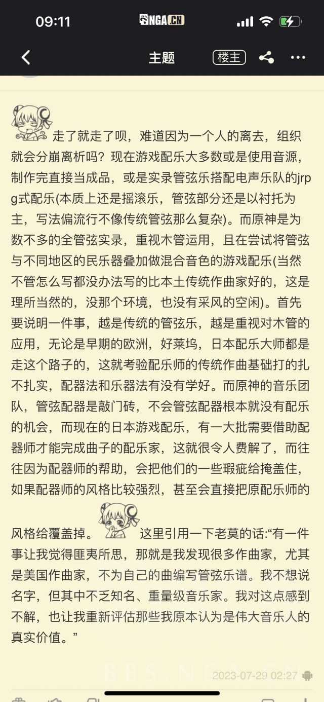

### [不吐不快] 音乐，极其套路化，单调，乏味，重复

Made by ngapost2md (c) ludoux [GitHub Repo](https://github.com/ludoux/ngapost2md)

----

##### 0.[7] \<pid:0\> 2023-08-04 22:09:53 by kenso999
记得刚接触原神音乐时，即使不懂乐理，但相信很多人都能仅凭感知就能发现陈的音乐有种惊为天人的特质
后来接触了一些音乐分析，比如ALEX的几期乐评，
当时陈老师还在下边回复说“自己有意的避免LOOP化的套路”
[url](https://www.bilibili.com/video/BV1LZ4y1L7UJ)
包括这句话在内的分析与陈的自述，当时给了我很多启发

就以ALEX第一期分析的《鲜衣游侠》为例，为什么这首歌听起来这么的灵动
1，段落结构不重复，ABCDE， 中间有重复使用的元素，但尽量使用技巧 避免给人重复的感觉
2，主要的调子或者说动机，非常灵动，走向具有高度的不可预测性
3，下了非常大的心思，使用各种技巧和乐器，避免小段落中的单调. (可以数数鲜衣游侠的前段，同样的调子重复了12遍，但却没有单调感)
4，情绪逐渐由低推到高潮，层层递进
用这些因素去看《疾如猛火》 也能发现相似的特性
<b>最终，才成就这些神曲的最终听感，既有朗朗上口的段落，但又不口水，既有章法，又不失灵动</b>

而以这次现场演奏的《花与剑的轮舞》为例
1，结构单调重复，其实就是套路化的loop， ABACDABABC
2，主调可预测性，缺乏灵性，反复使用，着重强调。像极了新手围绕着自己好不容易想出的“宝贝小调”写了首歌，抱着俗透的几个音符爱不释手的样子
3，缺少丰富的元素来丰富听感(也许之前有各种“民族乐器”的帮助，交响乐就是欧洲的“民族”，但大家太熟悉了)
4，没有层层递进的感觉，虽然后段使劲想用各种大乐器加进来把情绪往上推，但明显力有不逮。最后给人的感觉，就是在转着圈念经

当时听完MIDI感觉心凉了一半，还有人在说MIDI不算数
但是我说，3.0的MIDI我精准的挑出了所有大火的看板曲，包括兰那罗，几初的智愿，维摩庄，包括4首战斗曲
当时爱不释手的抱着听了一个多月，好不好听根本跟MIDI没有关系，曲子的基本基调已经打下了，只是MIDI乐器音色听起来很呆板而已
这次没演奏的其他战斗曲，跟这个《花与剑的轮舞》基本是同样的问题

如果这是陈老师写的，那它们跟原神初期陈差了有0.5-0.8个陈
如果这不是陈写的，我祝陈老师脱离这项目之后好好休息休息，调整一下状态，30几岁正当年，未来几十年我们的文艺产品一定还有很长的上升期，在这个时期一定能凭借自己的才能，并乘着这股势头，陈老师一定能达到真正国际级大师的地位
跟着这帮虫豸完全是浪费才能，暴殄天物

----

##### 1.[0] \<pid:707004635\> 2023-08-04 22:11:24 by laserxkuma
我不懂太多，我只能说 起码我不喜欢，听起来 没有 3.0 早期版本以及之前的味道，不如说 从沙漠的音乐开始就怪怪了

----

##### 2.[0] \<pid:707004646\> 2023-08-04 22:11:27 by 剑筑师と書記官
陈致逸肯定是参与度越来越少软退出
现在我是有点信纳塔以后全自家的说法

----

##### 3.[0] \<pid:707005246\> 2023-08-04 22:14:24 by kenso999
>[jump](#pid707004646) 剑筑师と書記官(2023-08-04 22:11)说:
>陈致逸肯定是参与度越来越少软退出
>现在我是有点信纳塔以后全自家的说法

须弥就跟走穴差不多了，他作曲编曲的比例大量稀释，但是其他老师的水准也是比较高的
但主要4首战斗曲还是他主笔了，但其实在当时，LOOP化，套路化已经开始了
但可能也是民族元素的使用，所以给了人很多新鲜感，另外就是作曲编曲的水平还是比现在要高几档

----

##### 5.[0] \<pid:707010215\> 2023-08-04 22:40:26 by 花瓣飘零
最近fgo 的八周年pv 音乐，我一直在循环，我想这种歌词和旋律比较像我心中的二次元，纯粹又热血 ，还好听  ，我觉得陈老师的话一定能拿出来那种特别抓人的音乐，毕竟他还写过铠甲勇士

----

##### 6.[0] \<pid:707010954\> 2023-08-04 22:44:03 by ANUBlS
在今晚之前我一直相信陈老师说的他会做完五年是真的

但是今天前瞻那个音乐录像听到一半我就开始怀疑这个说法是不是真的了

----

##### 7.[0] \<pid:707011343\> 2023-08-04 22:45:53 by KIMIGGA
陈老师赶紧润，期待您下一个作品

----

##### 8.[1] \<pid:707012424\> 2023-08-04 22:51:05 by 鲜百香四季春茶
这和民族乐器根本没啥关系，蒙德的音乐、渊下宫的音乐同样也很出色，民族乐器只会给好的旋律添光加彩而不是力挽狂澜

----

##### 9.[0] \<pid:707012749\> 2023-08-04 22:52:59 by Narcus
我还以为是我欣赏不来而已

----

##### 11.[0] \<pid:707013102\> 2023-08-04 22:54:51 by 弥可-
不知道我有没有听错，感觉第一首里有用到羽管键琴，就我的观感来说，感觉不如一部很老的动画《蔷薇少女》的bgm用的好……

----

##### 12.[0] \<pid:707013209\> 2023-08-04 22:55:25 by 转生能成功吗
其实hoyomix里面我还有一个特别喜欢的作曲，姜以君，做出来的曲子很有张力

----

##### 13.[0] \<pid:707013572\> 2023-08-04 22:57:22 by kenso999
还想起之前看见陈的微博，说半夜听拉三听得泪流满面
我当时还想说，是不是到了枫丹终于有卸下负重，拆了镣铐跳舞的感觉，是不是能终于解放他最终的能力，可以大胆妄为的疯狂一把了
然后现在，WOC

----

##### 14.[0] \<pid:707013994\> 2023-08-04 22:59:17 by haozhucs8
>[jump](#pid707013102) 弥可-(2023-08-04 22:54)说:
>不知道我有没有听错，感觉第一首里有用到羽管键琴，就我的观感来说，感觉不如一部很老的动画《蔷薇少女》的bgm用的好……

 蔷薇少女OST  yyds!

----

##### 16.[0] \<pid:707015234\> 2023-08-04 23:06:08 by aertgrujvdyjgfu
我不知道别人怎么想的，我觉得今天的音乐会非常无聊，以前的灵气和惊艳全都没了，甚至连耐听的程度都达不到，我现在已经忘了，没有留下任何印象

----

##### 17.[0] \<pid:707015559\> 2023-08-04 23:07:53 by 剑筑师と書記官
>[jump](#pid707013209) 转生能成功吗(2023-08-04 22:55) 说: 
>
>其实hoyomix里面我还有一个特别喜欢的作曲，姜以君，做出来的曲子很有张力

尽管我不喜欢岁门，但是sweet trap我的神  

草龙周本其实也不错的

----

##### 19.[0] \<pid:707016827\> 2023-08-04 23:15:18 by ANUBlS
>[jump](#pid707011343) KIMIGGA(2023-08-04 22:45) 说: 
>
>陈老师赶紧润，期待您下一个作品

希望只是单纯不给mhy写了

我上一个喜欢的作曲家是程池，最有名的作品是《大宋提刑官》的《满江红》，在国内的时候跟三宝一伙的，履历不细说审核不让过，反正是大佬

然后他去了阿美，这些年下来作品稀少，至今我还得靠着循环《新丝绸之路二零零六》和《大乘天》过日子

----

##### 20.[1] \<pid:707016915\> 2023-08-04 23:15:40 by 网友述
关于原神音乐，最逗比的是在原版看到过一个原神音乐在历史游戏中排第几名的投票，一堆说稳前十前五的。
我寻思成本比你低的有靠风格化更脱颖而出的，成本比你高的更能拿捏你，有些经典你更别想去碰了。
推一步讲，我都没见过哪个游戏的粉丝敢说那个游戏的音乐在全游戏排几几的，你算老几？
退一万步讲，谁敢说自己玩过的游戏足够多能给出一个合理的排名？就闭着眼睛嗯投历史前十倒是挺容易让人笑话的。

----

##### 21.[0] \<pid:707017295\> 2023-08-04 23:17:42 by 萨萨萨萨0918
hoyomix一个陈一个姜还一个苑demon，都很有灵性，这次的不知道是谁写的……可能是被()夺舍了吧

----

##### 23.[1] \<pid:707026095\> 2023-08-05 00:11:03 by Rilesss
跟楼主一样的感受
反复品鉴音乐会录像后，两年半以来我第一次为hoyomix感到担忧

貌似陈老师为散作曲之后就几乎退出了3.4-3.8的作曲
楼主说的这种LOOP化也许就是这段时间开始逐渐蔓延，我直接点名草龙周本

垮完剧情垮人设连带着美术废了，没想到现在音乐居然也有苗头了，唉

----

##### 24.[0] \<pid:707027003\> 2023-08-05 00:17:14 by 两块半大魔王
所以到现在，原的水平是全方位下降的咯，从剧情文案到游戏玩法到美工音乐，就连前瞻里制作者们也不是在介绍自己的作品打磨的有多好，而是不停强调自己有多辛苦。
符合我对某些生物的刻板印象，也渐渐理解原神怎么会越来越拉了。

----

##### 25.[0] \<pid:707027008\> 2023-08-05 00:17:15 by Farout
这次4.0pv的音乐也一般，我还以为至少这方面不会太拉跨的

----

##### 26.[0] \<pid:707027208\> 2023-08-05 00:18:31 by kenso999
>[jump](#pid707026095) Rilesss(2023-08-05 00:11)说:
>跟楼主一样的感受 反复品鉴音乐会录像后，两年半以来我第一次为hoyomix感到担忧  貌似陈老师为散作曲之后就几乎退出了3.4-3.8的作曲 楼主说的这种LOOP化也许就是这段时间开始逐渐蔓延，我直接点名草龙周本  垮完剧情垮人设连带着美术废了，没想到现在音乐居然也有苗头了，唉

倒不用替hoyomix担心，星铁虽然我过了主线就没玩了，系统各方面都不太对胃口，但是PV和音乐的水准就是原神开服水准，甚至有超越。崩3，星铁，ZZZ都有这种水准，不知道为什么就是原神保持不住
可能很简单，就是资源抽调，或者被一帮虫豸给夺舍了，一个生命周期达到中末期产品的待遇
虽然有点不甘吧，但还是有点气，
这么大体量这么大MAU的产品，做出X来，都有下边10-20%的人觉得还不错，“太刀了，太好听了，哇塞”
放4-5月份的时候说音乐 PV 编剧的事，会有全屏的人让我6字滚
放1-2个月前，舆论55开，放现在就那10-20%的人都张不了嘴了
谁不希望这游戏好呢，但饭圈化能好的了吗

----

##### 27.[0] \<pid:707027261\> 2023-08-05 00:18:54 by commodore1280
笑死，唯一稳定发挥的部门倒了

----

##### 28.[1] \<pid:707028104\> 2023-08-05 00:24:46 by 南海狒狒王
在流水楼有人发过之前截到的某发言
能对工作了解到这种细枝末节的多半是内部人员了

也就是说：1.陈真的跑了；2.内部音乐人员和文案一样自信

----

##### 29.[0] \<pid:707028555\> 2023-08-05 00:27:57 by kenso999
>[jump](#pid707016915) 网友述(2023-08-04 23:15)说:
>关于原神音乐，最逗比的是在原版看到过一个原神音乐在历史游戏中排第几名的投票，一堆说稳前十前五的。 我寻思成本比你低的有靠风格化更脱颖而出的，成本比你高的更能拿捏你，有些经典你更别想去碰了。 推一步讲，我都没见过哪个游戏的粉丝敢说那个游戏的音乐在全游戏排几几的，你算老几？ 退一万步讲，谁敢说自己玩过的游戏足够多能给出一个合理的排名？就闭着眼睛嗯投历史前十倒是挺容易让人笑话的。    补图：

<a href="javascript:;" onclick="collapse(this);">+</a>点击展开 ...
[img]https://img.nga.178.com/attachments/mon_202308/05/l2Q2s-89f5K1sT1kShs-sg.jpg[/img]

、

我觉得作为一个据说有5-6000万MAU的产品来说，啥人都有，不应该拿极端言论来说事(网上夸就是友，黑就是敌吗，很浅显的道理，不需要我展开)，
我也经常看见夸的，搞“排名”也见过，但很少很少
但真让我主观感觉，历史上确实应该是在第一梯队作品中有一号的，不输很多神作
蒙德璃月第一档，稻妻须弥第二档，但陈和原神明显没有得到应得的荣誉

原神的很多东西都因为手游的身份被低估了
大世界的大框架是塞尔达给出的新公式所奠定的，要是照着育碧的公式肯定要LOW很多
但音乐和战斗系统是最被低估的

元素反应虽然不平衡，但是如果把这套东西套到个单机大作上，那都是惊为天人的，跟这套系统比，即使主机PC上很多RPG那种脸滚键盘的技能释放，根本就是无聊透顶
音乐就更别说了，如果换个欧美的单机，横扫各大奖项了

----

##### 30.[0] \<pid:707028842\> 2023-08-05 00:29:59 by Giovann
>[jump](#pid707028104) 南海狒狒王(2023-08-05 00:24) 说: 
>
>在流水楼有人发过之前截到的某发言
>能对工作了解到这种细枝末节的多半是内部人员了
>
>
>
>也就是说：1.陈真的跑了；2.内部音乐人员和文案一样自信

但是新音乐不好听不抓耳是事实啊

----

##### 31.[1] \<pid:707028978\> 2023-08-05 00:31:06 by Germanuim
3.0和4.0的PV再也无法带给我2.0PV神里绫华立绘出来那一瞬间给我的惊为天人的震撼了

----

##### 32.[0] \<pid:707029487\> 2023-08-05 00:34:29 by 白泽老中医啊啊啊啊
>[jump](#pid707004646) 剑筑师と書記官(2023-08-04 22:11):

说真的，能活到纳塔嘛？其他周边游戏除非是结晶真的还会有玩家去玩嘛？

----

##### 33.[0] \<pid:707029909\> 2023-08-05 00:37:46 by Malygos0
原神的bgm感觉缺了一点层次感，而且复用太多了，好歹复用的时候变一下调啊

拿魔兽为例，原的bgm完全可以做成类似于暴风要塞的bgm和初入暴风城的bgm那样，更何况暴风要塞的bgm还有很多不同的调式

----

##### 34.[0] \<pid:707030176\> 2023-08-05 00:40:09 by Giovann
>[jump](#pid707029909) Malygos0(2023-08-05 00:37) 说: 
>
>原神的bgm感觉缺了一点层次感，而且复用太多了，好歹复用的时候变一下调啊
>
>拿魔兽为例，原的bgm完全可以做成类似于暴风要塞的bgm和初入暴风城的bgm那样，更何况暴风要塞的bgm还有很多不同的调式

哎呀，这种手法叫回响嘛

----

##### 35.[0] \<pid:707030276\> 2023-08-05 00:40:52 by kenso999
>[jump](#pid707028104) 南海狒狒王(2023-08-05 00:24)说:
>在流水楼有人发过之前截到的某发言 能对工作了解到这种细枝末节的多半是内部人员了  [img]https://img.nga.178.com/attachments/mon_202308/05/l2Q2s-jl9iZvT1kShs-12h.jpeg[/img]  也就是说：1.陈真的跑了；2.内部音乐人员和文案一样自信

因为一个人肯定崩不了，但跟他扯的这录制技术的问题根本也没关系，HOYOMIX神人多了去了，崩那俩，蔡近瀚 宫崎
但原神现在的问题是什么，群龙无首，项目 管理极其混乱

之前我分析的帖子都被锁了，
为什么在3.0中后期会出现这样的地图安排，为什么好几个编剧故事都有相似性，动不动就写死人骗廉价的眼泪，为什么至少3-4个PV都拉胯了
我就认为全是项目管理的问题，没有人在上边进行高效的统筹规划，很多东西单拿出来问题都不大，但是放在连续的版本里就像全是沙漠-沙漠-沙漠-沙漠，
陈肯定最终是世界级的超级大师，但是MHY有没有陈没那么重要，本质是团队极速从400倒2000人的扩张，直接把团队的执行力给干废了，刘和蔡缓了2年都没缓过来

----

##### 36.[0] \<pid:707030625\> 2023-08-05 00:43:38 by 罗成成lcc
>[jump](#pid707027208) kenso999(2023-08-05 00:18) 说: 
>
>倒不用替hoyomix担心，星铁虽然我过了主线就没玩了，系统各方面都不太对胃口，但是PV和音乐的水准就是原神开服水准，甚至有超越。崩3，星铁，ZZZ都有这种水准，不知道为什么就是原神保持不住
>可能很简单，就是资源抽调，或者被一帮虫豸给夺舍了，一个生命周期达到中末期产品的待遇
>虽然有点不甘吧，但还是有点气，
>这么大体量这么大MAU的产品，做出X来，都有下边10-20%的人觉得还不错，“太刀了，太好听了，哇塞”
>放4-5月份的时候说音乐 PV 编剧的事，会有全屏的人让我6字滚
>放1-2个月前，舆论5

星铁的音乐……
你听着水龙吟再说一遍
也不是说不好吧，就是感觉很多时候音乐太过用力了，插入的时机也不是很好，有一种非常尬的感觉。

----

##### 37.[0] \<pid:707030946\> 2023-08-05 00:46:05 by Giovann
>[jump](#pid707030625) 罗成成lcc(2023-08-05 00:43) 说: 
>
>星铁的音乐……
>你听着水龙吟再说一遍
>也不是说不好吧，就是感觉很多时候音乐太过用力了，插入的时机也不是很好，有一种非常尬的感觉。

星铁的音乐我感觉就比较一般了野火和水龙吟都尬尬的，踏上旅途还挺好听一直在列车里面放这首，但是不知道为什么这么短。

----

##### 38.[0] \<pid:707030978\> 2023-08-05 00:46:20 by kenso999
>[jump](#pid707029909) Malygos0(2023-08-05 00:37)说:
>原神的bgm感觉缺了一点层次感，而且复用太多了，好歹复用的时候变一下调啊[s:a2:偷吃]  拿魔兽为例，原的bgm完全可以做成类似于暴风要塞的bgm和初入暴风城的bgm那样，更何况暴风要塞的bgm还有很多不同的调式[s:a2:偷吃]

、

同一个调子变调出几个曲子复用问题不大，在以往的版本里也不会觉得单调，够用就行了
原神的制作周期WOW是比不了的，一个大版本他能写出几个小时的有效故事呀，几个月更新一个大版本呀？有多少时间是水在了刷取装备上，真正的有效内容是多少，完全不是一个类型的产品
但现在是连一个曲子都已经立不住了
之前我把几十首MIDI扫一遍，真的事一首都记不住，
能听，但是放在一种西式奇幻RPG的OST里，就是泯然众人的水平

----

##### 39.[0] \<pid:707031059\> 2023-08-05 00:46:56 by 白鸟过提瓦特
别啊，我还一直很期待足迹pv里纳塔的那一段啊
~~或者楼主有什么纳塔这个风格的音乐推荐吗，真的很喜欢很喜欢那种(是弗拉门戈吗)的感觉啊~~

----

##### 40.[0] \<pid:707031231\> 2023-08-05 00:48:14 by 南海狒狒王
>[jump](#pid707030276) kenso999(2023-08-05 00:40)说:
><b>Reply to [pid=707028104,37261043,2]Reply[/pid] Post by [uid=60265224]南海狒狒王[/uid] (2023-08-05 00:24)</b>  因为一个人肯定崩不了，但跟他扯的这录制技术的问题根本也没关系，HOYOMIX神人多了去了，崩那俩，蔡近瀚 宫崎 但原神现在的问题是什么，群龙无首，项目 管理极其混乱  之前我分析的帖子都被锁了， 为什么在3.0中后期会出现这样的地图安排，为什么好几个编剧故事都有相似性，动不动就写死人骗廉价的眼泪，为什么至少3-4个PV都拉胯了 我就认为全是项目管理的问题，没有人在上边进行高效的统筹规划，很多东西单拿出来问题都不大，但是放在连续的版本里就像全是沙漠-沙漠-沙漠-沙漠， 陈肯定最终是世界级的超级大师，但是MHY有没有陈没那么重要，本质是团队极速从400倒2000人的扩张，直接把团队的执行力给干废了，刘和蔡缓了2年都没缓过来

米的项目管理肯定是出了大问题，但不认可你说陈一个人跑了就跑了，米内部不缺大佬这点
1.你说需要一个中层统筹规划，而陈有能力有名望，恰好就是能够统筹原神整体音乐的人，他跑了更是群龙无首
2.音乐这种个人色彩浓郁的创作非常需要创作者自身的才华，别的东西可以用工业化手段进行弥补，但是音乐创作需要天才

----

##### 41.[0] \<pid:707031329\> 2023-08-05 00:49:02 by kenso999
>[jump](#pid707030625) 罗成成lcc(2023-08-05 00:43)说:
>[quote][pid=707027208,37261043,2]Reply[/pid] <b>Post by [uid=14607624]kenso999[/uid] (2023-08-05 00:18):</b>  倒不用替hoyomix担心，星铁虽然我过了主线就没玩了，系统各方面都不太对胃口，但是PV和音乐的水准就是原神开服水准，甚至有超越。崩3，星铁，ZZZ都有这种水准，不知道为什么就是原神保持不住 可能很简单，就是资源抽调，或者被一帮虫豸给夺舍了，一个生命周期达到中末期产品的待遇 虽然有点不甘吧，但还是有点气， 这么大体量这么大MAU的产品，做出X来，都有下边10-20%的人觉得还不错，“太刀了，太好听了，哇塞” 放4-5月份的时候说音乐 PV 编剧的事，会有全屏的人让我6字滚 放1-2个月前，舆论5[/quote]星铁的音乐…… 你听着水龙吟再说一遍[s:ac:冷] 也不是说不好吧，就是感觉很多时候音乐太过用力了，插入的时机也不是很好，有一种非常尬的感觉。

这首是最一般的，问题蒙德璃月里也有一半的和不一般的(当然架不住粉圈又开始起哄了)
但除此之外包括有歌词的，包括各种氛围音乐，那种灵性是有的，不呆板，不是一般的所谓中式复古的那种呆滞感，我觉得水平中上肯定有，少数几首神曲，这足够了

----

##### 42.[0] \<pid:707031800\> 2023-08-05 00:52:39 by kenso999
>[jump](#pid707031231) 南海狒狒王(2023-08-05 00:48)说:
><b>Reply to [pid=707030276,37261043,2]Reply[/pid] Post by [uid=14607624]kenso999[/uid] (2023-08-05 00:40)</b> 米的项目管理肯定是出了大问题，但不认可你说陈一个人跑了就跑了，米内部不缺大佬这点 1.你说需要一个中层统筹规划，而陈有能力有名望，恰好就是能够统筹原神整体音乐的人，他跑了更是群龙无首 2.音乐这种个人色彩浓郁的创作非常需要创作者自身的才华，别的东西可以用工业化手段进行弥补，但是音乐创作需要天才

我想说的重点是管理问题

之前原神音乐团队在陈的带领下有10分
但没有他就必定要到2分了吗？这恰恰反应出来真正的问题不是陈本身
如果管理顺畅，换个7-8分的人上来也是能顶住的，
好的管理，就是不能说少了一个人公司就不转了

----

##### 43.[0] \<pid:707033450\> 2023-08-05 01:06:45 by 网友述
>[jump](#pid707028555) kenso999(2023-08-05 00:27) 说: 
>
>、
>
>我觉得作为一个据说有5-6000万MAU的产品来说，啥人都有，不应该拿极端言论来说事(网上夸就是友，黑就是敌吗，很浅显的道理，不需要我展开)，
>我也经常看见夸的，搞“排名”也见过，但很少很少
>但真让我主观感觉，历史上确实应该是在第一梯队作品中有一号的，不输很多神作
>蒙德璃月第一档，稻妻须弥第二档，但陈和原神明显没有得到应得的荣誉
>
>原神的很多东西都因为手游的身份被低估了
>大世界的大框架是塞尔达给出的新公式所奠定的，要是照着育碧的公式肯定要LOW很多
>但音乐和战斗系统是最被低估的
>
>元素反应

我的主观是玩完游戏之后去听ost，里面让自己印象很深又好听的曲子数量，脱颖而出的的确有一些。但更多数有一种 “几乎没什么人去谈及它的音乐”的游戏 里的音乐的感觉。然后我又更倾向整体。
被手游拖累了也是真，元素这牌是好的，也不是没打好，是彻底落家里了。
七圣召唤把落家里那副牌拿出来，每个元素玩的都挺开心。而本体一直都整得跟种姓制度(五颜六色版)似的。
开服打好的牌：命座和四星。现在前者也打的很好，只不过方向变成赚更多钱了(想赚钱确实无可指摘，但说x块也确实没毛病)，而后者因为不符合这个方向，现在也收起来了。

----

##### 43.[0] \<pid:707033450\> 2023-08-05 01:06:45 by 网友述
>[jump](#pid707028555) kenso999(2023-08-05 00:27) 说: 
>
>、
>
>我觉得作为一个据说有5-6000万MAU的产品来说，啥人都有，不应该拿极端言论来说事(网上夸就是友，黑就是敌吗，很浅显的道理，不需要我展开)，
>我也经常看见夸的，搞“排名”也见过，但很少很少
>但真让我主观感觉，历史上确实应该是在第一梯队作品中有一号的，不输很多神作
>蒙德璃月第一档，稻妻须弥第二档，但陈和原神明显没有得到应得的荣誉
>
>原神的很多东西都因为手游的身份被低估了
>大世界的大框架是塞尔达给出的新公式所奠定的，要是照着育碧的公式肯定要LOW很多
>但音乐和战斗系统是最被低估的
>
>元素反应

我的主观是玩完游戏之后去听ost，里面让自己印象很深又好听的曲子数量。原神里脱颖而出的的确有一些，但更多数有一种 “几乎没什么人去谈及它的音乐”的游戏 里的音乐的感觉。而我评价时又更倾向整体上怎么样。
被手游拖累了也是真，元素这牌是好的，也不是没打好，是彻底落家里了。
七圣召唤把落家里那副牌拿出来，每个元素玩的都挺开心。而本体一直都整得跟种姓制度(五颜六色版)似的。

----

##### 44.[0] \<pid:707034078\> 2023-08-05 01:12:50 by kazuha71
Where are Debussy and Ravel de Fontaine?

----

##### 45.[0] \<pid:707034463\> 2023-08-05 01:16:24 by splendont
须弥midi我当初天天循环听兰纳罗那几首，以至于正式服删了几首我还感到可惜，枫丹我只能说完全没啥记忆点

----

##### 46.[0] \<pid:707034593\> 2023-08-05 01:17:31 by kenso999
>[jump](#pid707031059) 白鸟过提瓦特(2023-08-05 00:46):

真不知道纳塔会怎么样了，还能拉回来吗
从现在考据看其实应该是非洲和南美的结合，拉丁音乐有，但我也很期待很多非洲乐器的使用，应该有文明4Baba Yetu那种感觉，但现在有点没指望了

----

##### 47.[0] \<pid:707035766\> 2023-08-05 01:29:05 by abbccdkani
战斗已经算更好的了，主城音乐才是真突出一个迷惑，实在不敢想象这种质量的音乐能当原神主题曲音乐。。。

----

##### 48.[0] \<pid:707035868\> 2023-08-05 01:30:14 by Giovann
>[jump](#pid707034078) kazuha71(2023-08-05 01:12) 说: 
>
>Where are Debussy and Ravel de Fontaine?
>

mhy哪敢碰真lingling

----

##### 49.[0] \<pid:707036226\> 2023-08-05 01:34:11 by xlsq03
我一直在期待米哈游是不是能搞出点国产三剑那种风味的音乐
但好像我期望太高了

----

##### 50.[0] \<pid:707036595\> 2023-08-05 01:38:41 by kenso999
>[jump](#pid707036226) xlsq03(2023-08-05 01:34)说:
>我一直在期待米哈游是不是能搞出点国产三剑那种风味的音乐 但好像我期望太高了

会有的，但不在原神里 

----

##### 51.[0] \<pid:707036994\> 2023-08-05 01:43:04 by xlsq03
>[jump](#pid707036595) kenso999(2023-08-05 01:38) 说: 
>
>会有的，但不在原神里 

该怎么说，最近在玩顺火暖，感觉听到了很熟悉很怀念的味道，一查作曲家，还真是骆集益
米家游戏我玩的不多，只玩了铁和原，目前没见到太多有类似这种风格的……仙舟的音乐更是无法理解

----

##### 52.[0] \<pid:707063687\> 2023-08-05 09:26:42 by ayainchaos
>[jump](#pid707013572) kenso999(2023-08-04 22:57) 说: 
>
>还想起之前看见陈的微博，说半夜听拉三听得泪流满面
>我当时还想说，是不是到了枫丹终于有卸下负重，拆了镣铐跳舞的感觉，是不是能终于解放他最终的能力，可以大胆妄为的疯狂一把了
>然后现在，WOC

我好像明白为什么那首boss战是陈致逸亲自唱的了

感觉有点心酸又无奈

