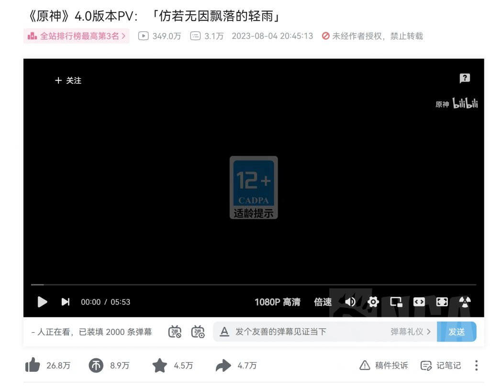
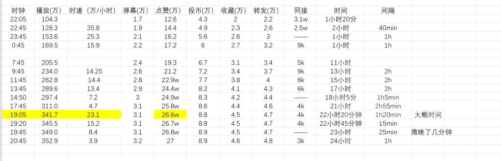
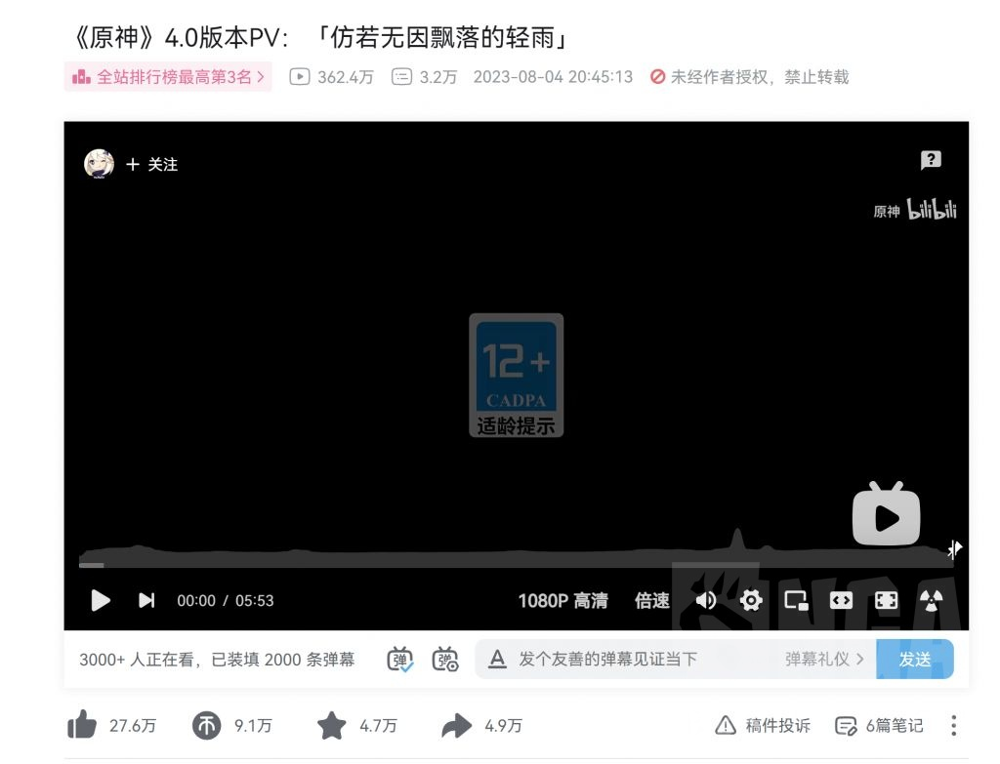

### [热点事件] 应该不会坑的短期记录，4.0pv各项数据记录

Made by ngapost2md (c) ludoux [GitHub Repo](https://github.com/ludoux/ngapost2md)

----

##### 0.[0] \<pid:0\> 2023-08-04 22:11:30 by yxliu24
对这个数字感兴趣，开个贴记录一下，大概就更三天左右吧

一楼放拿来做对比的2.0和3.0

----

##### 1.[0] \<pid:707004883\> 2023-08-04 22:12:42 by yxliu24
大约是10点5分截的图，一个小时20分钟的4.0pv，看看最后落点。

----

##### 2.[0] \<pid:707006074\> 2023-08-04 22:18:25 by 晨光里面春
蹲蹲

----

##### 3.[1] \<pid:707006342\> 2023-08-04 22:19:50 by Nimbus純水100
只看播放量不靠谱的，比如孤散者
再比如七圣召唤原神赛事

----

##### 4.[0] \<pid:707006359\> 2023-08-04 22:19:53 by 泛舟浮白
提前占个座儿

----

##### 5.[0] \<pid:707006857\> 2023-08-04 22:22:33 by yxliu24
>[jump](#pid707006342) Nimbus純水100(2023-08-04 22:19)说:
>只看播放量不靠谱的，比如孤散者
>再比如七圣召唤原神赛事

所以除了评论外其他数据都截了
个人感觉投币、收藏和转发都和质量高相关，对比2.0和3.0pv数据就能感觉出。点赞主要是配合播放量脱水

----

##### 6.[0] \<pid:707011497\> 2023-08-04 22:46:34 by yxliu24
2小时更新
印象里55分钟的时候播放量是88w左右，一个小时涨了30+

----

##### 7.[0] \<pid:707016257\> 2023-08-04 23:11:58 by 混乱就是艺术
逛到你这里才发现我看完毫无波澜甚至感觉总算结束了。然后连个赞都没点直接润了。

----

##### 8.[0] \<pid:707022148\> 2023-08-04 23:46:32 by yxliu24
3小时，一个小时+25.3w
去睡了，明天早上找一个整点再记录一下。

----

##### 9.[0] \<pid:707031079\> 2023-08-05 00:47:04 by yxliu24

加更

----

##### 10.[0] \<pid:707031526\> 2023-08-05 00:50:30 by 云间卷书
楼主如果闲着没事可以用一用周刊的算法(周刊算法还是比较公认的)

用一个分数衡量感觉很带劲

----

##### 11.[0] \<pid:707051972\> 2023-08-05 07:46:17 by yxliu24

11个小时，感觉不买量的落地在400w
不知道3.0 2.0有没有买量

----

##### 12.[0] \<pid:707052147\> 2023-08-05 07:48:39 by yxliu24
>[jump](#pid707031526) 云间卷书(2023-08-05 00:50) 说: 
>
>楼主如果闲着没事可以用一用周刊的算法(周刊算法还是比较公认的)
>
>
>用一个分数衡量感觉很带劲

之前都没截评论
晚点做一个

----

##### 13.[0] \<pid:707066739\> 2023-08-05 09:47:12 by yxliu24
13个小时，白天涨幅略有提升
评论数17329

打博德之门去了，估计中午再更一次

----

##### 14.[0] \<pid:707087369\> 2023-08-05 11:46:20 by yxliu24
15小时

----

##### 15.[0] \<pid:707108063\> 2023-08-05 13:46:16 by yxliu24
17小时，观看人数开始比较明显的下降，第一天落地个人认为在350前后

----

##### 16.[0] \<pid:707111922\> 2023-08-05 14:09:39 by 小君天
毕竟是新的大版本PV，愿意看一下枫丹新风貌的人应该还是挺多的，连我这个3.4开始一个版本PV都没看过的都看了一遍4.0PV~~虽然有些失望~~  

----

##### 17.[0] \<pid:707113675\> 2023-08-05 14:20:27 by TooruW
你敢相信连热门前三都不到？这可是大版本的前瞻pv啊

----

##### 18.[0] \<pid:707116884\> 2023-08-05 14:41:18 by yxliu24
>[jump](#pid707111922) 小君天(2023-08-05 14:09)说:
>毕竟是新的大版本PV，愿意看一下枫丹新风貌的人应该还是挺多的，连我这个3.4开始一个版本PV都没看过的都看了一遍4.0PV<del class='gray'> 虽然有些失望 </del>  [s:ac:哭笑]

所以只拿了2.0和3.0做对比，点开一个普通pv就能发现点赞硬币这些数字差距有些大

----

##### 19.[0] \<pid:707117735\> 2023-08-05 14:47:03 by bzbjzj
楼主整个Excel图表？

----

##### 20.[0] \<pid:707119007\> 2023-08-05 14:55:38 by yxliu24
更新在主楼了

----

##### 21.[0] \<pid:707146050\> 2023-08-05 17:45:55 by yxliu24
21小时，落点应该在320w+

----

##### 22.[0] \<pid:707148306\> 2023-08-05 18:00:01 by Shanger5124
蹲，辛苦了

----

##### 23.[0] \<pid:707151306\> 2023-08-05 18:14:39 by 云间卷书
楼主做个更新吧
评论数少了一半
这分数得掉多少

----

##### 24.[0] \<pid:707153295\> 2023-08-05 18:25:02 by yxliu24
>[jump](#pid707151306) 云间卷书(2023-08-05 18:14) 说: 
>
>楼主做个更新吧
>评论数少了一半
>这分数得掉多少

pv没掉吧
不打算做前瞻节目的对比，感觉时间长变量略多

----

##### 25.[0] \<pid:707160517\> 2023-08-05 19:06:53 by yxliu24
？我感觉我整好撞上买量了，一个小时20分钟30w播放

----

##### 26.[0] \<pid:707164059\> 2023-08-05 19:23:25 by yxliu24
19:20截的图，更新一下。
这么明目张胆

----

##### 27.[0] \<pid:707168755\> 2023-08-05 19:48:21 by yxliu24
23小时，涨幅逐渐回复正常。
评论数19746

----

##### 28.[1] \<pid:707183006\> 2023-08-05 21:00:14 by yxliu24
第一天打卡，没想到能发现疑似买量现场，意外之喜。

----

##### 29.[0] \<pid:707183951\> 2023-08-05 21:05:15 by 纳西妲真太可爱了
感觉也不用每时每刻记，一天记一次两次都差不多了，要和3.0PV，2.0PV比的话一个月后数据可能更适合

----

##### 30.[0] \<pid:707204888\> 2023-08-05 22:51:54 by yxliu24
22：50截的图，一晃神错过了。一波买量后走势平稳，明天一切正常的话就记录三四次就差不多了。

----

##### 31.[0] \<pid:707264782\> 2023-08-06 10:45:57 by yxliu24

补档

----

##### 32.[0] \<pid:707266637\> 2023-08-06 10:57:18 by 花瓣飘零
加油，我偶尔也看，但我记不住，总感觉也不是很正常，但是一想到他亏钱买这些又赚不到，我就很开心

----

##### 33.[0] \<pid:707267432\> 2023-08-06 11:02:11 by 洪炉一点雪
>[jump](#pid707016257) 混乱就是艺术(2023-08-04 23:11):

我点了个踩，比你强点。

