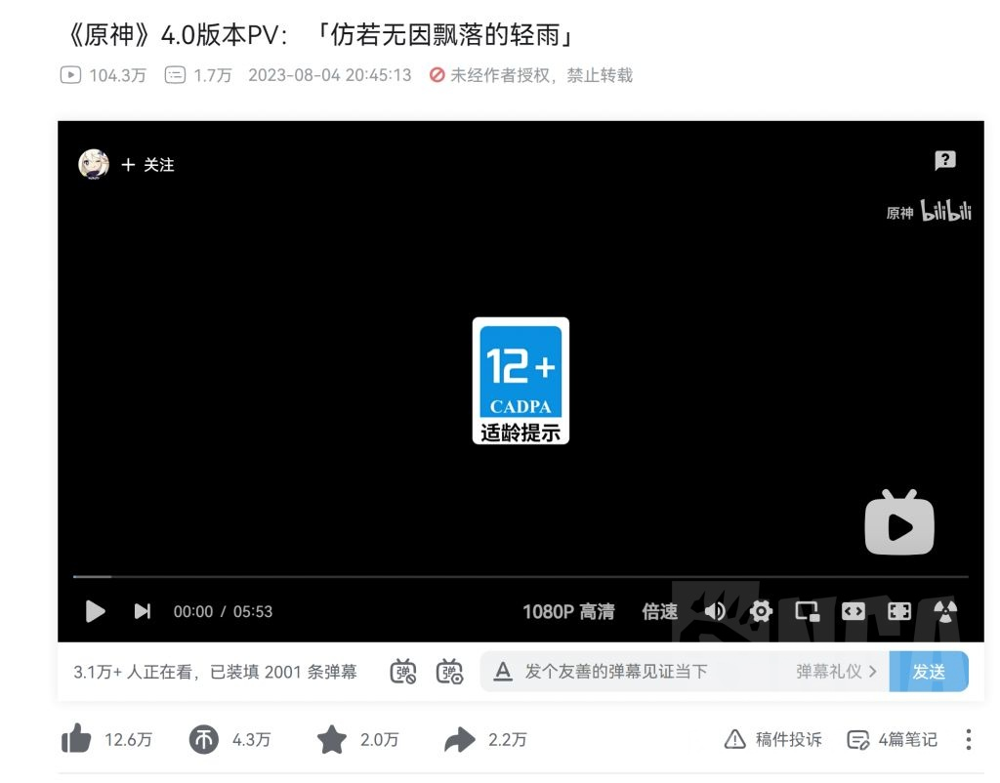
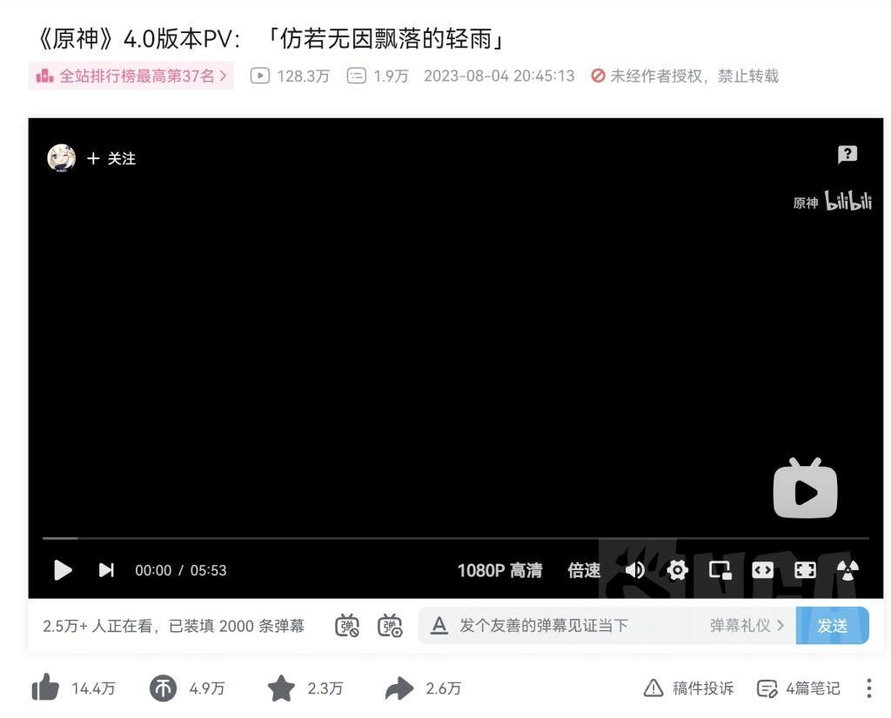
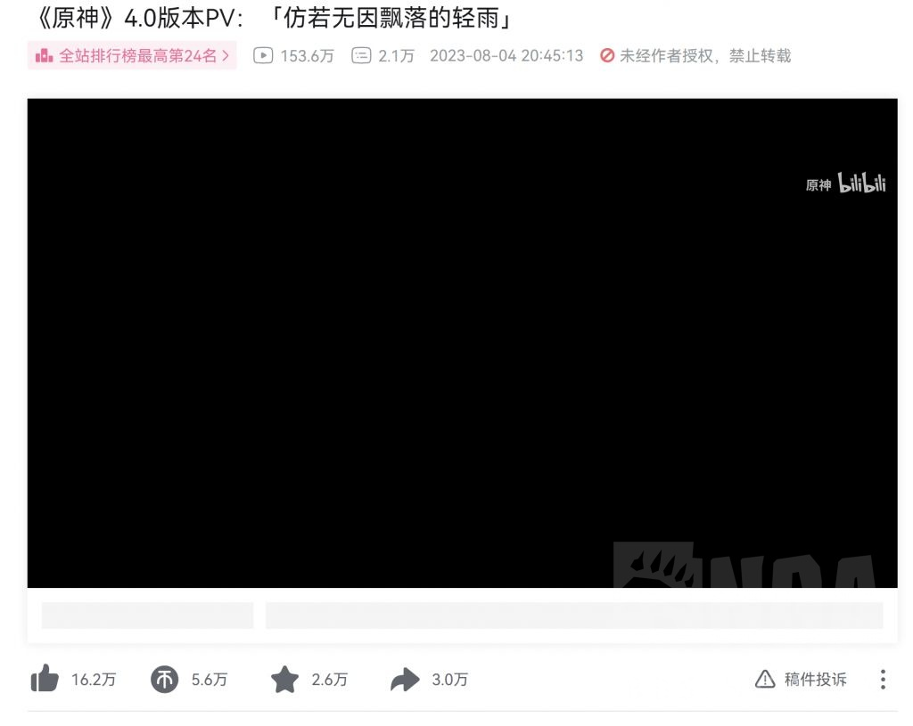
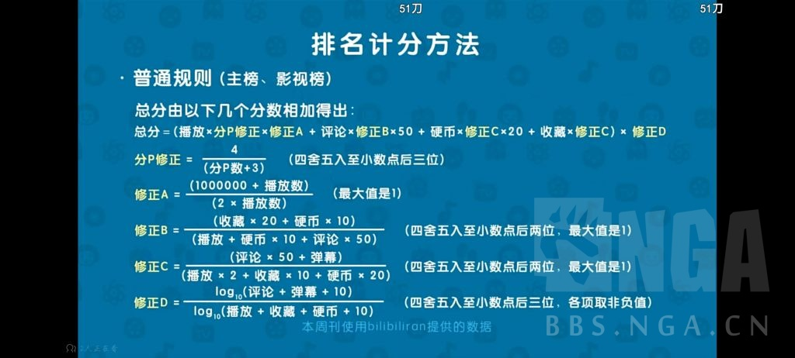

### [热点事件] 应该不会坑的短期记录，4.0pv各项数据记录

Made by ngapost2md (c) ludoux [GitHub Repo](https://github.com/ludoux/ngapost2md)

----

##### 0.[0] \<pid:0\> 2023-08-04 22:11:30 by yxliu24
对这个数字感兴趣，开个贴记录一下，大概就更三天左右吧

一楼放拿来做对比的2.0和3.0

----

##### 1.[0] \<pid:707004883\> 2023-08-04 22:12:42 by yxliu24
大约是10点5分截的图，一个小时20分钟的4.0pv，看看最后落点。

----

##### 2.[0] \<pid:707006074\> 2023-08-04 22:18:25 by 晨光里面春
蹲蹲

----

##### 3.[1] \<pid:707006342\> 2023-08-04 22:19:50 by Nimbus純水100
只看播放量不靠谱的，比如孤散者
再比如七圣召唤原神赛事

----

##### 4.[0] \<pid:707006359\> 2023-08-04 22:19:53 by 泛舟浮白
提前占个座儿

----

##### 5.[0] \<pid:707006857\> 2023-08-04 22:22:33 by yxliu24
>[jump](#pid707006342) Nimbus純水100(2023-08-04 22:19)说:
>只看播放量不靠谱的，比如孤散者
>再比如七圣召唤原神赛事

所以除了评论外其他数据都截了
个人感觉投币、收藏和转发都和质量高相关，对比2.0和3.0pv数据就能感觉出。点赞主要是配合播放量脱水

----

##### 6.[0] \<pid:707011497\> 2023-08-04 22:46:34 by yxliu24
2小时更新
印象里55分钟的时候播放量是88w左右，一个小时涨了30+

----

##### 7.[0] \<pid:707016257\> 2023-08-04 23:11:58 by 混乱就是艺术
逛到你这里才发现我看完毫无波澜甚至感觉总算结束了。然后连个赞都没点直接润了。

----

##### 8.[0] \<pid:707022148\> 2023-08-04 23:46:32 by yxliu24
3小时，一个小时+25.3w
去睡了，明天早上找一个整点再记录一下。

----

##### 9.[0] \<pid:707031079\> 2023-08-05 00:47:04 by yxliu24

加更

----

##### 10.[0] \<pid:707031526\> 2023-08-05 00:50:30 by 云间卷书
楼主如果闲着没事可以用一用周刊的算法(周刊算法还是比较公认的)

用一个分数衡量感觉很带劲

----

##### 11.[0] \<pid:707051972\> 2023-08-05 07:46:17 by yxliu24

11个小时，感觉不买量的落地在400w
不知道3.0 2.0有没有买量

----

##### 12.[0] \<pid:707052147\> 2023-08-05 07:48:39 by yxliu24
>[jump](#pid707031526) 云间卷书(2023-08-05 00:50) 说: 
>
>楼主如果闲着没事可以用一用周刊的算法(周刊算法还是比较公认的)
>
>
>用一个分数衡量感觉很带劲

之前都没截评论
晚点做一个

----

##### 13.[0] \<pid:707066739\> 2023-08-05 09:47:12 by yxliu24
13个小时，白天涨幅略有提升
评论数17329

打博德之门去了，估计中午再更一次

