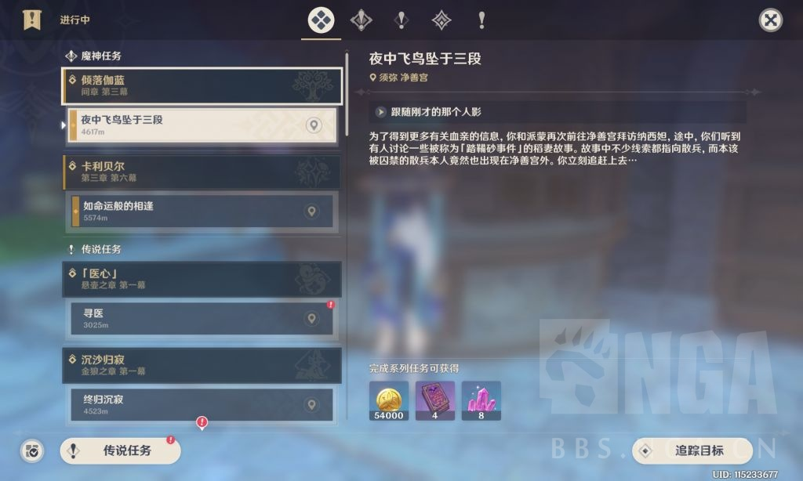

### [热点事件] 话说主线是不是可以不做了

Made by ngapost2md (c) ludoux [GitHub Repo](https://github.com/ludoux/ngapost2md)

----

##### 0.[0] \<pid:0\> 2023-08-04 23:30:09 by E_FrostBlade
前瞻好像说打完蒙德就能直接开枫丹了是吧
那这玩意是不是就可以扔这里了

----

##### 1.[0] \<pid:707019596\> 2023-08-04 23:31:00 by 银霭鸢尾花
想多了，开个捷径给你打材料而已

----

##### 2.[0] \<pid:707019961\> 2023-08-04 23:33:19 by 阿缇蜜斯
想想须弥
不做剧情不准进地图nie

----

##### 3.[0] \<pid:707020480\> 2023-08-04 23:36:35 by 长风の破浪
肯定方便你抽卡出来打材料，该吃的()怎么会让你跳过。

----

##### 4.[0] \<pid:707033058\> 2023-08-05 01:03:00 by 自由nga
官方在前两天的座谈会公告有说要做完卡利贝尔才能接主线

----

##### 5.[0] \<pid:707033939\> 2023-08-05 01:11:20 by cheyenne_xu
一只点鼠标跳过对话吧，都是shit

----

##### 6.[0] \<pid:707037796\> 2023-08-05 01:53:05 by Karq
确实没有什么做的必要了，我是打算把主城传送点开了4.0大版本的探索基本就算完成了，两个大版本的主线加探索合起来也凑不出个小保底

----

##### 7.[0] \<pid:707042043\> 2023-08-05 03:04:21 by ritsukaalter
你说的哪个散兵那个间章不出意外应该是可以放着不做，但下面那个戴因线属于魔神任务应该是必须要做完才能开枫丹主线的
但如果本来就不打算打枫丹主线，这两个就都可以不做了毕竟枫丹不锁国

