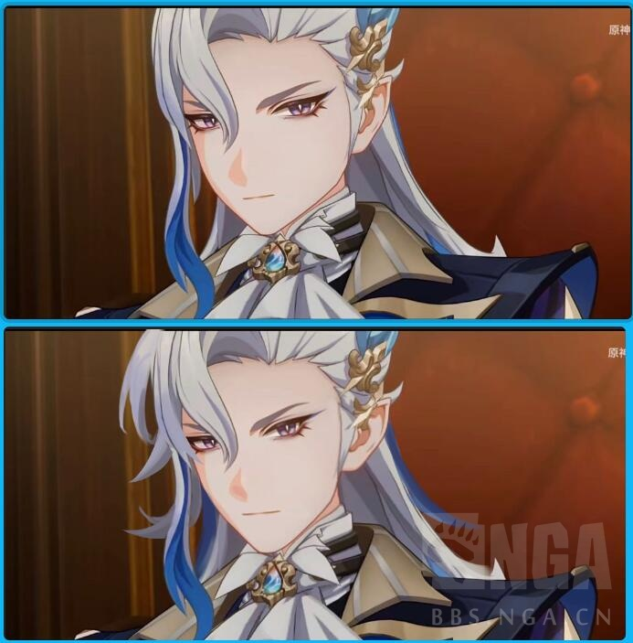
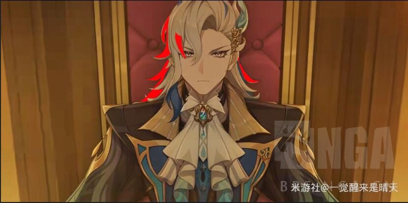
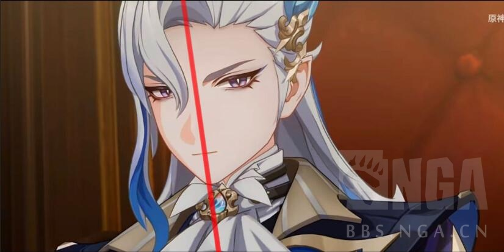
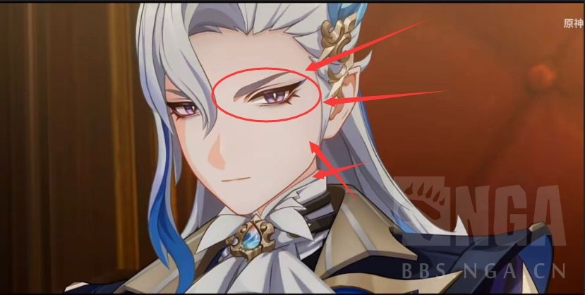
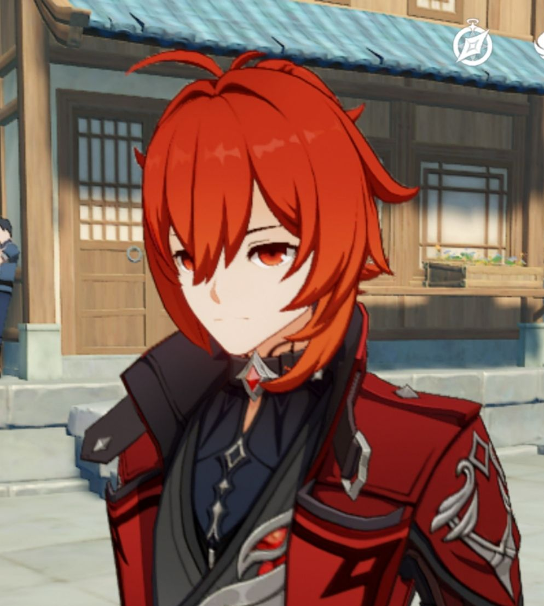
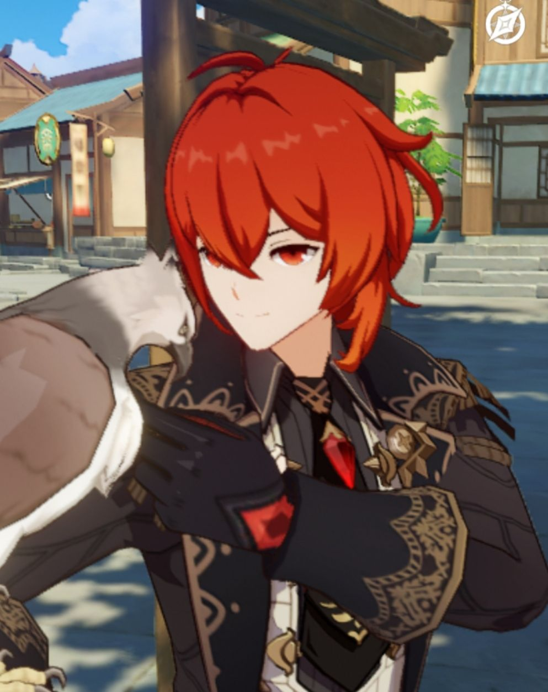
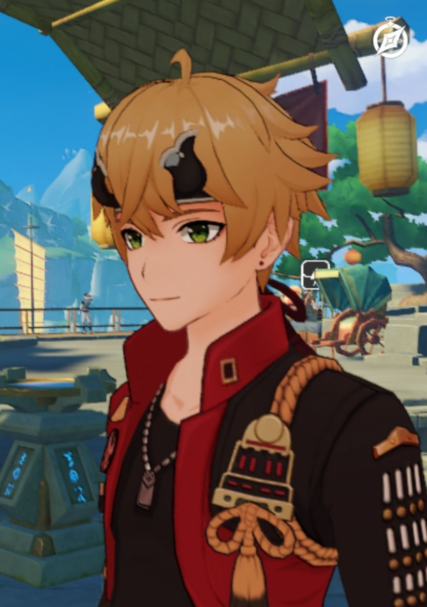

### [不吐不快] 大法官这个建模实在是忍不了了所以自信小画家改了几笔

Made by ngapost2md (c) ludoux [GitHub Repo](https://github.com/ludoux/ngapost2md)

----

##### 0.[1] \<pid:0\> 2023-08-04 23:40:01 by 沆瀣一气zex
讲真今天刚看完57的周年庆前瞻直播明明高高兴兴的，然后到理查来准备看看原神新乐子，结果我笑不出来了。
虽然我不玩了，但是我在脱坑之前确实是有打算抽大法官的(我就偏好手握重权的男人女人)
直到我看到了大法官的截图米哈游你认真的？这发面馒头脸，也太吃藕了吧？？？
索性鄙人不才还是学过画画的，所以来当一次自信小画手来给大法官整整容
整容后：

----

##### 1.[0] \<pid:707021181\> 2023-08-04 23:40:55 by 沆瀣一气zex
二楼放官图吧……真的一眼难尽

----

##### 2.[1] \<pid:707021620\> 2023-08-04 23:43:36 by 沆瀣一气zex
放一张对比图，上面是改前也就是官图，下面是改后(我自认为还不错，如果您也觉得还成的话希望能给个~~三连~~赞)
然后我会给大家讲讲我具体改了哪些方面

----

##### 3.[0] \<pid:707022810\> 2023-08-04 23:50:43 by 5gation
看完首楼往下拉看到一楼有一种...迷茫的感觉

----

##### 4.[0] \<pid:707022849\> 2023-08-04 23:50:53 by CUCUK
>[jump](#pid707021620) 沆瀣一气zex(2023-08-04 23:43) 说: 
>
>放一张对比图，上面是改前也就是官图，下面是改后(我自认为还不错，如果您也觉得还成的话希望能给个~~三连~~赞)
>然后我会给大家讲讲我具体改了哪些方面
>

不行了，原图已经快进入我的归途打马名单了

----

##### 5.[0] \<pid:707022978\> 2023-08-04 23:51:34 by 笑着选择原谅它
那维原图有一种忘记开美颜相机的纯真

----

##### 6.[5] \<pid:707023026\> 2023-08-04 23:51:49 by 陈茯苓
笑，整了后第一眼也没觉得有多好看，官图一摆出来，那确实是大有改善。

----

##### 7.[3] \<pid:707023223\> 2023-08-04 23:53:00 by 透明级
看了所有的改图
我觉得都不是很行
原材料馊了，厨师再能炒也救不了多少的

----

##### 8.[0] \<pid:707023278\> 2023-08-04 23:53:22 by 笑着选择原谅它
>[jump](#pid707021620) 沆瀣一气zex(2023-08-04 23:43) 说: 
>
>放一张对比图，上面是改前也就是官图，下面是改后(我自认为还不错，如果您也觉得还成的话希望能给个~~三连~~赞)
>然后我会给大家讲讲我具体改了哪些方面
>

其实我个人感觉改了还是脸偏长，而且不知道为什么原图感觉脸是歪的

----

##### 9.[0] \<pid:707023309\> 2023-08-04 23:53:33 by 四喜不是萝莉
啊这个官方建模怎么回事……

----

##### 10.[2] \<pid:707023488\> 2023-08-04 23:54:36 by 沆瀣一气zex
以另一张官图作为参照：

我们可以看得到发型是严重的货不对板，原本那维莱特的头发是向外延伸的比较外扬的。
也就是说缺少了红色区域的这部分头发：

----

##### 11.[0] \<pid:707023690\> 2023-08-04 23:55:38 by 普鲁士蓝蓝蓝
脸瘦了一点 别的没看出来

----

##### 12.[0] \<pid:707023763\> 2023-08-04 23:56:04 by 沆瀣一气zex
>[jump](#pid707023278) 笑着选择原谅它(2023-08-04 23:53)说:
>[quote][pid=707021620,37262094,1]Reply[/pid] <b>Post by [uid=63963010]沆瀣一气zex[/uid] (2023-08-04 23:43):</b>  放一张对比图，上面是改前也就是官图，下面是改后(我自认为还不错，如果您也觉得还成的话希望能给个<del class='gray'> 三连 </del>赞) 然后我会给大家讲讲我具体改了哪些方面[s:ac:呆] [img]https://img.nga.178.com/attachments/mon_202308/04/l2Q2s-he34ZcT3cSj9-jj.jpg[/img][/quote]其实我个人感觉改了还是脸偏长，而且不知道为什么原图感觉脸是歪的[s:ac:呆]

已经尽力了，毕竟我也不可能花费太多时间给他大改(除非给我塞钱)心血来潮改一下是因为确实把我丑到了

----

##### 13.[1] \<pid:707023800\> 2023-08-04 23:56:14 by 笑着选择原谅它
>[jump](#pid707023488) 沆瀣一气zex(2023-08-04 23:54) 说: 
>
>以另一张官图作为参照：
>
>
>我们可以看得到发型是严重的货不对板，原本那维莱特的头发是向外延伸的比较外扬的。
>也就是说缺少了红色区域的这部分头发：
>
>[img].

pv诈骗老传统了，远的有博士，近的有苹果姐

----

##### 14.[1] \<pid:707023812\> 2023-08-04 23:56:19 by 断裂的尾巴
>[jump](#pid707021181) 沆瀣一气zex(2023-08-04 23:40) 说: 
>
>二楼放官图吧……真的一眼难尽
>

看起来有点像没洗头加吃咸了水肿，其实欢宴pv里我觉得他还行的

----

##### 15.[0] \<pid:707023893\> 2023-08-04 23:56:46 by Inquisit
首楼一看感觉一般
看到官图 归途打马

----

##### 16.[0] \<pid:707023911\> 2023-08-04 23:56:53 by 沆瀣一气zex
>[jump](#pid707023223) 透明级(2023-08-04 23:53)说:
>看了所有的改图 我觉得都不是很行 原材料馊了，厨师再能炒也救不了多少的

很赞同，因为我改的时候都很迷茫……

----

##### 17.[0] \<pid:707023981\> 2023-08-04 23:57:21 by 八子之歌
这眼影，是女人么

----

##### 18.[5] \<pid:707024006\> 2023-08-04 23:57:29 by 冬虫夏草花花茶
第一眼：这改啥了？
往下一拉：好家伙，妙手回春，整容大师。

----

##### 19.[3] \<pid:707024058\> 2023-08-04 23:57:51 by 米难吃一定是粥的问题
乐就乐在改完之后也不好看，但和官图一比优势明显

----

##### 20.[3] \<pid:707024095\> 2023-08-04 23:58:07 by 猹飞
你是今天所有改图里改得最好的，其他的都多少保留了一些比较娘的部分

----

##### 21.[0] \<pid:707024285\> 2023-08-04 23:59:16 by 泛舟浮白
怀疑mhy发现自己捏出来的方下巴大叔都跟NPC撞脸，又没办法改成小尖下巴，干脆搞了个不伦不类的馒头脸

----

##### 22.[0] \<pid:707024401\> 2023-08-05 00:00:04 by 笑着选择原谅它
>[jump](#pid707023763) 沆瀣一气zex(2023-08-04 23:56) 说: 
>
>已经尽力了，毕竟我也不可能花费太多时间给他大改(除非给我塞钱)心血来潮改一下是因为确实把我丑到了

我感觉你光是帮他改眼睛和眼间距很尽力了，但是底子在这里尽力了还是令人悲伤

----

##### 23.[0] \<pid:707024430\> 2023-08-05 00:00:12 by 飒翎鸢
能看了，真是细节啊楼主

真该加点新体型脸型了，天天看着这些大头娃娃，真不知道还能玩出什么花来了，发型也做不好……

----

##### 24.[0] \<pid:707024534\> 2023-08-05 00:00:46 by shli—
都不咋好看，但我觉得不是楼主的问题

----

##### 25.[0] \<pid:707024548\> 2023-08-05 00:00:51 by 白浪梅
妙手回春啊气大夫官图要把人审美干碎了

----

##### 26.[0] \<pid:707024584\> 2023-08-05 00:01:04 by 沆瀣一气zex
>[jump](#pid707024401) 笑着选择原谅它(2023-08-05 00:00)说:
>[quote][pid=707023763,37262094,1]Reply[/pid] <b>Post by [uid=63963010]沆瀣一气zex[/uid] (2023-08-04 23:56):</b>  [s:ac:惊]已经尽力了，毕竟我也不可能花费太多时间给他大改(除非给我塞钱)[s:ac:喷]心血来潮改一下是因为确实把我丑到了[/quote]我感觉你光是帮他改眼睛和眼间距很尽力了，但是底子在这里尽力了还是令人悲伤[s:ac:哭笑]

你真的好懂我，这眼睛我改了好几次才觉得勉强还行

----

##### 27.[0] \<pid:707024936\> 2023-08-05 00:03:27 by 沆瀣一气zex
>[jump](#pid707024095) 猹飞(2023-08-04 23:58)说:
>你是今天所有改图里改得最好的，其他的都多少保留了一些比较娘的部分

其实大家都有很努力的想把那维改顺眼(只是我今天看完隔壁的直播确实很兴奋，人话就是我闲的蛋疼)，只是我个人觉得大法官应该阳刚一些，所以我稍微加入了一些自己的想法

----

##### 28.[1] \<pid:707025274\> 2023-08-05 00:05:42 by 癸池孟辛孟程
喷了，刚看见主楼的我：改的也就这样
往下一拉看到原版
我错了楼主你就是整形科圣手

----

##### 29.[0] \<pid:707025536\> 2023-08-05 00:07:16 by kudom
至今看到过改的最好的一版

----

##### 30.[0] \<pid:707025628\> 2023-08-05 00:07:49 by 皮皮沐pipiumu
>[jump](#pid707023488) 沆瀣一气zex(2023-08-04 23:54) 说: 
>
>以另一张官图作为参照：
>
>
>我们可以看得到发型是严重的货不对板，原本那维莱特的头发是向外延伸的比较外扬的。
>也就是说缺少了红色区域的这部分头发：
>
>[img].

阿贝多再现了属于是

----

##### 31.[0] \<pid:707025678\> 2023-08-05 00:08:10 by 小王饼干
感觉到楼主已经尽力在救了…

----

##### 32.[0] \<pid:707025745\> 2023-08-05 00:08:36 by 你掉的是西瓜还是南瓜
我觉得楼主改得算是好的了

----

##### 33.[0] \<pid:707026089\> 2023-08-05 00:11:01 by 蠢猪硬套
哎呦那个对比图真的是很难能绷住

----

##### 34.[0] \<pid:707026356\> 2023-08-05 00:12:48 by 沆瀣一气zex
第二点是眼睛透视的问题：
关于这点其实我想说，这个东西就算不用学画画，不用知道三庭五眼，都该知道正常人就算是侧面，两只眼睛的透视也不该这么大吧？毕竟咱们日常生活能看到不计其数的人啊？？？
我个人认为出现这种人物左眼比右眼长了很多的原因是因为脸型导致的，也就是说在官图的这个角度左脸比有脸看起来窄了很多，导致左眼相应的被拉狭长了。(这个可能跟建模有关，当然我不是很懂3D美术所以我就不多分析了，免得让内行人看笑话)

----

##### 35.[0] \<pid:707026585\> 2023-08-05 00:14:27 by 沆瀣一气zex
>[jump](#pid707025628) 皮皮沐pipiumu(2023-08-05 00:07)说:
>[quote][pid=707023488,37262094,1]Reply[/pid] <b>Post by [uid=63963010]沆瀣一气zex[/uid] (2023-08-04 23:54):</b>  以另一张官图作为参照： [img]https://img.nga.178.com/attachments/mon_202308/04/l2Q2s-c73hK25T3cSn0-bi.jpg[/img] [img]https://img.nga.178.com/attachments/mon_202308/04/l2Q2s-deleK1mT3cSj4-9j.jpg[/img] 我们可以看得到发型是严重的货不对板，原本那维莱特的头发是向外延伸的比较外扬的。 也就是说缺少了红色区域的这部分头发[s:a2:哦嗬嗬嗬]： [img]https://img.nga.178.com/attachments/mon_202308/04/l2Q2s-lc7sK25T3cSn1-bi.jpg[/img] [img].[/quote]阿贝多再现了属于是

我私心来说，那维这个建模……比阿贝多老师的丑多了，是真的不忍直视的那种，阿贝多是少年体型，肉包子脸我还能催眠自己觉得肉嘟嘟的也很可爱，但是成男肉嘟嘟就是油腻了啊

----

##### 36.[0] \<pid:707027307\> 2023-08-05 00:19:12 by setsuna2023
看了一些改图我有理由相信，内部就是怎么改都改不好看的一种迷茫最后端出来这玩意儿
就好像一个人写得一手鸡爪字，再怎么用力凹笔锋有型，字的结构也是鸡爪

----

##### 37.[0] \<pid:707027953\> 2023-08-05 00:23:48 by 沆瀣一气zex
最后一点也就是被大家诟病得最多——脸肿的像发面馒头
这点跟第二点其实是有联系的，毕竟脸型歪了眼睛怎么可能不歪，在例图作为参照物的情况下，我决定给大法官来一次液化瘦脸，我会用箭头来适宜我怎么推的脸，大家看个乐呵就好

<b>↓</b>

瘦脸之后，受到面部拉扯影响的眼睛也需要相应的进行调整，如第二点所说，左眼(人物的左)和右眼并不应该有这么大的透视，所以我们缩小一些左眼的大小，并调整到合适的位置即可
<b>↓</b>

----

##### 38.[0] \<pid:707028063\> 2023-08-05 00:24:29 by 十六个核桃
>[jump](#pid707025628) 皮皮沐pipiumu(2023-08-05 00:07) 说: 
>
>阿贝多再现了属于是

阿贝多建模罪不至此不要乱拉踩啊路过被踹了一脚~~我还不赞同~~很生气的

----

##### 39.[0] \<pid:707028590\> 2023-08-05 00:28:09 by 尼可波拉斯の尾巴
其实就是改之后变得头包脸了

可能姑娘们比较能理解我在说啥

----

##### 40.[0] \<pid:707028778\> 2023-08-05 00:29:33 by 玩c罗玩的
这哥们儿怎么成招风耳了

----

##### 41.[0] \<pid:707028903\> 2023-08-05 00:30:30 by 皮皮沐pipiumu
>[jump](#pid707028063) 十六个核桃(2023-08-05 00:24) 说: 
>
>阿贝多建模罪不至此不要乱拉踩啊路过被踹了一脚~~我还不赞同~~很生气的

你就说阿贝多头发少没少啊吧

----

##### 43.[0] \<pid:707029014\> 2023-08-05 00:31:20 by 阿猹不吃香菜
妙手回春了z大夫

----

##### 45.[0] \<pid:707029301\> 2023-08-05 00:33:14 by 会笑笑吗
怎么什么人都来吃米哈游血馒头了，你们非要米哈游死才高兴吗

----

##### 46.[0] \<pid:707029307\> 2023-08-05 00:33:15 by 沆瀣一气zex
当然我知道我改的也不好，所以大家就当图一乐吧
最后还是浅说一下我的心理历程吧，初看到官图的时候我是很震惊的再然后是很疑惑不解的，我震惊在——我这个并非二次元画师都能看得出来有问题……我疑惑在——“他们难道真的没有人觉得奇怪吗？”这一点
讲真要是我还在玩的话抽大法官就是我唯一的动力了，索幸我3.6之前就脱坑了导致我我现在对大法官也不是特别在乎，崩了也就崩了吧，虽然和我理想中有很大的差距……米哈游你真的白瞎了卡米亚这个声优~~妈的~~

----

##### 47.[0] \<pid:707029412\> 2023-08-05 00:33:51 by 沆瀣一气zex
>[jump](#pid707028778) 玩c罗玩的(2023-08-05 00:29)说:
>这哥们儿怎么成招风耳了

按理来说耳朵也该改的，毕竟脸变瘦了，但是我偷懒了诶嘿~

----

##### 48.[2] \<pid:707029415\> 2023-08-05 00:33:53 by linmenil
确实，虽然改得不好看，但官图已经不是胖是肿了

----

##### 49.[0] \<pid:707029494\> 2023-08-05 00:34:32 by 十六个核桃
>[jump](#pid707028903) 皮皮沐pipiumu(2023-08-05 00:30) 说: 
>
>你就是阿贝多头发少没少啊吧

但完全谈不上不好看吧，甚至还挺上镜的，我自己之前大世界拍照最喜欢的模特就是他，版里有个原摄玩家也拍了巨量阿贝多
头发与其加量我更想上3. 0时代的精细度，看过几个改图都是特定视角好看换个角度就是金毛狮王

----

##### 50.[0] \<pid:707029551\> 2023-08-05 00:34:55 by 道云道不同
米哈游死我真的会高兴
但你说出血馒头这话，是默认米已经死了吗，扣工资啊

----

##### 51.[0] \<pid:707029596\> 2023-08-05 00:35:16 by Giovann
mhy是缺头发还是咋滴咋一个个自机建模头发缩水一大半我说实话那维这脸倒还不是最灾难的(虽然也挺难蚌不是)，最灾难的是像几匹焉菜叶的发型，把原神建模的缺点一览无遗地暴露了出来

----

##### 52.[0] \<pid:707031102\> 2023-08-05 00:47:15 by 沆瀣一气zex
>[jump](#pid707029301) 会笑笑吗(2023-08-05 00:33)说:
>怎么什么人都来吃米哈游血馒头了，你们非要米哈游死才高兴吗[s:ac:嘲笑1]

米血馒头是在？我是偏写实的画师不是混二次元的，我发这个贴对我而言没有任何职场上的好处。我发这个贴纯属是觉得大法官建模太崩了辜负了我之前的期待，这也是为什么我tag选[不吐不快]

----

##### 53.[0] \<pid:707031386\> 2023-08-05 00:49:30 by 沆瀣一气zex
>[jump](#pid707029596) Giovann(2023-08-05 00:35)说:
>mhy是缺头发还是咋滴咋一个个自机建模头发缩水一大半[s:ac:喷]我说实话那维这脸倒还不是最灾难的(虽然也挺难蚌不是)，最灾难的是像几匹焉菜叶的发型，把原神建模的缺点一览无遗地暴露了出来

脸型可能是3d建模导致的，但发量问题没得说就是很离谱。我本以为阿贝多老师的头发惨案已经不会再发生了

----

##### 54.[0] \<pid:707031775\> 2023-08-05 00:52:25 by TheCyen
>[jump](#pid707029301) 会笑笑吗(2023-08-05 00:33) 说: 
>
>怎么什么人都来吃米哈游血馒头了，你们非要米哈游死才高兴吗

对啊，不然呢

----

##### 55.[0] \<pid:707032135\> 2023-08-05 00:55:14 by 秘密首领
>[jump](#pid707029301) 会笑笑吗(2023-08-05 00:33) 说: 
>
>怎么什么人都来吃米哈游血馒头了，你们非要米哈游死才高兴吗

那倒不用，不过米哈游死了我一定开心

----

##### 56.[0] \<pid:707032236\> 2023-08-05 00:56:06 by 要一杯杨枝甘露
脸真的很崩，眼睛做的很华丽但更加暴露出建模的缺点()
呈现出来就是脸肿头发秃……
明明这些模型的缺点海哥那个处理得就很好，耳机线尖端挡住了圆脸……
那维可能是后面头发多前面想露出一点搞个对比，但真的又秃又胖

----

##### 57.[0] \<pid:707032638\> 2023-08-05 00:59:39 by 黑蜀黍电动输弹机
主楼：这也没啥吗……
一楼：我超这啥？

----

##### 58.[0] \<pid:707033266\> 2023-08-05 01:04:53 by 夜雨如吟
>[jump](#pid707029301) 会笑笑吗(2023-08-05 00:33) 说: 
>
>怎么什么人都来吃米哈游血馒头了，你们非要米哈游死才高兴吗

吃什么流量了?你在说些什么东西?

后半句倒说对了，当然希望早似，正好给我推陪葬啊

----

##### 59.[0] \<pid:707034453\> 2023-08-05 01:16:19 by 天佑神牛
>[jump](#pid707029596) Giovann(2023-08-05 00:35) 说: 
>
>mhy是缺头发还是咋滴咋一个个自机建模头发缩水一大半我说实话那维这脸倒还不是最灾难的(虽然也挺难蚌不是)，最灾难的是像几匹焉菜叶的发型，把原神建模的缺点一览无遗地暴露了出来

这一点也是优化到隔壁去了，看景元那个发量

----

##### 60.[0] \<pid:707034756\> 2023-08-05 01:19:16 by 喵的
有一说一成男一直都是小圆脸，从下往上看的话个个圆我已经习惯了
但是那维这个看起来圆的就很特别
然后我就进游戏找了个海哥差不多角度的，借楼主的图放在一起看

emmmmmmm。。。。这个圆的地方确实很特别

----

##### 61.[0] \<pid:707034987\> 2023-08-05 01:21:38 by 笑着选择原谅它
>[jump](#pid707034756) 喵的(2023-08-05 01:19) 说: 
>
>有一说一成男一直都是小圆脸，从下往上看的话个个圆我已经习惯了
>但是那维这个看起来圆的就很特别
>然后我就进游戏找了个海哥差不多角度的，借楼主的图放在一起看
>
>
>emmmmmmm。。。。这个圆的地方确实很特别
>

类似角度的绫人，下巴也是尖的，所以我真的怀疑那维是独特的头模，和之前的成男不一样

----

##### 62.[0] \<pid:707035088\> 2023-08-05 01:22:35 by 汐汐漓漓
改完之后我本来还是觉得不太行的
结果官图一对比
对不起，还是改了好看

----

##### 63.[0] \<pid:707035105\> 2023-08-05 01:22:48 by 沆瀣一气zex
>[jump](#pid707034453) 天佑神牛(2023-08-05 01:16):

一提到隔壁我就更难受了，隔壁景元发量确实多原神到底不是正崩字旗，不需要那么用心

----

##### 64.[0] \<pid:707035113\> 2023-08-05 01:22:52 by sffgn
>[jump](#pid707021620) 沆瀣一气zex(2023-08-04 23:43) 说: 
>
>放一张对比图，上面是改前也就是官图，下面是改后(我自认为还不错，如果您也觉得还成的话希望能给个~~三连~~赞)
>然后我会给大家讲讲我具体改了哪些方面
>

哈哈哈哈哈哈哈哈哈哈哈哈哈哈哈哈哈哈哈哈哈哈哈哈

----

##### 65.[0] \<pid:707035304\> 2023-08-05 01:24:34 by Giovann
>[jump](#pid707031386) 沆瀣一气zex(2023-08-05 00:49) 说: 
>
>脸型可能是3d建模导致的，但发量问题没得说就是很离谱彻头彻尾的货不对板。我本以为阿贝多老师的头发惨案已经不会再发生了

阿贝多老师其实没这个难蚌(比烂有意思吗)

----

##### 66.[1] \<pid:707035348\> 2023-08-05 01:25:01 by 沆瀣一气zex
>[jump](#pid707034756) 喵的(2023-08-05 01:19)说:
>有一说一成男一直都是小圆脸，从下往上看的话个个圆我已经习惯了 但是那维这个看起来圆的就很特别 然后我就进游戏找了个海哥差不多角度的，借楼主的图放在一起看 [img]https://img.nga.178.com/attachments/mon_202308/05/l2Q2s-b3x5KzT3cSld-8u.jpg[/img]  emmmmmmm。。。。这个圆的地方确实很特别 [s:ac:哭笑]

这对比，比我们这些改的图更具杀伤力比不过之前的自机是最难蚌的

----

##### 67.[0] \<pid:707035379\> 2023-08-05 01:25:23 by Giovann
>[jump](#pid707034453) 天佑神牛(2023-08-05 01:16) 说: 
>
>这一点也是优化到隔壁去了，看景元那个发量

还有狐人尾巴，想起提纳里我滴个那个心疼啊

----

##### 68.[1] \<pid:707035618\> 2023-08-05 01:27:37 by 沆瀣一气zex
>[jump](#pid707035304) Giovann(2023-08-05 01:24)说:
>[quote][pid=707031386,37262094,3]Reply[/pid] <b>Post by [uid=63963010]沆瀣一气zex[/uid] (2023-08-05 00:49):</b>  脸型可能是3d建模导致的，但发量问题没得说就是很离谱彻头彻尾的货不对板。我本以为阿贝多老师的头发惨案已经不会再发生了[s:a2:那个…][/quote]阿贝多老师其实没这个难蚌(比烂有意思吗)[s:ac:哭笑]

没办法啊，阿贝多的建模优化在问卷中我也提过很多次了，您的意见非常宝贵.jpg所以只能骗骗自己了。

----

##### 69.[0] \<pid:707036080\> 2023-08-05 01:32:39 by FractureView
……透视有问题的可能是你，要不建点模自己看看。那维脸型是拉长了的，问题应该是眼线加上发型导致的。~~ 哪怕早期看设计图都应该知道这角色建模出来绝对容易出问题~~

----

##### 70.[1] \<pid:707036326\> 2023-08-05 01:35:17 by DDko
一樓真的把我看笑了，但是很遺憾這個設計就不夠好看，整容也難

----

##### 71.[0] \<pid:707036381\> 2023-08-05 01:36:08 by 喵的
>[jump](#pid707034987) 笑着选择原谅它(2023-08-05 01:21) 说: 
>
>类似角度的绫人，下巴也是尖的，所以我真的怀疑那维是独特的头模，和之前的成男不一样
>

我去叠了下图，侧脸线条其实差距不大
只不过现在成男圆是圆在颧骨那里
那维这个是圆在下面一点腮帮子那里
其实只凸了一点点，但是瞬间看起来就胖了好多
而且没有一个成男有半边脸是完全没有任何遮挡的，多少都有头发掩饰一下
不得不说大法官真是坦荡

----

##### 72.[0] \<pid:707036526\> 2023-08-05 01:37:55 by 笑着选择原谅它
>[jump](#pid707036381) 喵的(2023-08-05 01:36) 说: 
>
>我去叠了下图，侧脸线条其实差距不大
>只不过现在成男圆是圆在颧骨那里
>那维这个是圆在下面一点腮帮子那里
>其实只凸了一点点，但是瞬间看起来就胖了好多
>而且没有一个成男有半边脸是完全没有任何遮挡的，多少都有头发掩饰一下
>不得不说大法官真是坦荡
>

其实绫人另外半边是没什么遮挡的，但是绫人眼睛没这么过分的眼线破坏比例，发量瞅着也正常

----

##### 73.[0] \<pid:707036608\> 2023-08-05 01:38:48 by 长野原新之助
>[jump](#pid707021620) 沆瀣一气zex(2023-08-04 23:43):

谢谢楼主，本来没觉得怎么样，现在已经无法直视原版这张脸了

----

##### 74.[2] \<pid:707036703\> 2023-08-05 01:39:51 by 有才八千三
>[jump](#pid707029301) 会笑笑吗(2023-08-05 00:33) 说: 
>
>怎么什么人都来吃米哈游血馒头了，你们非要米哈游死才高兴吗

哥们你为什么这么急啊
好急好急，鉴定为被()()夺舍了

----

##### 75.[0] \<pid:707037207\> 2023-08-05 01:45:28 by Euncydar
~~官图我莫名想到了发福的沈晓海
对不起海哥你要帅多了！！就是这个包子腮真的很像哈哈哈哈~~

----

##### 76.[0] \<pid:707037508\> 2023-08-05 01:49:14 by 冰冷的心脏
>[jump](#pid707029301) 会笑笑吗(2023-08-05 00:33) 说: 
>
>怎么什么人都来吃米哈游血馒头了，你们非要米哈游死才高兴吗

我以为这里的不都是吃馒头的吗

----

##### 77.[0] \<pid:707037826\> 2023-08-05 01:53:23 by 云老王协会
>[jump](#pid707034756) 喵的(2023-08-05 01:19) 说: 
>
>有一说一成男一直都是小圆脸，从下往上看的话个个圆我已经习惯了
>但是那维这个看起来圆的就很特别
>然后我就进游戏找了个海哥差不多角度的，借楼主的图放在一起看
>
>
>emmmmmmm。。。。这个圆的地方确实很特别
>

逆天，海哥这张脸摆在大法官旁边感觉瞬间帅出新高度了

----

##### 78.[0] \<pid:707041714\> 2023-08-05 02:56:44 by ohana1208
这个建模，真的很难让人有抽卡欲望，太离谱了

----

##### 79.[0] \<pid:707043656\> 2023-08-05 03:49:41 by 来点乐子吧
>[jump](#pid707023278) 笑着选择原谅它(2023-08-04 23:53):

可能是因为大法官的美人尖是歪的，没有在正中间，所以看上去会这样?

----

##### 80.[0] \<pid:707044509\> 2023-08-05 04:19:54 by 糖小栗熊
整容后更丑了

----

##### 81.[0] \<pid:707044939\> 2023-08-05 04:37:58 by うみです
>[jump](#pid707029301) 会笑笑吗(2023-08-05 00:33) 说: 
>
>怎么什么人都来吃米哈游血馒头了，你们非要米哈游死才高兴吗

是的，赶紧死了让我开香槟吃席

----

##### 82.[0] \<pid:707047251\> 2023-08-05 06:20:19 by 子夜歌QAQ
上号去看了看成男里面脸最幼的迪卢克和也没有鬓角挡脸的托马，感觉那维的眼睛、三庭比例和发型都在强调脸型的问题，或许不是新头模，但是其他角色看上去就是没有那么肿

----

##### 83.[0] \<pid:707048445\> 2023-08-05 06:51:23 by 拌饭派蒙酱
原图除了肿的问题，搭配这卡姿兰大眼睛还给我一种奇怪的喜感乐

----

##### 84.[0] \<pid:707054053\> 2023-08-05 08:10:35 by tbiph9277
>[jump](#pid707029301) 会笑笑吗(2023-08-05 00:33) 说: 
>
>怎么什么人都来吃米哈游血馒头了，你们非要米哈游死才高兴吗

吃不吃馒头不重要，但是后半句确实

----

##### 85.[0] \<pid:707055114\> 2023-08-05 08:20:41 by ximu23
以我分析估计是鼻子太靠下了，

----

##### 86.[0] \<pid:707055195\> 2023-08-05 08:21:31 by 圣光笼罩的废柴
刚点进来：emm感觉也不太好看
看了原图后：wc这改的太帅了吧？？

----

##### 87.[0] \<pid:707055827\> 2023-08-05 08:27:25 by bluebayouplus
就是成男基础模型有问题，提瓦特悲剧的jawline

