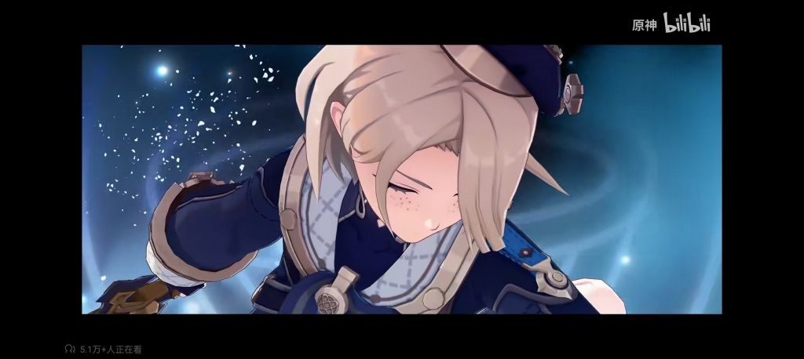

### [不吐不快]最让我意外的一点

Made by ngapost2md (c) ludoux [GitHub Repo](https://github.com/ludoux/ngapost2md)

----

##### 0.[1] \<pid:0\> 2023-08-05 00:07:28 by 远岱青衫

这是不是除了埃洛伊外第二个有雀斑的角色了。。

----

##### 1.[0] \<pid:707026071\> 2023-08-05 00:10:50 by 远岱青衫
其他的之前都梦完了。。就这个没料到。。。这是走向zzzq的一步吗？

----

##### 2.[1] \<pid:707026122\> 2023-08-05 00:11:14 by jadyn
本来看pv的时候我还在想，这位看起来也没有很娼年啊，就是腿比较露的正常水平？

一看这雀斑，好嘛，刻板印象++++

----

##### 3.[0] \<pid:707027632\> 2023-08-05 00:21:27 by Emmmuuuu
理查有过老哥科普，神父就喜欢雀斑小男孩

----

##### 4.[0] \<pid:707028560\> 2023-08-05 00:28:00 by 雨源rainsource
那个娼年是不是也有雀斑来着

----

##### 5.[1] \<pid:707031684\> 2023-08-05 00:51:39 by scoutqq
>[jump](#pid707027632) Emmmuuuu(2023-08-05 00:21) 说: 
>
>理查有过老哥科普，神父就喜欢雀斑小男孩

感觉更像迎合刻板印象中的欧美审美(欧美审美中认为雀斑是青春的象征)虽然lol的初版外服安妮和国服安妮的对比在各大社区没少被车,我都二次元了你还给我整这出

----

##### 7.[0] \<pid:707035741\> 2023-08-05 01:28:49 by 重生之我是荣誉骑士
这下正确了

----

##### 8.[0] \<pid:707036499\> 2023-08-05 01:37:36 by 月上七楼6004537238
金发、雀斑、水手服、小短裤，这神父要素还能再全些吗

----

##### 9.[0] \<pid:707036581\> 2023-08-05 01:38:32 by 会笑笑吗
雀斑也能拿出来车？逢米必反是吧

----

##### 10.[0] \<pid:707037164\> 2023-08-05 01:45:03 by TheCyen
>[jump](#pid707036581) 会笑笑吗(2023-08-05 01:38) 说: 
>
>雀斑也能拿出来车？逢米必反是吧

所以兄弟你爬完楼了吗？

你不会真的不知道雀斑在欧美社区文化中代表着什么吧

----

##### 11.[0] \<pid:707039108\> 2023-08-05 02:11:02 by 雲玩家かみかぜ
别吧，那火国冰国咋整啊

----

##### 12.[0] \<pid:707039753\> 2023-08-05 02:19:40 by Stosta
>[jump](#pid707036581) 会笑笑吗(2023-08-05 01:38) 说: 
>
>雀斑也能拿出来车？逢米必反是吧

你好闲啊哥们你是不是把理查所有帖子挨个回复了一遍啊
不过我也挺闲的毕竟一个一击脱离的小号你这辈子会不会看到我这条回复都不一定

----

##### 13.[0] \<pid:707041595\> 2023-08-05 02:54:11 by wlgcwcl
你们凭什么角色有雀斑就看不起他？现实中多少人有雀斑，你们这是在搞歧视吗？
-
来了，终于还是来了，我真是阐释妳的名了啊MHY。欧美市场给你的流水已经是烂中爆烂了，还搁这儿搞多样性呢。那我以后是不是还得在纳塔面对中性着装，中性发型的双性人，还得叫一声“你真美”？

说起来你游这几个烧0着装已经够tm恶心的了，角色设定上多少圆回来一点，行秋心向任侠仗义，魈是个直的锄地劳累人。到了须弥出了米卡这个正常着装的擦鞋男孩，现在枫丹装都不装了是吧？

埃罗伊在地平线中的外貌设定如此，o要美化也不能凭空创造新角色。在枫丹主动雀斑算什么意思？娼年人设退一万步，是本子的本子里的亚亚文化，媚的是极小部分宅女。但脸上有片雀斑很美吗？别说宅文化了，亚洲文化里有过哪怕一点提倡以脸上有片雀斑为美的要素吗？

“肤若凝脂，面若桃花”——《诗经·卫风·硕人》
“水沉为骨玉为肌”——北宋·黄庭坚
“面如凝脂，眼如点漆”——《世说新语·容止》
“粉妆玉琢”——《红楼梦》清·曹雪芹

雀斑在亚洲文化里叫什么？叫“疥”、叫“癣”、叫“疣”！你整个雀斑小男孩你想媚什么东西，你想媚在红迪升堂的贵物罕见？被叫米桑烦了，想被叫Mr.米了？说MHY是商业会社吧，它不向已经证明可行路径的客户提供服务。以前贴吧魔怔人拿点莫须有的证据骂MHY是罕见会社，我只觉着他们可笑。现在我该说什么好？

无论是单纯为了恶心部分人，还是真的内部有人认为这样的形象是很美的，都挺令人心寒的。

----

##### 14.[0] \<pid:707042320\> 2023-08-05 03:10:52 by sszzk
>[jump](#pid707036581) 会笑笑吗(2023-08-05 01:38) 说: 
>
>雀斑也能拿出来车？逢米必反是吧

逢米必孝的就不要那么激动啦

----

##### 15.[0] \<pid:707042452\> 2023-08-05 03:14:10 by nkd_sk
众所周知，原神npc的小孩都有雀斑，仔细一想蛮恐怖的。。。

----

##### 16.[0] \<pid:707052023\> 2023-08-05 07:46:58 by diver思凡
这角色配音和米卡一样，我直接生理不适

----

##### 17.[0] \<pid:707052212\> 2023-08-05 07:49:21 by Cloudrapid133
其他之前的小男孩大多还能说一句女性向，以及夸一句好看，其他之后的小男孩是真的没一个不带点逆天，我只能认为这是不装了的表现

----

##### 18.[0] \<pid:707052268\> 2023-08-05 07:50:02 by 渐行渐远ii
这么看建模挺精致啊，可惜大剑

----

##### 19.[0] \<pid:707053857\> 2023-08-05 08:08:37 by 叶公好龙娘
>[jump](#pid707036581) 会笑笑吗(2023-08-05 01:38) 说: 
>
>雀斑也能拿出来车？逢米必反是吧

teenage/teen标签下
西洋审美里雀斑很重要
青春期相关片子就喜欢这种

----

##### 20.[0] \<pid:707054145\> 2023-08-05 08:11:21 by 陌生的牙刷
其实我很嫌弃的一点是立绘和pv雀斑画得太不明显了
有一种既要还想要的不彻底感

----

##### 21.[0] \<pid:707054811\> 2023-08-05 08:17:48 by 会笑笑吗
>[jump](#pid707053857) 叶公好龙娘(2023-08-05 08:08) 说: 
>
>teenage/teen标签下
>西洋审美里雀斑很重要
>青春期相关片子就喜欢这种

那又怎么样？我看不出能车的点。理智一点，什么都随大流只会显得自己不成熟

----

##### 22.[0] \<pid:707067280\> 2023-08-05 09:50:41 by lasjksk
>[jump](#pid707027632) Emmmuuuu(2023-08-05 00:21) 说: 
>
>理查有过老哥科普，神父就喜欢雀斑小男孩

链接链接我真不懂什么意思

