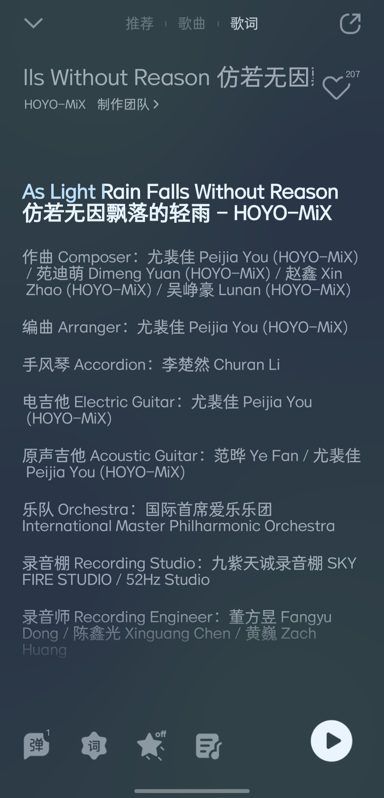

### [不吐不快]足迹pv里面根本就没有枫丹主旋律

Made by ngapost2md (c) ludoux [GitHub Repo](https://github.com/ludoux/ngapost2md)

----

##### 0.[0] \<pid:0\> 2023-08-05 00:30:30 by 克喵
今天看大家中有不少朋友说这次音乐没有能抓住人的旋律，这方面姑且不谈(其实主旋律一直在重复，挺洗脑的)
我看到有的朋友说这次枫丹主旋律把原来陈老师足迹pv力的主旋律替换掉了，然后阴谋论什么陈老师离职之类的离谱谣言是真的蚌埠住了。麻烦持这个观点朋友们回去听一听足迹里面枫丹画面的音乐动机，熟悉吗？这明明是愚人众执行官的动机旋律(不信的朋友们可以对比公子，女士，散兵，仆人在剧情或者pv里面出场的片段，看看背景动机是不是这一段)，足迹pv里面根本就没有枫丹主旋律动机。朋友们能不能发帖子之前查证一下？

----

##### 1.[0] \<pid:707051996\> 2023-08-05 07:46:41 by 他小炒肉谁啊
你说的对，但是

----

##### 2.[0] \<pid:707053368\> 2023-08-05 08:03:03 by 中華鱉精
足迹那个太像圣桑的水族馆了。
这次的主题曲没那个特征。

----

##### 3.[1] \<pid:707053545\> 2023-08-05 08:05:05 by vaderblade3
>[jump](#pid707051996) 他小炒肉谁啊(2023-08-05 07:46)说:
>你说的对，但是 [img]https://img.nga.178.com/attachments/mon_202308/05/l2Q2s-bzltZ1eT3cSu0-1qa.png[/img]

感觉换成xxn了捏编曲编的什么玩意，一点记忆点都没有

----

##### 4.[0] \<pid:707054608\> 2023-08-05 08:15:52 by 梅花鹿嘉宾
虽然但是，枫丹动机和愚人众动机真的不是同一……个……啊？啊啊？
为求证第一次把女士周本和足迹“枫丹”旋律连起来听，确实太像了完全可以当作是同一个动机的合理改编
之前也不是没见过有人把《致终末的欢宴》里仆人出场音乐认作愚人众动机的，我还心想不可能，绝对不可能，因为二者细节上还是有区别的，而欢宴pv里的旋律和“枫丹”旋律完全相符。
但现在版本pv和国家主题曲都出来了，是同一个新动机再加上终末pv“枫丹”旋律出现于仆人出场……各处细节都互相印证了
这下成了我这个希望在枫丹主题曲找到“枫丹”动机的人擅自去期待，擅自去失望了所以为什么当初足迹不用枫丹的动机？是足迹后临时和愚人众的调换了(怎么可能)，还是枫丹和愚人众关系密切(至冬都有自己的旋律)……完全说不通啊
算了我自己来：这很重要吗？也就只有你这种音乐厨才会……

----

##### 5.[0] \<pid:707055819\> 2023-08-05 08:27:21 by 风之碧海之翠
继立绘与剧情内核后，期待之后足迹爆出更多的金币

----

##### 6.[0] \<pid:707055993\> 2023-08-05 08:29:11 by 不淡定の文
>[jump](#pid707051996) 他小炒肉谁啊(2023-08-05 07:46) 说: 
>
>你说的对，但是
>

这张图哪来的，我去看看

----

##### 7.[1] \<pid:707058390\> 2023-08-05 08:48:40 by astonishkwon
>[jump](#pid707053545) vaderblade3(2023-08-05 08:05) 说: 
>
>感觉换成xxn了捏编曲编的什么玩意，一点记忆点都没有

之前脉脉上就有原神的美工抱怨xxn策划为了逼他们改角色都自学建模了，现在估计这帮姑娘们又自学五线谱了吧

----

##### 8.[0] \<pid:707066571\> 2023-08-05 09:46:07 by 他小炒肉谁啊
>[jump](#pid707055993) 不淡定の文(2023-08-05 08:29) 说: 
>
>这张图哪来的，我去看看

qq音乐啊

----

##### 9.[0] \<pid:707068035\> 2023-08-05 09:55:44 by Khris2456
昨天一听就知道结束了

