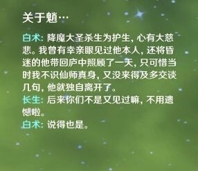

### [不吐不快]无人在意的角落，我突然翻出来白术语音里抄了佛剑分说

Made by ngapost2md (c) ludoux [GitHub Repo](https://github.com/ludoux/ngapost2md)

----

##### 0.[0] \<pid:0\> 2023-08-05 02:25:33 by 玛缇亚斯

原句是杀生为护生，斩业非斩人，三弦，你害了多少搞古风的人啊咩哈哈哈哈哈

----

##### 1.[0] \<pid:707040169\> 2023-08-05 02:26:43 by 透明级
想起一些欲买桂花同载酒，终不似少年游
mhy为什么这么喜欢断一句

----

##### 2.[0] \<pid:707040369\> 2023-08-05 02:29:40 by 玛缇亚斯
>[jump](#pid707040169) 透明级(2023-08-05 02:26) 说: 
>
>想起一些欲买桂花同载酒，终不似少年游
>mhy为什么这么喜欢断一句

全抄了不就显示不出他们的水平了吗光母也是这么想的

----

##### 3.[0] \<pid:707040623\> 2023-08-05 02:34:21 by shiroe_tothewhite
久远回忆ri怎么我头像还是一页书摘下了费列罗

----

##### 4.[0] \<pid:707040900\> 2023-08-05 02:39:24 by aertgrujvdyjgfu
想拽文，没本事，抄吧，想想又不甘心，那我就抄一半，来个自以为是的狗尾续貂，美滋滋，今天又原创了一句好诗啊！

----

##### 5.[0] \<pid:707041477\> 2023-08-05 02:51:37 by 黄河远上白云间
我又想起来了钟离语音
欲买桂花同载酒，终不似，少年游
多美的诗句啊，被文案的狗尾续貂毁了

----

##### 6.[3] \<pid:707041641\> 2023-08-05 02:55:04 by Giovann
mhy文案特有的碎尸是这样的

----

##### 7.[0] \<pid:707045635\> 2023-08-05 05:10:57 by TooruW
>[jump](#pid707041477) 黄河远上白云间(2023-08-05 02:51) 说: 
>
>我又想起来了钟离语音
>欲买桂花同载酒，终不似，少年游
>多美的诗句啊，被文案的狗尾续貂毁了

因为钟师傅没有“少年”时期啊，只是往事。

----

##### 8.[0] \<pid:707055137\> 2023-08-05 08:20:55 by 花瓣飘零
白术对魈的评语像被皮套编剧一样附体了一样，像个小粉丝仰慕又想要见识又想要照顾还遗憾没认出来没说两句，他对别的仙人乃至岩王帝君死了仪式卖永生香都不肯便宜一点，完全没有表现出这种恭敬的态度，别的角色也为璃月付出了很多也没见白术说了什么特别的，加上点评的两句还是抄来的，而且是3.6同期出来的难免不往皮套编剧这方面想

----

##### 9.[0] \<pid:707055504\> 2023-08-05 08:24:27 by 五柳情州
但凡有个人能缝下三弦的智斗缝一场也好啊

----

##### 10.[0] \<pid:707056171\> 2023-08-05 08:30:46 by 白芍识秋
居然还有人记得霹雳

----

##### 11.[0] \<pid:707056264\> 2023-08-05 08:31:30 by 夭叶舒华
之前我也发现了，主要是就这么半截话也说不上是不是抄

----

##### 12.[0] \<pid:707056467\> 2023-08-05 08:33:17 by momookyk
想起以前读书的时候最喜欢念的就是
两只黄鹂鸣翠柳，一行白鹭上西天
窗含西岭千秋雪，门泊东吴大翻船

----

##### 13.[0] \<pid:707058903\> 2023-08-05 08:52:39 by 水禾歌
自称国中生的编剧抄本省文化作品的台词不是很正常吗？

----

##### 14.[0] \<pid:707058908\> 2023-08-05 08:52:42 by 莱莱不知道哦
mhy文案是这样的

----

##### 15.[0] \<pid:707059643\> 2023-08-05 08:57:53 by 纯白的心中
角色石块，文案抄缝，美术抄缝，好像招的人就没有一个真的有本事的。本事全点在记仇阴阳怪气看不起中国人，精日辱华培养罕见上了。音乐里有本事的说不定已经被熏走了。不对，说不定是米家搞小把戏故意恶心人家让人家自己走，然后推垃圾精日恨国的罕见上位。

----

##### 16.[0] \<pid:707091625\> 2023-08-05 12:09:37 by 玛缇亚斯
>[jump](#pid707056264) 夭叶舒华(2023-08-05 08:31) 说: 
>
>之前我也发现了，主要是就这么半截话也说不上是不是抄

主要一开始我总以为魈怎么也是赮毕钵罗，结果这个佛剑分说一出来给我笑喷了古风二次元什么时候给三弦和素问付版权费啊

----

##### 17.[0] \<pid:707092279\> 2023-08-05 12:13:42 by 琅华宴_二号机
有一说一，我可以点名下绫人吗？三尺秋水尘不染，天下无双。

----

##### 18.[0] \<pid:707093044\> 2023-08-05 12:17:59 by 大象的象子
只会玩梗是玩梗的电商吗

----

##### 19.[0] \<pid:707093059\> 2023-08-05 12:18:03 by 扉与
文案喜欢生僻字说不定还真是跟布袋戏学的

----

##### 20.[0] \<pid:707093544\> 2023-08-05 12:20:45 by 玛缇亚斯
>[jump](#pid707092279) 琅华宴_二号机(2023-08-05 12:13) 说: 
>
>有一说一，我可以点名下绫人吗？三尺秋水尘不染，天下无双。
>别的不说，把三尺秋水和剑联系起来的，我查到的只有剑子仙迹。

剑子变成日本人了，收万劫狂喜好吧

----

##### 21.[0] \<pid:707093810\> 2023-08-05 12:22:28 by 琅华宴_二号机
>[jump](#pid707093544) 玛缇亚斯(2023-08-05 12:20)说:
>[quote][pid=707092279,37263282,1]Reply[/pid] <b>Post by [uid=65149883]琅华宴_二号机[/uid] (2023-08-05 12:13):</b>  有一说一，我可以点名下绫人吗？三尺秋水尘不染，天下无双。[s:ac:哭笑] 别的不说，把三尺秋水和剑联系起来的，我查到的只有剑子仙迹。[/quote][s:ac:哭笑]剑子变成日本人了，收万劫狂喜好吧

就离谱，有一种抄了贞德帮别人把辫子接回去的美。

----

##### 22.[0] \<pid:707095293\> 2023-08-05 12:30:56 by yaxylum
我不好说

不懂日语，没有能力判断真假。
假设为真的是否可以推导出这样的结论：湾湾布袋戏汲取了霓虹文学元素创作出了三尺秋水，又被原借鉴走创作了赛博稻妻人

----

##### 23.[0] \<pid:707095509\> 2023-08-05 12:32:16 by 琅华宴_二号机
>[jump](#pid707095293) yaxylum(2023-08-05 12:30)说:
>我不好说  [img]https://img.nga.178.com/attachments/mon_202308/05/l2Q2s-jdc3Z12T3cSn0-yv.jpg.medium.jpg[/img] 不懂日语，没有能力判断真假。 假设为真的是否可以推导出这样的结论：湾湾布袋戏汲取了霓虹文学元素创作出了三尺秋水，又被原借鉴走创作了赛博稻妻人[s:ac:哭笑]

如果这是真的话，那也太搞了

----

##### 24.[0] \<pid:707096170\> 2023-08-05 12:36:23 by 玛缇亚斯
>[jump](#pid707095293) yaxylum(2023-08-05 12:30) 说: 
>
>我不好说
>
>
>不懂日语，没有能力判断真假。
>假设为真的是否可以推导出这样的结论：湾湾布袋戏汲取了霓虹文学元素创作出了三尺秋水，又被原借鉴走创作了赛博稻妻人

说起来我觉得申鹤其实有点琴箕的味道，魈是菠萝，对应得上两个人关系，魈和帝君也是一种菠萝和龙戬

----

##### 25.[0] \<pid:707096653\> 2023-08-05 12:39:13 by __唐紫陌
是吗？那我会说:
鸱鸮怪叫，终难掩鹓鶵清音！

----

##### 26.[0] \<pid:707123477\> 2023-08-05 15:24:59 by 平春永
>[jump](#pid707095293) yaxylum(2023-08-05 12:30) 说: 
>
>我不好说
>
>
>不懂日语，没有能力判断真假。
>假设为真的是否可以推导出这样的结论：湾湾布袋戏汲取了霓虹文学元素创作出了三尺秋水，又被原借鉴走创作了赛博稻妻人

依稻妻文案考据的浓度，直接从日语取来源可能性更大，没必要走中间商。就像是雷电将军的花鸟余情语音，也是来自日语典故的。

----

##### 27.[0] \<pid:707123608\> 2023-08-05 15:25:50 by 网友述
米的事，怎么能叫抄呢

----

##### 28.[0] \<pid:707124891\> 2023-08-05 15:34:36 by 一片平凡的全麦面包
>[jump](#pid707092279) 琅华宴_二号机(2023-08-05 12:13) 说: 
>
>有一说一，我可以点名下绫人吗？三尺秋水尘不染，天下无双。
>别的不说，把三尺秋水和剑联系起来的，我查到的只有剑子仙迹。

啊？？？啊？？？？前剑粉心态裂开了

----

##### 29.[0] \<pid:707125245\> 2023-08-05 15:36:49 by 玛缇亚斯
>[jump](#pid707123477) 平春永(2023-08-05 15:24) 说: 
>
>依稻妻文案考据的浓度，直接从日语取来源可能性更大，没必要走中间商。就像是雷电将军的花鸟余情语音，也是来自日语典故的。

但是第一个把三尺秋水和剑连起来的就是这个句子，就像杀生为护生，斩业非斩人，化用自《偈颂十七首》的“杀生护生，得念失念”但是第一个改的就是布袋戏。同理也有三尺秋水尘不染，天下无双。重点在于最后的天下无双，说明这个角色的心如剑一般，看似古尘满身但实际上不染尘埃，道心无双。
而且我说一句，这两个句子出来到现在，都有二十几年历史了，比一些谭u都老，真能说完全没注意吗？

----

##### 30.[0] \<pid:707125754\> 2023-08-05 15:40:04 by 琅华宴_二号机
>[jump](#pid707124891) 一片平凡的全麦面包(2023-08-05 15:34)说:
>[quote][pid=707092279,37263282,1]Reply[/pid] <b>Post by [uid=65149883]琅华宴_二号机[/uid] (2023-08-05 12:13):</b>  有一说一，我可以点名下绫人吗？三尺秋水尘不染，天下无双。[s:ac:哭笑] 别的不说，把三尺秋水和剑联系起来的，我查到的只有剑子仙迹。[/quote]啊？？？啊？？？？[s:ac:晕]前剑粉心态裂开了，我宁可相信他们没抄也不希望剑子被他们粘上 妈的，冷不丁看到爱了好多年的前前推，真给我感觉被雷劈了一样

三人组就差一个龙宿了，噔噔咚

----

##### 31.[0] \<pid:707128402\> 2023-08-05 15:57:45 by 冷泠棱凌
>[jump](#pid707096170) 玛缇亚斯(2023-08-05 12:36) 说: 
>
>这样说起来我觉得申鹤其实有点琴箕的味道，琴箕不相信感情且为人冷冰冰，但是对男主素还真是视为朋友和知音的，这边就直接对上旅行者了。魈是赮毕钵罗，赮毕钵罗和赦天琴箕是一堆同事里说得上话的那俩，对应得上魈鹤两个人关系。同时魈和帝君也是一种菠萝和龙戬  先生救下魈，也能对得上菠萝少年流浪被龙戬收徒的经历

所以璃月原型是布袋戏是吧，这下破案了

----

##### 32.[0] \<pid:707129224\> 2023-08-05 16:03:21 by 玛缇亚斯
>[jump](#pid707128402) 冷泠棱凌(2023-08-05 15:57) 说: 
>
>所以璃月原型是布袋戏是吧，这下破案了  
>不过鉴于制作方立场都不是什么好鸟……嗯……

和国中生猛干哥99好吧说实话辱了啊，霹雳自己还是写过类似于相隔两岸但是血浓于水的句子，黄大哪怕仙逝了都还是自称台湾省。

猛干们？在支支那那龙龙呢

----

##### 33.[0] \<pid:707131599\> 2023-08-05 16:18:25 by 今天也要好好吃饭哦
>[jump](#pid707055137) 花瓣飘零(2023-08-05 08:20) 说: 
>
>白术对魈的评语像被皮套编剧一样附体了一样，像个小粉丝仰慕又想要见识又想要照顾还遗憾没认出来没说两句，他对别的仙人乃至岩王帝君死了仪式卖永生香都不肯便宜一点，完全没有表现出这种恭敬的态度，别的角色也为璃月付出了很多也没见白术说了什么特别的，加上点评的两句还是抄来的，而且是3.6同期出来的难免不往皮套编剧这方面想

被文案“要不是魈，谁工作啊！”上身套皮了呗

----

##### 34.[0] \<pid:707135567\> 2023-08-05 16:43:25 by 平春永
>[jump](#pid707125245) 玛缇亚斯(2023-08-05 15:36) 说: 
>
>但是在中文网络各种古风句子无差别乱传播的历史里，第一个把三尺秋水和剑连起来的还真就是这句。
>就像杀生为护生，斩业非斩人，化用自《偈颂十七首》的“杀生护生，得念失念”但是第一个改的就是布袋戏，最后流传开来也是布袋戏里这一句。
>同理也有三尺秋水尘不染，天下无双。重点在于最后的天下无双，说明这个角色的心如剑一般，看似古尘满身，但实际上不染尘埃，道心无双。
>而且我说一句，这两个句子从被创作出来到现在，都有二十几年历史了，比一些谭u都老，猛干们查资料的时候真能说完全没注意吗？

首先，三尺秋水本身也是日语的四字熟语，指凛凛剑光，而且隔壁李素裳也化用了李贺的“先辈匣中三尺水，曾入吴潭斩龙子”，三尺水来指剑也不是布袋戏独创的。
杀生为护生这个说来自布袋戏确实一目了然，比较直接。但是原神这帮编剧本身就在日本读书，稻妻各种梗也都是来自各种日语古典捏他，你说他们不知道日语三尺秋水是什么意思简直是不可能的。这种情况下硬要用布袋戏认领，未免太没根据了吧。

----

##### 35.[0] \<pid:707159633\> 2023-08-05 19:02:51 by 玛缇亚斯
>[jump](#pid707135567) 平春永(2023-08-05 16:43) 说: 
>
>首先，三尺秋水本身也是日语的四字熟语，指凛凛剑光，而且隔壁李素裳也化用了李贺的“先辈匣中三尺水，曾入吴潭斩龙子”，三尺水来指剑也不是布袋戏独创的。
>杀生为护生这个说来自布袋戏确实一目了然，比较直接。但是原神这帮编剧本身就在日本读书，稻妻各种梗也都是来自各种日语古典捏他，你说他们不知道日语三尺秋水是什么意思简直是不可能的。这种情况下硬要用布袋戏认领，未免太没根据了吧。
>
>顺便补充一下，稻妻这边是中文文案宁肯写遊芸(指七圣召唤)也不写游戏，写屋台也不写小摊，写逐电也不写逃亡，写神人都不写巫女的(等等

说白了这事有即视感或者直接化用就已经够搞笑了好吧，大家这是想纠正吗，只是想顺着笑他罢了。
这很重要吗，也就考据党和在乎原神剧情的会觉得重要罢了.jpg

