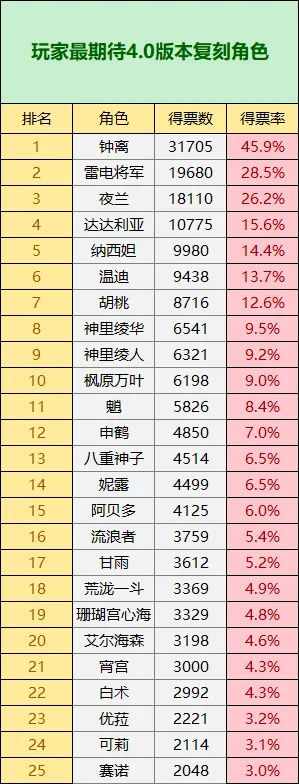
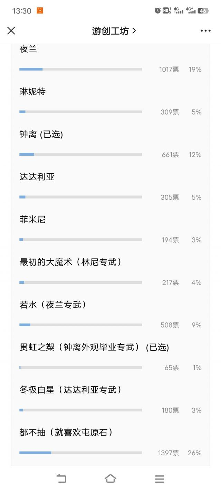

### [热点事件]小助手抽取意愿

Made by ngapost2md (c) ludoux [GitHub Repo](https://github.com/ludoux/ngapost2md)

----

##### 0.[0] \<pid:0\> 2023-08-05 07:57:34 by rtg？
林与夜抽取意愿1：3

----

##### 1.[0] \<pid:707053612\> 2023-08-05 08:05:48 by 胡桃梅花
还有3.8的截图吗
想看看有没有小男孩0h之姿

----

##### 2.[0] \<pid:707053742\> 2023-08-05 08:07:25 by 尤塔基里斯
能让夜天后陪跑就已经能明白策划的想法了，他们自己也知道这种角色单走流水是不会好看的
~~月华铃铛池警告~~

----

##### 3.[0] \<pid:707053769\> 2023-08-05 08:07:43 by after_lastrain
嗨丝小男孩抽取意愿不敌1.0退环境绑配队断头饭大C是吧

只要和天后合砍81分，神父也能自豪的昂起头颅

----

##### 4.[0] \<pid:707053984\> 2023-08-05 08:09:53 by 汀上白沙_
我兰豆啊.jpg

----

##### 5.[0] \<pid:707054172\> 2023-08-05 08:11:38 by 好几块哈哈
不是吧，抽取意愿还不如公子？

----

##### 6.[0] \<pid:707054286\> 2023-08-05 08:12:52 by Kaekaekae
黑丝小男孩抽取人数不如公子

----

##### 7.[0] \<pid:707054460\> 2023-08-05 08:14:30 by 八子之歌
跟夜兰绑，能看出ch有多爱了

----

##### 8.[0] \<pid:707054636\> 2023-08-05 08:16:05 by 追加记忆
4.0时期还要靠1.0老角色吸金，噗嗤

----

##### 9.[0] \<pid:707054912\> 2023-08-05 08:18:46 by 修天赐
夜兰抽取意愿不如钟离挺意外的，老钟头4.0还能爆米吗

----

##### 10.[0] \<pid:707055071\> 2023-08-05 08:20:23 by 布蕾脆脆奶芙永远滴神
>[jump](#pid707054912) 修天赐(2023-08-05 08:18) 说: 
>
>夜兰抽取意愿不如钟离挺意外的，老钟头4.0还能爆米吗

夜兰能抽命座，钟离抽个0命就跑路了，怎么爆米

----

##### 11.[0] \<pid:707055167\> 2023-08-05 08:21:10 by Wincyl_
我也宁愿补个公子去公子池垫个小保底，出了挺好不出算了

----

##### 12.[0] \<pid:707055177\> 2023-08-05 08:21:20 by 天剑歌
我4.0不抽夜兰纯粹是因为已经6+5了

----

##### 13.[0] \<pid:707055683\> 2023-08-05 08:26:07 by 妙妙复读机
怎么连想抽公子的人数都比林尼多

----

##### 14.[0] \<pid:707056988\> 2023-08-05 08:37:33 by 滅燼
>[jump](#pid707054912) 修天赐(2023-08-05 08:18) 说: 
>
>夜兰抽取意愿不如钟离挺意外的，老钟头4.0还能爆米吗

不意外，上次他们统计的意愿，钟离也是遥遥领先

----

##### 15.[0] \<pid:707057879\> 2023-08-05 08:44:40 by cbgc343
林尼这也太……打不过钟离夜兰正常，打不过公子也太离谱了……

----

##### 16.[0] \<pid:707058370\> 2023-08-05 08:48:33 by akxttx1
一眼好多韭菜

----

##### 17.[0] \<pid:707059045\> 2023-08-05 08:53:34 by astonishkwon
>[jump](#pid707057879) cbgc343(2023-08-05 08:44) 说: 
>
>林尼这也太……打不过钟离夜兰正常，打不过公子也太离谱了……

也不至于离谱吧，公子本来也是真的帅，而且还有万达国际这种饭碗，不比那些个奇装异服还放在大版本第一个炮灰池的人安稳多了

----

##### 18.[0] \<pid:707059253\> 2023-08-05 08:55:11 by tbiph9277
和夜兰绑已经能说明问题了

大版本新角色开服0h，哪怕是米哈游也蚌埠住，必须祭出畅销产品捆绑销售装装样子

----

##### 19.[0] \<pid:707059493\> 2023-08-05 08:56:53 by 这游戏真给我整沉默了
钟离最高…这游戏还有这么多新人吗？

----

##### 20.[0] \<pid:707060124\> 2023-08-05 09:01:51 by Lilith330
经过3.8卡池我感觉小助手抽取意愿还是很准的
那次是心海&gt;散兵，但最大头的是跳过不抽
果然出来后流水暴死，抽取比2人差不多，考虑到心海命座吸引力0散兵抽取命座高，实际抽取人数确实是心海大于散兵

----

##### 21.[2] \<pid:707060246\> 2023-08-05 09:02:49 by sinco123
我觉得是须弥后面还是有点新人入坑的，比如我
我就是达达利亚那期进的坑，然后被损友忽悠没抽同期的小草神
映像中那时候开始钟离就没有复刻吧
我的观念里钟离已经不仅仅是一个岩系盾辅了，璃月背后最高的存在，已经是一种象征了，我高低要抽一个的，命座看缘分吧

----

##### 22.[0] \<pid:707060402\> 2023-08-05 09:04:01 by chijiling
梭哈一点老角色就润了，mhy越是推荒芒越是不想抽，反正深渊也不碰了

----

##### 23.[0] \<pid:707060679\> 2023-08-05 09:05:46 by ソフィスト
我倒是比较倾向抽4.0上半武器池，已经进大保底了，保底若水还是大魔术都是赚到，前者给夜兰后者给甘雨

----

##### 24.[0] \<pid:707060715\> 2023-08-05 09:06:03 by 风亭子
>[jump](#pid707060124) Lilith330(2023-08-05 09:01)说:
>经过3.8卡池我感觉小助手抽取意愿还是很准的 那次是心海&gt;散兵，但最大头的是跳过不抽 果然出来后流水暴死，抽取比2人差不多，考虑到心海命座吸引力0散兵抽取命座高，实际抽取人数确实是心海大于散兵

散兵持有率上涨没有心海多，大致上是对的。但持有率上涨不低也没有流水啊，这游戏还能有几个新人

----

##### 25.[0] \<pid:707060728\> 2023-08-05 09:06:09 by piepiero
>[jump](#pid707059045) astonishkwon(2023-08-05 08:53) 说: 
>
>也不至于离谱吧，公子本来也是真的帅，而且还有万达国际这种饭碗，不比那些个奇装异服还放在大版本第一个炮灰池的人安稳多了

可他是个1.0主c林尼高倍率还带神奇的荒芒元素

----

##### 26.[0] \<pid:707062687\> 2023-08-05 09:19:54 by 自由干饭人
入坑不久还没有钟离，作为厨子准备抽了就跑，我真的感觉昨天看到的这句话很对，大意是这待遇钟离给米多赚一分钱米都对不起他

----

##### 27.[0] \<pid:707064521\> 2023-08-05 09:32:21 by 这个西瓜好甜
>[jump](#pid707054912) 修天赐(2023-08-05 08:18) 说: 
>
>夜兰抽取意愿不如钟离挺意外的，老钟头4.0还能爆米吗

有啥意外的，我记得小助手有统计以来你游巅峰持有率能达到90%以上的限五只有钟离万叶草神三个角色，雷神夜兰都没突破90大关。

不过爆米就算了，用脚设计的命座专武，两次三无复刻气死厨子，米社自己不想赚钱能怪谁

----

##### 28.[0] \<pid:707066863\> 2023-08-05 09:47:57 by 转生能成功吗
唯一想抽的只有琳妮特，但是已经78抽了。下夜兰池子捞几只，出了夜兰也不算亏

----

##### 29.[0] \<pid:707067268\> 2023-08-05 09:50:35 by cclean
你好，我抽钟离6命

----

##### 30.[0] \<pid:707067486\> 2023-08-05 09:51:54 by xtip29121
>[jump](#pid707059493) 这游戏真给我整沉默了(2023-08-05 08:56) 说: 
>
>钟离最高…这游戏还有这么多新人吗？

也有可能是我这样3.0甘雨池入坑的，完美错过钟离，还抽了甘雨

----

##### 31.[0] \<pid:707069971\> 2023-08-05 10:07:58 by 星星鬼鬼会飞
钟离你真的我哭死

----

##### 32.[0] \<pid:707070488\> 2023-08-05 10:11:08 by 玩c罗玩的
林尼唯一一个新角色却是最少 不知道的以为他要进常驻

----

##### 33.[0] \<pid:707073110\> 2023-08-05 10:27:04 by 芥子禹
还有愿意抽钟离的，看来情况还不够严峻(大概)

----

##### 34.[0] \<pid:707073412\> 2023-08-05 10:28:53 by Kaekaekae
>[jump](#pid707060124) Lilith330(2023-08-05 09:01) 说: 
>
>经过3.8卡池我感觉小助手抽取意愿还是很准的
>那次是心海&gt;散兵，但最大头的是跳过不抽
>果然出来后流水暴死，抽取比2人差不多，考虑到心海命座吸引力0散兵抽取命座高，实际抽取人数确实是心海大于散兵

以后从持有率增加也看得出来

----

##### 35.[0] \<pid:707074669\> 2023-08-05 10:36:01 by 白与懿
~~贯虹我可怜的贯虹~~

----

##### 36.[0] \<pid:707077652\> 2023-08-05 10:52:38 by zhillbb
我抽贯虹

----

##### 37.[0] \<pid:707078876\> 2023-08-05 10:59:26 by 别再锁了
从梦里听说的林尼的强度来看，4.0上半池子其实性价比拉满了要是这流水都寄了的话那就太好玩了

----

##### 38.[0] \<pid:707078993\> 2023-08-05 11:00:02 by 景邀明
如果一切顺利就能拿下兰姐1+1，然后我要抽贯虹，有护摩了但想着还是给钟离外观毕业，也算做个纪念，毕竟是拉我入坑的最大因素，怨种就怨种吧

----

##### 39.[0] \<pid:707079887\> 2023-08-05 11:04:40 by xmkz798
钟离怎么还是这么高啊

----

##### 40.[0] \<pid:707080620\> 2023-08-05 11:08:31 by 绽放于夜暮
贯虹，我的贯虹

----

##### 41.[0] \<pid:707081286\> 2023-08-05 11:12:02 by 寻找着徘徊着
怎么还有人抽钟离啊，快跑啊！
前面是被从强度针对到死，剧情查无此人一年一会，周边用脚捞出的地狱啊！！
可恶，钟离如果不是0h我真的会伤心啊！

----

##### 42.[0] \<pid:707085514\> 2023-08-05 11:35:44 by 飘雪菌

----

##### 43.[0] \<pid:707086764\> 2023-08-05 11:42:50 by 花瓣飘零
这不压双0？样本比3.8数据都差

----

##### 44.[0] \<pid:707087845\> 2023-08-05 11:48:47 by yenfsjs
>[jump](#pid707054912) 修天赐(2023-08-05 08:18):

钟离上次是3.0，夜兰3.4。3.0-3.2这段时间里还是有不少新人入坑的，3.4倒是退坑潮的开始

----

##### 45.[0] \<pid:707088393\> 2023-08-05 11:51:45 by cbgc343
>[jump](#pid707086764) 花瓣飘零(2023-08-05 11:42) 说: 
>
>这不压双0？样本比3.8数据都差

尬黑了，4.0这统计才开不到一天

----

##### 46.[0] \<pid:707088971\> 2023-08-05 11:54:47 by 龙澂
>[jump](#pid707059493) 这游戏真给我整沉默了(2023-08-05 08:56):

我感觉还是有不少新人，不然也不会有那么多结晶，但凡玩原神玩久点，结晶都给你震碎了

----

##### 47.[0] \<pid:707089949\> 2023-08-05 12:00:10 by 雲玩家かみかぜ
回来吧早期团队

----

##### 48.[0] \<pid:707090253\> 2023-08-05 12:01:58 by 那又能怎么样呢
你钟老爷子还能再战三年

----

##### 49.[0] \<pid:707093660\> 2023-08-05 12:21:25 by 阿卡迪亚的风
为什么贯虹都能有一千票，这是何等的冤种
判断抽取意愿可以以贯虹为单位吗，这个新角色大C只有7贯，好逊哦

----

##### 50.[0] \<pid:707095582\> 2023-08-05 12:32:44 by ry0422
>[jump](#pid707093660) 阿卡迪亚的风(2023-08-05 12:21) 说: 
>
>为什么贯虹都能有一千票，这是何等的冤种
>判断抽取意愿可以以贯虹为单位吗，这个新角色大C只有7贯，好逊哦

笑死我了，贯虹你是真的火了，要注意自己的仪容仪表后面忘了
不会吧不会吧，不会真有人抽取意愿不能爆杀贯虹吧.jpg

----

##### 51.[0] \<pid:707095914\> 2023-08-05 12:34:51 by 青春派洛笛
这下想去隔壁流水楼压个双0了

----

##### 52.[0] \<pid:707096435\> 2023-08-05 12:37:56 by lllililylaly
最高的抽取率和最差的“专武”每次看都蚌埠住

----

##### 53.[1] \<pid:707097421\> 2023-08-05 12:43:48 by 一杯小冰块
作为厨子我是真心希望钟离池子0h，想抽钟离的各位答应我不要给米送钱好吗？咱就用攒的水抽，祝你们一发出钟离

----

##### 54.[0] \<pid:707099139\> 2023-08-05 12:53:28 by 亦有余央
慌什么！厕妹马上去打榜了而且。。即使厕妹不氪，米依然用你们氪的金去开发乙游腐游大主线啊。

----

##### 55.[0] \<pid:707099445\> 2023-08-05 12:55:14 by WindsK1245
三倍说实话感觉都高了，真的
我觉得在1:4和1:5之间，这个投票肯定有“宅男破防我就开心”的厕妹在投

----

##### 56.[0] \<pid:707100578\> 2023-08-05 13:01:56 by logicnnn
>[jump](#pid707054912) 修天赐(2023-08-05 08:18) 说: 
>夜兰抽取意愿不如钟离挺意外的，老钟头4.0还能爆米吗

钟离太久没复刻了，夜兰毕竟3.4来了一次。

----

##### 57.[0] \<pid:707101527\> 2023-08-05 13:07:28 by 甲叶
到时候池子怕是有一种“奥尼尔的奶奶和乔丹一起拿总冠军”，“我和乔丹合砍81分”的美

----

##### 58.[0] \<pid:707102943\> 2023-08-05 13:15:28 by 飞霜叩门
钟离抽取高很正常吧，你仔细一想这龙也是一年没复刻了，3.0版本骗进来还没杀干净的手头还真是一只没有

----

##### 59.[0] \<pid:707104412\> 2023-08-05 13:24:16 by 冷光小调
夜兰+若水的票数还是比钟离多的(惯虹你看看你能干点啥 

----

##### 60.[0] \<pid:707105564\> 2023-08-05 13:31:03 by 不想上班999号
贯虹啊贯虹，我又想起游创那个抽啥投票了，虽然样本量很小但是当初看到贯虹括号里的内容我还是觉得

----

##### 61.[1] \<pid:707111333\> 2023-08-05 14:05:53 by 岩间琉璃，云间月
>[jump](#pid707067268) cclean(2023-08-05 09:50) 说: 
>
>你好，我抽钟离6命

别爆米了(真心的)

----

##### 62.[0] \<pid:707112075\> 2023-08-05 14:10:34 by cclean
>[jump](#pid707111333) 岩间琉璃，云间月(2023-08-05 14:05)说:
>[quote][pid=707067268,37264047,2]Reply[/pid] <b>Post by [uid=65043903]cclean[/uid] (2023-08-05 09:50):</b>  你好，我抽钟离6命[s:ac:goodjob][/quote]别爆米了(真心的)[s:ac:哭笑]

哪能啊，我一年就抽一个神，米桑除了给钟离出衣服绝无可能再骗到我的米

----

##### 63.[0] \<pid:707112592\> 2023-08-05 14:13:42 by 雁门关下的小蘑菇
怎么钟离这么高啊我以为会是兰豆最高的
希望大伙都十连五金要啥有啥，不要给mhy爆一分钱的米

----

##### 65.[0] \<pid:707115200\> 2023-08-05 14:30:12 by 行檐
帝君对不起，我不想送米了，只能抽个0命了。下次复刻再见啊帝君

----

##### 66.[0] \<pid:707121174\> 2023-08-05 15:10:09 by 沙落雾
我唯一还留在这个游戏里的原因就是入坑时机不对还没有钟离，等复刻完抽到角色和专武，立马卸载，下次见面就是钟离出皮肤的时候。

----

##### 67.[0] \<pid:707122415\> 2023-08-05 15:18:05 by 天星之愿
我也想抽钟离命座，运气好能5命，运气差也至少有个4命

----

##### 68.[0] \<pid:707122833\> 2023-08-05 15:20:43 by 剑筑师と書記官
emmmm
我的评价是如果林夜的池子如果特别好
还不超24h，这游戏真的可以考虑一下要不要关服了

----

##### 69.[0] \<pid:707123580\> 2023-08-05 15:25:38 by 剑筑师と書記官
>[jump](#pid707113673) 阿缇蜜斯(2023-08-05 14:20) 说: 
>
>我想说，如果4.0夜兰流水很高的话，那么还没卸载的就别埋怨优化垃圾、不出女角、黑丝男同、散姐仙蛆了嗷
>这些都是你们花钱养的

但老实说夜阑算人权卡了
五神 叶天帝夜天后
如果夜天后，甚至明着告诉你，枫丹没有4命夜阑都容易爆金币的情况下都爆不出剩下的这批人的米，这游戏大概真的就得考虑开瓶香槟了

----

##### 70.[0] \<pid:707127797\> 2023-08-05 15:53:30 by htqwtbtwta
不少是作为厨子尽全力抽完就跑路了吧，反正所谓的璃月神这待遇到现在几年也丝毫不变

----

##### 71.[0] \<pid:707130560\> 2023-08-05 16:11:38 by 来份图图
>[jump](#pid707056988) 滅燼(2023-08-05 08:37) 说: 
>
>不意外，上次他们统计的意愿，钟离也是遥遥领先

能搞出钟离这样一个角色，实在是米哈游祖坟冒青烟了，感觉可以吃到公司倒闭，或者公司快倒闭的时候把钟离的版权卖给别人以苟延残喘

----

##### 72.[0] \<pid:707132041\> 2023-08-05 16:21:08 by 四风的烈酒
从梦里看，上半可能迎来璃月双水神坐镇，如果是真的那确实又想要流水又想要满足内部xp

----

##### 73.[0] \<pid:707147630\> 2023-08-05 17:56:01 by lipeeeeee
竟然有这么多人在等钟离
米()你真该死啊

----

##### 74.[0] \<pid:707151888\> 2023-08-05 18:17:33 by 放松一下心情
我感觉趁这个时机补夜兰命座应该不太好了，未来应该会有更好的

----

##### 75.[0] \<pid:707156037\> 2023-08-05 18:41:16 by 一个粉帽帽同学
我真的抽贯虹，因为命座已经抽满了

