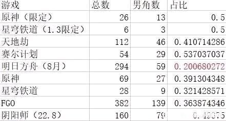
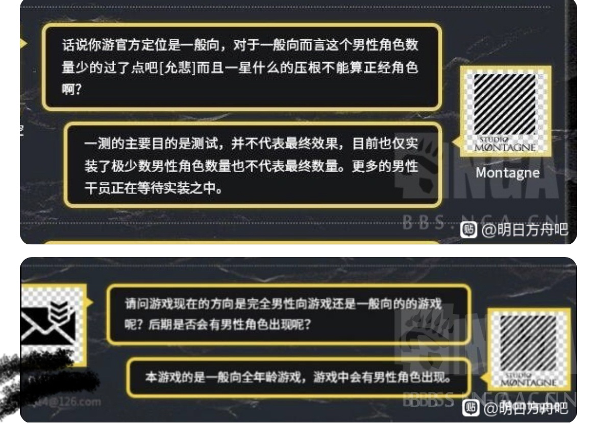

### [不吐不快]所谓“一般向”二游的困境

Made by ngapost2md (c) ludoux [GitHub Repo](https://github.com/ludoux/ngapost2md)

----

##### 0.[0] \<pid:0\> 2023-08-05 10:28:53 by fw4489555
起因是昨天贴吧首页推了一个隔壁淋吧的帖子，吐槽男女比例不合理，大致说法是：“只出女角色叫什么一般向”“骗进来杀”

得到这个帖子里认可的只有两个游戏，fgo和yys

很多宣传“一般向”二游都会在后期步入女角色连发，男角色逐渐减少的趋势，粥，云图，无期等

而一些新游也不“好过”，少前二官方节目试探过出男角色被反对最后放弃，尘白禁区删除男角色

不过令我意外的是一款宣传男性向的手游——奇点时代，老实说游戏质量真不行，但是前几个月流水相当不错，证明有ml需求的宅男还是挺有消费力的

所以希望那些二游厂商还是想明白自己做的游戏将来受众究竟是哪些，做男性向女性向“一般向”都可以，但是千万不要因为“一般向”听起来高大上，看起来受众多，就一拍脑袋决定。
免得最后又根据卡池流水转方向，把人骗进来杀。

----

##### 1.[0] \<pid:707073911\> 2023-08-05 10:31:51 by 癸芦饶子白林
不懂就问，图上这几个游戏真的宣传过自己一般向吗？

----

##### 2.[0] \<pid:707074169\> 2023-08-05 10:33:24 by Just  Monika
fgo和yys火的那个时代也没说过自己是一般向吧

----

##### 3.[3] \<pid:707074449\> 2023-08-05 10:34:49 by 芥子禹
一般向最初就是男性向吧，要不然怎么又特别区分的女性向呢，日本的那些一般向二游，大多也是女多男少的
不过看原这情况，是要稳定男女1：1，甚至要男多女少了，一般向的定义都变了，该有专门的男性向了

----

##### 4.[0] \<pid:707074467\> 2023-08-05 10:34:57 by fw4489555
>[jump](#pid707074169) Just  Monika(2023-08-05 10:33) 说: 
>
>fgo和yys火的那个时代也没说过自己是一般向吧

所以我的“一般向”打了引号，具体是哪个游戏带来的风气我就不拐了，反正我以后只玩只有女角色的游戏了。

----

##### 5.[0] \<pid:707074789\> 2023-08-05 10:36:47 by SCP250
只能说还要结合玩家环境来看，fgo虽然男角色多，受众男女通吃但是出大莱莱泳装的时候也没有xx在底下逼逼赖赖好像人家是日本游戏，国内逼逼赖赖也没有，那没事了

----

##### 6.[0] \<pid:707075356\> 2023-08-05 10:39:59 by em76599
四字有宣发自己是一般向吗
去贴吧什么地方看广告都是魔物娘美少女塔防策略游戏

----

##### 7.[0] \<pid:707075554\> 2023-08-05 10:41:09 by fw4489555
>[jump](#pid707074449) 芥子禹(2023-08-05 10:34) 说: 
>
>一般向最初就是男性向吧，要不然怎么又特别区分的女性向呢，日本的那些一般向二游，大多也是女多男少的
>不过看原这情况，是要稳定男女1：1，甚至要男多女少了，一般向的定义都变了，该有专门的男性向了

所以虽然奇点时代质量很差，但也算是一次有意义的尝试，我还是贡献了几个礼包和一单，细分赛道对所有人都好。

----

##### 8.[0] \<pid:707075694\> 2023-08-05 10:41:53 by Arantir_
一般向看完了，接下来能不能给大伙看点成人向的？

----

##### 9.[0] \<pid:707075976\> 2023-08-05 10:43:28 by 玩c罗玩的
说反了吧 粥的男角色是一年比一年多了
不过粥的6星大部分都还是大姐姐 对我比较好

----

##### 10.[0] \<pid:707076079\> 2023-08-05 10:44:01 by PuneumaMidori
啊，少前2那明显是开玩笑吧怎么还能往试探去解释的  
编辑：是哪一期啊

----

##### 11.[0] \<pid:707076107\> 2023-08-05 10:44:09 by rea禁止刹车
男性向这个词大家默认规避的，一般向很多时候只是幌子，要不为什么要区分女性向？

----

##### 12.[0] \<pid:707076126\> 2023-08-05 10:44:15 by クロエ私の
冷知识，粥从一开始的宣传语就是：魔物娘们的现代战争。
倒不如说开服看到银老板大伙都觉得：啊？

----

##### 13.[0] \<pid:707076218\> 2023-08-05 10:44:50 by yoooooov
>[jump](#pid707074449) 芥子禹(2023-08-05 10:34) 说: 
>
>一般向最初就是男性向吧，要不然怎么又特别区分的女性向呢，日本的那些一般向二游，大多也是女多男少的
>不过看原这情况，是要稳定男女1：1，甚至要男多女少了，一般向的定义都变了，该有专门的男性向了

确实，正是因为出现了女性向游戏，所以才被定义出的男性向游戏。

单讨论有故事剧情的游戏，抛开真正的女性向游戏，市面上无论塑造的角色是什么性别、角色性取向如何、角色男女比例如何，皆是男性用户偏多，然后都被贴上了男性向标签。

----

##### 14.[4] \<pid:707076301\> 2023-08-05 10:45:17 by 阿特托斯
你粥不叫男角色逐渐减少，而是打一开始就少，只不过那会儿圈外人对二游的普遍印象就是全女角色，然后这么个大火出圈的二游竟然有男角色，好像很稀罕的样子，其实就是玩的少了

----

##### 15.[2] \<pid:707076384\> 2023-08-05 10:45:44 by 乐克乐克yyds
>[jump](#pid707073911) 癸芦饶子白林(2023-08-05 10:31) 说: 
>
>不懂就问，图上这几个游戏真的宣传过自己一般向吗？

yys在原神男连发之前真有不少人在泥潭吹不媚宅，是真正的一般向来着

----

##### 17.[0] \<pid:707076467\> 2023-08-05 10:46:08 by 須賀悠衣
粥现在有这么多卡吗？

----

##### 18.[0] \<pid:707076784\> 2023-08-05 10:47:55 by 咩夏绿蒂
一般向大概也是一滴男原则吧

----

##### 19.[0] \<pid:707077519\> 2023-08-05 10:51:49 by 零点，陈彬
>[jump](#pid707076467) 須賀悠衣(2023-08-05 10:46) 说: 
>
>粥现在有这么多卡吗？

粥是这样的我已经放弃捞双up了

----

##### 20.[0] \<pid:707078103\> 2023-08-05 10:55:10 by 头盖骨当碗使的死灵法
>[jump](#pid707076467) 須賀悠衣(2023-08-05 10:46) 说: 
>
>粥现在有这么多卡吗？

一般一个版本四五六星加起来2-4个角色，一个月一版本，确实出挺快

----

##### 21.[0] \<pid:707078586\> 2023-08-05 10:57:42 by 陈迪winston
>[jump](#pid707074789) SCP250(2023-08-05 10:36) 说: 
>
>只能说还要结合玩家环境来看，fgo虽然男角色多，受众男女通吃但是出大莱莱泳装的时候也没有xx在底下逼逼赖赖好像人家是日本游戏，国内逼逼赖赖也没用，那没事了

fgo怎么没有哔哔赖赖只不过不敢像原这边明面上抱团罢了，基本都会在自己微博里骂，不过她们看见什么都会骂，而且日本人也听不到，无所谓了~~要真能把烟雾镜这种卡面骂到改就谢天谢地了~~

----

##### 22.[0] \<pid:707078840\> 2023-08-05 10:59:14 by 纪灵玥
>[jump](#pid707075976) 玩c罗玩的(2023-08-05 10:43) 说: 
>
>说反了吧 粥的男角色是一年比一年多了
>不过粥的6星大部分都还是大姐姐 对我比较好

今年才两个呀？去年老鲤，流明，黑键，玛恩纳，伺夜整整五个呢。

----

##### 23.[0] \<pid:707078935\> 2023-08-05 10:59:44 by 不淡定の文
不过现在来看原的限男和限女总数已经持平了，我看某些人还有什么理由说mhy男少女多

----

##### 24.[0] \<pid:707079083\> 2023-08-05 11:00:27 by Gdygfdqqqq
>[jump](#pid707078840) 纪灵玥(2023-08-05 10:59) 说: 
>
>今年才两个呀？去年老鲤，流明，黑键，玛恩纳，伺夜整整五个呢。

白铁:？

----

##### 25.[0] \<pid:707079769\> 2023-08-05 11:04:04 by 纪灵玥
>[jump](#pid707079083) Gdygfdqqqq(2023-08-05 11:00) 说: 
>
>白铁:？

啊这，不管怎样，舟的男角色没有每年越出越多就对了。今年估计只剩一个赫德雷了，至多再送一个残疾人。

----

##### 26.[0] \<pid:707080292\> 2023-08-05 11:06:44 by 年下萝莉控
后期？粥开始比例差不多就这么多，别忘了粥第一个男限6是第几年才出的

----

##### 27.[0] \<pid:707080688\> 2023-08-05 11:08:50 by 伊莱亚斯0508
赛寄那不是纯纯原本页游赛尔号就一大堆男的嘛也没啥大意见反正

----

##### 28.[0] \<pid:707081746\> 2023-08-05 11:14:34 by 维尔贝尔
没什么一般向，只有老用户不如狗

刘伟和叔叔做的事情有区别吗

----

##### 29.[0] \<pid:707081886\> 2023-08-05 11:15:24 by 维尔贝尔
>[jump](#pid707078935) 不淡定の文(2023-08-05 10:59)说:
>不过现在来看原的限男和限女总数已经持平了，我看某些人还有什么理由说mhy男少女多[s:ac:茶]

结晶会把凑数4星算上，得出须弥女多男少的结论

----

##### 30.[0] \<pid:707082449\> 2023-08-05 11:18:40 by 蓝梦天王
>[jump](#pid707074449) 芥子禹(2023-08-05 10:34) 说: 
>
>一般向最初就是男性向吧，要不然怎么又特别区分的女性向呢，日本的那些一般向二游，大多也是女多男少的
>不过看原这情况，是要稳定男女1：1，甚至要男多女少了，一般向的定义都变了，该有专门的男性向了

一般向最初是指《秋色之空》、《轻吻姐姐》、《尤利娅100式》、《科学家们》这类漫画。好孩子不要搜哦。

----

##### 31.[0] \<pid:707083106\> 2023-08-05 11:22:13 by Luoping3
粥虽然男角色少，但是个性鲜明

----

##### 32.[0] \<pid:707083921\> 2023-08-05 11:26:56 by 二木咕咕
u1s1，“一般向”对应的是“成人向”，你要按男女分，二游本来就是默认偏男性向的，提“一般向二游”正常情况只会理解为“18-男性向二次元手游”

----

##### 33.[0] \<pid:707084826\> 2023-08-05 11:31:47 by 55小玮555
>[jump](#pid707075356) em76599(2023-08-05 10:39) 说: 
>
>四字有宣发自己是一般向吗
>去贴吧什么地方看广告都是魔物娘美少女塔防策略游戏

“硬核不媚宅”不是它的招牌吗

----

##### 34.[0] \<pid:707085553\> 2023-08-05 11:35:57 by em76599
>[jump](#pid707084826) 55小玮555(2023-08-05 11:31) 说: 
>
>“硬核不媚宅”不是它的招牌吗

当年利刃说的，说完没多久官方就夏活出泳装开始媚了

----

##### 35.[0] \<pid:707085664\> 2023-08-05 11:36:35 by 零点，陈彬
>[jump](#pid707084826) 55小玮555(2023-08-05 11:31) 说: 
>
>“硬核不媚宅”不是它的招牌吗

今年有琴柳皮肤可不敢说这话

----

##### 36.[1] \<pid:707085752\> 2023-08-05 11:37:08 by 蓝梦天王
>[jump](#pid707084826) 55小玮555(2023-08-05 11:31) 说: 
>
>“硬核不媚宅”不是它的招牌吗

那是早期利刃自己臆想出来的，官方宣传有硬核，没有不媚宅，反而买量广告大多都强调美少女。

----

##### 37.[1] \<pid:707085801\> 2023-08-05 11:37:25 by MC6666698
粥这个男性数量都已经够多了()

----

##### 38.[0] \<pid:707085803\> 2023-08-05 11:37:25 by 水禾歌
>[jump](#pid707074789) SCP250(2023-08-05 10:36):

1.5那会没少骂fgo没男泳装，白情没新从者啊。

叶良树刚上来那会一条吹点就是fgo出泳装灵衣了，男泳装有希望了。

不过就结果而言，只能说国内舆论确实管不了日本人就是了。

----

##### 39.[0] \<pid:707086725\> 2023-08-05 11:42:38 by ALLAN_Y
什么一般向？xxn圈地规制游戏内容的话术而已。这些游戏本来就是男性向。当然yys我不好说，感觉已经是个女性向游戏了。

----

##### 40.[0] \<pid:707087111\> 2023-08-05 11:44:49 by ALLAN_Y
>[jump](#pid707078935) 不淡定の文(2023-08-05 10:59) 说: 
>
>不过现在来看原的限男和限女总数已经持平了，我看某些人还有什么理由说mhy男少女多

男角色须弥验证失败了，4.2以后女角色会更多

----

##### 41.[0] \<pid:707087874\> 2023-08-05 11:48:58 by tmp216
>[jump](#pid707084826) 55小玮555(2023-08-05 11:31) 说: 
>
>“硬核不媚宅”不是它的招牌吗

那确实是被自己的“xz”套的麻袋，不得不说是一种循环

----

##### 42.[0] \<pid:707088112\> 2023-08-05 11:50:18 by c6537
一般向不是圈地话术？反正我在某声称自己是一般向所有人都可以上桌吃饭的四字手游被孝子打成了dl÷退坑了

----

##### 43.[0] \<pid:707088668\> 2023-08-05 11:53:06 by ou2021
查询到时空裂缝
利刃是在20/10 21/4剧情中出现相同名称角色后才有的
之前叫粥卫兵

----

##### 44.[0] \<pid:707088957\> 2023-08-05 11:54:43 by mopeqiupe
舟在开服的时候标过一般向也有视频说过

----

##### 45.[1] \<pid:707089351\> 2023-08-05 11:56:54 by 蛋黄的长裙
谁存了之前粥没公测的时候一个海猫的采访来着？特地说了自己是一般向(叠甲：不厨任何一个粥男角色，从未打过性别对立，不清楚此时一般向是什么意思，不反对粥将来出女角色多于男角色)

----

##### 46.[0] \<pid:707090604\> 2023-08-05 12:03:56 by 芥子禹
>[jump](#pid707078586) 陈迪winston(2023-08-05 10:57):

主要是搁着海，影响不到，蘑菇本人直接参与工作，还是有把控的~~他自己发电就另算了~~
想起来前两天看到一个有点好笑的场景，讨论废狗泳装从者里谁是五星，一个女玩家回复说她们从没有机会想这个，因为男角色的泳装/夏装，从来都只是灵衣(皮肤)，没有单独的新角色，这要放在国内二游，怕是要被吵上天了
看看原神，现在完全没有泳装了，也不存在这种问题了

----

##### 47.[0] \<pid:707091685\> 2023-08-05 12:09:55 by h26hxutz
“一般向&quot;(X)
又当又立的掩饰罢了(&amp;#10003;)

----

##### 48.[0] \<pid:707091778\> 2023-08-05 12:10:36 by 三木木三
舟的男角色少但塑造基本都不错，男女玩家也愿意买单。出的这几个男六都挺喜欢的。

----

##### 49.[0] \<pid:707092286\> 2023-08-05 12:13:45 by 奥托·斯科尔兹内
>[jump](#pid707084826) 55小玮555(2023-08-05 11:31):

闪灵的大奈奈泳装销量表示不认可这个结论。

----

##### 50.[0] \<pid:707092857\> 2023-08-05 12:16:53 by 丙蒙凌丁魏黄
淋吧给差不多得了，自己玩东京放课后去

----

##### 52.[0] \<pid:707094366\> 2023-08-05 12:25:29 by zhangyue616
刚来，不懂就问，一般向不是用来和r18做区别的嘛，大概什么时候开始指代性别占比了？是生造出的词义吗

----

##### 53.[0] \<pid:707101153\> 2023-08-05 13:05:20 by 摆烂的鱼鱼
奇点时代不是说有问题嘛

----

##### 54.[0] \<pid:707105812\> 2023-08-05 13:32:36 by 玖玖77
我只知道是全年龄向

----

##### 55.[0] \<pid:707105887\> 2023-08-05 13:33:03 by -河里炭-
原神这比例真是搞笑

----

##### 56.[1] \<pid:707107118\> 2023-08-05 13:40:25 by 无料通贩商
>[jump](#pid707088668) ou2021(2023-08-05 11:53) 说: 
>
>查询到时空裂缝
>利刃是在20/10 21/4剧情中出现相同名称角色后才有的
>之前叫粥卫兵

2021年4月直播后才有利刃称呼，此前都是传统型卫兵(舰圈大战的那堆除外)

----

##### 57.[1] \<pid:707108103\> 2023-08-05 13:46:32 by 喵喵酱与狗比酱
哈哈哈哈没有困境的，都这样的，并且大家都会主动找补的，比如原的最新话术是枫丹女儿国+文化输出需要，舟最新的话术是虽然男的少但是质量高都喜欢

----

##### 58.[0] \<pid:707108309\> 2023-08-05 13:47:45 by ZX_hysh
呃虽然但是，粥近几年男角色数量在增加。

----

##### 59.[0] \<pid:707110982\> 2023-08-05 14:03:50 by 雨瑞Viola
阴阳师是真的接近一比一，比原男角色还多，但是性别对立节奏就没那么多，谁的问题

----

##### 60.[0] \<pid:707112775\> 2023-08-05 14:14:50 by smasher401
原神奇奇怪怪的节奏是真的多。之前玩yys，男女角色比例差不多，也没见因为角色性别吵架的。其他二游，女角色多，那不喜欢这种类型的女玩家就不去玩或者不喜欢直接退坑。
而原神这边，去年女玩家骂男角色强度和数量，今年男玩家骂女角色数量和外观设计。

~~别骂我，我不是想说谁对谁错，只是说自己的见闻~~

----

##### 61.[0] \<pid:707113622\> 2023-08-05 14:20:07 by 凰羽轻歌
我玩阴阳师的时候真没见过这么多因为性别问题吵架的~~全在骂zen~~

----

##### 62.[0] \<pid:707123557\> 2023-08-05 15:25:30 by 蓝梦天王
>[jump](#pid707089351) 蛋黄的长裙(2023-08-05 11:56) 说: 
>
>谁存了之前粥没公测的时候一个海猫的采访来着？特地说了自己是一般向(叠甲：不厨任何一个粥男角色，从未打过性别对立，不清楚此时一般向是什么意思，不反对粥将来出女角色多于男角色)

最初一般向这个概念和男性向、女性向并不冲突，指的是《秋色之空》、《轻吻姐姐》、《尤利娅100式》、《科学家们》、《暴想少女》、《指尖奶茶》这一类有性暗示或者非本番性行为作品的委婉称呼。

现在把一般向解读为男女两头恰的“一般向”，就是海猫那个访谈被过度解读的解读结果，某种意义上就是粥开启了“一般向”的潘多拉的魔盒。

真正男女两头恰的《智龙迷城》、《怪物弹珠》的，就是把制作人打死，人家也不会承认自己是“一般向”的。

----

##### 64.[0] \<pid:707126098\> 2023-08-05 15:42:18 by 蓝梦天王
>[jump](#pid707112775) smasher401(2023-08-05 14:14) 说: 
>
>原神奇奇怪怪的节奏是真的多。之前玩yys，男女角色比例差不多，也没见因为角色性别吵架的。其他二游，女角色多，那不喜欢这种类型的女玩家就不去玩或者不喜欢直接退坑。
>而原神这边，去年女玩家骂男角色强度和数量，今年男玩家骂女角色数量和外观设计。
>
>~~别骂我，我不是想说谁对谁错，只是说自己的见闻~~

阴阳师是因为会发声的男玩家在玉藻前时就走光了，那时候手游社区文化还没形成，自然不会有节奏。玉藻前那玩意放在现在，节奏不会小的。

----

##### 65.[0] \<pid:707127644\> 2023-08-05 15:52:26 by 楚翊哲
>[jump](#pid707075356) em76599(2023-08-05 10:39) 说: 
>
>四字有宣发自己是一般向吗
>去贴吧什么地方看广告都是魔物娘美少女塔防策略游戏

广告tag有些是可以用户贴标签的，但是粥内测qa有人问过男角色这么少，究竟是不是一般向，给的答复是非常明确的一般向作品，反而原是没有官方通稿一般向的

----

##### 66.[0] \<pid:707128827\> 2023-08-05 16:00:28 by 蓝梦天王
>[jump](#pid707127644) 楚翊哲(2023-08-05 15:52) 说: 
>
>广告tag有些是可以用户贴标签的，但是粥内测qa有人问过男角色这么少，究竟是不是一般向，给的答复是非常明确的一般向作品，反而原是没有官方通稿一般向的

海猫从来没说过一般向是男女通吃，在海猫访谈之前，一般向在宅圈默认指PG12和R15+，而不是性取向。

把一般向强行解读成男女通吃的，就是那群粥批。可以说粥批就是二游圈最大的祸害。

----

##### 67.[0] \<pid:707131493\> 2023-08-05 16:17:50 by 楚翊哲
>[jump](#pid707128827) 蓝梦天王(2023-08-05 16:00) 说: 
>
>海猫从来没说过一般向是男女通吃，在海猫访谈之前，一般向在宅圈默认指PG12和R15+，而不是性取向。如果说类似虎之穴这种商店的一般馆，那就是指男性向馆。
>
>把一般向强行解读成男女通吃的，就是那群粥批。可以说粥批就是二游圈最大的祸害。

原话在这里&amp;#128519;怎么理解见仁见智，反正粥是自己立的牌坊

----

##### 68.[0] \<pid:707135191\> 2023-08-05 16:41:00 by 蓝梦天王
>[jump](#pid707131493) 楚翊哲(2023-08-05 16:17) 说: 
>
>原话在这里&amp;#128519;怎么理解见仁见智，反正粥是自己立的牌坊

海猫访谈前从来没有人用一般向来表达男女通吃的书面说法，理解为虎穴、蜜瓜、gamers一般馆出现的作品就好了吧。

----

##### 69.[0] \<pid:707135720\> 2023-08-05 16:44:21 by 炒鸡内金
我们赛居然这么均衡

----

##### 70.[0] \<pid:707136327\> 2023-08-05 16:48:02 by killerzxx
很难想象当初我玩粥的时候还是冲着拉满六星平铺五星去的
这样出卡创意真的遭得住吗

