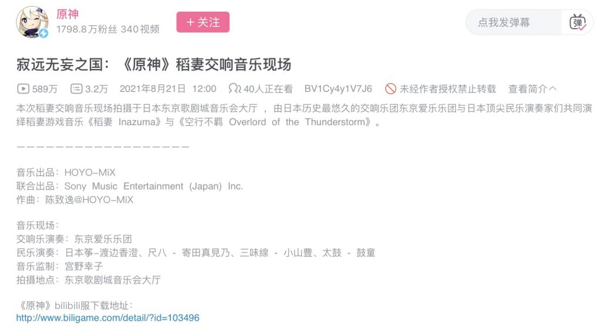
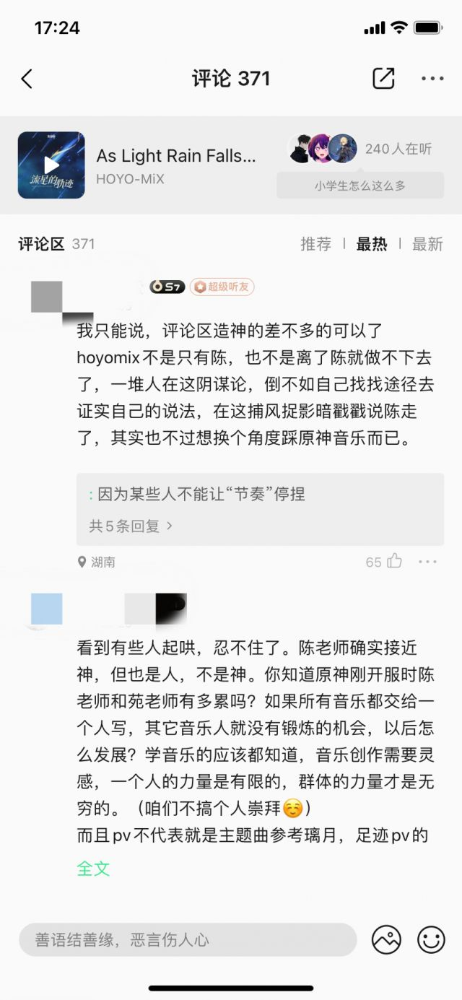

### [不吐不快]各国音乐现场

Made by ngapost2md (c) ludoux [GitHub Repo](https://github.com/ludoux/ngapost2md)

----

##### 0.[0] \<pid:0\> 2023-08-05 12:18:16 by RiNSliiUH
枫丹是谁作曲呢

----

##### 1.[0] \<pid:707094078\> 2023-08-05 12:23:56 by 居居白
首先排除陈老师

扫了一眼3.0大版本后期都没有陈老师名字了，应该换人了

----

##### 2.[0] \<pid:707096052\> 2023-08-05 12:35:39 by 本次我们想你啊
看来确实是走了，不然没理由改格式。

----

##### 3.[0] \<pid:707096210\> 2023-08-05 12:36:39 by 青春派洛笛
走了好，那就没啥可留恋的了

----

##### 4.[0] \<pid:707096437\> 2023-08-05 12:37:56 by TachibanaClover
陈老师都走了，没有熟悉的dalao那就和蜀国末期差不多了

----

##### 5.[0] \<pid:707096521\> 2023-08-05 12:38:21 by 贺一猫二世
我宁愿相信是陈老师离职
否则反过证明连陈老师也拉了
这不可能

----

##### 6.[1] \<pid:707096611\> 2023-08-05 12:38:53 by 溺水莲
有股欲盖弥彰的美，建议给社区管理员同步更新一下话术嗷。

----

##### 7.[0] \<pid:707096696\> 2023-08-05 12:39:30 by 咖峠
这已经是明示了吧，如果人家没走，为什么不写出来？多好的吸引人气的机会

如果你说陈老师只是这次没参与，笑话一个国家最重要的几首曲子的录制不参与，制作组犯什么病呢？

----

##### 8.[1] \<pid:707097457\> 2023-08-05 12:44:00 by 在家模块
陈老师走的小道消息已经传好久了，米家的社区管理员不可能探测不到。明明是辟谣打脸稳定民心的大好机会，格式却改了，怎么回事呢？

----

##### 9.[1] \<pid:707097678\> 2023-08-05 12:45:19 by ayainchaos
陈致逸b站最后一次动态是22年4月稻妻dlc的OST
以前都是一俩月一个动态，还和网友互动的
这是怎么回事呢

从时间上来看那个时候应该是须弥的雨林做的差不多了，那句“还没退休呢”以前大家觉得是定心丸，现在看来……

----

##### 10.[0] \<pid:707098354\> 2023-08-05 12:49:03 by abbccdkani
唉

----

##### 11.[0] \<pid:707098729\> 2023-08-05 12:51:17 by 老虎二世
陈致逸从来就不是米哈游的员工，是独立的音乐人，之前都是以合作的形式参与原神音乐创作的吧

从之前的几张OST开始就已经没有他直接的挂名了

----

##### 12.[0] \<pid:707099259\> 2023-08-05 12:54:15 by YVANLAU
如果是真的，那恭喜大佬脱离苦海，去其他初心健在的厂商输送血液吧，那才是zg游戏所需要的

----

##### 13.[0] \<pid:707099374\> 2023-08-05 12:54:48 by 梅花鹿嘉宾
>[jump](#pid707097678) ayainchaos(2023-08-05 12:45)说:
>陈致逸b站最后一次动态是22年4月稻妻dlc的OST 以前都是一俩月一个动态，还和网友互动的 这是怎么回事呢[s:ac:哭笑]  从时间上来看那个时候应该是须弥的雨林做的差不多了，那句“还没退休呢”以前大家觉得是定心丸，现在看来……

[quote]PS:还没退休呢233！继续创作去了～[/quote]指以后看不到我也不用慌，确实还在写曲子，只不过我可没说写的是原神的

----

##### 14.[0] \<pid:707099959\> 2023-08-05 12:58:19 by ayainchaos
>[jump](#pid707098729) 老虎二世(2023-08-05 12:51) 说: 
>
>陈致逸从来就不是米哈游的员工，是独立的音乐人，之前都是以合作的形式参与原神音乐创作的吧
>
>从之前的几张OST开始就已经没有他直接的挂名了

蒙德璃月稻妻1是联合署名，后面从稻妻2开始专辑就是只有hoyomix署名了，只有曲目里的作曲编曲署个人名，专辑也不发自己账号了，那个时候开始应该就是入职了
最坏的情况就是那之后的曲目全部是职务作品

----

##### 15.[0] \<pid:707109983\> 2023-08-05 13:57:50 by Germanuim
>[jump](#pid707099959) ayainchaos(2023-08-05 12:58) 说: 
>
>蒙德璃月稻妻1是联合署名，后面从稻妻2开始专辑就是只有hoyomix署名了，只有曲目里的作曲编曲署个人名，专辑也不发自己账号了，那个时候开始应该就是入职了
>最坏的情况就是那之后的曲目全部是职务作品

会不会是干脆不管社交账号了如果离职了应该会把hoyomix的后缀改掉吧

----

##### 16.[0] \<pid:707114795\> 2023-08-05 14:27:38 by qqqqqzzzz
米值得吹嘘的资本又少了一笔呀，这是好事

----

##### 17.[0] \<pid:707117602\> 2023-08-05 14:46:17 by Chx24
咋说呢，散兵那boss曲是陈老师亲自唱的，结果看看后面这角色怎么塑造的，这不是膈应人家么。

打个比方，要是云堇是个战犯雌小鬼，京剧大佬肯来唱么。

想走也正常，这根本就不尊重人了。

----

##### 18.[0] \<pid:707120666\> 2023-08-05 15:06:32 by 樗栋材
&amp;#8194;桓宣武征蜀，犹见诸葛亮时小吏，年百余岁。桓问：“诸葛丞相今谁与比？”意颇欲自矜。答曰：“葛公在时，亦不觉异，自葛公殁后，正不见其比。”

----

##### 19.[0] \<pid:707132421\> 2023-08-05 16:23:29 by hx0539
应该已经离职了？不然没道理不署名啊走了好，老米现在一团糟，优秀的音乐制作人不应该蜷缩在这么一个小家子气的公司

----

##### 20.[0] \<pid:707142336\> 2023-08-05 17:22:57 by 不淡定の文
>[jump](#pid707117602) Chx24(2023-08-05 14:46) 说: 
>
>咋说呢，散兵那boss曲是陈老师亲自唱的，结果看看后面这角色怎么塑造的，这不是膈应人家么。
>
>打个比方，要是云堇是个战犯雌小鬼，京剧大佬肯来唱么。
>
>想走也正常，这根本就不尊重人了。

陈老师一个音乐家对于角色的理解和塑造都比那垃圾文案要好得多。之前在b站听多个大佬分析，散兵的周本曲表达的是散兵三次追逐梦想，每一次都快要成功的那一刻却每一次都突然间遭受巨大打击而落败，完全是一个屡次追梦屡次失败者的形象，怎么也比文案那莫名其妙的“三次背叛”更令人尊重和同情，而b站那群孝子每次看人家音乐大佬分析到此处时总是搁那刷“三次背叛”，它那狗屁“三次背叛”也配和陈老师的音乐碰瓷？

----

##### 21.[1] \<pid:707143117\> 2023-08-05 17:27:28 by piepiero
qq音乐下打成一片结晶一边说米黑造谣陈走了，一边踩头陈在搞饭圈原神并不是非他不可
那看来多半走了

----

##### 22.[0] \<pid:707144021\> 2023-08-05 17:32:51 by Khris2456
>[jump](#pid707143117) piepiero(2023-08-05 17:27)说:
>qq音乐下打成一片[s:ac:哭笑]结晶一边说米黑造谣陈走了，一边踩头陈在搞饭圈原神并不是非他不可 那看来多半走了 [img]https://img.nga.178.com/attachments/mon_202308/05/l2Q2s-2odzZbT1kShs-12h.jpg.medium.jpg[/img]

这个音乐看群体的真的笑死了
学院派音乐本质就是菁英主义和头部效应
你以为百花齐放，实际上每朵花下面都堆满了无数的尸体，和无数个供养尸体的冤种家庭  

以為人家是為了你那小家子飯圈心態才崇拜的啊？

----

##### 23.[0] \<pid:707151157\> 2023-08-05 18:13:45 by godmaybe
>[jump](#pid707143117) piepiero(2023-08-05 17:27) 说: 
>
>qq音乐下打成一片结晶一边说米黑造谣陈走了，一边踩头陈在搞饭圈原神并不是非他不可
>那看来多半走了
>

就这种任何事情都能找一个角度立体防御的，不是官方串子就是真的偶像粉吧

----

##### 24.[0] \<pid:707171661\> 2023-08-05 20:01:40 by 雨中飞雪
所以相当于实锤陈已经走了吗……
我之前真的很喜欢音乐还是很期待的…

