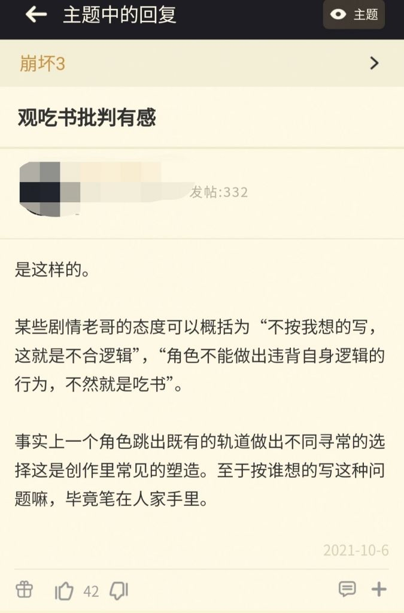

### [热点事件][不吐不快]感觉足迹pv里的设计真的变了

Made by ngapost2md (c) ludoux [GitHub Repo](https://github.com/ludoux/ngapost2md)

----

##### 0.[4] \<pid:0\> 2023-08-05 12:49:40 by 蛋黄的长裙
足迹七国代表角色，也就枫丹是双子吧？不仅是双子，还是哥哥拉着妹妹这种互动动作，大家往双子卡上猜很容易吧？我感觉足迹就是想做个双子卡的，前面还有崩三彼岸双生这种例子。
结果你现在告诉我这俩卡单卖，好吧结果还一五一四，那么枫丹放这个双子卡什么意义？你说就是因为兄妹放在一起，那为啥不把绫华旁放个绫人？结果这俩实锤兄妹了，又出了个他们弟弟的四星卡？那他俩之间的羁绊是什么？为啥不兄妹三人一起放足迹里？除了临时改策略我想不出别的原因，就这样吧

----

##### 1.[2] \<pid:707098954\> 2023-08-05 12:52:29 by YVANLAU
不把你旧团队设计的东西搞坏搞砸，怎么能让我们新团队设计东西看起来脱颖而出呢，换代跟着要换血

----

##### 2.[1] \<pid:707100644\> 2023-08-05 13:02:22 by 予晞
不是，赛诺出来的时候你居然觉得没变吗

----

##### 3.[1] \<pid:707101145\> 2023-08-05 13:05:18 by Collapsar。
璃月入坑原，足迹赛诺一眼荡魂，是我整个原神生涯最期待的一个角色
角色立绘出来的那一刻，就知道，碎掉了……

----

##### 4.[2] \<pid:707101310\> 2023-08-05 13:06:16 by 记得关灯
自作多情警告，笔在人家手上警告

----

##### 5.[1] \<pid:707101693\> 2023-08-05 13:08:25 by 在家模块
关于吃书，猛干大仙早有高论

----

##### 6.[0] \<pid:707101882\> 2023-08-05 13:09:31 by moseyuyan
难绷，翻公子立绘时候误触听到了前面的语音。
林尼：我亲爱的妹妹琳妮特现在在做什么呢，肯定想我想得不得了吧
琳妮特：林尼好像又在说奇怪的话了，真让人放心不下
菲米尼：……想去无人的海底

----

##### 7.[0] \<pid:707102054\> 2023-08-05 13:10:23 by commodore1280
参考兽娘动物园2，就是要有所颠覆捏

----

##### 8.[0] \<pid:707102101\> 2023-08-05 13:10:37 by 哒哒块
赛博返乡团，全给你掀了

----

##### 9.[0] \<pid:707102141\> 2023-08-05 13:10:54 by 用户名未命名用户
>[jump](#pid707101882) moseyuyan(2023-08-05 13:09) 说: 
>
>难绷，翻公子立绘时候误触听到了前面的语音。
>林尼：我亲爱的妹妹琳妮特现在在做什么呢，肯定想我想得不得了吧
>琳妮特：林尼好像又在说奇怪的话了，真让人放心不下
>菲米尼：……想去无人的海底

去掉菲米尼也没差

----

##### 10.[1] \<pid:707106646\> 2023-08-05 13:37:47 by 阿缇蜜斯
两年前我还以为它俩是元歌……结果可能不敢抄，这下tx打压了

----

##### 11.[0] \<pid:707109491\> 2023-08-05 13:54:54 by cclean
一朝天子一朝臣呐

----

##### 12.[0] \<pid:707112305\> 2023-08-05 14:11:55 by 芥子禹
为了凑娼年兄弟，可不就得拆了原来的兄妹吗
妹妹现在看还有可能是机器人，真是倒大霉了，和被夺舍身份的博人一样痛了

----

##### 13.[1] \<pid:707118223\> 2023-08-05 14:50:21 by 柏Cheung
绫人？看过绫华旧设就知道绫人是绫华拆出来的足迹那会还没有绫人这个人呢

----

##### 14.[0] \<pid:707119878\> 2023-08-05 15:01:18 by 蛋黄的长裙
>[jump](#pid707118223) 柏Cheung(2023-08-05 14:50) 说: 
>
>绫人？看过绫华旧设就知道绫人是绫华拆出来的足迹那会还没有绫人这个人呢

我到没觉得这个怎么样，明眼人能看出来绫人设计完还给主线填坑只不过就是双子立绘原本1+1，公布立绘发现是买一送一，再一看居然是买一送二太难崩了

----

##### 15.[0] \<pid:707120856\> 2023-08-05 15:07:57 by abasiyaluo2
>[jump](#pid707118223) 柏Cheung(2023-08-05 14:50)说:
>绫人？看过绫华旧设就知道绫人是绫华拆出来的[s:ac:哭笑]足迹那会还没有绫人这个人呢[s:ac:哭笑]

绫人拆得还行吧，至少性格和设计都比较正常，绫华去掉了腹黑属性，变成ml大小姐，现在看来对她的塑造也不是坏事

----

##### 16.[2] \<pid:707123073\> 2023-08-05 15:22:19 by 天星之愿
我曾经还幻想过林尼和琳妮特会是一张卡，技能是互相切换，那多有趣啊，结果是这样

----

##### 17.[0] \<pid:707124027\> 2023-08-05 15:28:45 by 一片平凡的全麦面包
>[jump](#pid707101882) moseyuyan(2023-08-05 13:09) 说: 
>
>难绷，翻公子立绘时候误触听到了前面的语音。
>林尼：我亲爱的妹妹琳妮特现在在做什么呢，肯定想我想得不得了吧
>琳妮特：林尼好像又在说奇怪的话了，真让人放心不下
>菲米尼：……想去无人的海底

我不该在这里，我该在海底

----

##### 18.[0] \<pid:707137150\> 2023-08-05 16:53:12 by 雲玩家かみかぜ
懂不懂破旧立新

----

##### 19.[0] \<pid:707213934\> 2023-08-05 23:48:50 by 柏Cheung
>[jump](#pid707120856) abasiyaluo2(2023-08-05 15:07) 说: 
>
>绫人拆得还行吧，至少性格和设计都比较正常，绫华去掉了腹黑属性，变成ml大小姐，现在看来对她的塑造也不是坏事

陈述事实而已主要是想表达足迹意义已经不大了

----

##### 20.[1] \<pid:707214274\> 2023-08-05 23:51:19 by miliao_d
就是变了啊，你敢相信漫画和足迹pv里的赛诺是现在这个不断重复冷笑话的人设？
当时在幽夜说这个，还要被赛解堵嘴

----

##### 21.[1] \<pid:707214320\> 2023-08-05 23:51:36 by 盒马生鲜鲜
足迹赛诺和立绘赛诺完全是两个水平的作品，立绘出来我大跌眼镜

