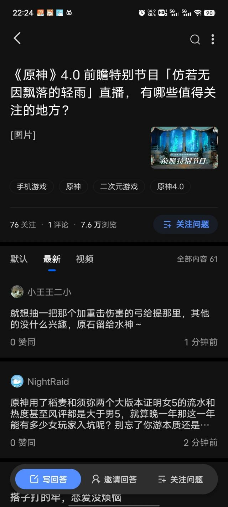

### [不吐不快]虽然我不想往最坏的方面想，但是陈老师这次确实没署名

Made by ngapost2md (c) ludoux [GitHub Repo](https://github.com/ludoux/ngapost2md)

----

##### 0.[0] \<pid:0\> 2023-08-05 12:49:58 by KIMIGGA

如果陈老师真离开了，那我也差不多应该离开了吧

----

##### 1.[2] \<pid:707098870\> 2023-08-05 12:52:05 by 追加记忆
这不是好事？陈老师这种水平耗在这个公司干什么

----

##### 2.[3] \<pid:707099031\> 2023-08-05 12:52:52 by KIMIGGA
>[jump](#pid707098870) 追加记忆(2023-08-05 12:52) 说: 
>
>这不是好事？陈老师这种水平耗在这个公司干什么

是好事啊，就是有感而发一下

反转了，这事儿很重要吗？只有像我这样的音乐爱好者觉得重要吧

----

##### 3.[0] \<pid:707099314\> 2023-08-05 12:54:30 by 可恶，长个锤子
这难道不是最好的事吗和这帮虫豸在一起怎么能做好音乐呢，散兵周本那个牛逼的音乐给了这么一战犯面首我都觉得暴殄天物，陈老师真的能接受吗

----

##### 4.[5] \<pid:707099382\> 2023-08-05 12:54:52 by bug失去联系
我记得前几个月听到这个消息的时候，爆料者给出的理由是受不了米哈游的内部氛围，现在想来真是理由充分

----

##### 5.[0] \<pid:707099960\> 2023-08-05 12:58:19 by KIMIGGA
>[jump](#pid707099382) bug失去联系(2023-08-05 12:54) 说: 
>
>我记得前几个月听到这个消息的时候，爆料者给出的理由是受不了米哈游的内部氛围，现在想来真是理由充分

还真是，支持陈老师音乐事业再创辉煌

----

##### 6.[0] \<pid:707115042\> 2023-08-05 14:29:24 by 云间居雁中
这次音乐真的很差

----

##### 7.[1] \<pid:707115497\> 2023-08-05 14:32:13 by 未始有物
截至现在23个回答的糊逼题上榜了，这是何意啊

----

##### 8.[0] \<pid:707115587\> 2023-08-05 14:32:48 by 怎样才能不被禁言1
微博上有人说陈老师想当独立音乐人的，要是真走了也好，希望不久之后能有老师的新消息

----

##### 9.[1] \<pid:707115953\> 2023-08-05 14:35:10 by KIMIGGA
>[jump](#pid707115497) 未始有物(2023-08-05 14:32) 说: 
>
>截至现在23个回答的糊逼题上榜了，这是何意啊
>

米乎日常呢，昨天61回答的直接热榜第五

----

##### 10.[0] \<pid:707116130\> 2023-08-05 14:36:17 by 山薄荷雪
要是连和他们项目组相对独立的hoyomix都受不了“内部氛围”
那内部的氛围真是可想而知

----

##### 11.[1] \<pid:707116183\> 2023-08-05 14:36:42 by 秘密首领
最坏？最好！

----

##### 12.[1] \<pid:707116377\> 2023-08-05 14:37:57 by aidtory
>[jump](#pid707116130) 山薄荷雪(2023-08-05 14:36)说:
>[s:ac:哭笑]要是连和他们项目组相对独立的hoyomix都受不了“内部氛围” 那内部的氛围真是可想而知

一家人活不出两家话，说到底都是米哈游内部的，一定会相互影响

----

##### 13.[0] \<pid:707117147\> 2023-08-05 14:43:08 by 普鲁士蓝蓝蓝
换我是陈用尽心血创作了须弥音乐，亲自唱了周本音乐之后知道周本音乐给了个这种垃圾玩意儿估计得当场气死

----

##### 14.[0] \<pid:707117219\> 2023-08-05 14:43:38 by 这游戏真给我整沉默了
说真的我现在非常非常好奇米哈游内部氛围得成一个什么味
~~总不能真的是成年厕味大合集吧~~

----

##### 15.[0] \<pid:707118212\> 2023-08-05 14:50:17 by 山薄荷雪
突然幻视看见这贴的猛干“音乐重要吗，你这样的音乐厨才觉得陈致逸重要吧”
“音乐能让玩家尖叫抓挠吗”

我只想说陈老师快跑吧

----

##### 16.[0] \<pid:707118532\> 2023-08-05 14:52:29 by 眼中血
这下能吹的点又少了一个

----

##### 17.[0] \<pid:707118617\> 2023-08-05 14:53:00 by 灵芝是个快乐的小蘑菇
某不可靠来源说，我推被某个落地抽满命的内部人员爱过，可惜他走了。这样看……

----

##### 18.[0] \<pid:707120143\> 2023-08-05 15:02:57 by 白浪梅
祝真正的创作者和艺术家远走高飞

----

##### 19.[0] \<pid:707121456\> 2023-08-05 15:11:51 by ayainchaos
>[jump](#pid707118617) 灵芝是个快乐的小蘑菇(2023-08-05 14:53) 说: 
>
>某不可靠来源说，我推被某个落地抽满命的内部人员爱过，可惜他走了。这样看……

老哥私个瓜

----

##### 20.[0] \<pid:707121571\> 2023-08-05 15:12:42 by yummmmmmm
说实话，我是因为音乐入坑的，没玩原神的时候就听过若坨周本音乐，大气磅礴，毕竟视觉和听觉那时候确实冲击到我的感官了，须弥音乐水平依旧在线，其他的带过，现在陈老师都走了，有点惘然。

----

##### 21.[0] \<pid:707122887\> 2023-08-05 15:21:00 by 灵芝是个快乐的小蘑菇
>[jump](#pid707121456) ayainchaos(2023-08-05 15:11):

算了，微博那真假参杂的，也有可能是有人根据现在的情况编的料。我给你私个名字，你当乐子看吧。

----

##### 22.[0] \<pid:707123951\> 2023-08-05 15:28:11 by 淡淡星光i
贴吧一月就有说润了，不知道是不是真的

----

##### 23.[0] \<pid:707124702\> 2023-08-05 15:33:20 by 江海寄余生ξ
坏了，这下音乐美工都没法吹了

----

##### 24.[0] \<pid:707124911\> 2023-08-05 15:34:43 by 花夹饼
散兵周本那首我加到歌单里了，每次听到都在想陈老师写这首歌的时候知道散兵会是这个剧情吗，歌词对被背叛啥的的描写很多，他知道这个被背叛居然是这样被背叛的吗，不知道的话他现在看到这个剧情得咋想啊
现在看到他走了有种“啊果然”的感觉，毕竟谁都不想付出心血写的音乐被这样背刺吧，从交响与日本乐器的融合到古日语和拉丁文的歌词再到陈老师亲自上场的演唱，这么用心的歌最后给到了这样一个小丑角色，想想就感到痛心

----

##### 25.[0] \<pid:707126200\> 2023-08-05 15:42:58 by 谦谦谦3
>[jump](#pid707118617) 灵芝是个快乐的小蘑菇(2023-08-05 14:53) 说: 
>
>某不可靠来源说，我推被某个落地抽满命的内部人员爱过，可惜他走了。这样看……

你推是？

