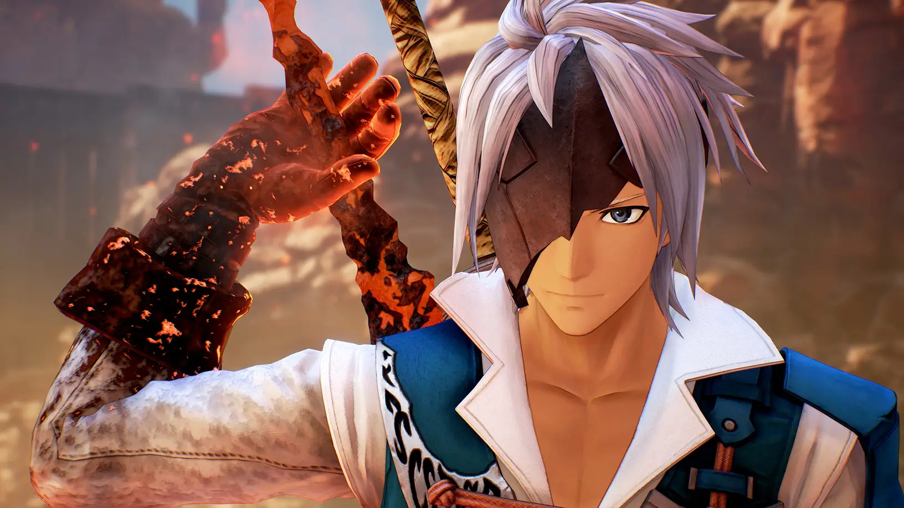
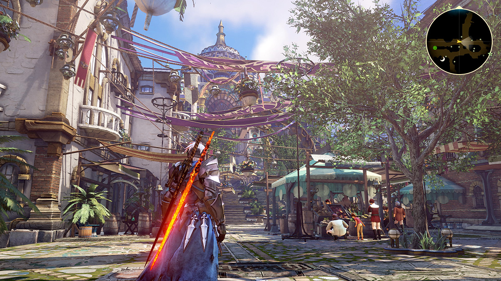
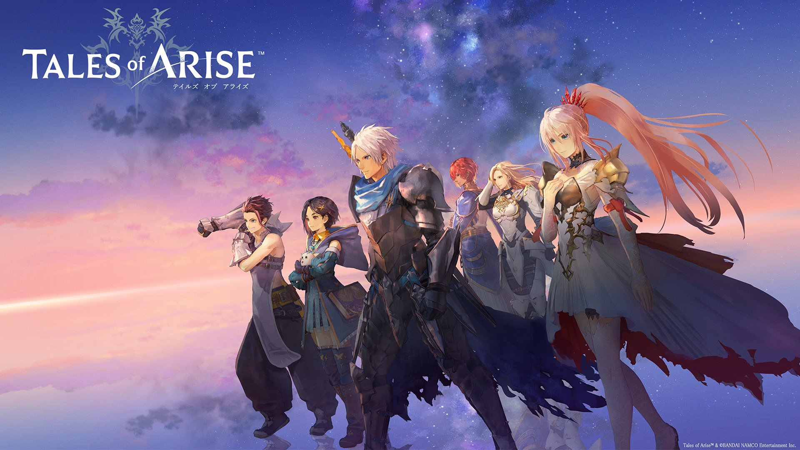

### [不吐不快]说到二次元建模就不得不提这部作品

Made by ngapost2md (c) ludoux [GitHub Repo](https://github.com/ludoux/ngapost2md)

----

##### 0.[2] \<pid:0\> 2023-08-05 12:58:06 by 舟端F91
21年发售，传说系列迄今为止的最新作，除了小剧场和画面美术以外基本上都挺拉的但玩起来其实也没有很亏的《破晓传说》！

说实在的本作男主奥尔芬有够帅的，当然主角团全员的颜值都很高就是。

----

##### 1.[3] \<pid:707100140\> 2023-08-05 12:59:26 by heavenscar
当时都喷这游戏的剧情来着，这是不是也是一种回旋镖…

----

##### 2.[3] \<pid:707100158\> 2023-08-05 12:59:31 by erikcww
这作问题就是后期剧情太蠢了，而且虎头蛇尾，op2开始还以为还有半部，结果草草结束了

----

##### 3.[0] \<pid:707100416\> 2023-08-05 13:01:01 by MuizZ
女主那个泳装是真的好看拉出来跑图看着贼爽

----

##### 4.[0] \<pid:707100537\> 2023-08-05 13:01:43 by 雨源rainsource
没玩过，从鹅卵石那里听说过

----

##### 5.[0] \<pid:707100696\> 2023-08-05 13:02:37 by 舟端F91
>[jump](#pid707100140) heavenscar(2023-08-05 12:59)说:
>当时都喷这游戏的剧情来着，这是不是也是一种回旋镖…

剧情问题主要出在后半部分，明明做出了很好的连段设计但奇蠢无比的boss霸体就感觉纯粹是代便摆烂了
等等，剧情问题随着进度而凸显，越发摆烂的怪物设计……

----

##### 6.[0] \<pid:707102077\> 2023-08-05 13:10:29 by RorJchach
后期剧情莫名其妙
但希侬真好看啊

----

##### 7.[0] \<pid:707102892\> 2023-08-05 13:15:12 by god。like
破晓剧情问题当时被都被车烂了都
因为对比前作狂战传说真的相形见绌。
我还是先推荐玩狂战传说，剧情演出是真的好。就是场景建模差强人意。
女主贝姐的人设塑造够mhy学一辈子。

----

##### 8.[0] \<pid:707103104\> 2023-08-05 13:16:37 by 舟端F91
>[jump](#pid707102892) god。like(2023-08-05 13:15)说:
>破晓剧情问题当时被都被车烂了都[s:ac:哭笑] 因为对比前作狂战传说真的相形见绌。 我还是先推荐玩狂战传说，剧情演出是真的好。就是场景建模差强人意。 女主贝姐的人设塑造够mhy学一辈子。

那么情热……

----

##### 9.[0] \<pid:707103820\> 2023-08-05 13:20:52 by ayayayo
剧情一拖答辩反正玩一半我玩不下去了，不如多玩一遍狂战

----

##### 10.[0] \<pid:707103908\> 2023-08-05 13:21:22 by scoutqq
就是除了打联动技以外的手感评价为逆水寒级的烂,还有伤害太刮了,完全没有近act游戏的爽感,不过美术真的顶

----

##### 11.[0] \<pid:707104613\> 2023-08-05 13:25:31 by 暗之铃音
>[jump](#pid707103104) 舟端F91(2023-08-05 13:16) 说: 
>
>那么情热……

草神：“对不起，旅行者不是真的仲间”

----

##### 12.[1] \<pid:707105996\> 2023-08-05 13:33:41 by heavenscar
>[jump](#pid707100696) 舟端F91(2023-08-05 13:02) 说: 
>
>剧情问题主要出在后半部分，明明做出了很好的连段设计但奇蠢无比的boss霸体就感觉纯粹是代便摆烂了
>等等，剧情问题随着进度而凸显，越发摆烂的怪物设计……

属于是致敬了
这就是卖梗电商的实力吗

----

##### 13.[0] \<pid:707106273\> 2023-08-05 13:35:25 by c6537
轰霸斩传说

----

##### 14.[0] \<pid:707106405\> 2023-08-05 13:36:14 by 长河月
剧情部分有点沾ntr了 当时玩的有点
当然强行过去之后 我还是吃这对的 猫头鹰小剧场也很甜

----

##### 15.[0] \<pid:707106483\> 2023-08-05 13:36:46 by yoooooov
>[jump](#pid0) 舟端F91(2023-08-05 12:58):

这逼游戏男主太苟八圣人了。煞笔剧情大概是两处，风国和结尾。
但比起原神，我觉得好像这游戏剧情也没这么不堪了。

----

##### 16.[0] \<pid:707106664\> 2023-08-05 13:37:53 by 海崎新太9139
破晓是代哥三渲二最高技术力了，但是游戏角度不如绯红结系乃至噬血代码

----

##### 17.[0] \<pid:707106728\> 2023-08-05 13:38:15 by 谢谢我不喝
我其实也很想说剧情问题
但想了想，O都玩下来了，好像也……

----

##### 18.[0] \<pid:707106806\> 2023-08-05 13:38:38 by 癸敖蔡壬乔邵
这一作主打的就是画质，比起来不太公平，要比得去和xb3比，ns性能可比手机弱多了，但是xb3除了分辨率稳不住以外角色人设，动作，精细度都非常强，尤其是角色的各种动作设计

----

##### 19.[0] \<pid:707107002\> 2023-08-05 13:39:46 by yoooooov
>[jump](#pid707100696) 舟端F91(2023-08-05 13:02) 说: 
>
>剧情问题主要出在后半部分，明明做出了很好的连段设计但奇蠢无比的boss霸体就感觉纯粹是代便摆烂了
>等等，剧情问题随着进度而凸显，越发摆烂的怪物设计……

那个连段斩杀也就打小怪有用，大怪还是要刮，困难难度疯狂嗑药。打boss毫无体验感可言。

----

##### 20.[0] \<pid:707107464\> 2023-08-05 13:42:32 by rr1317
这游戏也有那种让你血压拉满的迷途知返小男孩,当时刚出的时候也车烂了,不过现在看起来还是mhy更胜一筹

----

##### 21.[0] \<pid:707111596\> 2023-08-05 14:07:34 by 丨Sheogorath丨
这位的剧情跟原神3.0半斤八两了但是人设和建模确实爆杀现在的原神

----

##### 22.[0] \<pid:707114631\> 2023-08-05 14:26:37 by 骑空士透也
最后的剧情，男主替所有人原谅突出一个煞笔，我觉得比原有过之而无不及

----

##### 23.[0] \<pid:707115392\> 2023-08-05 14:31:28 by 碓氷
toar除了画面相关的，真的是全方位不如前作tob

----

##### 25.[0] \<pid:707115954\> 2023-08-05 14:35:11 by 凉菲凡
这游戏的建模是一坨大便
别光看截图， 进去玩两下， 女主长发跟胶水糊着的一样
场景材质瞎鸡巴乱搞， 有些地方马赛克有些地方超精细， 整体突出一个违和
渲染更是属于新手， 别的不用多看， 第一章进去的远景， 什么J8， 同是UE引擎的绯红完爆这玩意

这东西拿21年最佳RPG是我20年游戏生涯最匪夷所思的一件事

----

##### 26.[0] \<pid:707116328\> 2023-08-05 14:37:39 by nekopadia
这玩意儿的连携技演出还被原汁原味的抄进了后崩2里，绷

----

##### 27.[0] \<pid:707116626\> 2023-08-05 14:39:35 by 呼姆
说起来 这部的游戏内动画部分也是飞碟社做的

----

##### 28.[0] \<pid:707118552\> 2023-08-05 14:52:34 by 零点，陈彬
>[jump](#pid707115954) 凉菲凡(2023-08-05 14:35) 说: 
>
>这游戏的建模是一坨大便
>别光看截图， 进去玩两下， 女主长发跟胶水糊着的一样
>场景材质瞎鸡巴乱搞， 有些地方马赛克有些地方超精细， 整体突出一个违和
>渲染更是属于新手， 别的不用多看， 第一章进去的远景， 什么J8， 同是UE引擎的绯红完爆这玩意
>
>这东西拿21年最佳RPG是我20年游戏生涯最匪夷所思的一件事

绯红最大的问题大概是ppt演出和矫情的剧情吧这俩说实话剧情都不行

----

##### 29.[0] \<pid:707125261\> 2023-08-05 15:36:57 by 网友述
这个我还没玩，男主老让我幻视农里的夏侯惇

----

##### 30.[0] \<pid:707147789\> 2023-08-05 17:57:07 by 大宇256
可惜这作没即时战斗，每次打怪都得进决斗场

----

##### 31.[0] \<pid:707152127\> 2023-08-05 18:18:45 by 羽衣草
破晓的最大毒点就是让飞碟桌做播片然后钱没给够，整个结局就是被飞碟桌的垃圾播片毁了，也是我玩过的第一部游戏建模比动画好看的jrpg

----

##### 32.[0] \<pid:707153290\> 2023-08-05 18:25:01 by write54
to系列的痛点是需要花钱买

----

##### 33.[0] \<pid:707154811\> 2023-08-05 18:33:42 by 阿来
你们要聊传说我就像推我个人最喜欢的薄暮了

