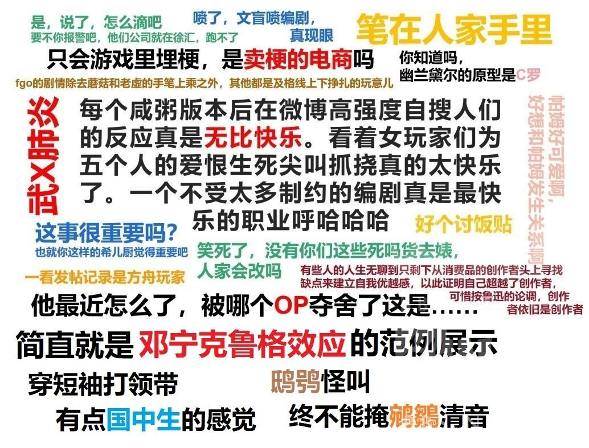

### [不吐不快]米哈游最大的问题是不解决问题

Made by ngapost2md (c) ludoux [GitHub Repo](https://github.com/ludoux/ngapost2md)

----

##### 0.[5] \<pid:0\> 2023-08-05 14:57:21 by 献给美第奇
看到有人提xxx。xxx事件最后的处理方式是什么？一封道歉信上轻飘飘的话语、未来会更好的展望和一些福利。这像极了吵架之后躲进自己的房间生气，对方一句“出来吃饭吧”，这件事就算一笔揭过，大家默契地不再提起，饭桌上依然一片欢乐。所以既然崩坏三项目组发了道歉信，xxx成了它的禁词，那大家就当作无事发生吧，以后也不要再揭开伤疤。
而今原神也出问题了：原神的世界观废了。修改历史，包庇罪人，纯真与权谋。这些内容把来自世界外的力量塞进了提瓦特，剧情靠提瓦特本身已经无法自圆其说，于是玩家的注意力被迫从台前转移到幕后：只要编剧有想法，那一切故事剧情世界观乃至其他角色都要为一个角色让路。那投入到这个世界上其他角色的感情怎么办？大家都在等待版本结束后的回答。回答是什么呢？
<b>没有回应，翻篇了。</b>
没有重置剧情，没有编剧负责，没有处理办法，什么都没有。
好像米哈游对还在屋子里生闷气的玩家说“出来吃饭吧”，大家都不要再提起须弥的一切，佯作无事发生，继续提瓦特的旅途。
我不知道米哈游在想什么，我只知道我的月卡还有15天。
刚才发主版被锁了，里版应该没事吧。

----

##### 1.[0] \<pid:707119465\> 2023-08-05 14:58:42 by rcimg
不仅不解决问题，它还喜欢制造问题，更喜欢把问题当特色

----

##### 2.[0] \<pid:707119480\> 2023-08-05 14:58:47 by 未始有物
米一直就是靠下一个大的吸引了多一个数量级的新韭菜保持以前的破事像是无事发生一样，但这套路可能确实到头了，梦里去比原神玩家还大一个数量级的群体

----

##### 3.[0] \<pid:707119952\> 2023-08-05 15:01:45 by 洪炉一点雪
不要尬黑，怎么没解决？那么多mxz帮忙清除提出问题的人，不是也解决了吗。高贵的mhy游戏岂是黑子能左右的。

----

##### 4.[2] \<pid:707120122\> 2023-08-05 15:02:51 by lingwzhui
解决不了问题，就把有问题的玩家解决了

----

##### 5.[0] \<pid:707120405\> 2023-08-05 15:04:44 by 山薄荷雪
趁着疫情，原这波早就赚够了，后续尾大不掉不如筛选玩家，满命的钱早够支付多少个游戏了，现在被熏走了mhy也不赔本
又或者没有上市，没有压力，有钱肆意妄为，恶心天天挑错儿的玩家也是一种人家公司的高端乐趣，李猛干不就这样吗

----

##### 6.[0] \<pid:707120563\> 2023-08-05 15:05:50 by Laeditil
除了不解决问题，还要把问题做成梗自己玩，或者对不接受问题存在的人文案里一顿阴阳

----

##### 7.[0] \<pid:707120688\> 2023-08-05 15:06:46 by vhbjnm
还是解决提出问题的玩家比较简单

----

##### 8.[0] \<pid:707120841\> 2023-08-05 15:07:53 by kenso999
唱个反调，某些版本里的某些问题，真的不需要解决，确实就是过去就过去了，翻篇了，矛盾的爆发是因为连续多个版本整体质量的下降，如果质量保持在一定水准之上，你说的问题最终就是历史中的一个小插曲

----

##### 9.[3] \<pid:707121119\> 2023-08-05 15:09:46 by 献给美第奇
>[jump](#pid707120841) kenso999(2023-08-05 15:07) 说: 
>
>唱个反调，某些版本里的某些问题，真的不需要解决，确实就是过去就过去了，翻篇了，矛盾的爆发是因为连续多个版本整体质量的下降，如果质量保持在一定水准之上，你说的问题最终就是历史中的一个小插曲

你觉得现在这样子是矛盾爆发了吗？只是山雨欲来而已

----

##### 10.[0] \<pid:707122734\> 2023-08-05 15:20:09 by Collapsar。
有没有一种可能，你们错把mhy当成一个游戏公司了？

游戏公司肯定要做游戏，哪怕为钱整了烂活，但游戏本体终归是卖钱的产品，怎么都会缝缝补补装一装好卖相

而mhy不一样，他可能是个诈骗公司。

那些诈骗短信，会刻意搞一点错别字，弱智的漏洞等，其目的就是为了筛选用户。
不傻的难骗，不费这个劲。

你看mhy是不是就这个路子？

所以别的游戏犯贱，挨骂，滑跪，优化，继续犯贱，循环往复
而mhy训狗一样训用户，用户要什么不给什么，玩家骂什么故意实装什么，awwbwg，以此筛出最孝顺虔诚的ATM机

你们这些带脑子，看剧情，对质量有要求，不容易被洗脑的人，压根不是mhy要的客户
是他awwbwg里让你赶紧滚的用户

是你们擅自期待擅自破防，怒骂mhy不解决问题
实际上人家压根不想做游戏，只想骗傻子钱，钱都顺利骗到手了，它有什么问题？

mhy的核心技术是畜牧业，国内游戏厂商无人能比

----

##### 11.[0] \<pid:707123418\> 2023-08-05 15:24:34 by Seebird
>[jump](#pid707120841) kenso999(2023-08-05 15:07) 说: 
>
>唱个反调，某些版本里的某些问题，真的不需要解决，确实就是过去就过去了，翻篇了，矛盾的爆发是因为连续多个版本整体质量的下降，如果质量保持在一定水准之上，你说的问题最终就是历史中的一个小插曲  
>本质就是?里有些巧克力，还是巧克力里有些?的问题，x山里你永远清不干净?，把你最在意的几坨清掉，无济于事

翻个屁，就sb3.3-3.6这种突破底线的shi，他不给搞一个干净，这游戏永远都是臭的，还是说换到枫丹米就能在现实发动岁月史树把人脑子洗了

----

##### 12.[0] \<pid:707123821\> 2023-08-05 15:27:24 by bzbjzj
实话实说，已经等了几个月了，我一直在观察米是否存在不愿沾染尘土的傲慢，星铁剧情雅利洛文本稍微圈回了一下信心。但心里对米总有点疑虑，结合最近爆出的猛干哥，让我确认了米确确实实存在一种傲慢，米获得了成功已经不需要从虚拟作品中汲取力量，从此与一部分普通玩家产生了巨大的鸿沟。米是一个已经成功了的企业，它希望输出它喜欢的东西。

----

##### 13.[0] \<pid:707124125\> 2023-08-05 15:29:23 by kenso999
>[jump](#pid707123418) Seebird(2023-08-05 15:24)说:
>[quote][pid=707120841,37268007,1]Reply[/pid] <b>Post by [uid=14607624]kenso999[/uid] (2023-08-05 15:07):</b>  唱个反调，某些版本里的某些问题，真的不需要解决，确实就是过去就过去了，翻篇了，矛盾的爆发是因为连续多个版本整体质量的下降，如果质量保持在一定水准之上，你说的问题最终就是历史中的一个小插曲   本质就是?里有些巧克力，还是巧克力里有些?的问题，x山里你永远清不干净?，把你最在意的几坨清掉，无济于事[/quote]翻个屁，就sb3.3-3.6这种突破底线的shi，他不给搞一个干净，这游戏永远都是臭的，还是说换到枫丹米就能在现实发动岁月史树把人脑子洗了[s:ac:偷笑]

现代很多事情，感受既世界，对个人小圈子里来说天大的事，对大圈子里来说微不足道，就像某油罢氪事件，当月流水反而涨了一样，很普遍的一个现象。对错的评价也只在相对的价值观中成立

----

##### 14.[0] \<pid:707136975\> 2023-08-05 16:52:11 by 雲玩家かみかぜ

----

##### 15.[0] \<pid:707137093\> 2023-08-05 16:52:53 by 野猫布鲁斯
不解决问题？不觉得有问题！

----

##### 16.[0] \<pid:707137680\> 2023-08-05 16:56:28 by 摆烂的鱼鱼
解决问题了怎么分化提纯啊

----

##### 17.[0] \<pid:707138123\> 2023-08-05 16:58:51 by 一念の差
哪里没解决了
()的名字不是光速解决？

----

##### 18.[0] \<pid:707140184\> 2023-08-05 17:10:50 by 白菊 ほたる
>[jump](#pid707123418) Seebird(2023-08-05 15:24) 说: 
>
>翻个屁，就sb3.3-3.6这种突破底线的shi，他不给搞一个干净，这游戏永远都是臭的，还是说换到枫丹米就能在现实发动岁月史树把人脑子洗了

可以的，因为不满意的人已经走了，历史留下来的，也只会被新地图吸引来或者吸引回来的人当成异类不断清洗排除，最终又一尘不染，曾经反对的人被编纂成小丑成为后来者嘴里的笑话，然后周而复始，这不就是米哈游最擅长的么

----

##### 19.[0] \<pid:707147878\> 2023-08-05 17:57:39 by 锈河F
讲点实话，我觉得他们是有在解决问题的，不过……结果很难评
稻妻版本的支线剧情塑造的npc有血有肉的，评价比主线的角色剧情好的多，当时经常会听到“支线这不是会写吗？还不如多来点npc剧情”。然后须弥的剧情着墨npc就更多了，还动不动就死几个，赚的一片“太刀了”
稻妻的容彩祭好评多，须弥的中后版本活动就都是这种跨国团建合家欢，看麻了属于是
这两都是形成了路径依赖，知其好不知其所以好
稻妻就有在车奇想的配导和配音不行，须弥听说也换了，结果是从一开始的声音虚到刚发布的PV，更不行了
更无语的是那个配队界面优化……虽然我们不取消进度条但是我们让他更好看了呀
你看我们都这么努力了你就少吐点黑泥多氪点吧

----

##### 20.[0] \<pid:707148628\> 2023-08-05 18:01:29 by Seebird
>[jump](#pid707140184) 白菊 ほたる(2023-08-05 17:10) 说: 
>
>可以的，因为不满意的人已经走了，历史留下来的，也只会被新地图吸引来或者吸引回来的人当成异类不断清洗排除，最终又一尘不染，曾经反对的人被编纂成小丑成为后来者嘴里的笑话，然后周而复始，这不就是米哈游最擅长的么

确实擅长，我只能从我做起，我的小孩也是，他/她成年以前唯一不能碰不能氪的，就是这个mhy的游戏

----

##### 21.[0] \<pid:707152171\> 2023-08-05 18:18:59 by rds5217
不解决问题还解决提出问题的人

