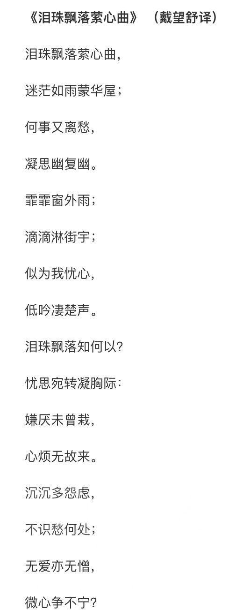

### [不吐不快][搬运]前瞻标题的可能内涵

Made by ngapost2md (c) ludoux [GitHub Repo](https://github.com/ludoux/ngapost2md)

----

##### 0.[2] \<pid:0\> 2023-08-05 16:21:08 by 扶光む
“仿若无因飘落的轻雨”，这个版本名字可能化用自法国象征主义诗人保罗·魏尔伦(Paul Verlain)所写的诗《泪落心中》。 
其中“城中轻雨飘落”(Il pleut doucement…)、“犹如城中雨落”(Comme il pleut…)和“泪落无因”(Il pleure sans raison)是原神4.0版本名“仿若无因飘落的轻雨”可能的来源。
是什么“仿若”轻雨飘落呢？“泪落心中”(Il pleure dans mon c?ur)。这里法语原文“泪落”(pleure)也与“雨落”(pleut)谐音，二者在这里巧妙相通。
作者魏尔伦是一位双性恋者，这首诗正是写作于他刚离开其同性恋情人阿蒂尔·兰波(Arthur Rimbaud)，且仍与妻子分居的时候。(可以看电影《心之全蚀》)诗歌表达的是他当时的伤感情绪，引用并续写兰波写的“城中轻雨飘落”，将城中的轻雨和自己心中的落泪相比，诉说这种哀伤的“无因”。
但是这种“无因”实际上是主观的，他同时深爱着一位异性与一位同性，他自认为他没有背叛任何人，却又同时遭到两个人的冷落，这便是他所认为的“无因”。
枫丹版本主题不好代入这个诗的背景，但多少可能是以“景”来比喻“情”，看似“无因”的雨可能暗喻着实际有因的“情”。 
?来源原神动态评论区

作品跟私德是要分开没错，出名的大文豪也挺多私生活混乱，但是连这种诗都用，魏尔伦爬

----

##### 1.[0] \<pid:707134660\> 2023-08-05 16:37:40 by ayainchaos
“还挺有文学性的”

----

##### 2.[0] \<pid:707135117\> 2023-08-05 16:40:33 by 吸水恶魔
他自认没有背叛任何人

这句话放太子身上是不是也很合适

----

##### 3.[0] \<pid:707135147\> 2023-08-05 16:40:42 by 蛋黄的长裙
得了一种看到主楼典故由来就瞎了的病(叠甲：文学性作品道德层面无所谓，关键讨厌对现实道德问题进行美化的作态)

----

##### 4.[1] \<pid:707135340\> 2023-08-05 16:41:49 by Aritaaa
他们文案平时都在看什么啊
我以前对这种没什么意见各活各的，现在我踏马真的要被米哈游整崆峒了

----

##### 5.[0] \<pid:707135609\> 2023-08-05 16:43:41 by 哒哒块
删过一帖了

明白为啥空降菲米尼了吧

----

##### 6.[0] \<pid:707135671\> 2023-08-05 16:44:06 by FractureView
想太多了……语松源去找了个知乎er的翻译版本，里面有“轻雨”和“无因”，就认为这诗和标题有关。这个考据本身就有问题。

----

##### 7.[0] \<pid:707135719\> 2023-08-05 16:44:20 by 这游戏真给我整沉默了
连夜再爬三座崆峒山！

----

##### 8.[0] \<pid:707135721\> 2023-08-05 16:44:21 by 玩c罗玩的
符合对挺有文学性的刻板印象

----

##### 9.[0] \<pid:707135964\> 2023-08-05 16:45:55 by bluebayouplus
没看看ip吗，是不是上海万一是猛干又憋不住出来卖瓜呢

----

##### 10.[0] \<pid:707137108\> 2023-08-05 16:52:58 by 贯虹之槊
昨天我看有人说来自郑振铎的《海燕》，这个是进过课本的
原文：当春间二三月，轻飔微微地吹拂着，如毛的细雨无因的由天上洒落着，千条万条的柔柳，齐舒了它们的黄绿的眼，红的白的黄的花，绿的草，绿的树叶，皆如赶赴市集者似的奔聚而来，形成了烂漫无比的春天时，那些小燕子，那么伶俐可爱的小燕子，便也由南方飞来，加入了这个隽妙无比的春景的图画中，为春光平添了许多的生趣。
我觉得比你主楼这个可能性更大的，“无因”直接出现了

----

##### 12.[1] \<pid:707137523\> 2023-08-05 16:55:24 by mihomopromax
笑死，有种硬蹭波西米亚狂想曲的美感

----

##### 13.[0] \<pid:707137849\> 2023-08-05 16:57:23 by 无。乡4
可能是我理解不好，“仿若”的意思是仿佛，文中提了一下，但是后面有什么解释吗？嗯提一嘴？

----

##### 14.[0] \<pid:707150406\> 2023-08-05 18:09:51 by 予晞
我还以为是硬凹字数呢
翻译一下不就是“不知道为什么下了毛毛雨”，反正我当时看到这标题第一个感受就是又在装逼谜语人讲话是吧
仿若→好像
无因→没有因原/没有理由
飘落的
轻雨→毛毛雨(小雨落下来还是有声音有感觉的)
没有文学素养真是抱歉

----

##### 15.[0] \<pid:707171914\> 2023-08-05 20:02:35 by 夜静銮铃
当米家文案有多种可能性出处时，该选正常的还是不正常的呢期待猛干哥亲自为我们解读

----

##### 16.[0] \<pid:707184624\> 2023-08-05 21:08:54 by 黄河远上白云间
啊？原神文案平常都在看什么东西啊？

