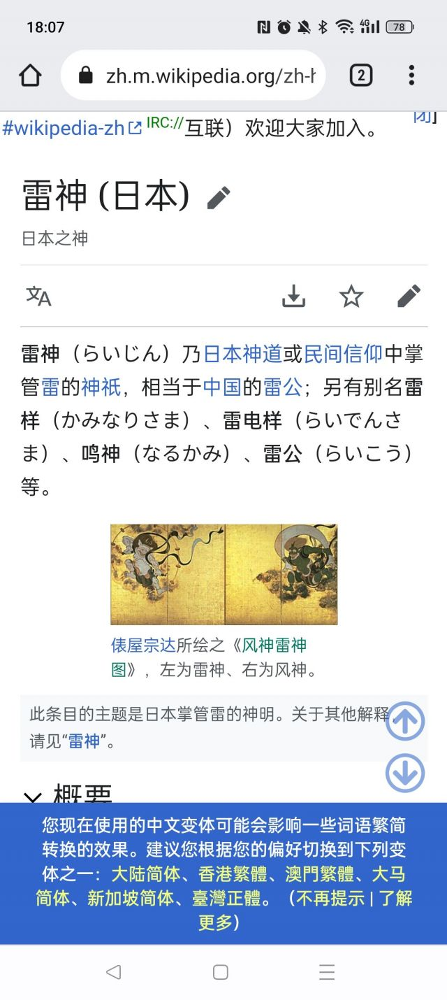

### [不吐不快] 稻妻鸣神这个词汇是有由来吗

Made by ngapost2md (c) ludoux [GitHub Repo](https://github.com/ludoux/ngapost2md)

----

##### 0.[0] \<pid:0\> 2023-08-05 17:00:03 by 大魔王的小忠犬
想到那个时候猛干哥哥就参与了原神。
鸣神的鸣分开是口，鸟吧
真的没有其他意思吗？

----

##### 1.[0] \<pid:707149566\> 2023-08-05 18:05:46 by 有梦想的非酋
鸣神这个是日本原本就有的词，不是生造的，意思是向神明祈祷，日本acg作品中也时不时使用这个词

----

##### 2.[1] \<pid:707149682\> 2023-08-05 18:06:20 by 不织围脖
照你这么说，鸣人也

----

##### 3.[2] \<pid:707149809\> 2023-08-05 18:06:57 by FAAET
鳴神在日语里就是雷神的意思

----

##### 4.[2] \<pid:707150030\> 2023-08-05 18:08:02 by yxliu24
  

雷电将军的底层设定很扎实，而且很大杂烩，日本很多神都缝了。

----

##### 5.[0] \<pid:707150851\> 2023-08-05 18:12:03 by crxLFYZgy
鸣神就是雷神

----

##### 6.[0] \<pid:707151887\> 2023-08-05 18:17:33 by 一片平凡的全麦面包
倒也不至于如此滑坡，你先搜搜呢

