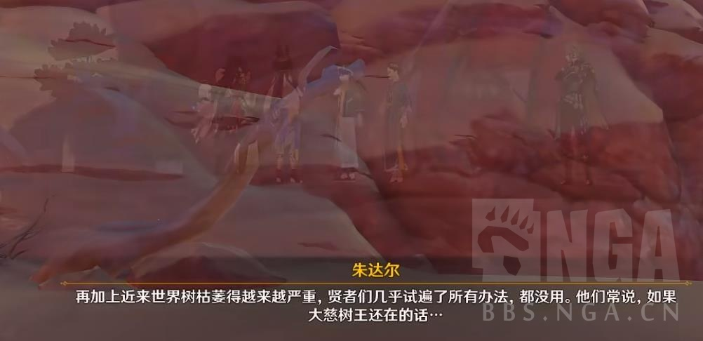
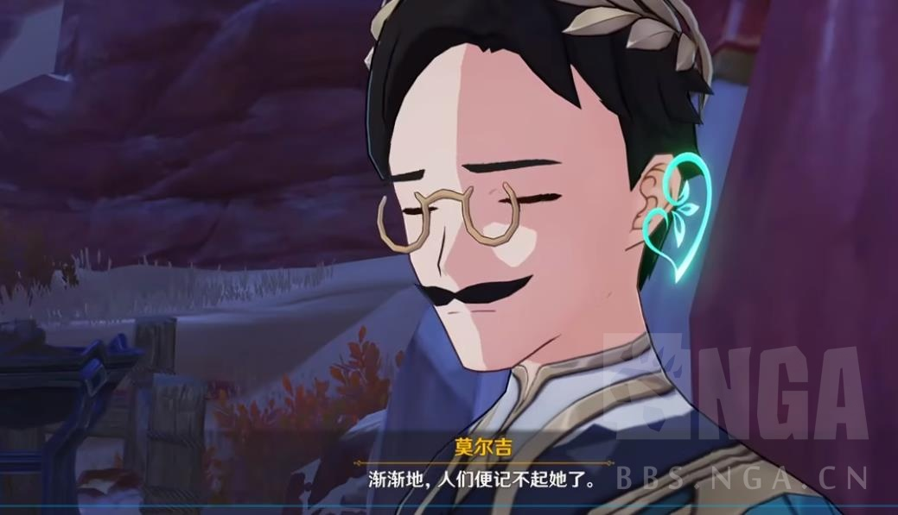
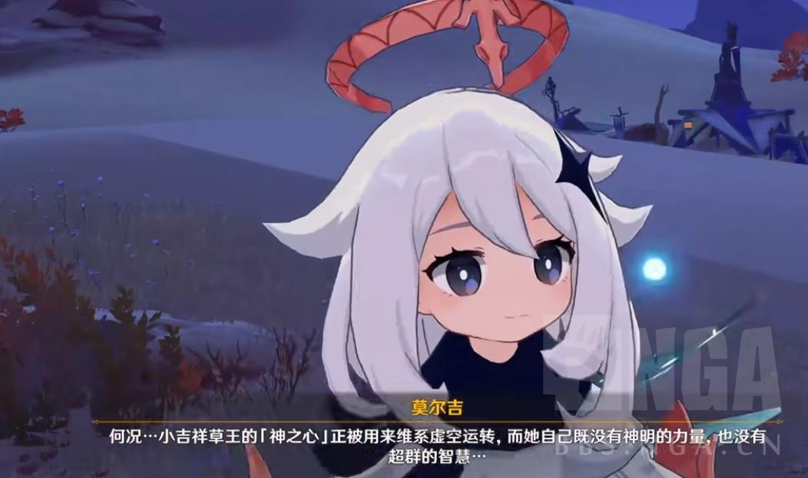
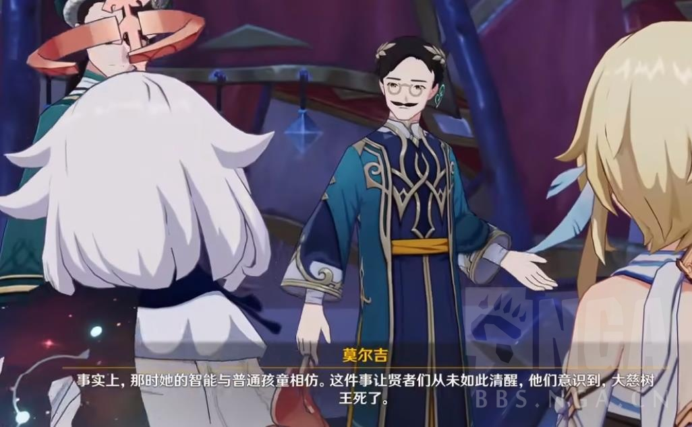
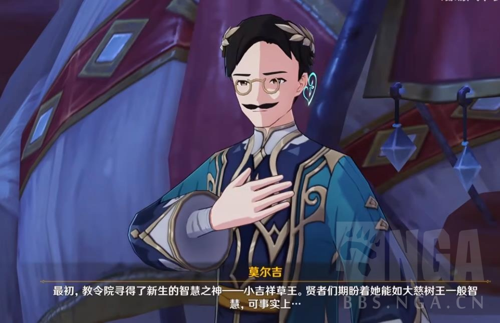
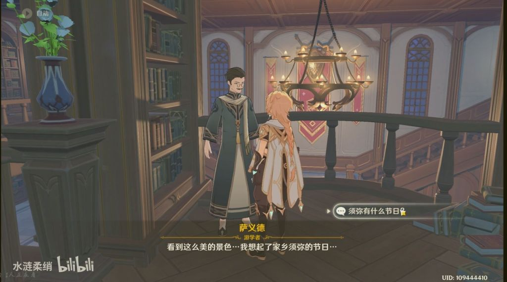
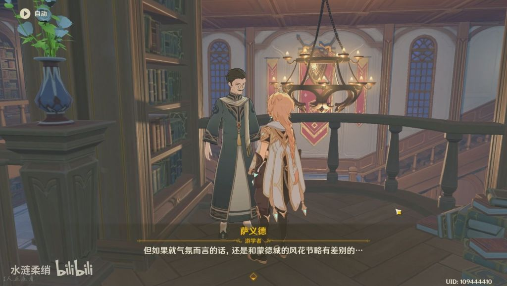
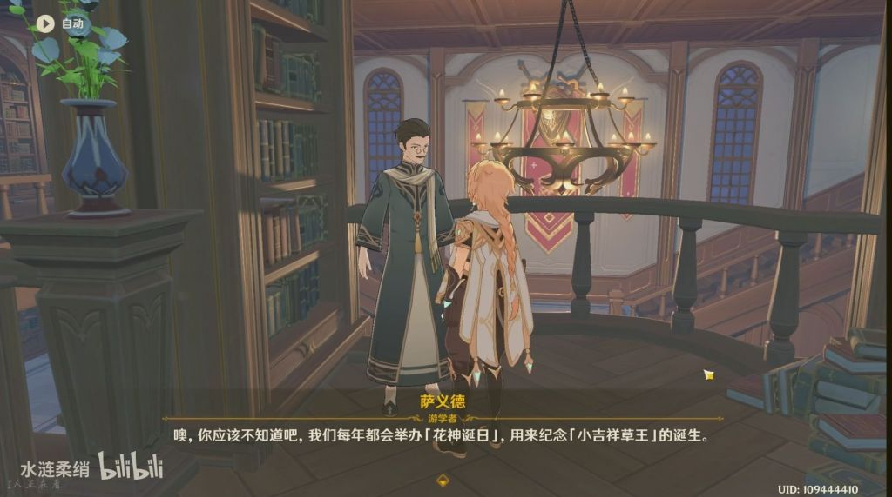
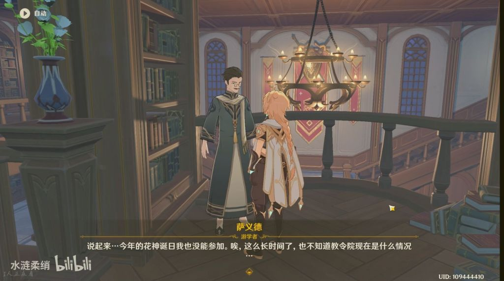

### [不吐不快] 还是有必要说下，前几代大贤者们真的不是什么大恶人

Made by ngapost2md (c) ludoux [GitHub Repo](https://github.com/ludoux/ngapost2md)

----

##### 0.[4] \<pid:0\> 2023-08-05 17:59:03 by 寅汤姜庚屈兰
很多人对阿扎尔之前的大贤者们有很大的恶感，直到现在不少玩家还认为大贤者们集体“虐待纳西妲，控制人心，让须弥永无天日”

这点其实就是逻辑错误的，在地狱叉的1.5W字长文里也说明之所以很多人对大贤者们产生误会，也是因为生日快乐PV里大贤者的形象和阿扎尔一模一样

实际上，一，大贤者们除了阿扎尔外，在就任期间一直保护世界树，治理死域瘤，发展学术等，可以嘲笑他们太想依赖大慈树王，但是认为他们是一无是处的坏人就很离谱了

二，大贤者们对纳西妲的确无视，不信任她的能力，但是纳西妲的境遇被恶意夸大了

而且大贤者们渐渐不信任纳西妲，剧情中也是有解释，一开始他们都还是优待纳西妲，希望她可以像大慈树王一样聪明，但是发现纳西妲那时候的心智水平和孩童差不多后，他们很失望并放弃了纳西妲

大贤者们当然是有错的，错在他们后来不相信纳西妲的能力和心智会进一步发展，但是用虐待，pua等字眼还是太过头了，也不符合实际情况

----

##### 1.[0] \<pid:707149578\> 2023-08-05 18:05:51 by lingwzhui
我觉得前任大贤者做得挺对的，免得哪天纳西妲带着净善宫一起自爆了

----

##### 2.[1] \<pid:707150040\> 2023-08-05 18:08:05 by 好家伙灬灬
大贤者问题不就是，莫名其妙ban艺术，然后疯学者嗯往沙漠扔

----

##### 3.[3] \<pid:707150102\> 2023-08-05 18:08:21 by Rean-7
没有神明的力量，没有超群的智慧，那凭什么受须弥人民敬仰凭她是神二代吗

----

##### 4.[1] \<pid:707150123\> 2023-08-05 18:08:28 by 再也不随意注销了
我现在甚至怀疑大贤者软禁典王是不是被她爆的典震惊了

----

##### 5.[12] \<pid:707150350\> 2023-08-05 18:09:35 by 雨源rainsource
纳西妲才放出来不到一年，提瓦特就烂了这就是典王的杀伤力

----

##### 6.[1] \<pid:707150486\> 2023-08-05 18:10:14 by 雲玩家かみかぜ
现在来看小机箱草王也就是个高维生物，对待人类的态度无非是写了保护性限制的gpt，其实除了草元素力和权限以外好像也没什么独一无二之处了。

----

##### 7.[0] \<pid:707150592\> 2023-08-05 18:10:45 by roseta
成王败寇了属于是

----

##### 8.[3] \<pid:707151057\> 2023-08-05 18:13:09 by plume-羽
>[jump](#pid707150123) 再也不随意注销了(2023-08-05 18:08) 说: 
>
>我现在甚至怀疑大贤者软禁典王是不是被她爆的典震惊了

典王张口就是一句魔神战争是抢座位的游戏这谁顶得住。

----

##### 9.[1] \<pid:707151250\> 2023-08-05 18:14:19 by piepiero
出脑以后再看笼中鸟的设定矛盾挺多的
为什么五百年间每一任大贤者都选择了关着自己的主神，500年都换了多少代了，按现实时间算那就是从明朝关到了现代，大贤者还不是长生种
草神千里之外隔空在蒙徳地盘掐温迪语音，还带心灵感应梦境也是说去就去，为啥人设会是悲惨无力的笼中鸟

----

##### 10.[2] \<pid:707151269\> 2023-08-05 18:14:24 by cvvmnx
就目前草王表现出的智力水平和行为模式，我是支持再关草王500年那一派的
抢椅子比例尺等暴论尚可以容忍，大家都是从中二病时期过来的。
有自爆倾向不可以容忍，草王不在意自身形态，大贤者还不想落一个“未尽到监护责任”的骂名呢

----

##### 11.[0] \<pid:707151806\> 2023-08-05 18:17:13 by 傻花没有花
做完草二我的感想就是理解大贤者

----

##### 12.[0] \<pid:707151906\> 2023-08-05 18:17:39 by 雷军单推人
贤者：草神大人，您怎么看须弥子民们？
小吉祥草王：我喜欢人类，就像人类喜欢狗一样。
贤者：……(净善宫上锁)

----

##### 13.[0] \<pid:707151943\> 2023-08-05 18:17:50 by 等把美又强的剑
事已至此无论是怎么样的塑造都显得无关紧要了，倒不如说更显得生日快乐小丑。。

----

##### 14.[0] \<pid:707153036\> 2023-08-05 18:23:36 by akanatsu
海赛迪都是听说还有这事立刻反水要救神一点纠结没有的，其实就是为了不给玩家多想一下出脑的时间，当然现在看来属于保皇思想确实不行

----

##### 15.[2] \<pid:707153207\> 2023-08-05 18:24:32 by 奈何断桥
以人类短生种的寿命，大贤者在任时间能有多长？不过三四十年吧？十几任大贤者都继承初任大贤者的决定继续囚禁典王，放历史上十几任皇帝都执行同样的政策这相当于是把这项政策当做立国根本了都

----

##### 16.[0] \<pid:707153316\> 2023-08-05 18:25:10 by Maccv
突然感觉这个过程和我对mhy的看法变化过程有点类似——从xx打压他们真惨呀游戏还行可以给一些信任期待——到这一切节奏都是应得的难怪之前那么多zqsg的黑

----

##### 17.[0] \<pid:707153451\> 2023-08-05 18:25:52 by 阿卡林12450
老祖宗这么做一定有他的道理

现在看来太对了

----

##### 18.[0] \<pid:707153765\> 2023-08-05 18:27:31 by c6537
理解，质疑，成为
请指导我们，大贤者

----

##### 19.[4] \<pid:707153775\> 2023-08-05 18:27:35 by 罗一川
做事冲动一根筋还是个恋爱脑，须弥人有的好享受了

----

##### 20.[0] \<pid:707153895\> 2023-08-05 18:28:10 by 逢河牧野0v0
这个剧情告诉我们保皇派没有前途，应该跟皇帝一起扫进历史的垃圾堆

----

##### 21.[0] \<pid:707153920\> 2023-08-05 18:28:18 by UID62492053
>[jump](#pid707150102) Rean-7(2023-08-05 18:08)说:
>没有神明的力量，没有超群的智慧，那凭什么受须弥人民敬仰[s:ac:哭笑]凭她是神二代吗

其实真讨论这件事，只有一个答案：虚空需要草元素力的神之心。而这玩意归属权以前是大慈树王的现在是纳西妲的

----

##### 22.[1] \<pid:707154908\> 2023-08-05 18:34:24 by rrrrawae
我要是提瓦特人民 在她说出魔神战争不过是抢椅子的游戏的时候，没打一架就是好的了

----

##### 23.[0] \<pid:707155728\> 2023-08-05 18:39:19 by 看我把那飞机打下来
但是说实话，囚禁别人也不对吧

----

##### 24.[0] \<pid:707155818\> 2023-08-05 18:39:51 by schiller2333
>[jump](#pid707151906) 雷军单推人(2023-08-05 18:17) 说: 
>
>贤者：草神大人，您怎么看须弥子民们？
>小吉祥草王：我喜欢人类，就像人类喜欢狗一样。
>贤者：……(净善宫上锁)

而且她丫的还更喜欢猫……

----

##### 25.[0] \<pid:707156972\> 2023-08-05 18:46:59 by 羽衣草
草神五百年都跟历任大贤者零沟通也挺离谱的，能飞到2.8海岛大显神通却不能跟某位大贤者好好聊聊

----

##### 26.[0] \<pid:707157315\> 2023-08-05 18:49:01 by 野猫布鲁斯
>[jump](#pid707150123) 再也不随意注销了(2023-08-05 18:08) 说: 
>
>我现在甚至怀疑大贤者软禁典王是不是被她爆的典震惊了

没事儿就开个盒，太好玩儿辣，大贤者：
小草王大人，死域瘤怎么解决？自爆！大贤者：

----

##### 27.[1] \<pid:707157587\> 2023-08-05 18:50:43 by 你们这是什么群啊
深层次来讲把典王关起来也是正确的，并且我认为黄毛在提瓦特犯下的最大的错误之一就是把典王放出来了。

稻妻的剧情虽然写的烂但剧情本身脉络没问题：长生种的雷神把对永恒的追求凌驾于凡人的愿望之上，然后被黄毛狠狠修正了。这符合提瓦特明面上的主流价值观。

而须弥是反过来的，一开始的典王被关着的时候还是愿意学习凡人的，到了被放出来以后开始以自己的好恶来决定哪些研究要禁绝，哪些可以继续，再后面甚至发表了比例尺这个经典的长生种言论。

只能说典王一步步在脱离凡人，她有一个非常清晰的她是执政而且她和短生种不是一搭的认知，实际上她日常除了和阿帽交好以外，和寿数有限的凡人也没什么密切关系。她对于人类缺乏同理心，而且越来越缺。

现在还没有闹出太大的矛盾纯属她的利益和凡人的利益还没有分歧到不可弥合的地步。实际上她的本质早就接近高塔孤王了。

虽然说编剧决定写一个披着七神皮的高塔孤王预备役也不是不行，但是我不喜欢主角亲手把高塔孤王放出来的剧情。我是来做英雄的，不是来当帮凶的。

----

##### 28.[0] \<pid:707157698\> 2023-08-05 18:51:22 by bzbjzj
草王的统治法理。

----

##### 29.[0] \<pid:707158386\> 2023-08-05 18:55:33 by 流量猫
阿扎尔本来也不坏啊，换你是领导者面对一个吉祥物你也这么干

----

##### 30.[0] \<pid:707158849\> 2023-08-05 18:58:21 by 不想上班999号
>[jump](#pid707155728) 看我把那飞机打下来(2023-08-05 18:39) 说: 
>
>但是说实话，囚禁别人也不对吧

虽然我也觉得不好
但是你看不上锁后不过短短一年

----

##### 31.[0] \<pid:707158900\> 2023-08-05 18:58:35 by jasmine4869
500年太久了，1523年还是明朝，但草神500年了还是那个话都说不清的草神

----

##### 32.[0] \<pid:707159507\> 2023-08-05 19:02:13 by tmp216
>[jump](#pid707155728) 看我把那飞机打下来(2023-08-05 18:39) 说: 
>
>但是说实话，囚禁别人也不对吧

万一刚长出来，对着人第一句话就是“抢椅子”或者“尺度”这些的大典呢

----

##### 33.[1] \<pid:707159541\> 2023-08-05 19:02:24 by SamidareTacho
而且这事吧，除了能力问题，还有不可能阿扎尔做了五百年大贤者(这人甚至没有神之眼)，五百年肯定换了不知道几届(没说有没有任期限制以及历代寿命等)：不可能每一代都无由来鄙视她纳西妲；不可能每一代都是无反思能力的笨蛋；也不可能五百年这么多届完全没有任何人愿意去和纳西妲交流，这不符合正常逻辑。所以我认为她能被关五百年完全就是自己有问题，卖惨装可怜也不能掩盖这一点，她甚至能到处上网顶号掐通讯，也没见大贤者怎么她了，要知道先不说本职工作，这可是还有紧急的魔鳞病之类的问题，她到处上网难道不知道这一点？糟糕的是故事流程中也并没有见到她对此有什么独特见解或思考问题就很明显了，只能说是mhy自己对时间和逻辑结构根本没概念，完全是搬起石头砸自己脚

----

##### 34.[0] \<pid:707159651\> 2023-08-05 19:02:56 by momookyk
恶感？我感觉里茶馆起码有五成都是大贤者的拥趸，其中三层是忠实的阿扎尔卫兵

----

##### 35.[0] \<pid:707160820\> 2023-08-05 19:08:06 by Count零
阿扎尔：你还能有老祖宗聪明？

----

##### 36.[0] \<pid:707161239\> 2023-08-05 19:10:07 by Skalski_
“错在他们后来不相信纳西妲的能力和心智会进一步发展”那确实没发展啊碎掉了的发展吗

----

##### 37.[0] \<pid:707161390\> 2023-08-05 19:10:54 by 嘟嘟水
质疑，理解，成为。
出脑之后仔细想想就明白了，须弥的主线剧情根本就跟前面三国和旅人之章的主基调是相反的。前面几个国家都在强调要重视人的力量，希望神明要还政于民，是人民史观。结果到了须弥，本来已经是人治的国家把神放了出来回归神治，直接大踏步后退

----

##### 38.[0] \<pid:707161962\> 2023-08-05 19:13:37 by 笑着选择原谅它
阿扎尔到底为什么要对海这个纯日子人秘书下黑手我至今想不明白，海森甚至对草神没什么敬意，他不去招惹海森，旅行者最多走到喀万驿也被逮回来了
但是后边为什么推翻阿扎尔就一定要让草神重新接管教令院我也同样想不明白，推翻阿扎尔的时候三十人团已经基本被控制了，城内唯一暴力机关就是沙漠里的镀金旅团和风纪官，又已知赛诺之前只是失踪而不是叛逃，那赛诺聚拢手下振臂一呼龙袍加身不就得了

----

##### 39.[0] \<pid:707162768\> 2023-08-05 19:17:27 by 何時會有HE的存在
>[jump](#pid707155728) 看我把那飞机打下来(2023-08-05 18:39) 说: 
>
>但是说实话，囚禁别人也不对吧

她又不是人,還能隨機佔據別人的意識的,這麼危險,500年前賢者念在樹王，不找其他方式干掉她，算仁至義盡

----

##### 40.[0] \<pid:707162823\> 2023-08-05 19:17:43 by momookyk
>[jump](#pid707161962) 笑着选择原谅它(2023-08-05 19:13) 说: 
>
>阿扎尔到底为什么要对海这个纯日子人秘书下黑手我至今想不明白，海森甚至对草神没什么敬意，他不去招惹海森，旅行者最多走到喀万驿也被逮回来了
>但是后边为什么推翻阿扎尔就一定要让草神重新接管教令院我也同样想不明白，推翻阿扎尔的时候三十人团已经基本被控制了，城内唯一暴力机关就是沙漠里的镀金旅团和风纪官，又已知赛诺之前只是失踪而不是叛逃，那赛诺聚拢手下振臂一呼龙袍加身不就得了

赛诺的道德水平不允许他龙袍加身，艾尔海森你让他当大贤者还不如杀了他

----

##### 41.[0] \<pid:707163487\> 2023-08-05 19:20:41 by 莉雅-
>[jump](#pid707161962) 笑着选择原谅它(2023-08-05 19:13) 说: 
>
>阿扎尔到底为什么要对海这个纯日子人秘书下黑手我至今想不明白，海森甚至对草神没什么敬意，他不去招惹海森，旅行者最多走到喀万驿也被逮回来了
>但是后边为什么推翻阿扎尔就一定要让草神重新接管教令院我也同样想不明白，推翻阿扎尔的时候三十人团已经基本被控制了，城内唯一暴力机关就是沙漠里的镀金旅团和风纪官，又已知赛诺之前只是失踪而不是叛逃，那赛诺聚拢手下振臂一呼龙袍加身不就得了

其实是要对抗伪神吧。不过等一下，那个时候把工厂能源切一下是不是也可以？

----

##### 42.[0] \<pid:707163581\> 2023-08-05 19:21:05 by 何時會有HE的存在
>[jump](#pid707159651) momookyk(2023-08-05 19:02) 说: 
>
>恶感？我感觉里茶馆起码有五成都是大贤者的拥趸，其中三成是忠实的阿扎尔卫兵

沒，不能說我不是保皇党，就說我是大賢者擁躉

----

##### 43.[0] \<pid:707164002\> 2023-08-05 19:23:09 by 笑着选择原谅它
>[jump](#pid707162823) momookyk(2023-08-05 19:17) 说: 
>
>赛诺的道德水平不允许他龙袍加身，艾尔海森你让他当大贤者还不如杀了他  
>
>至于对海哥下黑手，因为海哥师兄被塞了神明知识失了智，他早晚会查出来

他们自己不当也无所谓，反正再推举一个大贤者就行了，有啥必要非得让草神出来接管教令院，毕竟现在3.6已经盖章又有一个大贤者了，中间这几个版本继续把草神关着也没啥问题

----

##### 44.[0] \<pid:707164644\> 2023-08-05 19:26:22 by 科莱恩，克怂
>[jump](#pid707157587) 你们这是什么群啊(2023-08-05 18:50) 说: 
>
>深层次来讲把典王关起来也是正确的，并且我认为黄毛在提瓦特犯下的最大的错误之一就是把典王放出来了。
>
>
>稻妻的剧情虽然写的烂但剧情本身脉络没问题：长生种的雷神把对永恒的追求凌驾于凡人的愿望之上，然后被黄毛狠狠修正了。这符合提瓦特明面上的主流价值观。
>
>而须弥是反过来的，一开始的典王被关着的时候还是愿意学习凡人的，到了被放出来以后开始以自己的好恶来决定哪些研究要禁绝，哪些可以继续，再后面甚至发表了比例尺这个经典的长生种言论。
>
>只能说典王一步步在脱离凡人，她有一个非常清晰的她是执政而且她和短生种不是

对头
不管咋的，长生种做短生种的统治者太抽象了，无法共情这一点矛盾太大了。
留着当个武力倚靠(类似雷神)，回复以最大的信仰和尊敬就好，直接当统治者那真的是灾难

----

##### 45.[0] \<pid:707164806\> 2023-08-05 19:27:12 by tbiph9277
某天，某一任大贤者觉得老关着自己家神不太好，于是

大贤者：把草神大人放出来看看吧
典王：剧毒的蟒蛇
大贤者：……
典王：和植物抢空气
大贤者：……
典王：为什么不问问知无不言的我呢
大贤者：……
典王：在须弥，囚犯也有受教育的权力，指的是什么惩罚都没有，想逃课逃课那种，什么你说你不是阿帽，那你必须受到惩罚
大贤者：……
典王：比例尺的一小段
大贤者：……
典王：事已至此只能自爆了
大贤者：把她关回去罢，看好了不要让她出来祸害提瓦特，不然我们须弥人愧对提瓦特民众啊

----

##### 46.[2] \<pid:707165054\> 2023-08-05 19:28:17 by 吃乐川下你和我
建议大贤者重生找至冬学习一波核心技术把草神之心直接挖了，我认真的

----

##### 47.[0] \<pid:707165082\> 2023-08-05 19:28:27 by 无料通贩商
>[jump](#pid707159651) momookyk(2023-08-05 19:02) 说: 
>
>恶感？我感觉里茶馆起码有五成都是大贤者的拥趸，其中三成是忠实的阿扎尔卫兵

大贤者是第一个被抓的……

----

##### 48.[1] \<pid:707165105\> 2023-08-05 19:28:34 by 笑着选择原谅它
>[jump](#pid707164644) 科莱恩，克怂(2023-08-05 19:26) 说: 
>
>对头
>不管咋的，长生种做短生种的统治者太抽象了，无法共情这一点矛盾太大了。
>留着当个武力倚靠(类似雷神)，回复以最大的信仰和尊敬就好，直接当统治者那真的是灾难

地狱笑话的是，现在教令院已经又有新的大贤者管了，一通折腾除了把草神和她老公放出来给自己加了个祖宗，其实负责治理须弥的还是贤者和教令院，那你们他妈的放草神出来干嘛

----

##### 49.[0] \<pid:707167122\> 2023-08-05 19:39:15 by 的呢抵抗
>[jump](#pid707150102) Rean-7(2023-08-05 18:08):

这个东西可以用一些春秋笔法模糊掉，我自己来写的话我会在旅行者和阿扎尔的对质中写这么一段“因为你只会追求虚无缥缈的神明的力量，所以你看不见须弥人民的苦难，也看不到他们的力量。纳西妲她弱小，所以她能理解须弥人民的苦难，她能与须弥的人民站在一起，她能与须弥的人们一起解决问题，这才能让须弥真正的强大甚至超越大慈树王，弱小并非她的缺点，反而是她能治理好须弥的武器”这样会不会好一点

----

##### 50.[0] \<pid:707167820\> 2023-08-05 19:43:19 by 笑着选择原谅它
>[jump](#pid707167122) 的呢抵抗(2023-08-05 19:39) 说: 
>
>这个东西可以用一些春秋笔法模糊掉，我自己来写的话我会在旅行者和阿扎尔的对质中写这么一段“因为你只会追求虚无缥缈的神明的力量，所以你看不见须弥人民的苦难，也看不到他们的力量。纳西妲她弱小，所以她能理解须弥人民的苦难，她能与须弥的人民站在一起，她能与须弥的人们一起解决问题，这才能让须弥真正的强大甚至超越大慈树王，弱小并非她的缺点，反而是她能治理好须弥的武器”这样会不会好一点

这种话也有入典潜质吧……什么叫弱小所以能理解人民的苦难，弱小反而是治理好须弥的武器，前三国的神没一个武力值比她弱，也不是不理解苍生苦楚，要不你还是就强调她的努力算了

----

##### 51.[0] \<pid:707168300\> 2023-08-05 19:45:56 by 冬虫夏草花花茶
事实证明黄毛把典王放出来，就像打开了潘多拉魔盒。

----

##### 52.[0] \<pid:707168465\> 2023-08-05 19:46:49 by 月小炎
>[jump](#pid707153036) akanatsu(2023-08-05 18:23):

可能是参考夺门之变呢

----

##### 53.[0] \<pid:707168732\> 2023-08-05 19:48:13 by 的呢抵抗
>[jump](#pid707167820) 笑着选择原谅它(2023-08-05 19:43)说:
>[quote][pid=707167122,37269796,3]Reply[/pid] <b>Post by [uid=64846146]的呢抵抗[/uid] (2023-08-05 19:39):</b>  这个东西可以用一些春秋笔法模糊掉，我自己来写的话我会在旅行者和阿扎尔的对质中写这么一段“因为你只会追求虚无缥缈的神明的力量，所以你看不见须弥人民的苦难，也看不到他们的力量。纳西妲她弱小，所以她能理解须弥人民的苦难，她能与须弥的人民站在一起，她能与须弥的人们一起解决问题，这才能让须弥真正的强大甚至超越大慈树王，弱小并非她的缺点，反而是她能治理好须弥的武器”这样会不会好一点[/quote]这种话也有入典潜质吧……什么叫弱小所以能理解人民的苦难，弱小反而是治理好须弥的武器，前三国的神没一个武力值比她弱，也不是不理解苍生苦楚，要不你还是就强调她的努力算了[s:ac:哭笑]

这话就是针对阿扎尔的，不是什么通用的价值观。目的是辩赢阿扎尔罢了，治国谁来治的更好这种话题本来也不是三言两语就能得出结论的

----

##### 54.[0] \<pid:707169102\> 2023-08-05 19:50:11 by 笑着选择原谅它
>[jump](#pid707168732) 的呢抵抗(2023-08-05 19:48) 说: 
>
>这话就是针对阿扎尔的，不是什么通用的价值观。目的是辩赢阿扎尔罢了

这种话只会在爆典之后成为罪状+1，哪怕剧情里阿扎尔被剧情杀辩赢了，也说服不了剧外观众啊

----

##### 55.[0] \<pid:707169760\> 2023-08-05 19:53:37 by 的呢抵抗
>[jump](#pid707169102) 笑着选择原谅它(2023-08-05 19:50)说:
>[quote][pid=707168732,37269796,3]Reply[/pid] <b>Post by [uid=64846146]的呢抵抗[/uid] (2023-08-05 19:48):</b>  这话就是针对阿扎尔的，不是什么通用的价值观。目的是辩赢阿扎尔罢了[/quote]这种话只会在爆典之后成为罪状+1，哪怕剧情里阿扎尔被剧情杀辩赢了，也说服不了剧外观众啊[s:ac:哭笑] 编辑，我又重新看了一遍你说的，建议是直接把因为所以全改成虽然但是，不是因为弱小而如何如何，是虽然弱小但是仍然有关怀之心

我的意思其实是，派蒙那句“只有特别聪明或者特别能打的才能算好神明”这句话哪怕不算后面的爆典剧情就已经够诡异的了，我只是想问问这么写是否在3.2那个时间点看起来会没有那么奇怪

----

##### 56.[0] \<pid:707170312\> 2023-08-05 19:56:23 by 笑着选择原谅它
>[jump](#pid707169760) 的呢抵抗(2023-08-05 19:53) 说: 
>
>我的意思其实是，派蒙那句“只有特别聪明或者特别能打的才能算好神明”这句话哪怕不算后面的爆典剧情就已经够诡异的了，我只是想问问这么写是否在3.2那个时间点看起来会没有那么奇怪

派蒙的话其实完全可以糊弄成“爱护人民的才是好神明”，回避掉聪明或者能打的问题，直接强调虽然草神又弱又笨，但是她的心是善良的

----

##### 57.[1] \<pid:707170856\> 2023-08-05 19:58:41 by wjxjh
>[jump](#pid707170312) 笑着选择原谅它(2023-08-05 19:56) 说: 
>
>派蒙的话其实完全可以糊弄成“爱护人民的才是好神明”，回避掉聪明或者能打的问题，直接强调虽然草神又弱又笨，但是她的心是善良的

不过说实话，本来好神明和能当统治者的神明就不是一回事，查询盐神状态。
这话从根子上就没救了

----

##### 58.[1] \<pid:707171509\> 2023-08-05 20:01:01 by 笑着选择原谅它
>[jump](#pid707170856) wjxjh(2023-08-05 19:58) 说: 
>
>不过说实话，本来好神明和能当统治者的神明就不是一回事，查询盐神状态。
>这话从根子上就没救了

没办法，须弥没变成盐神2.0全靠树王遗产没什么大灾，以及历代须弥人积极自救

----

##### 59.[0] \<pid:707172086\> 2023-08-05 20:03:21 by Collapsar。
平心而论阿扎尔管得也没有多好，人脑挖矿，限制艺术，流放疯学者，死域问题也解决不了
属于无能+傲慢，想干正事干不成，还漠视普通民众，他被推翻不冤
坏就坏 ，推翻阿扎尔后，扶上来个典王

虽然解决了禁忌知识的问题，但纯靠树王遗产
与此同时，阿扎尔的无能+傲慢，典王不也一个样
遇事不决就自爆，长生种的比例尺
就连一言不合拉闸虚空，不也跟阿扎尔一言不合禁艺术一个路子吗？

艺术禁了好歹只是没法唱歌跳舞，虚空禁了，检索查阅资料不知道要麻烦多少倍
哪怕有权限，以前普通居民也可以靠虚空获得很多基础信息，现在呢？怎么获得，一个个去图书馆看？

而阿扎尔只是个能力有限的50岁左右的中年人
你500岁神二代典王，手握全知全能的世界树，还能随时上网顶号，就干成这样？
两相对比，可不就救了个寂寞

----

##### 60.[0] \<pid:707172417\> 2023-08-05 20:04:42 by 月舞星璇
>[jump](#pid707155728) 看我把那飞机打下来(2023-08-05 18:39) 说: 
>
>但是说实话，囚禁别人也不对吧

错了，教令院是自以为囚禁了她，她从来就没有被完全封锁过。

她的意识控制已经熟练到事后一点痕迹都不会留下，在禅那园强行和旅行者交换身体，立刻就能从5、6名精锐佣兵包围下带着派蒙边打边跑

如果她从来没有占据过别人身体，不可能刚学会夺舍就如此自如的应用他人的身体

----

##### 61.[0] \<pid:707173247\> 2023-08-05 20:08:10 by 的呢抵抗
>[jump](#pid707172086) Collapsar。(2023-08-05 20:03):

所以其实3.2须弥就已经初显病症了，3.3开始发病，3.6到达晚期

----

##### 62.[0] \<pid:707174302\> 2023-08-05 20:12:41 by 今锁朱楼
>[jump](#pid707161962) 笑着选择原谅它(2023-08-05 19:13):

赛诺也不想当吧，我感觉这人的人生理想就是当警察主持正义至于支持草神，赛诺是有一个自我说服的过程的，这人最开始连纳西妲是谁都差点没记起来，后来独白有在思考 草神执政须弥会更好吗？ 应该是想赌一把，结果没想到这位典王大人这么不值得信任转头就背刺。

----

##### 64.[0] \<pid:707175275\> 2023-08-05 20:17:20 by 奥托·斯科尔兹内
>[jump](#pid707164644) 科莱恩，克怂(2023-08-05 19:26):

其实不如说，需要的是一个掌握了最高武力(实际上包括了裁决权)的神明(总统)，加一个凡人政务官(总理)结构嘛(稻妻干这活的就是三奉行了)

----

##### 65.[0] \<pid:707176313\> 2023-08-05 20:22:31 by a小包子
还真没对前几代大贤者们有什么恶感，阿扎尔烂是他自己烂，迁怒不到其他人身上去，好比皇帝里也有孬皇帝，但不至于迁怒他前任
典王那个来去自如的行为回神想想都知道没到那份上，不过狗屁剧情咔咔咔咔的推进，根本不让玩家有时间琢磨，而等告一段落了，玩家的注意力也转移到别处去了
毕竟哪里能想，细节之间全是裂缝

----

##### 66.[0] \<pid:707179482\> 2023-08-05 20:41:04 by zxtapple
痛恨阿扎尔→质疑阿扎尔→理解阿扎尔→赞同阿扎尔

----

##### 67.[0] \<pid:707179875\> 2023-08-05 20:43:28 by orangrey
>[jump](#pid707151943) 等把美又强的剑(2023-08-05 18:17) 说: 
>
>事已至此无论是怎么样的塑造都显得无关紧要了，倒不如说更显得生日快乐小丑。。

比起说这pv小丑，倒更像是一开始就用心险恶。pv就是个买角色的广告片，只不过生日快乐用一些春秋笔法和卖惨式煽情把玩家忽悠住了。用一个完美受害者形象和一个明确的靶子诱导情感和舆论，甚至篡改了一部分剧情(500年前大贤者跟阿扎尔一张脸，草神刚被找回来就囚禁，民众的态度等等)

出脑之后一看，这广告妥妥的虚假宣传。但是能让人掏钱抽卡，它就是成功的。带货广告嘛，骗到一个算一个，这方面可以说是大成功

----

##### 68.[0] \<pid:707180020\> 2023-08-05 20:44:24 by AlLibbo
>[jump](#pid707175174) 笑着选择原谅它(2023-08-05 20:16) 说: 
>
>其实一开始大家都只是讨厌教令院或者跟教令院有仇，包括迪希雅和镀金旅团在内，救草神感觉就像打着扶苏旗号造反，坏就坏在他们成功之后没有直接从教令院选大贤者而是把草神解禁了，解禁了也就算了还给了草神权利，草神反手就是一套解救老公关停虚空

草神解禁这事得是主角的锅，当时和海森聊造反的事，主角说这个世界树污染完了得靠草神来，海森听了觉得没人能干这个就顺手就安排主角进去拉草一把
结果谁都没想到解禁了典王

----

##### 70.[0] \<pid:707181582\> 2023-08-05 20:53:00 by write54
原来好多人是因为生日快乐pv才喜欢当时草神的吗，我对pv倒是真的一点感觉没有，完全没讨厌过大贤者，大贤者也只是没做好罢了。
我当时喜欢草神完全是因为
1、白毛萝莉，外形喜欢
2、孩子们的神明，童话一样的神明，迪纳泽黛还有疯学者剧情
3、对主角特殊的依赖亲近
所以我一直没当草神是智慧之神

但是3.2结尾和博士斗志、传说1、3.3间章一步一步都在塑造什么智慧之神，塑造什么圣母，然后又搞脱离主角的cp，完全偏离了我喜欢的方向。

另外我带入的还是荧，我一直推的是荧草

----

##### 71.[0] \<pid:707181772\> 2023-08-05 20:53:45 by 看看其他的
>[jump](#pid707165082) 无料通贩商(2023-08-05 19:28) 说: 
>
>大贤者是第一个被抓的……

大哥你别这样我不想吃坛血馒头

----

##### 72.[0] \<pid:707181970\> 2023-08-05 20:54:58 by 看我把那飞机打下来
>[jump](#pid707172417) 月舞星璇(2023-08-05 20:04)说:
>[quote][pid=707155728,37269796,2]Reply[/pid] <b>Post by [uid=62526866]看我把那飞机打下来[/uid] (2023-08-05 18:39):</b>  但是说实话，囚禁别人也不对吧[s:ac:哭笑][/quote]错了，教令院是自以为囚禁了她，她从来就没有被完全封锁过。  她的意识控制已经熟练到事后一点痕迹都不会留下，在禅那园强行和旅行者交换身体，立刻就能从5、6名精锐佣兵包围下带着派蒙边打边跑  如果她从来没有占据过别人身体，不可能刚学会夺舍就如此自如的应用他人的身体

但是意图是囚禁她没错吧，就算觉得能力不行，但是限制人身自由多少太霸道了

----

##### 73.[0] \<pid:707182187\> 2023-08-05 20:56:03 by 今锁朱楼
>[jump](#pid707180020) AlLibbo(2023-08-05 20:44)说:
>[quote][pid=707175174,37269796,4]Reply[/pid] <b>Post by [uid=65138941]笑着选择原谅它[/uid] (2023-08-05 20:16):</b>  其实一开始大家都只是讨厌教令院或者跟教令院有仇，包括迪希雅和镀金旅团在内，救草神感觉就像打着扶苏旗号造反，坏就坏在他们成功之后没有直接从教令院选大贤者而是把草神解禁了，解禁了也就算了还给了草神权利，草神反手就是一套解救老公关停虚空[s:ac:哭笑][/quote]草神解禁这事得是主角的锅，当时和海森聊造反的事，主角说这个世界树污染完了得靠草神来，海森听了觉得没人能干这个就顺手就安排主角进去拉草一把 结果谁都没想到解禁了典王

核心还是谁都没想到典王是这么个玩意，背刺速度还贼快，知情的旅行者也是个脑子拎不清的。
现在好了，旅行者要跑了，草王再干什么sjb操作也没人拉着了，须弥崩塌指日可待啊

----

##### 74.[0] \<pid:707182876\> 2023-08-05 20:59:35 by 今锁朱楼
>[jump](#pid707181970) 看我把那飞机打下来(2023-08-05 20:54)说:
><b>Reply to [pid=707172417,37269796,4]Reply[/pid] Post by [uid=1189308]月舞星璇[/uid] (2023-08-05 20:04)</b>  但是意图是囚禁她没错吧，就算觉得能力不行，但是限制人身自由多少太霸道了

问题是她手里是真有权能的，不摁着她天知道她还能搞出什么骚操作。
她被囚禁着都能直接挂温迪电话，出来不就更放飞自我了？
重点不是囚禁这个手法，而是摁住她不让她作妖。
如果你觉得囚禁很残忍，那我支持直接干掉她换新的。

----

##### 75.[0] \<pid:707183266\> 2023-08-05 21:01:38 by 只是个路过的
~~大贤者的本意是好的，只是下面人执行的太温和了~~

----

##### 76.[0] \<pid:707185527\> 2023-08-05 21:13:39 by 这游戏真给我整沉默了
草神用她出来后的所作所为证明了五百年间大贤者决定把她继续关着的正确性~~理解并成为~~

----

##### 77.[0] \<pid:707185957\> 2023-08-05 21:16:04 by momookyk
>[jump](#pid707172417) 月舞星璇(2023-08-05 20:04)说:
>[quote][pid=707155728,37269796,2]Reply[/pid] <b>Post by [uid=62526866]看我把那飞机打下来[/uid] (2023-08-05 18:39):</b>  但是说实话，囚禁别人也不对吧[s:ac:哭笑][/quote]错了，教令院是自以为囚禁了她，她从来就没有被完全封锁过。  她的意识控制已经熟练到事后一点痕迹都不会留下，在禅那园强行和旅行者交换身体，立刻就能从5、6名精锐佣兵包围下带着派蒙边打边跑  如果她从来没有占据过别人身体，不可能刚学会夺舍就如此自如的应用他人的身体

如果你觉得是第一次，那你肯定没认真看剧情
阿如村的疯学者数次抵挡沙暴就是典王的手笔

----

##### 78.[0] \<pid:707186170\> 2023-08-05 21:17:11 by ritsukaalter
啊…跑个题。嘲笑他们依赖大慈树王，这个其实还不是贤者的问题，是提瓦特世界观的问题我的意思是，如果嘲讽依赖神，那整个游戏里除了个别的那几个，所有人类都可以被嘲讽个遍。
因为这个主基调就是拜神教，提瓦特的人类说不定都是神做出来的任何智慧技能物质资产都是神赐予的，整个儿就是神的附属品
不是依赖而是不得不依赖，就像前几楼说的草神有神之心所以就凭她是神二代你也得服这个世界的人类离了神就是活不了的，至少文案它就是要这样设计的

----

##### 79.[0] \<pid:707187388\> 2023-08-05 21:24:16 by 超级龙击炮
我快笑死了什么现实主义题材大作

----

##### 80.[0] \<pid:707190227\> 2023-08-05 21:42:27 by 可恶，长个锤子
>[jump](#pid707181486) 笑着选择原谅它(2023-08-05 20:52) 说: 
>
>时间太久了，我都忘了最开始是因为谁把推翻阿扎尔和救草神揉到一起了，原来是你啊，摄像头

圆上了，都圆上了，这是你自己开启的故事啊旅行者

----

##### 81.[0] \<pid:707190557\> 2023-08-05 21:44:34 by 被暗算的第一天
我怀疑是小草神爆典太多导致当时的贤者们商量了一下发现把小机箱典王关起来才是须弥可持续发展的正确答案

----

##### 82.[0] \<pid:707192085\> 2023-08-05 21:53:31 by 看我把那飞机打下来
>[jump](#pid707185957) momookyk(2023-08-05 21:16):

凯瑟琳应该是附身多次了，其他人不知道

----

##### 83.[0] \<pid:707192348\> 2023-08-05 21:54:20 by 你们这是什么群啊
>[jump](#pid707176313) a小包子(2023-08-05 20:22) 说: 
>
>还真没对前几代大贤者们有什么恶感，阿扎尔烂是他自己烂，迁怒不到其他人身上去，好比皇帝里也有孬皇帝，但不至于迁怒他前任
>典王那个来去自如的行为回神想想都知道没到那份上，不过狗屁剧情咔咔咔咔的推进，根本不让玩家有时间琢磨，而等告一段落了，玩家的注意力也转移到别处去了
>毕竟哪里能想，细节之间全是裂缝

然后最蚌埠的是阿扎尔作为老年人类真的只是比例尺的一小段，他再烂也就烂那一小段

典王烂一点那就真是整个比例尺烂完毕竟典王真的是千秋万代的

----

##### 84.[0] \<pid:707198655\> 2023-08-05 22:19:45 by 看我把那飞机打下来
>[jump](#pid707192348) 你们这是什么群啊(2023-08-05 21:54)说:
>[quote][pid=707176313,37269796,4]Reply[/pid] <b>Post by [uid=18109842]a小包子[/uid] (2023-08-05 20:22):</b>  还真没对前几代大贤者们有什么恶感，阿扎尔烂是他自己烂，迁怒不到其他人身上去，好比皇帝里也有孬皇帝，但不至于迁怒他前任 典王那个来去自如的行为回神想想都知道没到那份上，不过狗屁剧情咔咔咔咔的推进，根本不让玩家有时间琢磨，而等告一段落了，玩家的注意力也转移到别处去了 毕竟哪里能想，细节之间全是裂缝[s:ac:偷笑][/quote]然后最蚌埠的是阿扎尔作为老年人类真的只是比例尺的一小段，他再烂也就烂那一小段  典王烂一点那就真是整个比例尺烂完[s:ac:哭笑]毕竟典王真的是千秋万代的

小草其实也不是没有过功绩，比如救了迪娜泽黛，保护了阿如村的小孩，还给沙漠发教育资源等

----

##### 85.[0] \<pid:707200088\> 2023-08-05 22:26:44 by hanana-
我觉得须弥主线写得挺藏拙的，虽然你会感觉哪里不太对但看在角色塑造和还算顺的故事线的份上你还能用一种瑕不掩瑜的眼光来看待它
直到打碎人幻想的3.3岁月史书

----

##### 86.[0] \<pid:707200755\> 2023-08-05 22:30:03 by 今锁朱楼
>[jump](#pid707186170) ritsukaalter(2023-08-05 21:17):

其实有一个国家是不靠神就可以征战四方的，虽然目前看来是往小丑和反派方向塑造的。

----

##### 87.[0] \<pid:707202855\> 2023-08-05 22:40:48 by ζ泪水沾湿的奇迹
很难相信历千难万险寻找大慈树王下落的大贤者，在找到大慈树王唯一遗留后却迅速把她软禁。

要说不是小吉祥草王整出个类似衣带诏的狠活，我真不理解

----

##### 88.[0] \<pid:707203434\> 2023-08-05 22:43:58 by 537464先生
>[jump](#pid707187388) 超级龙击炮(2023-08-05 21:24) 说: 
>
>我快笑死了这解构出来什么现实主义大作，能再加点情色要素和战争血腥要素吗

你别说，你还真别说，
赤王花神的故事和沙漠千年前的王朝更替都能满足你说的情色要素和战争血腥要素
你游这些剧情都是藏在世界文本的，也只有些张口就来的玩家认为12+的剧情就只是明面上的宝宝巴士。

----

##### 89.[0] \<pid:707208770\> 2023-08-05 23:15:18 by 无意识koishi
>[jump](#pid707182187) 今锁朱楼(2023-08-05 20:56) 说: 
>
>核心还是谁都没想到典王是这么个玩意，背刺速度还贼快，知情的旅行者也是个脑子拎不清的。
>现在好了，旅行者要跑了，草王再干什么sjb操作也没人拉着了，须弥崩塌指日可待啊

黄毛本质也是长生种啊
实际上须弥典王做了那么多  黄毛有真正在意须弥人民会咋样吗  没有吧
典王从黄毛进入须弥的时候就开始关注黄毛了
靠着打感情牌忽悠黄毛内心认同她 
你看须弥F4都是挺能干的  怎么典王不去找他们
看清黄毛本质 能够帮她扫清皇位然后还不拿权利走人
黄毛太好用了

----

##### 90.[0] \<pid:707211414\> 2023-08-05 23:31:52 by 看我把那飞机打下来
>[jump](#pid707203434) 537464先生(2023-08-05 22:43) 说: 
>
>你别说，你还真别说，
>赤王花神的故事和沙漠千年前的王朝更替都能满足你说的情色要素和战争血腥要素
>你游这些剧情都是藏在世界文本的，也只有些张口就来的玩家认为12+的剧情就只是明面上的宝宝巴士。

啥情色要素？指暗示开impact那里？

----

##### 91.[0] \<pid:707213647\> 2023-08-05 23:46:48 by 537464先生
>[jump](#pid707211414) 看我把那飞机打下来(2023-08-05 23:31) 说: 
>
>啥情色要素？指暗示开impact那里？

都暗示impart了也不是吗，是不是看不出来就不是了

----

##### 92.[0] \<pid:707213751\> 2023-08-05 23:47:33 by 笑着选择原谅它
>[jump](#pid707211414) 看我把那飞机打下来(2023-08-05 23:31) 说: 
>
>啥情色要素？指暗示开impact那里？

我以为是利露帕尔后代乱伦那段？

----

##### 93.[0] \<pid:707216497\> 2023-08-06 00:07:02 by EmmaDragon
>[jump](#pid707155818) schiller2333(2023-08-05 18:39):

笑发财了

----

##### 94.[0] \<pid:707217140\> 2023-08-06 00:11:31 by 普鲁士蓝蓝蓝
不滑坡认真一点讲 就算没有虐待 囚禁神明的行为本身也足够惊世骇俗了

----

##### 95.[0] \<pid:707218502\> 2023-08-06 00:21:22 by 夕音子
>[jump](#pid707217140) 普鲁士蓝蓝蓝(2023-08-06 00:11)说:
>不滑坡认真一点讲 就算没有虐待 囚禁神明的行为本身也足够惊世骇俗了

“人类的底蕴”我不好说了

----

##### 96.[0] \<pid:707218858\> 2023-08-06 00:24:07 by 年下萝莉控
>[jump](#pid707150350) 雨源rainsource(2023-08-05 18:09) 说: 
>
>纳西妲才放出来不到一年，提瓦特就烂了这就是典王的杀伤力

这么一说，怕不是主角得知自己兄/妹被提瓦特坑成反主后，有意为之，纵容这对狗男女把提瓦特搅得天翻地覆

----

##### 97.[0] \<pid:707219413\> 2023-08-06 00:28:11 by 普鲁士蓝蓝蓝
[quote][pid=707218502,37269796,5]Reply[/pid] <b>Post by [uid=43377055]夕音子[/uid] (2023-08-06 00:21):</b>

“人类的底蕴”我不好说了[/quote][quote]人类有人类的底蕴，我们不是滤清神选者后剩余的残渣[/quote]我想这个底蕴大概不会是指将神囚禁后躺在神的遗产上墨守成规

----

##### 98.[0] \<pid:707220603\> 2023-08-06 00:37:07 by 银河外的水滴
>[jump](#pid707150040) 好家伙灬灬(2023-08-05 18:08) 说: 
>
>大贤者问题不就是，莫名其妙ban艺术，然后疯学者嗯往沙漠扔

ban艺术也是阿扎尔或阿扎尔之前两代开始的，五百年里都ban艺术的话大巴扎不可能还有这么多艺术从业者

----

##### 99.[0] \<pid:707222301\> 2023-08-06 00:51:30 by bsjskdmcn
讲个笑话，须弥每年都会举办花神诞日，用于纪念小吉祥草王的诞生。

----

##### 100.[0] \<pid:707222450\> 2023-08-06 00:52:42 by 顺火暖围观群众
>[jump](#pid707174302) 今锁朱楼(2023-08-05 20:12):

现在发动岁月史树后赛诺这边估计也难再起反抗心了(从前任赤王祭司那里看到的有关大慈树王的记忆+大慈树王功绩已经被嫁接+编剧摁头设定再提到又会有禁忌知识+黄毛闭嘴)
须弥已经完蛋哩(看着赛诺的阿努比斯头盔+故事里的那句“情有可原但罪无可恕”感到极大嘲讽)

----

##### 101.[0] \<pid:707222591\> 2023-08-06 00:53:51 by 笛河
>[jump](#pid707155728) 看我把那飞机打下来(2023-08-05 18:39) 说: 
>
>但是说实话，囚禁别人也不对吧

虽然确实不对，但须弥人的命也是命啊
比起放她一个全凭自己喜恶形式的长生种出来爆典霍霍须弥人……算了还是关起来吧
即使是从道德角度看，她替受害人原谅灭门仇人也没道德啊让阿帽保送因论派也没道德啊

----

##### 102.[0] \<pid:707223427\> 2023-08-06 01:01:07 by 小王饼干
阿扎尔可能做错了很多，但从后续发展来看不放典王出山一定是正确的

----

##### 103.[0] \<pid:707223709\> 2023-08-06 01:04:01 by Ngchikrn
一個為了造神挖礦，一個為了愛人洗人腦，誰贏麻了我不想說，但小典王真的技高一籌

----

##### 104.[0] \<pid:707225288\> 2023-08-06 01:19:12 by zhy68872
>[jump](#pid707198655) 看我把那飞机打下来(2023-08-05 22:19) 说: 
>
>小草其实也不是没有过功绩，比如救了迪娜泽黛，保护了阿如村的小孩，还给沙漠发教育资源等

西方政客式做秀，合理怀疑演给旅行者看的。安抚一两个疯子有什么用，有本事直接清除死域啊。锅巴为了拯救人类耗尽力量。怎么你典王是舍不得那点开盒能力吗？

----

##### 105.[0] \<pid:707225567\> 2023-08-06 01:22:01 by 无明尽
说不囚禁的，那你要人家教令院怎么办嘛
正常上任的执政神都是魔神战争历练出来的，实力或说智慧都有保障
但在这个体系下你家神突然变成了幼儿
在七神体系下，根本没办法否认她执政的合法性
但也不能真让她来治国，没这个能力知道吧
杀了她更别想
当成傀儡更是引发政变的祸乱之源
只能通过关起来消弭她的影响，维持国家稳定
而且并非完全的囚禁，默许精神自由就不说了，她甚至可以软磨硬泡让贤者给建筑师写信

----

##### 106.[0] \<pid:707226282\> 2023-08-06 01:30:30 by ritsukaalter
>[jump](#pid707200755) 今锁朱楼(2023-08-05 22:30) 说: 
>
>其实有一个国家是不靠神就可以征战四方的，虽然目前看来是往小丑和反派方向塑造的。

至冬是吧按照这个风格下去早晚会垫给唯一神天理毕竟米家亲女儿演员的含金量

