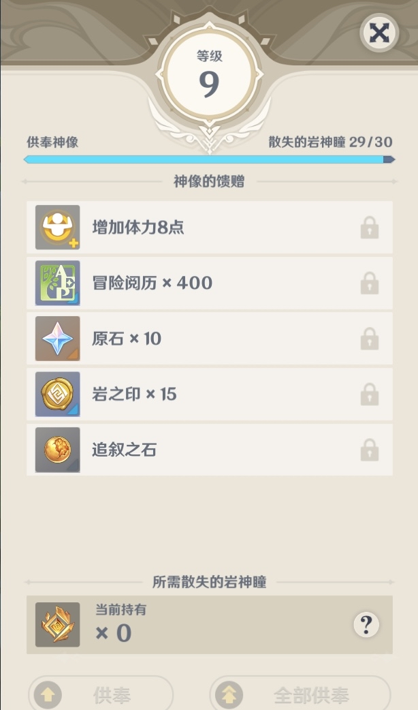
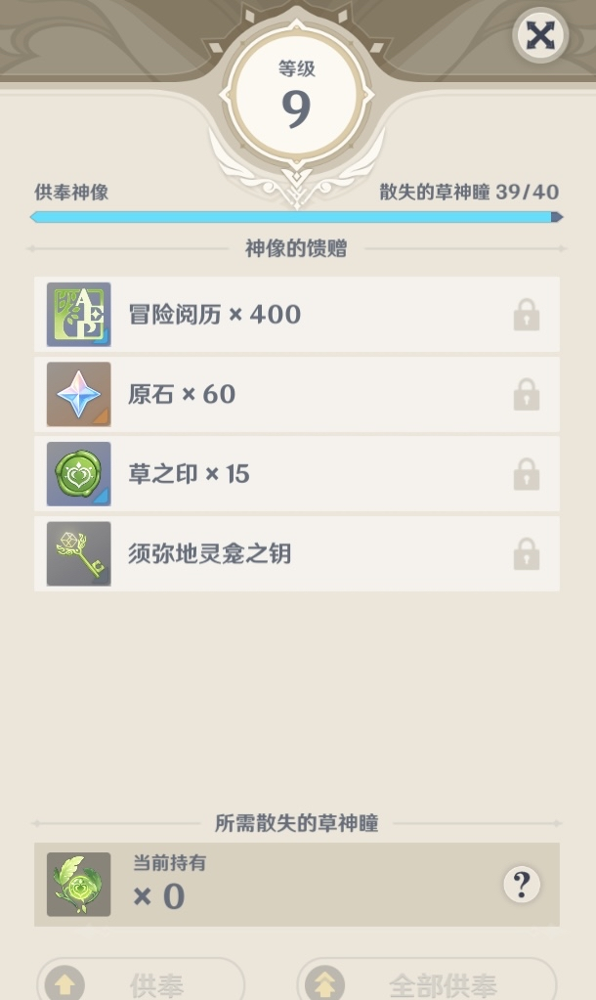
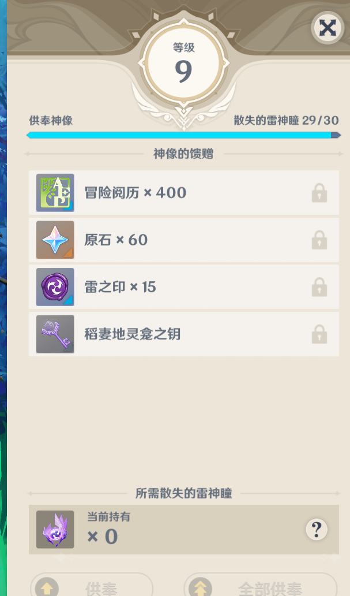

### [热点事件][不吐不快]典中典之神瞳

Made by ngapost2md (c) ludoux [GitHub Repo](https://github.com/ludoux/ngapost2md)

----

##### 0.[2] \<pid:0\> 2023-08-05 18:34:40 by 2233log
这是之前的

这是刚交完的

不得不说这真是太神奇了，就差一个供满
想问问泥潭老哥有没有风神瞳的，凑个整  

二编，跟着影月月跑的，就是这么巧合，每次都差俩。
(我要是故意的还至于每周往声望那跑)

----

##### 1.[2] \<pid:707155164\> 2023-08-05 18:35:51 by 一颗好桃
我其他都溢出1个，须弥8级。

----

##### 2.[0] \<pid:707155191\> 2023-08-05 18:35:58 by 夜之海绝音
探测器啊

----

##### 3.[4] \<pid:707155218\> 2023-08-05 18:36:06 by 仓鼠悠米
我确实有多 你每个缺两个

----

##### 4.[0] \<pid:707155225\> 2023-08-05 18:36:07 by Bauhaus的大豪斯
每个都差一个还是挺神奇的

----

##### 5.[6] \<pid:707155423\> 2023-08-05 18:37:18 by 没有爱的承诺
你是怎么做到每样都差俩才齐的

----

##### 6.[1] \<pid:707155655\> 2023-08-05 18:38:49 by aplyse
讲道理我都是算好缺几个捏罗盘的，缺一个的是跟跑漏了吗

----

##### 7.[1] \<pid:707155771\> 2023-08-05 18:39:35 by 天咕星
你差两个为什么不用探测器

----

##### 8.[0] \<pid:707155913\> 2023-08-05 18:40:24 by 2233log
>[jump](#pid707155771) 天咕星(2023-08-05 18:39) 说: 
>
>你差两个为什么不用探测器

只有风岩

----

##### 9.[4] \<pid:707158232\> 2023-08-05 18:54:37 by 一曲浮生
所以说确实很巧。你每个都缺的是两个而不是你认为的一个  
等下，你这个tag不吐不快加热点事件，不应该入理查的吗，怎么在主版

----

##### 10.[0] \<pid:707160990\> 2023-08-05 19:08:49 by 电波女＆青春男
不是有神瞳探测器吗？你就挨个传送点试一下就好了还是说你强迫症，每个神像都必须差一个

----

##### 11.[0] \<pid:707162554\> 2023-08-05 19:16:23 by 学好赤鸢拳2
>[jump](#pid707158232) 一曲浮生(2023-08-05 18:54) 说: 
>
>所以说确实很巧。你每个都缺的是两个而不是你认为的一个  
>等下，你这个tag不吐不快加热点事件，不应该入理查的吗，怎么在主版

有可能是热点事件和不吐不快都会移到里茶，但是两个放一块负负得正就进不去了

----

##### 12.[0] \<pid:707164449\> 2023-08-05 19:25:19 by 2233log
>[jump](#pid707160990) 电波女&amp;青春男(2023-08-05 19:08) 说: 
>
>不是有神瞳探测器吗？你就挨个传送点试一下就好了还是说你强迫症，每个神像都必须差一个

没有啊   

----

##### 13.[0] \<pid:707187490\> 2023-08-05 21:25:01 by 流离琉璃666
实在不行咱跟跑吧也就全套森林书的时间

----

##### 14.[0] \<pid:707187685\> 2023-08-05 21:26:18 by qq1173055079
每个都差一个，我很难怀疑不是故意的(实际应该是差两个)

