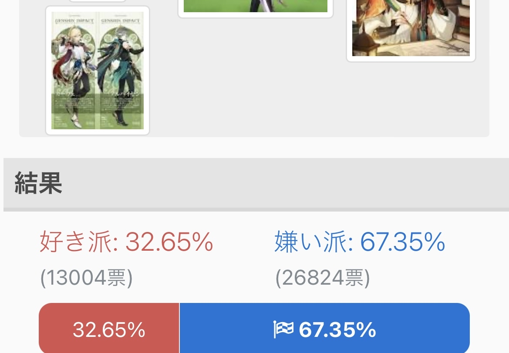
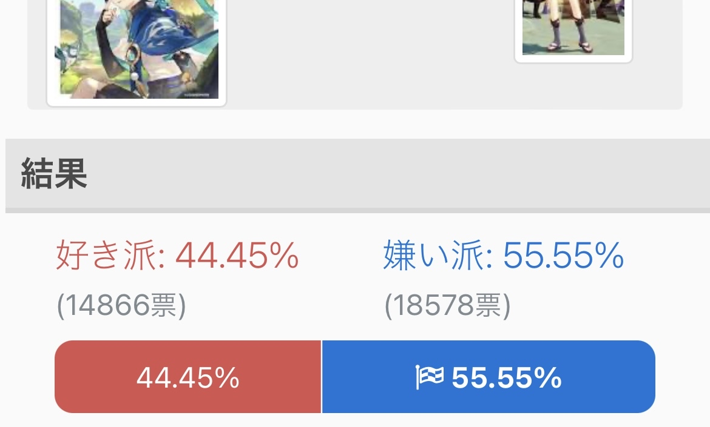

### [不吐不快]从带货角色来看mhy是很知道路人缘是什么样的

Made by ngapost2md (c) ludoux [GitHub Repo](https://github.com/ludoux/ngapost2md)

----

##### 0.[0] \<pid:0\> 2023-08-05 21:13:59 by 没有柠檬c
先有请须弥第一带货女王妮露吧，最明显的就是剧情极其路人但带货猛刷业绩，实际上就是吃了没有剧情塑造的“红利”导致大众对于美少女有普遍好感，因为太普通你也不会因为剧情而讨厌妮露。同理甘雨也是这个道理，剧情很普通，每次出场就玩玩小时候的梗，但是经常作为璃月的带货大使其次就是提纳里和科莱，这两位都是塑造不功不过，甚至小提在须弥因为过于正常人脱颖而出，所以也肩负起了带货的使命。(为什么带货没有沙漠人呢，须弥只有雨林吗？可能只有我这种人才在意吧)
由此我们可以得出一点带货是十分商业性的，一般会选择大众普遍具有好感的角色。而须弥初期草神的路人缘是极好的吧，池子的流水也是非常的高，但为什么直到须弥结束了都没有看到小草神的带货呢mhy，不会是草神风评下降早就在计划之中吧，先塑造一个完美受害者，然后拿她去给一个罪人背书，本来想着平衡一下二人风评，结果是两人锁死风评掉到谷底，真是好似。
说到底文案就是没有这个能力，但就是要洗其他，不惜一切代价也要洗，结果就是赔，太棒了我们赔宝，以一己之力让mhy少赚了那么多钱，不仅自己不能创造价值还拉低了别人的价值，谢谢真的谢谢啊，mhy光明的未来必然不能没有你

----

##### 1.[0] \<pid:707185862\> 2023-08-05 21:15:37 by 等把美又强的剑
可能赔宝走的是机你太美的黑红路线吧。

----

##### 2.[0] \<pid:707185885\> 2023-08-05 21:15:47 by Gdygfdqqqq
联动带货的角色是联动方选吧
你米哈游不想赚钱，但人联动方想啊

----

##### 3.[0] \<pid:707186182\> 2023-08-05 21:17:16 by 憨憨那个大鱼
那枫丹第一带货女王必然是我们常驻·岩·大剑·成女·午餐肉·娜维娅了！

----

##### 4.[3] \<pid:707186220\> 2023-08-05 21:17:28 by piepiero
联动方选人的时候做调研可太变态了，毕竟人家是真的要卖产品的

----

##### 5.[0] \<pid:707186482\> 2023-08-05 21:19:03 by 扶桑初日升
拿草神举例子是不是不太好，神从来没有联动过

----

##### 6.[0] \<pid:707186673\> 2023-08-05 21:20:05 by 经常看书看得开
赔宝卡池都没什么人氪金抽，还指望联动周边有人买么

----

##### 7.[1] \<pid:707186691\> 2023-08-05 21:20:10 by 藤衣半卷苔衣皱
赔宝可是断了米哈游宗门最有天赋的原神的大道根基啊，劝里茶各位跟米哈游有仇的道友对赔宝客气点。

----

##### 8.[0] \<pid:707186976\> 2023-08-05 21:21:56 by 云恭
草神不带货应该不是你以为的原因
带货可能也是品牌方选，不过估计米也会给个角色范围？？

----

##### 9.[0] \<pid:707188767\> 2023-08-05 21:32:56 by 白开水巨好喝
赔钱货的厨子会说赔钱货的联动身价太高，品牌方出不起。

----

##### 10.[0] \<pid:707189381\> 2023-08-05 21:36:49 by 战场原我老婆
你不会觉得真用草神带货会比提纳里差吧

----

##### 11.[0] \<pid:707198218\> 2023-08-05 22:17:38 by 转生能成功吗
草神这个例子没说服力的，神角色都没有联动过

----

##### 12.[0] \<pid:707202136\> 2023-08-05 22:37:07 by 美美把玩
就算草神风评烂成这样，她真的出来带货了也绝对爆卖问题就是想不想吃这个争议

----

##### 13.[0] \<pid:707204587\> 2023-08-05 22:50:17 by ayainchaos
因为是骄傲的米忽悠啊

授权费用是顶格的
出钱的乙方咖位/量级不够是不接受的
早期有些授权角色是要“配货”的(奢侈品业名词，可以回忆一下第一个手机授权角色是谁(没有贬低角色的意思，只说人气)
喜茶竟然可以神里兄妹打包上，璃月冰系姐妹花一起给，已经是了不起的面子啦

至于神角色，是要藏着不轻易给的，不如说按现在这个走势，哪天给了神的授权，可能是真的急了吧

----

##### 14.[0] \<pid:707205039\> 2023-08-05 22:52:46 by 谦谦谦3
虽然妮是联动选的，我记得联动方一起选的另外一个是卡维

~~真的有很多人对这个巨婴好感好吗~~

----

##### 15.[0] \<pid:707205300\> 2023-08-05 22:54:16 by ayainchaos
>[jump](#pid707205039) 谦谦谦3(2023-08-05 22:52) 说: 
>
>虽然妮是联动选的，我记得联动方一起选的另外一个是卡维
>
>~~真的有很多人对这个巨婴好感好吗~~

联动的是日本啊，yhm那边人气很高的

----

##### 16.[0] \<pid:707205665\> 2023-08-05 22:56:24 by 玩c罗玩的
其他三个神也没出来带货 草神估计也不会有联动的
感觉这几个神要不就一起都出现要不就都不出现

----

##### 17.[1] \<pid:707206527\> 2023-08-05 23:01:29 by 谦谦谦3
>[jump](#pid707205300) ayainchaos(2023-08-05 22:54) 说: 
>
>联动的是日本啊，yhm那边人气很高的

你硬要这么说的话，日本那边散兵人气也挺高的

----

##### 18.[0] \<pid:707207786\> 2023-08-05 23:09:13 by sudashui1551
>[jump](#pid707205039) 谦谦谦3(2023-08-05 22:52) 说: 
>
>虽然妮是联动选的，我记得联动方一起选的另外一个是卡维
>
>~~真的有很多人对这个巨婴好感好吗~~

虽然已经出脑了，至少卡维角色故事还是正常的，剧情里的塑造嘛
被诟病最多的也是卖cp

----

##### 19.[0] \<pid:707207919\> 2023-08-05 23:10:03 by 转生能成功吗
>[jump](#pid707204587) ayainchaos(2023-08-05 22:50) 说: 
>
>因为是骄傲的米忽悠啊
>
>授权费用是顶格的
>出钱的乙方咖位/量级不够是不接受的
>早期有些授权角色是要“配货”的(奢侈品业名词，可以回忆一下第一个手机授权角色是谁(没有贬低角色的意思，只说人气)
>喜茶竟然可以神里兄妹打包上，璃月冰系姐妹花一起给，已经是了不起的面子啦
>
>至于神角色，是要藏着不轻易给的，不如说按现在这个走势，哪天给了神的授权，可能是真的急了吧

第一个手机授权角色是胡桃吗？

----

##### 20.[2] \<pid:707208190\> 2023-08-05 23:11:40 by 叉车佬安康鱼
>[jump](#pid707205300) ayainchaos(2023-08-05 22:54) 说: 
>
>联动的是日本啊，yhm那边人气很高的

冷知识，卡维在yhm的嫌恶榜上比散兵高

----

##### 21.[0] \<pid:707208490\> 2023-08-05 23:13:38 by moseyuyan
>[jump](#pid707207919) 转生能成功吗(2023-08-05 23:10) 说: 
>
>第一个手机授权角色是胡桃吗？

我记得是砂糖……？

----

##### 22.[0] \<pid:707208540\> 2023-08-05 23:13:55 by 9with9
所以我真的理解不了日本那边怎么选了卡维联动 感觉真是品牌方选的吗

----

##### 23.[0] \<pid:707208641\> 2023-08-05 23:14:32 by 盆菜
>[jump](#pid707186182) 憨憨那个大鱼(2023-08-05 21:17) 说: 
>
>那枫丹第一带货女王必然是我们常驻·岩·大剑·成女·午餐肉·娜维娅了！

已经确定她是常驻了吗

----

##### 24.[0] \<pid:707209464\> 2023-08-05 23:19:33 by 来点乐子吧
>[jump](#pid707208190) 叉车佬安康鱼(2023-08-05 23:11)说:
>[quote][pid=707205300,37272284,1]Reply[/pid] <b>Post by [uid=61111748]ayainchaos[/uid] (2023-08-05 22:54):</b>  联动的是日本啊，yhm那边人气很高的[s:ac:哭笑][/quote]冷知识，卡维在yhm的嫌恶榜上比散兵高[s:ac:哭笑]

从票数上看还是散兵最高的，足足12000+的讨厌票，比卡维都还多三四千票。

----

##### 25.[0] \<pid:707210770\> 2023-08-05 23:27:35 by ayainchaos
>[jump](#pid707207919) 转生能成功吗(2023-08-05 23:10) 说: 
>
>第一个手机授权角色是胡桃吗？

是砂糖，开服不久就做的，你看现在甚至第一反应想不起来

----

##### 26.[3] \<pid:707210940\> 2023-08-05 23:28:43 by 叉车佬安康鱼
>[jump](#pid707209464) 来点乐子吧(2023-08-05 23:19) 说: 
>
>从票数上看还是散兵最高的，足足12000+的讨厌票，比卡维都还多三四千票，全角色讨厌票最多。
>
>但是散兵同时又有10000喜欢票，讨厌率就下去了。

你说的哪个榜，好き嫌い上卡维嫌票26824，散兵18578，卡维吊打散兵，虽然只是匿名投票但能说明一部分问题

----

##### 27.[0] \<pid:707211081\> 2023-08-05 23:29:49 by tag一定要打对真菌
>[jump](#pid707186482) 扶桑初日升(2023-08-05 21:19) 说: 
>
>拿草神举例子是不是不太好，神角色都没有联动过

鸣神组在日本刚刚联动过  
编辑：不是联动是广告，记错了

----

##### 28.[0] \<pid:707212107\> 2023-08-05 23:36:21 by 叉车佬安康鱼
>[jump](#pid707210940) 叉车佬安康鱼(2023-08-05 23:28) 说: 
>
>你说的哪个榜，好き嫌い上卡维嫌票26824，散兵18578，卡维吊打散兵，虽然只是匿名投票但能说明一部分问题

补个图吧，仅供参考，卡维人气没散兵高，讨厌的比散兵多

----

##### 29.[0] \<pid:707213617\> 2023-08-05 23:46:33 by 予晞
>[jump](#pid707205300) ayainchaos(2023-08-05 22:54) 说: 
>
>联动的是日本啊，yhm那边人气很高的

真的吗，原神厌恶榜第一可是立本人自己投的

----

##### 30.[0] \<pid:707215285\> 2023-08-05 23:58:32 by ayainchaos
>[jump](#pid707212107) 叉车佬安康鱼(2023-08-05 23:36) 说: 
>
>补个图吧，仅供参考，卡维人气没散兵高，讨厌的比散兵多
>
>

是蓝鸟蒙蔽了我的双眼

----

##### 31.[0] \<pid:707218029\> 2023-08-06 00:17:47 by 甘雨榨苷我
>[jump](#pid707186482) 扶桑初日升(2023-08-05 21:19) 说: 
>
>拿草神举例子是不是不太好，神角色都没有联动过

韩国的联动

----

##### 32.[0] \<pid:707218256\> 2023-08-06 00:19:24 by 憨憨那个大鱼
>[jump](#pid707208641) 盆菜(2023-08-05 23:14) 说: 
>
>已经确定她是常驻了吗

还没确定但大概率了先做好心理准备吧，打个预防针总没错

----

##### 33.[0] \<pid:707218937\> 2023-08-06 00:24:45 by 谦谦谦3
>[jump](#pid707208540) 9with9(2023-08-05 23:13) 说: 
>
>所以我真的理解不了日本那边怎么选了卡维联动 感觉真是品牌方选的吗

刚去研究了一下联动，出的那个立牌图，第一排卡维在海哥旁边，剩下的第一排全是五星。cpf心思明显了

----

##### 34.[0] \<pid:707219222\> 2023-08-06 00:26:53 by addyoumiha
>[jump](#pid707212107) 叉车佬安康鱼(2023-08-05 23:36) 说: 
>
>补个图吧，仅供参考，卡维人气没散兵高，讨厌的比散兵多
>
>

去看了圈，这榜怎么大部分角色喜欢讨厌差不多五五开，是专门输出黑泥的吗

----

##### 35.[0] \<pid:707221424\> 2023-08-06 00:44:10 by 江右商帮
>[jump](#pid707218029) 甘雨榨苷我(2023-08-06 00:17) 说: 
>
>韩国的联动
>

这个不是联动，是快闪，好像是这样叫。去年主题是璃月，今年是稻妻，明年应该须弥了

----

##### 36.[0] \<pid:707224186\> 2023-08-06 01:08:31 by 来点乐子吧
>[jump](#pid707210940) 叉车佬安康鱼(2023-08-05 23:28)说:
>[quote][pid=707209464,37272284,2]Reply[/pid] <b>Post by [uid=65042747]来点乐子吧[/uid] (2023-08-05 23:19):</b>  从票数上看还是散兵最高的，足足12000+的讨厌票，比卡维都还多三四千票，全角色讨厌票最多。  但是散兵同时又有10000喜欢票，讨厌率就下去了。[/quote][s:ac:哭笑]你说的哪个榜，好き嫌い上卡维嫌票26824，散兵18578，卡维吊打散兵，虽然只是匿名投票但能说明一部分问题

是咩，那我可能搞混了

