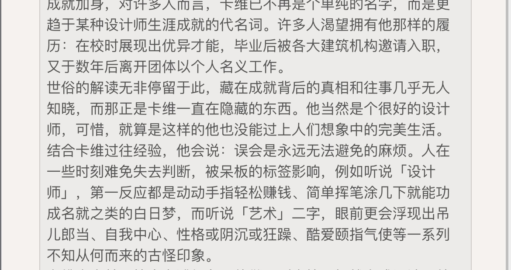

### [不吐不快]看了水神和那维，更难理解原神在3.0版本的做法了

Made by ngapost2md (c) ludoux [GitHub Repo](https://github.com/ludoux/ngapost2md)

----

##### 0.[0] \<pid:0\> 2023-08-05 21:32:10 by cxjlcxl
很明显，水神无论是人设还是剧情，以米哈游现在的文案水平来说都很难做到比当初刚开须弥的纳西妲(萝莉+善良+笼中鸟的设计)更讨喜，那维的建模也明显不如艾尔海森。
但就是纳西妲和艾尔海森这两个天胡开局的角色，闭着眼睛都能捧出人气的设计，居然最后会直接搞得一落千丈，简直难以理解。而且纳西妲是给真正内部爱的散兵当垫子也就算了，看得出来散兵也是用心在设计建模强度和剧情抬轿(虽然限于文案水平越写越烂)，卡维把艾尔海森人设绑烂了，但自己也是个毫无强度和塑造的四星，剧情人设强度被同样是四星的珐露珊甚至莱伊拉三百六十度吊打。
从商业角度我难以理解这是在干什么，以前剧情不是没有写得烂的时候，但人气角色从剧情上也很少受这么大的损害，之前朋友跟我说可能是尝试新路线，失败了也无所谓还有枫丹，现在一看好嘛枫丹开头一看更没吸引力了，难道米哈游真的嫌赚的太多？

----

##### 1.[2] \<pid:707188897\> 2023-08-05 21:33:40 by 不断寻觅着
不要从商业角度去分析老米，他们不是那种正常的为客户服务然后赚钱的商业公司，他们怎么想的，只有他们自己知道。

----

##### 2.[0] \<pid:707188978\> 2023-08-05 21:34:09 by 一只扁扁
内部xp大放送罢了
玩家算个啥

----

##### 3.[0] \<pid:707189039\> 2023-08-05 21:34:33 by UID3563849
你理解不了米哈游吗？那就对了

----

##### 4.[0] \<pid:707189650\> 2023-08-05 21:38:29 by 笑着选择原谅它
你理解了米哈游才可怕，庆幸自己还是正常人吧

----

##### 5.[1] \<pid:707189902\> 2023-08-05 21:40:17 by 雲玩家かみかぜ
他们说枫丹做了两年，难不成真是各玩各的吗，这算什么，一个游戏里塞七个游戏？

----

##### 6.[1] \<pid:707190063\> 2023-08-05 21:41:16 by jwbdbx
原一直这样啊，岩雷胡待遇？

----

##### 7.[0] \<pid:707190134\> 2023-08-05 21:41:49 by 藤衣半卷苔衣皱
怎么，你对米哈游当众释放内部小众xp不满意吗？

----

##### 8.[0] \<pid:707190380\> 2023-08-05 21:43:30 by 逆空空空空空_
本来以为米桑是无情的商人，后来发现是厕味浓郁的猛干

----

##### 9.[0] \<pid:707190943\> 2023-08-05 21:47:17 by cxjlcxl
>[jump](#pid707190063) jwbdbx(2023-08-05 21:41) 说: 
>
>原一直这样啊，岩雷胡待遇？

岩雷胡的待遇也各有各的问题，但他们更多的看起来像内部没什么偏爱导致剧情敷衍或者干脆没剧情，都没有出过很致命的“让花钱的厨子觉得这个人没法厨了”的情况(钟离初版算一个吧，其实这个也挺离谱的，但起码人设没崩)
如果类比纳西妲的话，起码要到“绑定一个争议极大不讨喜的角色且两个人共同出现的剧情非常离谱还存在重大道德问题”的程度，感觉这三位现在还不至于

----

##### 10.[2] \<pid:707191260\> 2023-08-05 21:49:20 by 笑着选择原谅它
>[jump](#pid707190943) cxjlcxl(2023-08-05 21:47) 说: 
>
>岩雷胡的待遇也各有各的问题，但他们更多的看起来像内部没什么偏爱导致剧情敷衍或者干脆没剧情，都没有出过很致命的“让花钱的厨子觉得这个人没法厨了”的情况(钟离初版算一个吧，其实这个也挺离谱的，但起码人设没崩)
>如果类比纳西妲的话，起码要到“绑定一个争议极大不讨喜的角色且两个人共同出现的剧情非常离谱还存在重大道德问题”的程度，感觉这三位现在还不至于

我猜他们是想用高人气带动低人气，结果水平太差变成烂做一团

----

##### 11.[1] \<pid:707191274\> 2023-08-05 21:49:24 by akanatsu
想不明白就想想猛干语录，我们原自己的猛干也爱看尖叫抓挠啊，不然呢

----

##### 12.[0] \<pid:707191480\> 2023-08-05 21:51:00 by 兔兔源
很重要吗，也就你这样的以下略

----

##### 13.[0] \<pid:707191574\> 2023-08-05 21:51:37 by 云恭
我觉得你要是能理解策划可能觉得3.3到3.6都是对草神不错的塑造，大概你就可以做原神的文案了
顺便我觉得水神不好说，但是恐怕那维重要性和塑造量绝对不低，怎么可以只用建模考虑策划的想法，策划可能就喜欢现在的建模呢

----

##### 14.[0] \<pid:707191739\> 2023-08-05 21:52:18 by cxjlcxl
>[jump](#pid707191260) 笑着选择原谅它(2023-08-05 21:49) 说: 
>
>我猜他们是想用高人气带动低人气，结果水平太差变成烂做一团

这个可以解释为什么让纳西妲带散兵，但还是解释不了为什么艾尔海森绑卡维，难道他们的市场调研真的以为女玩家为俩男的CP消费的实力一定大于卖单人，哪怕另一个角色做得稀烂？

----

##### 15.[0] \<pid:707192164\> 2023-08-05 21:53:47 by cxjlcxl
>[jump](#pid707191574) 云恭(2023-08-05 21:51) 说: 
>
>我觉得你要是能理解策划可能觉得3.3到3.6都是对草神不错的塑造，大概你就可以做原神的文案了
>顺便我觉得水神不好说，但是恐怕那维重要性和塑造量绝对不低，怎么可以只用建模考虑策划的想法，策划可能就喜欢现在的建模呢

你说的对，可能我判断角色好坏的标准从一开始就和他们内部左了，但米哈游的流水也不能让他们意识到自己哪里出了问题吗

----

##### 16.[0] \<pid:707192232\> 2023-08-05 21:54:01 by A—lhaitham
很重要么，只有我这种艾尔海森厨会在意吧

----

##### 17.[0] \<pid:707192488\> 2023-08-05 21:54:47 by 吃烤肉去啊
>[jump](#pid707191260) 笑着选择原谅它(2023-08-05 21:49)说:
>[quote][pid=707190943,37272513,1]Reply[/pid] <b>Post by [uid=65199060]cxjlcxl[/uid] (2023-08-05 21:47):</b>  岩雷胡的待遇也各有各的问题，但他们更多的看起来像内部没什么偏爱导致剧情敷衍或者干脆没剧情，都没有出过很致命的“让花钱的厨子觉得这个人没法厨了”的情况(钟离初版算一个吧，其实这个也挺离谱的，但起码人设没崩) 如果类比纳西妲的话，起码要到“绑定一个争议极大不讨喜的角色且两个人共同出现的剧情非常离谱还存在重大道德问题”的程度，感觉这三位现在还不至于[/quote]我猜他们是想用高人气带动低人气，结果水平太差变成烂做一团

其实从一开始散兵就是冲着用雷神的人气带他的意图去设计的。
把走捷径视作理所当然，忘记了自己本应有的样子，最终只是一团不可名状的拼凑物寄生在别人的设定上罢了。
无论是对雷，还是对草。

----

##### 18.[0] \<pid:707192504\> 2023-08-05 21:54:51 by jwbdbx
>[jump](#pid707190943) cxjlcxl(2023-08-05 21:47) 说: 
>
>岩雷胡的待遇也各有各的问题，但他们更多的看起来像内部没什么偏爱导致剧情敷衍或者干脆没剧情，都没有出过很致命的“让花钱的厨子觉得这个人没法厨了”的情况(钟离初版算一个吧，其实这个也挺离谱的，但起码人设没崩)
>如果类比纳西妲的话，起码要到“绑定一个争议极大不讨喜的角色且两个人共同出现的剧情非常离谱还存在重大道德问题”的程度，感觉这三位现在还不至于

雷神生日信和胡桃连着唱rap多次和辛焱一起卖棺埋七七吹捧等还不算吗？如果你是指散草那种，那只能说像散草这样的，整个二次元都很难找到可以打的了

----

##### 19.[2] \<pid:707192805\> 2023-08-05 21:55:50 by 吃烤肉去啊
>[jump](#pid707191739) cxjlcxl(2023-08-05 21:52)说:
>[quote][pid=707191260,37272513,1]Reply[/pid] <b>Post by [uid=65138941]笑着选择原谅它[/uid] (2023-08-05 21:49):</b>  我猜他们是想用高人气带动低人气，结果水平太差变成烂做一团[/quote]这个可以解释为什么让纳西妲带散兵，但还是解释不了为什么艾尔海森绑卡维，难道他们的市场调研真的以为女玩家为俩男的CP消费的实力一定大于卖单人，哪怕另一个角色做得稀烂？

我说一种可能哈，有没有可能，纯粹只是因为编剧想看女玩家“尖叫抓挠”呢

----

##### 21.[0] \<pid:707193702\> 2023-08-05 21:59:06 by Per-aspera-ad-astra
我猜想过的解释就是他们自己内部也混乱不堪了，不是说有六七百个小组长么…不同人揽着一个个割裂式Timeline的活，从3.0梦幻般开局，没想到3.6是这样落幕的，没想着好好塑造角色整体光顾着四分五裂的推活扯皮xp放出了

----

##### 22.[0] \<pid:707193737\> 2023-08-05 21:59:16 by 云恭
>[jump](#pid707192164) cxjlcxl(2023-08-05 21:53) 说: 
>
>你说的对，可能我判断角色好坏的标准从一开始就和他们内部左了，但米哈游的流水也不能让他们意识到自己哪里出了问题吗

意识不意识到，他们品味变不了吧，就像可能很多编剧看过爆款剧，不代表他们照着写，最后就不会还会是他们水准下的烂片。

----

##### 23.[1] \<pid:707193810\> 2023-08-05 21:59:34 by kiyota119
我感觉是他们真觉得自己这套卖的出去啊
不能用常人想法来理解，你看晋江那些娇妻文学，老多人看呢，你把mhy推须弥那两位扶不上的类比一下这类文受众，就好理解了
没准人还觉得不买账的人“没品”呢

----

##### 24.[0] \<pid:707193946\> 2023-08-05 22:00:06 by 神無千夜
米()可不在乎钱，它只想恶心玩家

----

##### 25.[0] \<pid:707193960\> 2023-08-05 22:00:10 by cxjlcxl
>[jump](#pid707192504) jwbdbx(2023-08-05 21:54) 说: 
>
>雷神生日信和胡桃连着唱rap多次和辛焱一起卖棺埋七七吹捧等还不算吗？如果你是指散草那种，那只能说像散草这样的，整个二次元都很难找到可以打的了

想了一下你说的对，我被“把高人角色做烂掉”的做法给冲击到了导致没有仔细想，其实在有高人气角色的情况下完全不去做维护也是很奇怪的事，好像现成的摇钱树丢在角落积灰偶尔还踹两脚一样，我确实理解不了米哈游

----

##### 26.[0] \<pid:707195787\> 2023-08-05 22:06:59 by cxjlcxl
>[jump](#pid707193506) FrozenFrigidFrantic(2023-08-05 21:58) 说: 
>
>那就反过来考虑有没有一种可能，人气太高对米忽悠来说是一种需要密切关注，乃至值得遏制的现象呢？参考钟离和八重。

这就是我的疑问啊，为什么会有商业公司嫌摇钱树太多呢

----

##### 27.[1] \<pid:707196542\> 2023-08-05 22:10:13 by 嘟嘟水
有没有一种可能就是，他们真的觉得卡维这样塑造并不烂，能卖得出去呢。毕竟现在这样的卡维，是他们拿3.6一整个学园祭让卡维当主角塑造出来的诶。前所未有的四星待遇了呀
成就也有啊，cp29知妙一整条街呢，都美帝了诶。同人女的声音都这么大了，给米哈游花钱的厨子要紧吗？你说的这种事情，只有艾尔海森厨才会觉得重要吧  
实际上须弥真正有摇钱树潜力，刚出图透就拿了人气第一，回回宣传海报站c位，强度还极高的妮露被做成了女露人才是我最不能理解的

----

##### 28.[0] \<pid:707197369\> 2023-08-05 22:13:56 by 0123cola
我觉得是公司内部真的就好这一口，而且他们觉得玩家会镍币接受，总之不能理解米是好事，至少脑子还是正常的

----

##### 29.[0] \<pid:707197375\> 2023-08-05 22:13:57 by 食茄少年
只有我这种海厨会觉得重要吧我们其他cp不也蒸蒸日上吗，至于厨子死活谁在意呢，不磕海卡才是你们海厨的问题吧

----

##### 30.[0] \<pid:707197599\> 2023-08-05 22:15:00 by 莉雅-
你为什么会认为能搞出初版钟离的公司会是正常的商业公司？跟这个一比，我觉得限五给四星垫都不算特别离谱了

----

##### 31.[0] \<pid:707197738\> 2023-08-05 22:15:38 by lien11
有没有可能，皮套人呢

----

##### 32.[0] \<pid:707197920\> 2023-08-05 22:16:22 by 终了后的序章
没事，让流水继续暴跌之后他们就会反过来理解我们了

----

##### 33.[0] \<pid:707198838\> 2023-08-05 22:20:35 by plume-羽
>[jump](#pid707196542) 嘟嘟水(2023-08-05 22:10) 说: 
>
>有没有一种可能就是，他们真的觉得卡维这样塑造并不烂，能卖得出去呢。毕竟现在这样的卡维，是他们拿3.6一整个学园祭让卡维当主角塑造出来的诶。前所未有的四星待遇了呀
>成就也有啊，cp29知妙一整条街呢，都美帝了诶。同人女的声音都这么大了，给米哈游花钱的厨子要紧吗？你说的这种事情，只有艾尔海森厨才会觉得重要吧  
>实际上须弥真正有摇钱树潜力，刚出图透就拿了人气第一，回回宣传海报站c位，强度还极高的妮露被做成了女露人才是我最不能理解的

对啊，为啥妮露会变成女露人啊，须弥就这么一个五星少女，mhy也知道她赚钱，只要给她正常的剧情量和正常的传说。。。

----

##### 34.[0] \<pid:707199168\> 2023-08-05 22:22:11 by akanatsu
正经说其实我还想说一句迪希雅，内部视角怕不是用扶贫办教育给国服上价值，帮助移民越墙给欧美服上价值，强度烂了就烂了一定能被上价值堵嘴堵住，这种对控制社区的傲慢爆棚可能才是很多决策商业上说不通的原因

----

##### 35.[0] \<pid:707199205\> 2023-08-05 22:22:21 by FrozenFrigidFrantic
>[jump](#pid707195787) cxjlcxl(2023-08-05 22:06) 说: 
>
>这就是我的疑问啊，为什么会有商业公司嫌摇钱树太多呢

因为贪，当人气维持在一定平衡时，就能让各路厨子自由搏击，造出生机勃勃的景象。而只有一个领头羊时，就没话题度了。唯一可能出现的就是玩家因强度集体冲刺。所以钟离一定是mhy最后悔的设计，没有之一。

----

##### 37.[1] \<pid:707199512\> 2023-08-05 22:23:46 by 塔克里里
当你把一切都看是猛干们为了看到玩家尖叫抓挠而做的后，一切都会显得很合理
但我的困惑是，这一地鸡毛里看起来挺正常的3.0-3.2到底是谁写的，把我骗进来杀？

----

##### 38.[0] \<pid:707199826\> 2023-08-05 22:25:24 by abasiyaluo2
>[jump](#pid707191739) cxjlcxl(2023-08-05 21:52):

因为开服璃月那对很成功吧，稻妻没有强推所以没有特别大热的，到了须弥再不推一对新的，那腐向热度就要降了，所以才猛推试图再度复制成功？

----

##### 39.[1] \<pid:707200219\> 2023-08-05 22:27:26 by cxjlcxl
>[jump](#pid707199168) akanatsu(2023-08-05 22:22) 说: 
>
>正经说其实我还想说一句迪希雅，内部视角怕不是用扶贫办教育给国服上价值，帮助移民越墙给欧美服上价值，强度烂了就烂了一定能被上价值堵嘴堵住，这种对控制社区的傲慢爆棚可能才是很多决策商业上说不通的原因

我都忘了迪希雅了，她的情况跟初版钟离略像，人设建模都好，泛人气高，有一点附加文化价值，然后强度做崩
可能他们真的很不愿意看到社区一边倒夸奖一定要搞点事？

----

##### 40.[0] \<pid:707200345\> 2023-08-05 22:28:02 by Frostte
>[jump](#pid707198838) plume-羽(2023-08-05 22:20) 说: 
>
>对啊，为啥妮露会变成女露人啊，须弥就这么一个五星少女，mhy也知道她赚钱，只要给她正常的剧情量和正常的传说。。。

等一下，正常的剧情量+高人气你不怕成为下一个草神/艾尔海森？
毕竟文案看上去只有在挑好用的垫子这件事上有脑子

----

##### 42.[4] \<pid:707201783\> 2023-08-05 22:35:27 by 迦勒底在逃员工
我可以在这里说我在消失了的楼里没来得及发出去的话吗因为我真的觉得卡维这角色很套皮啊！！！
我也不知道这么表述大家能不能理解我的意思：单看卡维的角色故事，情感性的、抽象的感触太多了——字真的很多，但读起来感觉“很虚”。我有种文案在替卡维、替我去“感受”的错觉。
截几张图

在原的wiki上我随便点了几个没看过的角色故事：万叶，珐姐，白术。是凑巧了吗，他们恰好都不是卡维角色故事这种情况，他们的角色故事都更偏向于特定的场景+一些对话的模式，像是只给你掀开窗帘的一角，让你从这个隐秘的视角去窥视/认识该角色的一些特质。
但卡维的不是，也不知道还有多少角色故事也和卡维的情况差不多，其实艾尔海森的角色故事行文的脉络与卡维的我感觉是类似的：第一眼感觉长、片断化的场景和对话比较少、大段的是阐述性的文字。
但区别是艾尔海森的故事里没有那么多感触性的抽象东西，而且故事所覆盖的角色人生比例尺要更短。
简而言之，卡维的角色故事给我的主要感觉就是：卡维的故事拉得——太长太长了！他的角色故事呈现出来的内容是贯穿了他的整个人生的。
打个比喻的话，如果别人的角色故事是都是只掀开一角窗帘，卡维的角色故事是连窗户带门甚至连房顶都要给你掀开了。
长还不算完，感触性的结论又这么多，虚空中仿佛真的能听到有声音传来：“看啊他的人生多么光芒四射！但他又是这么的脆弱和不幸，不信您看这里这里和这里，我明明白白写了……”
而我be like误入屈臣氏被热情导购包围询问的i 人：(缓缓退出房间)
虽然也许这只是一种写作的风格吧……但我个人很不喜欢这种类型的故事。本质上是因为他几乎没有留白的空间，对卡维此人的定性和卡维的感受占满了故事的篇幅，那你都替我感受完了，我还看个啥劲儿啊？那我还不如直接去看剧情了，当然了结果就是看完剧情被创得更死……
反正从卡维艾尔海森看来米桑是真的不在乎玩家诉求的，他们大概就是那种我做了你不吃你就等着饿死吧的傲慢心态，即使他做饭的动机都值得商榷但是“笔在他手里”，玩家就只能抓心挠肝难受，我是真的想不到多傲慢才能这样视角色的塑造和玩家诉求如无物随意揉捏……建议大家还是能跑就跑吧……

pg：还没成功跑路的海厨，这是我应得的，没关系，我还能挺住。

----

##### 43.[1] \<pid:707201947\> 2023-08-05 22:36:17 by Lilith330
一直觉得米哈游有一种我知道大众喜欢什么但是我偏不这样，我就要改造你们的xp的感觉
他们看着论坛里一堆我男我也，我的xp被mhy改造了的帖子一定笑的很开心吧
我的建议是这些东西的含金量有多少你们难道真的不知道吗
明明自己也知道人气高的角色是哪些，却偏要投资自以为能爆火的“新款”，那投资失败也是很正常的，自己受着吧

----

##### 44.[1] \<pid:707202401\> 2023-08-05 22:38:29 by wjxjh
这…从猛干看它们可能喜欢在厕所调研，毕竟其它和其它cp在厕所是真的大受欢迎(指控场

----

##### 45.[0] \<pid:707203076\> 2023-08-05 22:42:04 by 雷军单推人
>[jump](#pid707192805) 吃烤肉去啊(2023-08-05 21:55) 说: 
>
>我说一种可能哈，有没有可能，纯粹只是因为编剧想看女玩家“尖叫抓挠”呢

烤肉哥你也恶堕了啊

----

##### 46.[0] \<pid:707203280\> 2023-08-05 22:43:06 by 海上飘丝瓜
>[jump](#pid707199826) abasiyaluo2(2023-08-05 22:25) 说: 
>
>因为开服璃月那对很成功吧，稻妻没有强推所以没有特别大热的，到了须弥再不推一对新的，那腐向热度就要降了，所以才猛推试图再度复制成功？
>作为一个平常不太看腐向的人，我觉得海卡这对底子其实还可以，可以理解为什么有cp潜力，但是实际游戏里推的方式令人咋舌

3.0留言板很多人都觉得想起室友有意思+隔壁凯文和苏，对应到这边一个名字像一个长得像

加上俩人其实都挺帅的，也代表了这游戏目前的成男建模技术巅峰(设计好坏太主观咱不讨论)，海卡也算梦幻开局了，其实就这样参考前面那几对，无互动或少互动结束，也是一对挺火的cp

但架不住非要画蛇添足，一道菜放一勺糖好吃，米哈游一口气放一百勺，这下子一定一百倍好吃了吧

----

##### 47.[0] \<pid:707203577\> 2023-08-05 22:44:43 by mdy3502
其他的还能用内部自以为是，误判市场来解释。迪希雅是最最抽象的，这辈子都想不明白把一个高人气五星角色强度故意做烂，再扔进常驻对它赚钱到底有什么好处。

----

##### 50.[0] \<pid:707204536\> 2023-08-05 22:49:59 by 吃烤肉去啊
>[jump](#pid707203076) 雷军单推人(2023-08-05 22:42)说:
>[quote][pid=707192805,37272513,1]Reply[/pid] <b>Post by [uid=63987990]吃烤肉去啊[/uid] (2023-08-05 21:55):</b>  我说一种可能哈，有没有可能，纯粹只是因为编剧想看女玩家“尖叫抓挠”呢[s:ac:哭笑][/quote]烤肉哥你也恶堕了啊[s:ac:哭笑]

我能说有一些角色第一眼就能看出来是专门卖给女玩家“尖叫抓挠”的吗李猛干真的没超出我预料。
而且Mhy想写爱恨情仇、最喜欢贵圈真乱，也全被我说中了。

----

##### 51.[1] \<pid:707204579\> 2023-08-05 22:50:13 by 荣誉璃月人
理解不了就对了，我感觉米的那帮人对站着把钱挣了有种病态的追求。问题是在正常公司眼中的站着把钱挣了是接受玩家的合理建议，拒绝玩家的不合理建议。而米眼中的站着把钱挣了是我必须得给玩家喂屎，不然这钱我挣着心虚。纯纯的有毛病。

----

##### 52.[0] \<pid:707205191\> 2023-08-05 22:53:38 by 超定归约律
>[jump](#pid707201783) 迦勒底在逃员工(2023-08-05 22:35) 说: 
>
>我可以在这里说我在消失了的楼里没来得及发出去的话吗因为我真的觉得卡维这角色很套皮啊！！！
>我也不知道这么表述大家能不能理解我的意思：单看卡维的角色故事，情感性的、抽象的感触太多了——字真的很多，但读起来感觉“很虚”。我有种文案在替卡维、替我去“感受”的错觉。
>截几张图
>
>[img]./mon_202308/05/l2Q2s-ghj6ZyT3cSwi-h6

不能能赞同了
卡维的文案，不限于角色故事，包括他自己的语音，别的角色对他的评语，都非常露骨地让人感到有个人在透过这些文字对玩家倒苦水。

----

##### 53.[0] \<pid:707205617\> 2023-08-05 22:56:09 by wjxjh
>[jump](#pid707203280) 海上飘丝瓜(2023-08-05 22:43) 说: 
>
>3.0留言板很多人都觉得想起室友有意思+隔壁凯文和苏，对应到这边一个名字像一个长得像
>
>加上俩人其实都挺帅的，也代表了这游戏目前的成男建模技术巅峰(设计好坏太主观咱不讨论)，海卡也算梦幻开局了，其实就这样参考前面那几对，无互动或少互动结束，也是一对挺火的cp
>
>但架不住非要画蛇添足，一道菜放一勺糖好吃，米哈游一口气放一百勺，这下子一定一百倍好吃了吧

看到做菜放糖，点开ip看了眼，我就说为什么做菜要放糖

----

##### 54.[0] \<pid:707205621\> 2023-08-05 22:56:11 by 海上飘丝瓜
>[jump](#pid707201947) Lilith330(2023-08-05 22:36) 说: 
>
>一直觉得米哈游有一种我知道大众喜欢什么但是我偏不这样，我就要改造你们的xp的感觉
>他们看着论坛里一堆我男我也，我的xp被mhy改造了的帖子一定笑的很开心吧
>我的建议是这些东西的含金量有多少你们难道真的不知道吗
>明明自己也知道人气高的角色是哪些，却偏要投资自以为能爆火的“新款”，那投资失败也是很正常的，自己受着吧

恰恰相反，这些cp塑造没有一个是因为挑战新鲜时髦事物乱凑导致的爆雷，甚至是因为表现过于老土了，一个为了爱可以不顾原则，什么罪孽什么过去通通一笔勾销；一个经典欠债赖别人家，还处处嫌弃人家怎么怎么样，然后这种行为被作者归结为独立自我。

这不就是我小时候偷看我妈妈藏在床底下的言情小说的那些套路吗，清穿之我是王爷小丫鬟，霸道总裁之我是女白领，纯情丫头火辣辣……这种

----

##### 55.[0] \<pid:707205733\> 2023-08-05 22:56:47 by cxjlcxl
>[jump](#pid707203577) mdy3502(2023-08-05 22:44) 说: 
>
>别的还能用内部品味狗屎，误判市场来解释。迪希雅是最最抽象的，这辈子都想不明白把一个高人气五星角色强度故意做烂，再扔进常驻对它赚钱到底有什么好处。

是这样，越想越费解，以前骂腾讯网易，但人家确实明牌来赚钱的，米哈游倒好，感觉是来给大家添堵的

----

##### 56.[0] \<pid:707206340\> 2023-08-05 23:00:15 by 花瓣飘零
有一说一，3.4活动主角牵头是瑶瑶，其他人群像，3.5是科莱砂糖加群像，3.6是卡维牵头，须弥所有人群像，3.7是草猫夏洛蒂牵头的群像，须弥主线结束后，大版本活动四星和npc 当主角挺常见的，往死里塑造都没关系，反正又不卖钱，又无人care，卡维这种精神内涵的其实女角色也有各种各样的心理问题嘛，但卡维一个成男爆典真的杀伤力太强显得存在感高，但是写烂了也无所谓啊又不卖钱，五星写不好，节奏一出来就废了，写得好又要花很多功夫，而且他们很明显的写不好，文案让五星去当路人也不好好写，大概率是怕担责，很多五星出来也就是凹标签，根本没打算好好写，这几个版本都是一个得过且过，的状态，游戏无聊到爆炸

----

##### 57.[0] \<pid:707206777\> 2023-08-05 23:02:57 by お宅不是
>[jump](#pid707191739) cxjlcxl(2023-08-05 21:52) 说: 
>
>这个可以解释为什么让纳西妲带散兵，但还是解释不了为什么艾尔海森绑卡维，难道他们的市场调研真的以为女玩家为俩男的CP消费的实力一定大于卖单人，哪怕另一个角色做得稀烂？

2-4w一个月16薪，是我我就无视市场调研，直接xp输出拜托艾尔海森多卖一个亿，咬笔头的能多拿哪怕十万吗？

----

##### 58.[0] \<pid:707207145\> 2023-08-05 23:05:12 by 迦勒底在逃员工
>[jump](#pid707205191) 超定归约律(2023-08-05 22:53) 说: 
>
>不能能赞同了
>卡维的文案，不限于角色故事，包括他自己的语音，别的角色对他的评语，都非常露骨地让人感到有个人在透过这些文字对玩家倒苦水。  
>味儿冲的要死

是真的……原来不是我自己这么觉得……
别的角色故事给人感觉就真的是旁观者看完了随便我自己理解，但卡维的故事我真的明显觉得有种文案按着我的头说“我都写清楚了！你就要这么理解！”的感觉
没有主观情绪代入我是不信能写出这种故事来的

----

##### 59.[0] \<pid:707207659\> 2023-08-05 23:08:23 by 新年才醒
>[jump](#pid707206777) お宅不是(2023-08-05 23:02) 说: 
>
>2-4w一个月16薪，是我我就无视市场调研，直接xp输出拜托艾尔海森多卖一个亿，咬笔头的能多拿哪怕十万吗？

这个东西应该是按项目组发绩效奖金吧   只能说成了大家都发快快乐乐    不成那也是拉其他岗位一起扣奖金属实不亏

----

##### 61.[0] \<pid:707208418\> 2023-08-05 23:13:08 by abasiyaluo2
>[jump](#pid707203909) 嘟嘟水(2023-08-05 22:46):

可能我真的老了吧，一直觉得咱们这辈人小时候浸淫了这么多二次元名作，对什么是一般向或者经典口味应该有数，为什么最近做出来的东西会这么抽象呢

----

##### 62.[0] \<pid:707210634\> 2023-08-05 23:26:43 by 陌湮
>[jump](#pid707203577) mdy3502(2023-08-05 22:44):

我从数值ch上感受到的是对黑皮的恶意
凯亚 辛焱 赛诺 坎蒂丝 迪希雅，其中也就凯亚好点

----

##### 63.[0] \<pid:707210936\> 2023-08-05 23:28:42 by mdy3502
>[jump](#pid707205733) cxjlcxl(2023-08-05 22:56) 说: 
>
>是这样，越想越费解，以前骂腾讯网易，但人家确实明牌来赚钱的，米哈游倒好，感觉是来给大家添堵的

年轻不懂事的时候觉得冲着赚钱去的文艺作品不免媚俗，终归下乘。后来才明白完全不在乎市场的创作产物才是真·不可名状的恐怖。

----

##### 64.[1] \<pid:707213037\> 2023-08-05 23:42:40 by abasiyaluo2
>[jump](#pid707210634) 陌湮(2023-08-05 23:26)说:
><b>Reply to [pid=707203577,37272513,3]Reply[/pid] Post by [uid=42103115]mdy3502[/uid] (2023-08-05 22:44)</b>我从数值ch上感受到的是对黑皮的恶意[s:a2:偷吃] 凯亚 辛焱 赛诺 坎蒂丝 迪希雅，其中也就凯亚好点 虽然不非要迎合欧美的zzzq，但这几位的强度一言难尽 连个正常强度的都没有，也太凑巧了点[s:a2:不活了]

对数值ch我只有一句话想说，即“没品的东西”

----

##### 65.[0] \<pid:707214468\> 2023-08-05 23:52:44 by 八丙羽
>[jump](#pid707201783) 迦勒底在逃员工(2023-08-05 22:35) 说: 
>
>我可以在这里说我在消失了的楼里没来得及发出去的话吗因为我真的觉得卡维这角色很套皮啊！！！
>我也不知道这么表述大家能不能理解我的意思：单看卡维的角色故事，情感性的、抽象的感触太多了——字真的很多，但读起来感觉“很虚”。我有种文案在替卡维、替我去“感受”的错觉。
>截几张图
>
>[img]./mon_202308/05/l2Q2s-ghj6ZyT3cSwi-h6

不知道该说什么，毕竟同为还没跑路的海厨心态很是复杂。
文案的表达方式我意见一般不大，你能写好就行…卡单看文案一开始可能想写的人设，其实我应该挺喜欢才对。
只是后来被创死了，被米的剧情和各类摁头磕操作。
反正消磨的最终只是我的角色爱…

----

##### 66.[0] \<pid:707214727\> 2023-08-05 23:54:26 by h26hxutz
掌权的虫豸为了放出自己的下作xp把整个游戏绑架上了。

----

##### 67.[0] \<pid:707216253\> 2023-08-06 00:05:10 by sallybbnn
只能说mhy审美与常人不同，不然怎么会出内部爱的散兵和卡维这种拉胯玩意设定

----

##### 68.[0] \<pid:707216842\> 2023-08-06 00:09:20 by 清明上核图
其实从那个美工包来看，艾尔海森对美工来说是空降角色，人设立绘要的都很突然，匆匆忙忙交稿没什么修改就给过了，远远比不上其他角色精雕细琢搞出五版十版设定，所以不是“高人气角色做烂”而是意外爆了个高人气角色，但没打算让他抢皇族的高光，所以故意做烂了

----

##### 69.[1] \<pid:707217005\> 2023-08-06 00:10:27 by 是谁在敲打我窗w
呃，个人感觉设计版本少和草率似乎没有关系  比起几版然后选了最丑的，一波到位怎么不算是幸运呢

----

##### 70.[1] \<pid:707217240\> 2023-08-06 00:12:13 by 四喜不是萝莉
因为卡维也有内部爱呗。
不过主要限于文案，虽然文案不断观察社区动向然后给卡维人设打补丁，奈何水平太差+嬷味太重，大家不买账罢了。
说白须弥就是因为内部xp大放送，把正常角色拿出来垫垫垫，最后内部爱没推出去，反正拖垮了正常角色的人设，然后大家一起寄了，的一个情况。

----

##### 71.[0] \<pid:707217855\> 2023-08-06 00:16:36 by 子夜歌QAQ
须弥的角色那么多一路过来，除了太子是真的再没有一个待遇好的
提纳里作为草体系唯一低配没有种子队保底的，直接扔常驻不说专武复刻还遥遥无期，剧情里被散兵劈成重伤转头就忘了3.6和散兵一起搞须弥大团圆
赛诺真的建模无力吐槽，那个帽子底下是个光头真的会笑死我，强度都被车烂了，都须弥版本了还有主C拿最烂的攻击模组之一还没有队友
妮露我是2.8做梦的时候就被美到了，那会人气真的好高，结果主线女路人传说任务平平无奇之外，那个板砖谁信ch不是故意的我笑死他，大招动画也没有爆料的好看了
纳西妲就不说了，从全民卫星到散草99，懂得都懂
艾尔海森主线时期的泛人气基础是真的很好，最后给老赖四星当血包当垫子，两次池子都是三无上线不说，复刻当期深渊一路草抗一路冰盾是针对的
迪希雅那个技能模组我一开始看到的时候，第一次想用抽象形容一个角色的技能，主线花了大篇幅塑造、海外高人气卫星最后的结局潦草成这样
白术不是须弥角色但也是须弥版本上线的，那个衣服节奏玩家喊了多少遍有用吗，做头的模型师和设计衣服的像打了一架，而且那个普攻又没什么伤害，何必苦心孤诣下毒成这样，给厨子留个站场的娱乐玩法能死吗

不过这两天散解才觉得自己是最惨的人她们的赔宝可是月华陪跑呢，米哈游简直太针对散兵啦

----

##### 72.[0] \<pid:707218739\> 2023-08-06 00:23:12 by KingreyShawn
只能说mhy真的自由，活该流水一路走低……

----

##### 73.[0] \<pid:707221200\> 2023-08-06 00:42:19 by 无明尽
不靠虐粉挣来的钱拿着不踏实，这就是阿米的畜牧养殖技术

----

##### 74.[0] \<pid:707228891\> 2023-08-06 02:04:38 by ritsukaalter
豪车买了别墅也有了好几套了已经不缺钱了

----

##### 76.[0] \<pid:707253905\> 2023-08-06 09:33:48 by eeqgm
>[jump](#pid707201783) 迦勒底在逃员工(2023-08-05 22:35):

就是个皮套，别怀疑，可怜艾尔海森遇到变态男了

