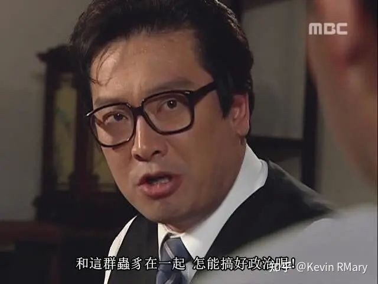

### [热点事件] 不知道陈老师走没走，枫丹的bgm听起来过于单调枯燥了

Made by ngapost2md (c) ludoux [GitHub Repo](https://github.com/ludoux/ngapost2md)

----

##### 0.[0] \<pid:0\> 2023-08-06 02:06:23 by Jason794
rt，听完枫丹的bgm尤其是战斗曲，我心想欧洲的交响曲怎么都比中东的各种陌生乐器好吧，结果就是突出一个没有特色，尤其是足迹里的枫丹动机也没有，而且b站视频底下找不到陈老师的署名

所以我的感觉是有一定可能性陈老师已经离开了，因为一直以来原神只有bgm没有拉过，这次很反常，理论上如果是陈老师谱曲即便没有突破但是也能保证入耳好听，现在的版本就是很…单调，不够抓耳

如果陈老师没离职，我希望能不要绑在mhy的战车上，并在其他优秀作品上继续欣赏陈老师的作品。而且联想到mhy内部都是些什么离谱玩意儿，我只想说，卡卡，和这群虫豸在一起，这么能搞好艺术呢

----

##### 1.[0] \<pid:707229314\> 2023-08-06 02:11:08 by Seeyoupelos
AI作曲早就有了，缺点就是你说的枯燥

----

##### 2.[0] \<pid:707229343\> 2023-08-06 02:11:39 by 雨源rainsource
我看之前说的陈致逸是18年签的合同，说搞5年，正好23年结束了，估计就把七国的主题曲编完走了吧，剩下的让hoyomix的人去做点变调啥的就行了，没想到拉的这么快

----

##### 3.[0] \<pid:707229483\> 2023-08-06 02:13:43 by TTorena
哦豁以后连音乐都没得吹了

----

##### 4.[0] \<pid:707233435\> 2023-08-06 03:18:18 by 雲玩家かみかぜ
崩三和星铁音乐还行，不过原神这种大编制演奏录制而且地域特色浓郁的音乐确实不太一样，至于到底还有没有他的作品，新版本实装了应该也就见分晓了。

----

##### 5.[0] \<pid:707233487\> 2023-08-06 03:19:11 by Giovann
不好听，真的不好听，我在写长贴车这次的音乐，太灾难了

----

##### 6.[0] \<pid:707234486\> 2023-08-06 03:41:44 by kenso999
很多人在说为什么要纠结陈在不在，其实只是大家直观的感觉到音乐水准的下降，所以在分析原因到底是什么，是不是因为陈不在了
但这不是神话陈老师，这些音乐，就算写上作曲是久石让汉斯季默，它照样是工业垃圾

----

##### 7.[0] \<pid:707237818\> 2023-08-06 05:48:46 by nervkid
>[jump](#pid707233487) Giovann(2023-08-06 03:19) 说: 
>
>不好听，真的不好听，我在写长贴车这次的音乐，太灾难了

木耳等看你的长文，音乐盲实话就算感觉不好听也说不出所以然

----

##### 8.[0] \<pid:707242841\> 2023-08-06 07:51:53 by 飘雪菌
>[jump](#pid707233487) Giovann(2023-08-06 03:19) 说: 
>
>不好听，真的不好听，我在写长贴车这次的音乐，太灾难了

期待一手。现在大众车音乐只能被说为没有音乐鉴赏能力，得专业人士分析

----

##### 9.[0] \<pid:707247576\> 2023-08-06 08:41:32 by 黄河远上白云间
估计是走了这次枫丹的音乐就普通的好听，没有特色

----

##### 10.[0] \<pid:707248890\> 2023-08-06 08:53:20 by 剑筑师と書記官
>[jump](#pid707233487) Giovann(2023-08-06 03:19) 说: 
>
>不好听，真的不好听，我在写长贴车这次的音乐，太灾难了

感觉枫丹的音乐真的很复制粘贴可以说吗

----

##### 11.[0] \<pid:707257402\> 2023-08-06 09:58:28 by piepiero
我完全不懂音乐我只能评价<b>真tm难听</b>

----

##### 12.[0] \<pid:707258689\> 2023-08-06 10:07:06 by Jason794
>[jump](#pid707233487) Giovann(2023-08-06 03:19)说:
>不好听，真的不好听，我在写长贴车这次的音乐，太灾难了[s:ac:喷]

大佬解析的很nb，我这个帖子只是一个比较喜欢音乐的普通人的个人感觉，一般玩家的视角和感受

----

##### 13.[0] \<pid:707258865\> 2023-08-06 10:08:07 by 别慌冷静
里板有个发帖就说了，以前陈致逸在视频里就说他写曲子尽量避免避免LOOP，就是几段旋律换着样儿给你端上来

这次枫丹那8分钟视频，我一听醉了，雷区踩上了

----

##### 14.[0] \<pid:707259219\> 2023-08-06 10:10:21 by 透明级
我记得之前还有人对“原神只有音乐了”表示异议，说音乐这种东西是最好糊弄的，随便搞搞都难听不到哪去(所以只剩音乐其实就是什么都不剩了)
但彼时没人能预料到，真的有“连音乐都不剩了”的结局

----

##### 15.[0] \<pid:707259635\> 2023-08-06 10:13:07 by 风之碧海之翠
>[jump](#pid707233487) Giovann(2023-08-06 03:19)说:
>不好听，真的不好听，我在写长贴车这次的音乐，太灾难了[s:ac:喷]

它该车就该车在为了车它还得忍着听好几遍

----

##### 16.[0] \<pid:707260202\> 2023-08-06 10:16:53 by Giovann
>[jump](#pid707259635) 风之碧海之翠(2023-08-06 10:13) 说: 
>
>它该车就该车在为了车它还得忍着听好几遍

还好，我的耳朵只是感到疲惫而不是被强奸

----

##### 17.[0] \<pid:707261074\> 2023-08-06 10:22:28 by NeroliPortofino
我觉得能让我这种外行都听得出来毛病的话那问题已经很严重了。
前瞻最后的演奏枫丹主题的那首我一边听一边跟朋友说完全抓不到主旋律，只觉得到处在稀碎地响，偶尔还有几种声音互相遮盖的问题。
如果是陈老师的话，他一定会把主题句自然地送到你耳边而不是让听众去一堆声响里扒拉。

----

##### 18.[0] \<pid:707261475\> 2023-08-06 10:25:05 by 网瘾少年杨永信
我pv里没细听，音乐会从来不看，只能等游戏里了。
从足迹开始给我印象最深的还是须弥那一段，以及pv末尾公子出场时候的音乐，枫丹整个咋样还得看看游戏里的表现咯。

----

##### 19.[0] \<pid:707262165\> 2023-08-06 10:29:50 by Jason794
>[jump](#pid707258865) 别慌冷静(2023-08-06 10:08)说:
>里板有个发帖就说了，以前陈致逸在视频里就说他写曲子尽量避免LOOP，就是一首曲子里几段旋律换着样儿给你端上来  其实他不用再深入解释，我作为外行都能理解，游戏音乐一首就那么几分钟，陈致逸作为有写古典能力的大手子，写个几分钟的曲子还在那儿LOOP，真是丢份儿  这次枫丹那8分钟视频，我一听醉了，雷区踩上了

我觉得陈致逸老师在作曲上是很严谨的，他应该会对于编曲很有经验而且很清楚玩家喜欢什么，这次很多玩家对音乐也产生了怀疑，这就很能体现出问题了

