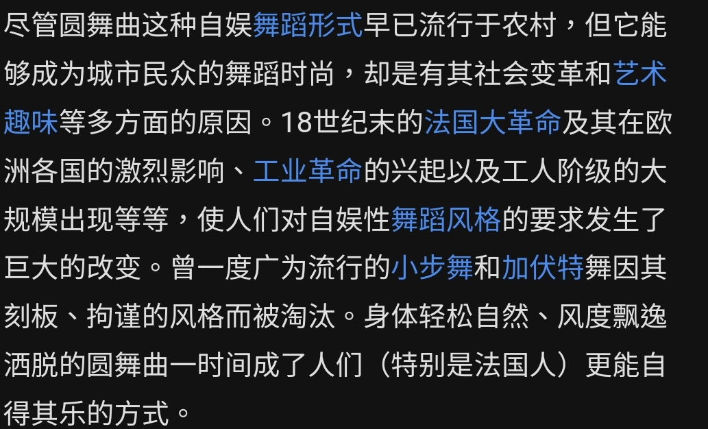

### [不吐不快]枫丹的音乐不仅是平庸，还存在严重问题

Made by ngapost2md (c) ludoux [GitHub Repo](https://github.com/ludoux/ngapost2md)

----

##### 0.[0] \<pid:0\> 2023-08-06 04:23:36 by Giovann
深夜和其他帖子的潭友聊天突然发现了枫丹音乐问题的严重性，非常非常失望，特此开贴
叠甲：楼主只是票友，半吊子乐理水平，全靠听音乐的时候自己摸索和练习乐器的实践，表述可能口语化，专业大佬勿喷，理性讨论

<b>问题一：枫丹音乐旋律不抓耳</b>
只要不是实验音乐等等近现代严肃音乐，音乐创作的第一要务就是：旋律抓耳、好听。这样音乐才有记忆点和创新性，尤其是原神这种偏流行音乐的游戏配乐。
枫丹主城的主旋律无功无过，常规小调音乐，但是没有记忆点(对听众的耳朵刺激不深，也起不到调动情绪的作用)，主旋律被潭友说过“像哈利波特”，正说明它的旋律不是特别独特，反而使人联想出戏。
战斗音乐的主旋律用了很多不和谐音程，导致旋律特别不好记忆，且同样没有起到调动情绪的作用(这个问题等会会说)。
<b>这种白开水一样的旋律的水平大概就是古典音乐家们摸鱼应付金主会写的那种口水歌。</b>
并且反观其他音乐会版本的地区音乐录音，会发现枫丹的音乐旋律与之对比显得十分寡淡平庸，甚至在音乐呈示部部分基本上丢失了主旋律，少了重复的机会，让本来就没有记忆点的旋律雪上加霜。

<b>问题二：枫丹音乐的主题不突出</b>
一首乐曲采用的主题彰显了它承载的地域、文化与情感。
枫丹主城的音乐采用了圆舞曲的音乐体裁，而圆舞曲作为一种已经被用滥了的体裁，基本上丧失了原有的地域意义。并且圆舞曲起源于德奥，且圆舞曲之王施特劳斯也是德奥人~~把蒙德拿来代表枫丹~~。并且这对于以“法国”为原型的枫丹主城是十分灾难的，完全突出不了枫丹的“法国风格”。
战斗音乐是弦乐四重奏加乐团，十分常见的形式，也没有什么特色。
<b>法国特色的音乐风格不是没有：远至巴洛克音乐时期的，以吕利、拉莫等为代表的芭蕾歌剧(一边唱歌剧一边跳芭蕾，法国特产)，近至快近代的以德彪西、拉威尔等为代表的印象派音乐，而这次枫丹音乐哪种法国题材都没有蹭到，至少是非常不明显，让人联想不起来法国。</b>
个人认为，既然都有歌剧院了，审判表演也是重头戏，为什么不写一个巴洛克式的芭蕾歌剧主题呢？谢皇堡都能写巴洛克风格的音乐，枫丹为什么不能？

<b>问题三：枫丹战斗音乐的情绪调动不积极</b>
音乐作为直接调动人类感性的存在，不能引起情绪调动的音乐只能用“寡淡”来形容。
其实这个内容跟问题一比较接近，因为情绪调动是依靠旋律来进行的。两首枫丹音乐的起伏都不算很大，旋律不突出，各种音色变换也比较匮乏，自然让人觉得“寡淡”“昏昏欲睡”。
<b>尤其是战斗音乐，居然没有战斗给人的紧迫感。这种音乐节奏一般都会加快或者强调重音，旋律高昂紧张，而枫丹战斗音乐主旋律是一串不和谐音程，节奏也不快，这好像是尴尬的情绪表达。</b>
还是对比米以前的。很难想象战斗音乐的节奏旋律都不积极不起伏吧？

<b>问题四：枫丹主城音乐不搭配主城给人的印象</b>
我相信这里的潭友或多或少都看过剧情版有位考据佬做的枫丹建筑考据，知道枫丹杂糅了近现代巴黎、美国的建筑风格，以蓝白为主色调，现在pv透露出来的主城建筑给人一种梦幻、大气、水波流动之感。
主城音乐则是主要采用<b>小调</b>圆舞曲，小调的表达一直是狭窄、局促的。而且“像哈利波特”表明了这首曲子带有一定的哥特风格。
<b>而这明显与浅明大气、与哥特艺术不沾边的枫丹主城完全不符合。</b>
甚至“水”的动机表达也不清晰，甚至是简单粗暴的用水碗来演奏。光听这首曲子，枫丹主城给人的印象是威严、高耸、狭窄、哥特式的，而不是现在这种风格。(建筑这里就不车了。)

<b>问题五：枫丹音乐的编曲(配器)太杂乱了。</b>
这一条是好心潭友指出的，也是引发我直接思考的契机，用作压轴。
枫丹音乐的配器，在现代交响乐团的基础上还有：手风琴，人声，玻璃琴，羽管键琴，鲁特琴。前三者增色用暂不提，后两者是古代欧洲使用的<b>古乐器</b>，被淘汰有很大一部分原因是因为声音太小了。
<b>这就体现了枫丹音乐配器的混乱：羽管键琴与钢琴一起合奏，钢琴的音色完全包住了羽管键琴尖细的音色，给人一种看上去光滑的木头摸上去全是疙瘩的质感，并且二者使用的音律不同，羽管键琴音色被包的这个和声显得非常的不和谐；鲁特琴本来就声音小，结果在乐曲中间在乐队齐奏的之后弹了一段突兀的旋律，听不清的突突声和糟糕的对位法手段导致这一段音乐显得特别混乱。</b>
其他国家也有使用特色乐器，为什么就枫丹这么混乱？为什么配器水平下降的如此厉害呢？

先写这么多，我对这次枫丹音乐感到非常非常失望，一想到以前的水准，<b>就更失望了。</b>

放一下我的乐器~~老婆~~证明一下成分

----

##### 1.[2] \<pid:707236025\> 2023-08-06 04:30:24 by XvX_XvX
作为不懂的人随便胡扯两句，有大佬的话别喷我。陈老师之前玩的那种把各地区特色传统乐器，现代音乐和经典音乐融合，并且还能产生和谐，主题鲜明的旋律的设计感觉是非常困难的一件事情，一般人估计是玩不转的

----

##### 2.[0] \<pid:707236072\> 2023-08-06 04:32:17 by Giovann
>[jump](#pid707236025) XvX_XvX(2023-08-06 04:30) 说: 
>
>作为不懂的人随便胡扯两句，有大佬的话别喷我。陈老师之前玩的那种把各地区特色传统乐器，现代音乐和经典音乐融合，并且还能产生和谐，主题鲜明的旋律的设计感觉是非常困难的一件事情，一般人估计是玩不转的

陈老师是真的融合得挺好的突然到了枫丹就驾驭不了融合题材乱缝一气是怎么回事，我暂且蒙古

----

##### 3.[2] \<pid:707236492\> 2023-08-06 04:50:42 by 庚桂周甲席苗
等编曲来查理对线前，先搬一个其他社区疑似编曲对线回复给大家瞧瞧：

名句 “都是欧洲交响乐，你想要多大差异”

----

##### 4.[0] \<pid:707236531\> 2023-08-06 04:51:41 by Giovann
>[jump](#pid707236492) 庚桂周甲席苗(2023-08-06 04:50) 说: 
>
>等编曲来查理对线前，先搬一个其他社区疑似编曲对线回复给大家瞧瞧：
>
>
>
>名句 “都是欧洲交响乐，你想要多大差异”

这耳朵不要卖我一副备用吧

----

##### 5.[0] \<pid:707236618\> 2023-08-06 04:55:18 by 雲玩家かみかぜ
>[jump](#pid707236492) 庚桂周甲席苗(2023-08-06 04:50) 说: 
>
>等编曲来查理对线前，先搬一个其他社区疑似编曲对线回复给大家瞧瞧：
>
>
>
>名句 “都是欧洲交响乐，你想要多大差异”

在玩家需要符合架空世界观的音乐来增加代入感的时候，这些人又开始拿西方音乐史绕弯子了，可是在看前瞻的时候也没人关注有没有陈老师啊，好不好听不是玩家大众听一段就能听出来的吗？

----

##### 6.[1] \<pid:707236715\> 2023-08-06 04:58:39 by 雨源rainsource
或许米自信了，觉得hoyomix不需要陈致逸也可以，<b>工业化</b>生产bgm

----

##### 7.[0] \<pid:707236718\> 2023-08-06 04:58:45 by Giovann
>[jump](#pid707236618) 雲玩家かみかぜ(2023-08-06 04:55) 说: 
>
>在玩家需要符合架空世界观的音乐来增加代入感的时候，这些人又开始拿西方音乐史绕弯子了，可是在看前瞻的时候也没人关注有没有陈老师啊，好不好听不是玩家大众听一段就能听出来的吗？  
>编辑补充：这次莫名其妙出来这么多人急着把玩家对音乐的感受往其他方向拐，这本身是不是也能说明问题呢？

我觉得吧，除非是实验音乐，总要讲究一个好听，原神这种二次元游戏音乐就更不用说了，不好听就是原罪。

----

##### 8.[0] \<pid:707236735\> 2023-08-06 04:59:33 by Giovann
>[jump](#pid707236715) 雨源rainsource(2023-08-06 04:58) 说: 
>
>或许米自信了，觉得hoyomix不需要陈致逸也可以，<b>工业化</b>生产bgm

鉴定为不如ai作曲一根

----

##### 9.[0] \<pid:707236829\> 2023-08-06 05:03:45 by 逆转的密码
支持一下。
之前一直没看论坛。
前瞻录像专门挑到音乐部分听的，就是很失望很失望

----

##### 10.[0] \<pid:707237070\> 2023-08-06 05:14:29 by Giovann
>[jump](#pid707236829) 逆转的密码(2023-08-06 05:03) 说: 
>
>支持一下。
>之前一直没看论坛。
>前瞻录像专门挑到音乐部分听的，就是很失望很失望

感谢支持
我刚开始听还激动了一下，越听越不对劲。。

----

##### 11.[0] \<pid:707237589\> 2023-08-06 05:39:04 by 脖子右拧好兄弟
我本来以为爷跟水神的初次见面是在舞会上，甚至还跳了一曲，结果看来是对米桑这条懒狗期望过高

----

##### 12.[1] \<pid:707237700\> 2023-08-06 05:43:47 by Serviusネコ
我只能说水的这个意象，不用一些印象主义作曲风格实在是非常可惜……当然main theme用圆舞曲贴合“罪人舞步旋”这个二级标题是没问题的啦，可是圆舞曲配器不能那么杂乱。我自己很喜欢鲁特琴和羽管键琴，但这两种乐器在音乐会里面几乎没体现出来存在感，巴洛克风一下就没了。跟须弥的一比，根本不知道枫丹主题曲在表达什么描写什么，像极了不知所云铺陈无度又冗余乏味的主线剧情

----

##### 13.[0] \<pid:707237739\> 2023-08-06 05:45:46 by Serviusネコ
>[jump](#pid707236492) 庚桂周甲席苗(2023-08-06 04:50) 说: 
>
>等编曲来查理对线前，先搬一个其他社区疑似编曲对线回复给大家瞧瞧：
>
>
>
>名句 “都是欧洲交响乐，你想要多大差异”

笑死了，巴赫莫扎特贝多芬三者的区别都听不出那真的谈不上有什么音乐素养可言了，可能米哈游的钱真好挣吧

----

##### 14.[0] \<pid:707238147\> 2023-08-06 06:02:48 by 献给美第奇
[quote][pid=707237589,37275450,1]Reply[/pid] <b>Post by [uid=65218979]脖子右拧好兄弟[/uid] (2023-08-06 05:39):</b>

禁词了，快改改吧

----

##### 15.[0] \<pid:707238300\> 2023-08-06 06:09:26 by TooruW
>[jump](#pid707236492) 庚桂周甲席苗(2023-08-06 04:50) 说: 
>
>等编曲来查理对线前，先搬一个其他社区疑似编曲对线回复给大家瞧瞧：
>
>
>
>名句 “都是欧洲交响乐，你想要多大差异”

这种回复像是票友，而不是真正在从事作编曲的人。用的词很理论。

----

##### 16.[0] \<pid:707238435\> 2023-08-06 06:14:55 by xlsq03
截图给我看笑了
别的也就算了，说巴赫和莫扎特没什么区别，龟龟

----

##### 17.[0] \<pid:707238805\> 2023-08-06 06:28:18 by zzxswj
>[jump](#pid707236492) 庚桂周甲席苗(3楼) (2023-08-06 04:50)说:
>等编曲来查理对线前，先搬一个其他社区疑似编曲对线回复给大家瞧瞧：  [img]https://img.nga.178.com/attachments/mon_202308/06/l2Q2s-dekxK2lT1kSh9-sg.jpg.medium.jpg[/img]  [s:ac:茶]名句 “都是欧洲交响乐，你想要多大差异”

这他妈说的什么逼话，小白也能一耳朵听出巴赫和莫扎特的区别啊
不可能是作曲，水平再低的作曲也说不出这种话，这话和猴子鲸鱼没啥区别差不多

----

##### 18.[0] \<pid:707239256\> 2023-08-06 06:42:31 by tina2231
枫丹的建筑已经被人批判过一轮了

----

##### 19.[0] \<pid:707240308\> 2023-08-06 07:08:04 by 花瓣飘零
不懂那么多，反正不好听，听不完一遍，也再也不想听的程度

----

##### 20.[0] \<pid:707241005\> 2023-08-06 07:22:21 by Schia19
到处都有人发贴说对音乐失望感到了落差就已经足够说明问题了。
没能在听众脑海里留下印象就是平庸。

----

##### 21.[0] \<pid:707241301\> 2023-08-06 07:27:45 by 飘雪菌
B站底下还有7000粉的专业人士说，评论原神枫丹音乐不好听的应该都是没有基础古典音乐的，不懂的欣赏的，快节奏生活惯了的人
但是我觉得不好听就是不好听，我特意回放了璃月稻妻须弥，还放了两三遍，对比起来确实就枫丹最拉。
当然也可以说故意被挑出来两首拉的，好的在后头，但是这话我不会信

----

##### 22.[0] \<pid:707242311\> 2023-08-06 07:44:46 by 风之碧海之翠
乳哈利波特了

----

##### 23.[0] \<pid:707242674\> 2023-08-06 07:49:59 by 转生三周目
我在泥潭学建筑
我在泥潭学音乐

----

##### 24.[1] \<pid:707243862\> 2023-08-06 08:05:02 by XvX_XvX
>[jump](#pid707241301) 飘雪菌(2023-08-06 07:27) 说: 
>
>B站底下还有7000粉的专业人士说，评论原神枫丹音乐不好听的应该都是没有基础古典音乐的，不懂的欣赏的，快节奏生活惯了的人
>但是我觉得不好听就是不好听，我特意回放了璃月稻妻须弥，还放了两三遍，对比起来确实就枫丹最拉。
>当然也可以说故意被挑出来两首拉的，好的在后头，但是这话我不会信

这是什么P话，一个游戏的BGM还得专业人士坐在金色大厅里全神贯注去听才能觉得好听是吧，先不论是不是真的，就算是这样拿来作为一个游戏的BGM也是驴唇不对马嘴

----

##### 25.[0] \<pid:707244459\> 2023-08-06 08:11:42 by MeliMor
小调圆舞曲的确太明显了我听的时候也有同感，听后觉得这地方像个被德国占领的法国

----

##### 26.[1] \<pid:707244560\> 2023-08-06 08:12:49 by 莉莉丝冲鸭
你醒了，主板在车鉴赏水平低下了

----

##### 27.[0] \<pid:707245202\> 2023-08-06 08:19:31 by Khris2456
不知道是我解读能力不够还是怎样，和弦进程是真的又短又碎，特别是弦乐部一直给我一种“这段我配合完了哦，赶快进下一段”的感觉，没什么情绪铺垫

----

##### 28.[0] \<pid:707245404\> 2023-08-06 08:21:17 by 风干的小花
其实我是有先入为主的 之前就听说了一些陈老师已润的消息 但当时没有太确定 抱着也许名单上会有陈老师的想法去看了前瞻

建筑之前车过了 连体房干碎切块明显的顶部设计问题

水神的cv不贴合问题(注意这不是cv问题是导演问题)

我也没想过说认为陈老师不在所以枫丹bgm不好听 反而当时看见玻璃琴的时候还觉得[特色] 但是紧接着我就有了第一个想法<b>不抓耳</b> 第二个想法是自我滑坡觉得也许是因为能用的乐器不多所以除了玻璃琴没什么特别的(因为感觉欧洲给人印象就是提琴钢琴) 第三个想法是 哎？这是战斗bgm吗？再听听。。然后过了好一会才能确定这是战斗bgm(在过往音乐展示中一般第一首是主城第二首是战斗bgm)

我就一非专业普通人 我是觉得以上存在问题的 当然有的人说那可能只是我的问题个人并不觉得甚至非常好听 但是很显然不少人提出讨论 <b>那就是真的存在问题</b>

----

##### 29.[0] \<pid:707245428\> 2023-08-06 08:21:29 by Glora
>[jump](#pid707236492) 庚桂周甲席苗(2023-08-06 04:50) 说: 
>
>等编曲来查理对线前，先搬一个其他社区疑似编曲对线回复给大家瞧瞧：
>
>
>
>名句 “都是欧洲交响乐，你想要多大差异”

就像巴赫与贝多芬的差异？？？？？
热爱巴赫拉不来贝多芬的我表示

----

##### 30.[1] \<pid:707245600\> 2023-08-06 08:23:24 by 莱卡勒斯s
>[jump](#pid707244560) 莉莉丝冲鸭(2023-08-06 08:12) 说: 
>
>你醒了，主板在车鉴赏水平低下了

能有出来堵嘴的，说明确实拉了我现在看到鉴赏能力不行、现代人、快节奏之类的洗地用词就会想笑，只有菜鸡才会给观众甩锅

----

##### 31.[0] \<pid:707245958\> 2023-08-06 08:26:39 by 网友述
>[jump](#pid707242674) 转生三周目(2023-08-06 07:49) 说: 
>
>我在泥潭学建筑
>我在泥潭学音乐

建筑的贴可否麻烦指个路？我也看着怪很久了

----

##### 32.[0] \<pid:707246783\> 2023-08-06 08:34:34 by 雲玩家かみかぜ
>[jump](#pid707241301) 飘雪菌(2023-08-06 07:27) 说: 
>
>B站底下还有7000粉的专业人士说，评论原神枫丹音乐不好听的应该都是没有基础古典音乐的，不懂的欣赏的，快节奏生活惯了的人
>但是我觉得不好听就是不好听，我特意回放了璃月稻妻须弥，还放了两三遍，对比起来确实就枫丹最拉。
>当然也可以说故意被挑出来两首拉的，好的在后头，但是这话我不会信

这时候怎么不说12+了......

----

##### 33.[0] \<pid:707246910\> 2023-08-06 08:35:42 by 十九颗白菜
感觉不同乐器的声音在某些地方融合、过渡的很僵硬(非专业人士)，什么感觉呢，就习惯了某一类乐音，突然插入其他的声音，有种踩了刹车突然加速的感觉

举个例子，官号枫丹交响乐1：30到2：30这一段，感觉被丢进了滚筒洗衣机里一样

----

##### 34.[0] \<pid:707246926\> 2023-08-06 08:35:53 by 雲玩家かみかぜ
>[jump](#pid707245958) 网友述(2023-08-06 08:26) 说: 
>
>建筑的贴可否麻烦指个路？我也看着怪很久了

恒纳兰那进去就有

----

##### 35.[0] \<pid:707247193\> 2023-08-06 08:38:11 by 飘雪菌
>[jump](#pid707243862) XvX_XvX(2023-08-06 08:05) 说: 
>
>这是什么P话，一个游戏的BGM还得专业人士坐在金色大厅里全神贯注去听才能觉得好听是吧，先不论是不是真的，就算是这样拿来作为一个游戏的BGM也是驴唇不对马嘴

他们说咱音乐鉴赏能力低下呜呜呜

----

##### 36.[0] \<pid:707249260\> 2023-08-06 08:56:35 by bingximofa1998
>[jump](#pid707237739) Serviusネコ(2023-08-06 05:45) 说: 
>
>笑死了，巴赫莫扎特贝多芬三者的区别都听不出那真的谈不上有什么音乐素养可言了，可能米哈游的钱真好挣吧

偏偏选了这三个差异一耳朵就能听出来的…………

----

##### 37.[0] \<pid:707249491\> 2023-08-06 08:58:26 by Glora
>[jump](#pid707241301) 飘雪菌(2023-08-06 07:27) 说: 
>
>B站底下还有7000粉的专业人士说，评论原神枫丹音乐不好听的应该都是没有基础古典音乐的，不懂的欣赏的，快节奏生活惯了的人
>但是我觉得不好听就是不好听，我特意回放了璃月稻妻须弥，还放了两三遍，对比起来确实就枫丹最拉。
>当然也可以说故意被挑出来两首拉的，好的在后头，但是这话我不会信

这就扯了，不说别的，看看老柴吧。好听的古典乐就是全方面降维打击的好听，不需要什么慢节奏细细品，旋律出来第一句就是扑面而来的好听。

----

##### 38.[0] \<pid:707251202\> 2023-08-06 09:12:42 by 风暴之心·凯南
崩铁的音乐编剧敢出视频介绍自己是怎么做地区特色音乐的，不知道原神出不出枫丹的音乐制作历程

----

##### 39.[0] \<pid:707254398\> 2023-08-06 09:37:15 by StayCoolBro
連最後的底褲都爛了

----

##### 40.[0] \<pid:707254512\> 2023-08-06 09:38:04 by ether-wind
我觉得最莫名其妙的是古乐器的使用，羽管键琴的声音几乎被钢琴盖过，只留下拨弦的声音。我刚刚又看了一遍视频，发现还用了巴洛克时期的大提琴，不知道意义何在。编曲上这两首曲子又和巴洛克完全不沾边，感觉像是仿哥特风的现代交响流水歌。但问题是枫丹建筑给人的印象也不哥特呀。枫丹的主题曲给人的感觉就跟枫丹建筑一样风格杂糅。

要我说，最适合作为枫丹地区的音乐风格的是印象派音乐，因为本身法国就有德彪西、拉威尔两位印象派大师，而且印象派的风格和“水”的主题也能很好地契合。还有一点，过去几个国家都有使用特殊调式来渲染异域风情，而印象派在使用特殊调式这方面可谓是信手拈来，德彪西就很喜欢使用全音音阶(音阶上相邻两个音的间隔是一个全音)。我印象里渊下宫就有类似德彪西风格的曲子，不知道为什么到了枫丹这里没有用。

----

##### 41.[0] \<pid:707258616\> 2023-08-06 10:06:36 by Giovann
>[jump](#pid707254512) ether-wind(2023-08-06 09:38) 说: 
>
>我觉得最莫名其妙的是古乐器的使用，羽管键琴的声音几乎被钢琴盖过，只留下拨弦的声音。我刚刚又看了一遍视频，发现还用了巴洛克时期的大提琴，不知道意义何在。编曲上这两首曲子又和巴洛克完全不沾边，感觉像是仿哥特风的现代交响流水歌。但问题是枫丹建筑给人的印象也不哥特呀。枫丹的主题曲给人的感觉就跟枫丹建筑一样风格杂糅。
>
>要我说，最适合作为枫丹地区的音乐风格的是印象派音乐，因为本身法国就有德彪西、拉威尔两位印象派大师，而且印象派的风格和“水”的主题也能很好地契合。还有一点，过去几个国家都有使用特殊调式来渲染

对对对，我也十分好奇为啥不用选了些最没特色的古乐器完全没表现出来血压都高了我

----

##### 42.[0] \<pid:707258787\> 2023-08-06 10:07:38 by Giovann
>[jump](#pid707241301) 飘雪菌(2023-08-06 07:27) 说: 
>
>B站底下还有7000粉的专业人士说，评论原神枫丹音乐不好听的应该都是没有基础古典音乐的，不懂的欣赏的，快节奏生活惯了的人
>但是我觉得不好听就是不好听，我特意回放了璃月稻妻须弥，还放了两三遍，对比起来确实就枫丹最拉。
>当然也可以说故意被挑出来两首拉的，好的在后头，但是这话我不会信

这破烂水平碰瓷古典乐？

----

##### 43.[0] \<pid:707258916\> 2023-08-06 10:08:25 by Giovann
>[jump](#pid707244459) MeliMor(2023-08-06 08:11) 说: 
>
>小调圆舞曲的确太明显了我听的时候也有同感，听后觉得这地方像个被德国占领的法国

昨天写的时候太晚了忘了，我应该写点地狱的法国笑话的(喂)

----

##### 44.[0] \<pid:707259437\> 2023-08-06 10:11:50 by Jason794
其实我觉得交响乐是最能玩出花样的曲风啊，各个著名音乐家不都是玩交响乐的，怎么到mhy手里变成了欧洲音乐没有辨识度都一个样子，我一个普通人都绷不住了，举个例子天堂与地狱序曲和命运交响曲听上去能是一个东西吗

----

##### 45.[1] \<pid:707259522\> 2023-08-06 10:12:25 by ether-wind
其实在须弥后期就可以发现原神的作曲陷入了一种路径依赖，就是严重依赖民族乐器来丰富听感、体现地区特色。最典型的就是草龙王的bgm，关注过禁忌知识的潭友应该知道早在2.6测试服就有这首曲子了，但迟迟没有实装。这首曲子最早应该是作为地区战斗音乐设计的这就可以解释为什么曲子中出现了提瓦特战斗动机(其他周本音乐都没有出现这个动机)。原本这首曲子使用的是传统交响乐编制，可以说和草龙王没有半毛钱关系，但3.6版本仅仅加入了民族乐器并对旋律进行了加花就上线了(我还在b站评论区看到有人试图分析这首曲子和草龙王的关联，真是贻笑大方)。到了枫丹这里缺乏民族乐器的加持，编曲水平就完全暴露了。

这也是为我认为原神作曲的最高水平在蒙德的原因。蒙德仅仅采用了传统的交响乐，没有民族乐器的加持，也能描绘出幻想世界的异域风情。蒙德地区的音乐体现出陈老师非常深厚的古典音乐功底。给我印象非常深刻的是蒙德的战斗音乐《战斗的秘仪》，其节奏异常复杂，但又不失章法，跳脱的节奏与草史莱姆在草丛里活蹦乱跳的场景相当契合(有坊间传闻称这在当时是陈老师最满意对一首曲子)。此外北风狼王的战斗音乐《冰封交响曲》也给我留下相当深刻的印象。这首曲子的旋律neta了莫扎特《安魂曲》中的《落泪之日》，“安魂”恰好与北风狼王的残魂相呼应，但不同于《落泪之日》的静谧与忧伤，《冰封交响曲》狂风骤雨般的节奏体现了北风狼王的震怒，配器上高音曲的钢琴声和低音区的弦乐声交织在一起给人冰天雪地之感(这是一个经典套路，在女士一阶段也有使用)，高潮部分钢琴与乐队的协奏给我的震撼不亚于拉赫玛尼诺夫《第二钢琴协奏曲》第一乐章的再现部。这些都可以体现出陈老师作曲技法之成熟。

----

##### 46.[1] \<pid:707259985\> 2023-08-06 10:15:23 by 完胜熔岩
有一说一,2.8幽夜净土的bgm比现在这个更加抓耳不已经证明了音乐质量下降了

----

##### 47.[0] \<pid:707260076\> 2023-08-06 10:15:59 by Giovann
>[jump](#pid707259522) ether-wind(2023-08-06 10:12) 说: 
>
>其实在须弥后期就可以发现原神的作曲陷入了一种路径依赖，就是严重依赖民族乐器来丰富听感、体现地区特色。最典型的就是草龙王的bgm，关注过禁忌知识的潭友应该知道早在2.6测试服就有这首曲子了，但迟迟没有实装。这首曲子最早应该是作为地区战斗音乐设计的这就可以解释为什么曲子中出现了提瓦特战斗动机(其他周本音乐都没有出现这个动机)。原本这首曲子使用的是传统交响乐编制，可以说和草龙王没有半毛钱关系，但3.6版本仅仅加入了民族乐器并对旋律进行了加花就上线了(我还在b站评论区看到有人试图分析这首曲子和草龙王的关

大佬分析得很好哇
对的，之前陈老师负责作曲的bgm一听就知道作者有极强的功底，讲究章法的同时大胆创新融合；枫丹这个宛如巴洛克车轱辘却没有巴洛克车轱辘复杂复调的loop真的是low穿地心，像那什么作曲系学生赶出来的作业。

----

##### 48.[0] \<pid:707260461\> 2023-08-06 10:18:36 by 芙洛斯特的残影
>[jump](#pid707249491) Glora(2023-08-06 08:58):

老柴是真的，曲子做成力量金属一样好听
之前看到过国外把古典音乐用金属风格翻弹的版本，只能说，顶级(当然你可能不喜欢金属，这里就是举个例子)

----

##### 49.[0] \<pid:707260860\> 2023-08-06 10:21:11 by Giovann
>[jump](#pid707259437) Jason794(2023-08-06 10:11) 说: 
>
>其实我觉得交响乐是最能玩出花样的曲风啊，各个著名音乐家不都是玩交响乐的，怎么到mhy手里变成了欧洲音乐没有辨识度都一个样子，我一个普通人都绷不住了，举个例子天堂与地狱序曲和命运交响曲听上去能是一个东西吗

现代交响乐的正式出现差不多是贝多芬时期，之后一个作曲家写的交响乐都是评价这个作曲家的重头戏<b>还有第九交响曲诅咒这种梗</b>，这个领域被开发得可谓很娴熟了，米家作曲肯定是不缺素材的，再怎么也比冷门的须弥原型好吧。结果他就是给你端上来了口水歌，还嘴硬“作曲家没区别”，天呐，三个时代差得比较远风格完全不同的作曲家能被这么形容，我算是明白为什么mhy总是喜欢把不同的的东西碎尸端上来做成同样的味道了。

----

##### 50.[0] \<pid:707260962\> 2023-08-06 10:21:50 by 连续二阶偏导
>[jump](#pid707259522) ether-wind(2023-08-06 10:12) 说: 
>
>其实在须弥后期就可以发现原神的作曲陷入了一种路径依赖，就是严重依赖民族乐器来丰富听感、体现地区特色。最典型的就是草龙王的bgm，关注过禁忌知识的潭友应该知道早在2.6测试服就有这首曲子了，但迟迟没有实装。这首曲子最早应该是作为地区战斗音乐设计的这就可以解释为什么曲子中出现了提瓦特战斗动机(其他周本音乐都没有出现这个动机)。原本这首曲子使用的是传统交响乐编制，可以说和草龙王没有半毛钱关系，但3.6版本仅仅加入了民族乐器并对旋律进行了加花就上线了(我还在b站评论区看到有人试图分析这首曲子和草龙王的关

草鸡的bgm中间有一段复调可谓是非常惊喜了，恐怕很少有游戏音乐(尤其是战斗部分的音乐)会这么写的。可惜几乎没见人夸过这段。还有一首我觉得很有代表性的是公子的一二阶段bgm，真是浑然天成如有神助。

----

##### 51.[0] \<pid:707261263\> 2023-08-06 10:23:45 by 他小炒肉谁啊
先套盾：我啥音乐都不会，纯靠脑放，有问题应该就是我错了
为什么选圆舞曲，我猜是有人看百度了

但是归根结底，你要选圆舞曲可以，虽说圆舞曲很多，但是要做好也没那么难，这么多的圆舞曲名曲都有共同特点：主旋律突出，有一个主要乐器从头到尾基本是不会断的，其他乐器再应和主乐器，而且一般不会有特别多的乐器。这次这个主城音乐我是没法理解的，简直就是大乱炖，为了塞乐器而塞乐器，我觉得把人声部分去掉都会比现在好不少，本来主乐器就已经区分不明显了，再来个人声，啥主调都给你抢完了，而且这音乐的发展感觉就是寸止挑战，老是冲不上去，你觉得要冲上去的时候他往回收了，你觉得是不是要完了他又开始放了，你觉得要来个大的收尾了他又收回去了。战斗音乐他就不像是战斗音乐，更像是大半夜的BBC RADIO 3的催眠音乐，给人的感觉就跟这个公司给人的印象一模一样--小家子气

----

##### 52.[0] \<pid:707261624\> 2023-08-06 10:26:11 by ether-wind
>[jump](#pid707260076) Giovann(2023-08-06 10:15) 说: 
>
>大佬分析得很好哇
>对的，之前陈老师负责作曲的bgm一听就知道作者有极强的功底，讲究章法的同时大胆创新融合；枫丹这个宛如巴洛克车轱辘却没有巴洛克车轱辘复杂复调的loop真的是low穿地心，像那什么作曲系学生赶出来的作业。

我本来最期待的是至冬国的音乐，因为十九世纪末以来俄国音乐可谓是大师云集，柴可夫斯基、强力集团、拉赫玛尼诺夫、普罗科菲耶夫、肖斯塔科维奇，数不胜数，而且陈老师本人最喜欢的作曲家就是拉赫玛尼诺夫，如果是陈老师主导作曲肯定会对这些大师进行模仿。层岩巨渊最底层的音乐就很有俄派音乐对特征。要是陈老师离开了我会很伤心的

----

##### 53.[0] \<pid:707261625\> 2023-08-06 10:26:11 by 连续二阶偏导
>[jump](#pid707259522) ether-wind(2023-08-06 10:12) 说: 
>
>其实在须弥后期就可以发现原神的作曲陷入了一种路径依赖，就是严重依赖民族乐器来丰富听感、体现地区特色。最典型的就是草龙王的bgm，关注过禁忌知识的潭友应该知道早在2.6测试服就有这首曲子了，但迟迟没有实装。这首曲子最早应该是作为地区战斗音乐设计的这就可以解释为什么曲子中出现了提瓦特战斗动机(其他周本音乐都没有出现这个动机)。原本这首曲子使用的是传统交响乐编制，可以说和草龙王没有半毛钱关系，但3.6版本仅仅加入了民族乐器并对旋律进行了加花就上线了(我还在b站评论区看到有人试图分析这首曲子和草龙王的关

战斗的秘仪(rite of battle)节奏之复杂，让人联想到春之祭(rite of spring) 我一直把这首当作某种程度上的致敬

----

##### 54.[0] \<pid:707261857\> 2023-08-06 10:27:39 by Giovann
>[jump](#pid707260962) 连续二阶偏导(2023-08-06 10:21) 说: 
>
>草鸡的bgm中间有一段复调可谓是非常惊喜了，恐怕很少有游戏音乐(尤其是战斗部分的音乐)会这么写的。可惜几乎没见人夸过这段。还有一首我觉得很有代表性的是公子的一二阶段bgm，真是浑然天成如有神助。

我最喜欢的原神bgm还得是渊下宫战斗bgm寒光裂涛，简单的四重奏加人声写得非常震撼，把渊下宫的氛围和历史、战斗的紧张刺激感等等全部融合在一起写得也十分严谨合章法，陈老师写得确实非常牛逼，如果枫丹没有陈老师那么hoyomix水平下降，如果陈老师还有我宁愿相信他被排挤到只剩挂名了。

----

##### 55.[0] \<pid:707261876\> 2023-08-06 10:27:45 by rysher12
俗人觉得须弥战斗音乐真是好听

----

##### 56.[0] \<pid:707262034\> 2023-08-06 10:28:50 by ether-wind
>[jump](#pid707260962) 连续二阶偏导(2023-08-06 10:21) 说: 
>
>草鸡的bgm中间有一段复调可谓是非常惊喜了，恐怕很少有游戏音乐(尤其是战斗部分的音乐)会这么写的。可惜几乎没见人夸过这段。还有一首我觉得很有代表性的是公子的一二阶段bgm，真是浑然天成如有神助。

草鸡的音乐相当优秀，虽然这首曲子后来变成了boss通用音乐，但我觉得它就是草鸡专属bgm，太合适了

----

##### 57.[0] \<pid:707262160\> 2023-08-06 10:29:48 by Giovann
>[jump](#pid707261624) ether-wind(2023-08-06 10:26) 说: 
>
>我本来最期待的是至冬国的音乐，因为十九世纪末以来俄国音乐可谓是大师云集，柴可夫斯基、强力集团、拉赫玛尼诺夫、普罗科菲耶夫、肖斯塔科维奇，数不胜数，而且陈老师本人最喜欢的作曲家就是拉赫玛尼诺夫，如果是陈老师主导作曲肯定会对这些大师进行模仿。层岩巨渊最底层的音乐就很有俄派音乐对特征。要是陈老师离开了我会很伤心的

天呐要是陈老师离开了剩下的人水平嚯嚯俄派，怕不是拙劣模仿了一下爵士组曲后然后说俄罗斯就那样

----

##### 58.[0] \<pid:707262207\> 2023-08-06 10:30:08 by ether-wind
>[jump](#pid707261625) 连续二阶偏导(2023-08-06 10:26) 说: 
>
>战斗的秘仪(rite of battle)节奏之复杂，让人联想到春之祭(rite of spring) 我一直把这首当作某种程度上的致敬

有意思的解读，从标题上看应该确实有某种相关性。

----

##### 59.[0] \<pid:707262349\> 2023-08-06 10:30:59 by Giovann
>[jump](#pid707261625) 连续二阶偏导(2023-08-06 10:26) 说: 
>
>战斗的秘仪(rite of battle)节奏之复杂，让人联想到春之祭(rite of spring) 我一直把这首当作某种程度上的致敬

须弥的节奏也很复杂，符合西亚南亚玩节奏。
杂而不乱而不是像枫丹这种乐器全混在一起声音都乱了，水平高下立判。

----

##### 60.[0] \<pid:707262637\> 2023-08-06 10:32:39 by Giovann
>[jump](#pid707262034) ether-wind(2023-08-06 10:28) 说: 
>
>草鸡的音乐相当优秀，虽然这首曲子后来变成了boss通用音乐，但我觉得它就是草鸡专属bgm，太合适了

草鸡的bgm感觉比草龙好听多了草龙滚车轱辘的感觉有点明显

----

##### 61.[0] \<pid:707264513\> 2023-08-06 10:44:17 by 连续二阶偏导
>[jump](#pid707262207) ether-wind(2023-08-06 10:30) 说: 
>
>有意思的解读，从标题上看应该确实有某种相关性。

史莱姆、丘丘人、仪式舞蹈、原始旺盛的生命力；钢琴在低音区打击乐般的复杂节奏型、富于流动感的单簧管、间或插入的尖锐小号……

----

##### 62.[0] \<pid:707264857\> 2023-08-06 10:46:29 by ANUBlS
>[jump](#pid707261857) Giovann(2023-08-06 10:27) 说: 
>
>我最喜欢的原神bgm还得是渊下宫战斗bgm寒光裂涛，简单的四重奏加人声写得非常震撼，把渊下宫的氛围和历史、战斗的紧张刺激感等等全部融合在一起写得也十分严谨合章法，陈老师写得确实非常牛逼，如果枫丹没有陈老师那么hoyomix水平下降，如果陈老师还有我宁愿相信他被排挤到只剩挂名了。

震惊了我刷你这个帖子的时候正在单曲循环《寒光裂涛》

----

##### 63.[0] \<pid:707265659\> 2023-08-06 10:51:28 by Giovann
>[jump](#pid707264857) ANUBlS(2023-08-06 10:46) 说: 
>
>震惊了我刷你这个帖子的时候正在单曲循环《寒光裂涛》
>
>
>

哈哈哈，这首曲子真的是十分优秀，我把这首都推荐给我身边也听古典的朋友了，听过都说好
反观我要是推枫丹他们可能以为我审美降级了

