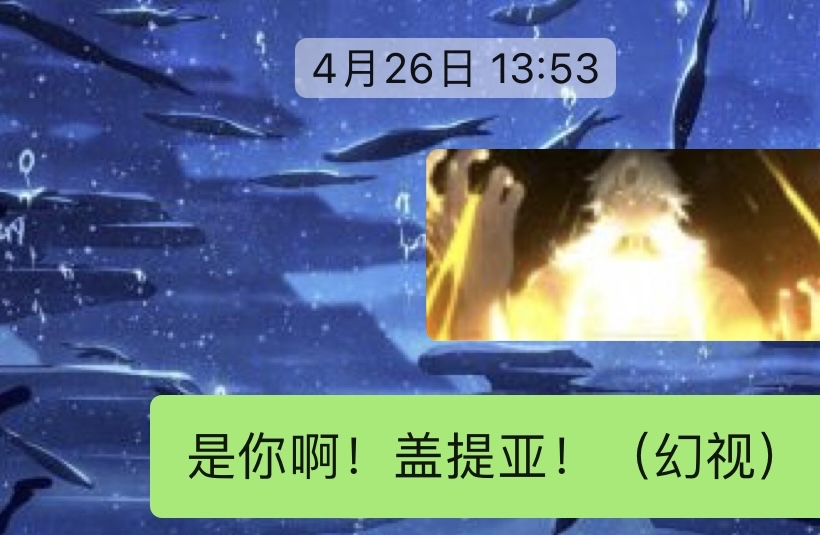
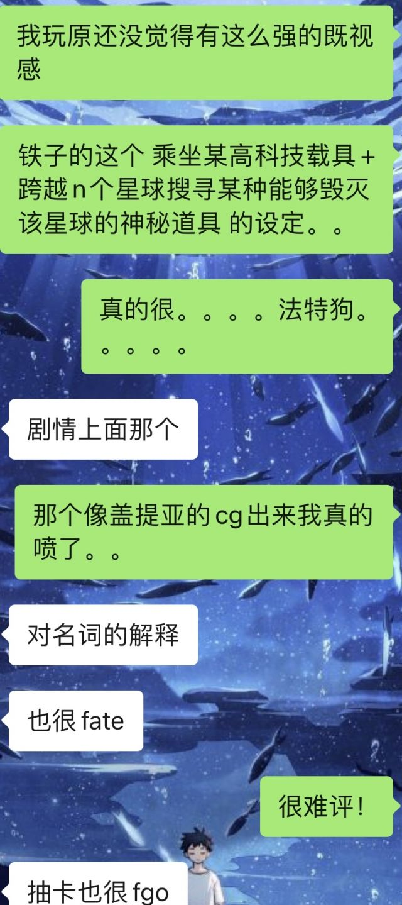

### [不吐不快]其实米哈游的ip创作还真的就是摸着型月过河

Made by ngapost2md (c) ludoux [GitHub Repo](https://github.com/ludoux/ngapost2md)

----

##### 0.[0] \<pid:0\> 2023-08-06 08:11:39 by gloriel
理查们都知道李猛干是个喜欢阿周那的月厨，而米哈游的元老级编剧里的月厨并不止他一个，能明确身份的还有崩坏3现任ip格陵兰帆船，以及崩坏系列的制作人蒋大卫。

米哈游的第一位编剧是

----

##### 1.[1] \<pid:707248944\> 2023-08-06 08:53:45 by 我冲我自己
那猛干哥说出“fgo除了蘑菇和老虚都是水平线上下的货色”的时候不会心虚吗型月作者团水平不高，那抓着一个型月又抄又蹭cg还故意画雷同的崩三是啥

----

##### 2.[0] \<pid:707249209\> 2023-08-06 08:56:14 by bzbjzj
再来多点，不怕滑坡文案，就怕没文案乐子看。

----

##### 3.[0] \<pid:707249225\> 2023-08-06 08:56:21 by 雲玩家かみかぜ
我其实挺感兴趣现在崩二的编剧，我个人是非常喜欢崩二前段时间那个写死女OL的剧情的......

----

##### 4.[6] \<pid:707249421\> 2023-08-06 08:57:56 by mudadadada
>[jump](#pid707248944) 我冲我自己(2023-08-06 08:53) 说: 
>
>那猛干哥说出“fgo除了蘑菇和老虚都是水平线上下的货色”的时候不会心虚吗型月作者团水平不高，那抓着一个型月又抄又蹭cg还故意画雷同的崩三是啥

型月那些人离了型月也是有代表作的一线作者，米这帮文案离了米哈游自己写书吃得饱饭么

----

##### 5.[2] \<pid:707249964\> 2023-08-06 09:02:40 by Elleece
那星穹铁道莫非是fgo星战宇宙？快把阿尔托莉雅元素、善恶宇宙凛、黑暗圆桌骑士端上来罢

----

##### 6.[0] \<pid:707250139\> 2023-08-06 09:04:08 by 尤塔基里斯
当初看到猛干老师的言论我整个人都惊了，哪怕是fgo最被人诟病的樱井，人家好歹也是讲了一个有头有尾有始有终的故事，该填的坑人家也填了比起某个前后吃书，主线像碎片强行拼凑在一起的玩意儿已经强太多了连故事都讲不好还敢碰瓷人家东出啊？人家2.1的雅嘎，2.4的迦周，2.5的团灭之海，哪个不比他强，间章的莎乐美相关看得我想哭，这种主人公跟从者之间简单但真挚的羁绊不比你那cp互动强多了

----

##### 7.[0] \<pid:707250428\> 2023-08-06 09:06:29 by lkkkkstar
>[jump](#pid707249421) mudadadada(2023-08-06 08:57) 说: 
>
>型月那些人离了型月也是有代表作的一线作者，米这帮文案离了米哈游自己写书吃得饱饭么

啊，猛干哥，你的名字是小丑

----

##### 9.[0] \<pid:707250562\> 2023-08-06 09:07:39 by Elleece
就算比缺点，论mhy的cp和樱井的cp哪个写得更难吃一点，我觉得都不相伯仲，更别提樱井的优点他们是一点都没有

----

##### 10.[0] \<pid:707250759\> 2023-08-06 09:09:19 by 深眠冠爵
别这样，月球人打不过()()的，我害怕

----

##### 11.[0] \<pid:707250761\> 2023-08-06 09:09:19 by gloriel
>[jump](#pid707249225) 雲玩家かみかぜ(2023-08-06 08:56) 说: 
>
>我其实挺感兴趣现在崩二的编剧，我个人是非常喜欢崩二前段时间那个写死女OL的剧情的......

崩2的主笔至少换过两次。
有了崩坏3之后蒋大卫就不管崩2了，灵依娘皮套里的人就换成了周经理(在某次直播里他还出场了)，逐火之蛾篇是他的代表作。后来他与一批人都离职了，导致了归零计划停摆，主线也停更了一年，之后重新招到编剧之后才开始复更

----

##### 12.[0] \<pid:707251341\> 2023-08-06 09:13:47 by 105104_
我20年左右看崩三剧情安利视频却没玩就是因为它部分设定跟FGO相似度高，我都玩FGO了为什么要玩你。

----

##### 13.[0] \<pid:707251364\> 2023-08-06 09:13:57 by yaxylum
fgo再一次发动了谁学谁死的因果律

----

##### 14.[0] \<pid:707251678\> 2023-08-06 09:16:14 by Glucocorticoid
>[jump](#pid707248944) 我冲我自己(2023-08-06 08:53) 说: 
>
>那猛干哥说出“fgo除了蘑菇和老虚都是及格线上下的货色”的时候不会心虚吗型月作者团水平不高，那抓着一个型月又抄又蹭cg还故意画雷同的崩三是啥

怎么会心虚，自视甚高的李猛干想必是抱着“我上我更行”的心态在抄，照搬型月的东西是型月的荣幸，何况这怎么能叫抄？这叫优化

----

##### 15.[0] \<pid:707252022\> 2023-08-06 09:19:08 by 吃乐川下你和我
说到fate，我必须来提一句我整个fate里最喜欢的一部作品：君主埃尔梅罗二世事件簿，作者三田诚。
(对不起我有私心，我fz厨帝韦伯党)
虽然受小太刀右京的影响，这部已经被动画化了一部分且引入国内的作品并没有受到太多关注；
虽然，fate世界观不知道被吃了多少次书；虽然，fate最受人关注的还是第四次第五次圣杯战争；但这部作品算是比较详尽的描述了整个fate世界的一些基础设定：比如魔术、圣杯战争、英灵召唤、时钟塔(欢迎各位开位御主)。如果你看完fsn、fz等fate系列比较优秀的作品而且对作品里的主要人物的后续有兴趣的话，可以去看看这部作品，对原作有很好的世界观补全。作者三田诚对整个fate世界基础设定和人物塑造拿捏的都很得当，小说各个事件的反转也很有“魔术”的感觉，整个fate里面难得不吃书而是不足设定的佳作。b站也有对这部作品里第4、5卷事件《魔眼收集列车》的动画改编，个人认为看个场面舔舔妹子就行了，因为脚本是小太刀右京。
(每当想起这个我就恨不得宰了这个b，原作那么优秀你改编了个什么东西)(哦，里面莱妮丝的cv是水濑祈)

----

##### 16.[0] \<pid:707252532\> 2023-08-06 09:22:59 by 随便改个名字吧
游星不是extella才有的设定吗……？和后崩一谁先谁后来着……？

艹居然2016就有了吗 时间过得真快啊

----

##### 17.[0] \<pid:707253629\> 2023-08-06 09:31:43 by gloriel
>[jump](#pid707252532) 随便改个名字吧(2023-08-06 09:22) 说: 
>
>游星不是extella才有的设定吗……？和后崩一谁先谁后来着……？
>
>艹居然2016就有了吗 时间过得真快啊  
>
>往世乐土确实很有mooncell的感觉
>提取死人的资料制作npc
>每一个区域参考英桀的记忆和内心世界这点很ccc的心灵迷宫

而且阿波尼亚这个角色，原型应该就是杀生院

----

##### 18.[0] \<pid:707254115\> 2023-08-06 09:35:19 by 随便改个名字吧
>[jump](#pid707253629) gloriel(2023-08-06 09:31) 说: 
>
>而且阿波尼亚这个角色，原型应该就是杀生院

是的但是一个是乐土本身 一个想把MC据为己有  除了修女衣服和很涩以外共同点好像有点少 所以我不确定(内核差别有点大)

----

##### 19.[0] \<pid:707254436\> 2023-08-06 09:37:30 by fudi3000
型月一大优势是可以蹭历史名人热度，天生角色塑造就多一个维度，还自带粉丝

米忽悠的角色塑造怕是只能提纯粉丝

----

##### 20.[1] \<pid:707254619\> 2023-08-06 09:38:50 by 泥头车司机66号
国内这批二游创作或多或少都是月球人，倒也不能算错

----

##### 21.[0] \<pid:707254861\> 2023-08-06 09:40:31 by gloriel
>[jump](#pid707254115) 随便改个名字吧(2023-08-06 09:35) 说: 
>
>是的但是一个是乐土本身 一个想把MC据为己有  除了修女衣服和很涩以外共同点好像有点少 所以我不确定(内核差别有点大)

阿波尼亚出于好意给予别人戒律但是却无一例外都招致了破灭的结果，比如樱的妹妹玲被杀就是因为戒律的缘故

----

##### 22.[0] \<pid:707256084\> 2023-08-06 09:49:35 by 天堂地狱破
崩铁学fgo学的最像的地方明明是两个一点联系都没有的角色能堂而皇之用一张脸

----

##### 23.[0] \<pid:707256524\> 2023-08-06 09:52:24 by 随便改个名字吧
>[jump](#pid707254619) 泥头车司机66号(2023-08-06 09:38) 说: 
>
>国内这批二游创作或多或少都是月球人，倒也不能算错

可人家米哈游刚有个孟干哥爆了个看不起fgo里蘑菇和老虚以外的型月写手的大典

这些被他看不起的作家比他有成就的可太多了

而且他还在fgo提老虚(老虚只负责了2.3和zero联动，参与章节极少而且这俩篇老虚给人的感觉都像摸了、避重就轻) 算型月写手团通常是不会带上老虚的

以我混b站的经历来看会说出型月作家团除了蘑菇和老虚都是垃圾的，通常都是只看过ubw和fz动画的假月厨，只是看其他人喷神奇东出和樱井而跟着凑热闹的小鬼 月厨？什么月厨

----

##### 24.[0] \<pid:707256661\> 2023-08-06 09:53:21 by 呵呵不会取名
最像的地方还有一个&quot;玩家能想到的，舍弃&quot;都突出一个随心所欲，但人家能搞出绝世烂活(烟雾镜的卡面)，也能搞出好活(烟雾镜的剧情)，米一随心所欲就只有烂烂烂

----

##### 25.[0] \<pid:707256697\> 2023-08-06 09:53:39 by Germanuim
终焉之茧和娑何德何能和uo比

----

##### 26.[0] \<pid:707257052\> 2023-08-06 09:56:12 by Kadorc
还有天元骑英的专武文案介绍第一句“人生即为二律背反的矛盾螺旋”。我还特意查了一下，“矛盾螺旋”只出现在空境里，除此之外就是恩格斯的《自然辩证法》里有一句话同时出现了“矛盾”和“螺旋”，但没有拼合在一起说，所以基本可以理解为“矛盾螺旋”是蘑菇的独创词汇。
空境是我最喜欢的小说，被米这么逮着抄是真恶心伽蓝之洞抄了，矛盾螺旋抄了，俯瞰风景抄了，什么时候抄痛觉残留、忘却录音、杀人考察和未来福音？
顺便一提蘑菇起名真是一绝，空之境界的七章章节名又简洁又文艺又突出主题，比米家这种要么文青犯病要么无病呻吟要么抄袭融梗的起名方式强多了

----

##### 27.[0] \<pid:707257091\> 2023-08-06 09:56:28 by 星辰之剑
>[jump](#pid707250139) 尤塔基里斯(2023-08-06 09:04) 说: 
>
>当初看到猛干老师的言论我整个人都惊了，哪怕是fgo最被人诟病的樱井，人家好歹也是讲了一个有头有尾有始有终的故事，该填的坑人家也填了比起某个前后吃书，主线像碎片强行拼凑在一起的玩意儿已经强太多了连故事都讲不好还敢碰瓷人家东出啊？人家2.1的雅嘎与萨列里在世界毁灭之际弹起的小星星，2.4的迦周之战，2.5的团灭之海，哪个不比他强，间章的莎乐美相关看得我想哭，这种主人公跟从者之间简单但真挚的羁绊不比你那cp互动强多了  他一同行哪来的脸嘲讽东出啊？ ？
>

樱井烂在在不合适的人物和人设上写剧情，但是本身剧情如果把人物背景和人设换掉其实真的没啥大毛病的

----

##### 28.[0] \<pid:707257110\> 2023-08-06 09:56:36 by 苦瓜加多了
>[jump](#pid707249964) Elleece(2023-08-06 09:02):

圆桌骑士这个好像真的有，纯美骑士团，以及卫星有个很像是老崔和小贝缝合的骑士角色，感觉都会加进来、

----

##### 29.[0] \<pid:707257609\> 2023-08-06 09:59:49 by 在豆田发现少女
虽然东出整昏君烂活，但总能写一些热血沸腾的场面，简单的纸片演出配上音效文字，能有这种体验还是挺有水平的吧。反观某些文案……玩家不睡着就算成功

----

##### 30.[0] \<pid:707257823\> 2023-08-06 10:01:17 by aaccns
说瞧不上，其实mhy的理想就是型月那样，但是mhy又看不上阿宅和玩家

----

##### 31.[0] \<pid:707258027\> 2023-08-06 10:02:31 by 随便改个名字吧
说起来还可以提名一个

铁道的纳努克“参考”所罗门和盖提亚这个应该没有异议吧
只要玩过fgo都会觉得像(外形更像所罗门 行为像盖提亚)
而纳努克要毁灭宇宙 盖提亚要毁灭人类史
纳努克每个星球一颗星核 是不是等于盖提亚每个特异点扔一个圣杯啊

----

##### 32.[0] \<pid:707258129\> 2023-08-06 10:03:12 by EmileVittorio
>[jump](#pid707257110) 苦瓜加多了(2023-08-06 09:56) 说: 
>
>圆桌骑士这个好像真的有，纯美骑士团，以及卫星有个很像是老崔和小贝缝合的骑士角色，感觉都会加进来、

啊，不是吧那种事情不要啊，我的小贝

----

##### 33.[1] \<pid:707258268\> 2023-08-06 10:04:12 by 被塞抹布后的小号
>[jump](#pid707253629) gloriel(2023-08-06 09:31) 说: 
>
>而且阿波尼亚这个角色，原型应该就是杀生院

得了吧，你说阿波尼亚没出场前有一点像杀生院我还信。出场后，呦，这不岁门大教徒吗！
马的，为了造神损害了多少人的人物形象

----

##### 34.[0] \<pid:707258357\> 2023-08-06 10:04:51 by 向日葵之梦
>[jump](#pid707252022) 吃乐川下你和我(2023-08-06 09:19) 说: 
>
>说到fate，我必须来提一句我整个fate里最喜欢的一部作品：君主埃尔梅罗二世事件簿，作者三田诚。
>(对不起我有私心，我fz厨帝韦伯党)
>虽然受小太刀右京的影响，这部已经被动画化了一部分且引入国内的作品并没有受到太多关注；
>虽然，fate世界观不知道被吃了多少次书；虽然，fate最受人关注的还是第四次第五次圣杯战争；但这部作品算是比较详尽的描述了整个fate世界的一些基础设定：比如魔术、圣杯战争、英灵召唤、时钟塔(欢迎各位开位御主)。如果你看完fsn、fz等fate系列比较优秀的

水神怎么不是莱妮丝那种 看到是水濑祈我还兴奋了一下 结果选了个中性声线

----

##### 36.[3] \<pid:707258777\> 2023-08-06 10:07:35 by 碑谷soul
我觉得fgo在二游剧作上证明了一个事实，那就是一个人的作用大于一整个团队的作用蘑菇一个人就是能干碎米一整个几百人的编剧团队

----

##### 37.[1] \<pid:707258781\> 2023-08-06 10:07:36 by shumian65581
“ego曾经在粉丝群里透露，大卫甚至还提议给八重樱加一个经常欺凌她的哥哥”
什么鬼，这是月厨还是月畜啊，没有慎二也要创造一个慎二是吧

----

##### 38.[0] \<pid:707259059\> 2023-08-06 10:09:21 by safindem
这个故事告诉我们人要有自知之明，安然接纳自己的禀赋和天性，资质平平的INFP就不要强行模仿INFJ人才了，依样画葫芦学人玩世界观把自己的优点(细腻的情感感知)都给忘了，反倒把人家坏的阴暗面情感尽数吸纳并发扬光大，突出一个邯郸学步。

----

##### 39.[0] \<pid:707259668\> 2023-08-06 10:13:19 by 呵呵不会取名
>[jump](#pid707258777) 碑谷soul(2023-08-06 10:07) 说: 
>
>我觉得fgo在二游剧作上证明了一个事实，那就是一个人的作用大于一整个团队的作用蘑菇一个人就是能干碎米一整个几百人的编剧团队

废狗常驻写手才几个人，经验值这种还不涉及主线，主线写到现在算上老虚也就六个人，六个人都能彼此矛盾，主角定位不一，观感参差不齐，几百个人写原那点剧情，冲突起来想想都害怕

----

##### 40.[0] \<pid:707260434\> 2023-08-06 10:18:25 by 碑谷soul
>[jump](#pid707259668) 呵呵不会取名(2023-08-06 10:13)说:
>[quote][pid=707258777,37275921,2]Reply[/pid] <b>Post by [uid=62225016]碑谷soul[/uid] (2023-08-06 10:07):</b>  我觉得fgo在二游剧作上证明了一个事实，那就是一个人的作用大于一整个团队的作用[s:ac:哭笑]蘑菇一个人就是能干碎米一整个几百人的编剧团队[s:ac:哭笑][/quote]废狗常驻写手才几个人，经验值这种还不涉及主线，主线写到现在算上老虚也就六个人，六个人都能彼此矛盾，主角定位不一，观感参差不齐，几百个人写原那点剧情，冲突起来想想都害怕[s:ac:哭笑]

主角暂且不论，我觉得最大的区分点在于监修吧，fgo很明确每个角色由谁负责，那别人写这个角色的剧情就要给原负责人过目下保证统一性。但米好像没有这种责任制，而是每个作者在同时写同一个角色，割裂得非常离谱

----

##### 41.[2] \<pid:707260935\> 2023-08-06 10:21:39 by 迦勒底在逃员工
说过多少次了不要轻易学fgo你能写好也行，但是月的写手随便拉出来一个至少都是有名有姓有代表作的大手子啊，就算是阿光也好歹有拿得出手的代表作，而且阿光2.2最后小姑娘消失那里写得也挺好的……
你米……李先生怎么还好意思瞧不起别的月写手的，你米文案的草台班子写出来的前后互相吃书的这一坨，何德何能越星系碰瓷月啊

----

##### 42.[0] \<pid:707261062\> 2023-08-06 10:22:22 by 江鹤疏
>[jump](#pid707259668) 呵呵不会取名(2023-08-06 10:13) 说: 
>
>废狗常驻写手才几个人，经验值这种还不涉及主线，主线写到现在算上老虚也就六个人，六个人都能彼此矛盾，主角定位不一，观感参差不齐，几百个人写原那点剧情，冲突起来想想都害怕

三田诚过劳不可避
我记得fsf出场了格蕾作为彩蛋，三田诚都要打个补丁解释为啥格蕾现在看着还是灰发

----

##### 43.[0] \<pid:707261112\> 2023-08-06 10:22:46 by 夜山鬼
>[jump](#pid707258027) 随便改个名字吧(2023-08-06 10:02):

该说不说我当时看到纳努克就立刻上游戏截图然后发给了我朋友槽了半小时。
像啊实在是太像了，还像黑A，那黑金皮肤，仿佛我之前看到有人做的黑A流麻。

----

##### 44.[2] \<pid:707261707\> 2023-08-06 10:26:42 by 迦勒底在逃员工
纳努克说没借鉴盖提亚狗都不信……426刚开服的时候纳努克一出来我都石化了，盖总这么闲啊你也玩游戏啊当时还和朋友吐槽了很久

----

##### 45.[1] \<pid:707262162\> 2023-08-06 10:29:49 by 吃乐川下你和我
如果不聊fate而单纯只说fgo的话，要注意的是，先有的fsn等一系列fate世界观的优秀作品，才有了fate/grand order这部玩法无聊但剧情有爆点就能活八周年的手游。
玩家对角色的爱在不受影响的情况下是可以延续很久的，主要是fate的写手也没出过3.3这么重量级的东西，有的时候可能会觉得这编剧写嗨了整出了令人无语的操作，但还不至于让玩家彻底讨厌这个角色，因为这个角色是真的有过很好的高光剧情，就算是剧情出点问题也不至于引发大规模退坑。
米哈游的话……先不说它打算从崩坏系列开始打造的这个IP的前两部作品的质量，反正无论是拿崩2崩3还是原神前几章的剧情碰fsn我都觉得有点悬；它所打造的这个IP里，最有卖点的角色是谁？假设有人看了一张崩坏系列的同人图，他要从哪里开始了解这部作品？fate系列入坑虽然fz厨和fsn厨吵了不知道多少年但这两个作品不管哪个都是优秀的，崩坏系列……难道要让新人去玩崩3或者去看那一段段的剧情短片，还是入坑原神看300小时里299个小时都是废话的剧情？虽然原神的动画要上线了吧，但有一说一，原神目前为止所有的剧情绑一块，比得过fa吗……

----

##### 46.[1] \<pid:707264751\> 2023-08-06 10:45:42 by 色胚茄子
很难评，感觉像摸石头过河的时候不小心掉泥坑里

型月是靠经得起推敲的剧情和有血有肉的人物来让人喜欢的，米：我懂了，我要疯狂叠人设！
然后造出一大堆类似于fgo自设的玩意儿堆在一起，说：我这是在致敬型月！
晦气啊哥们

